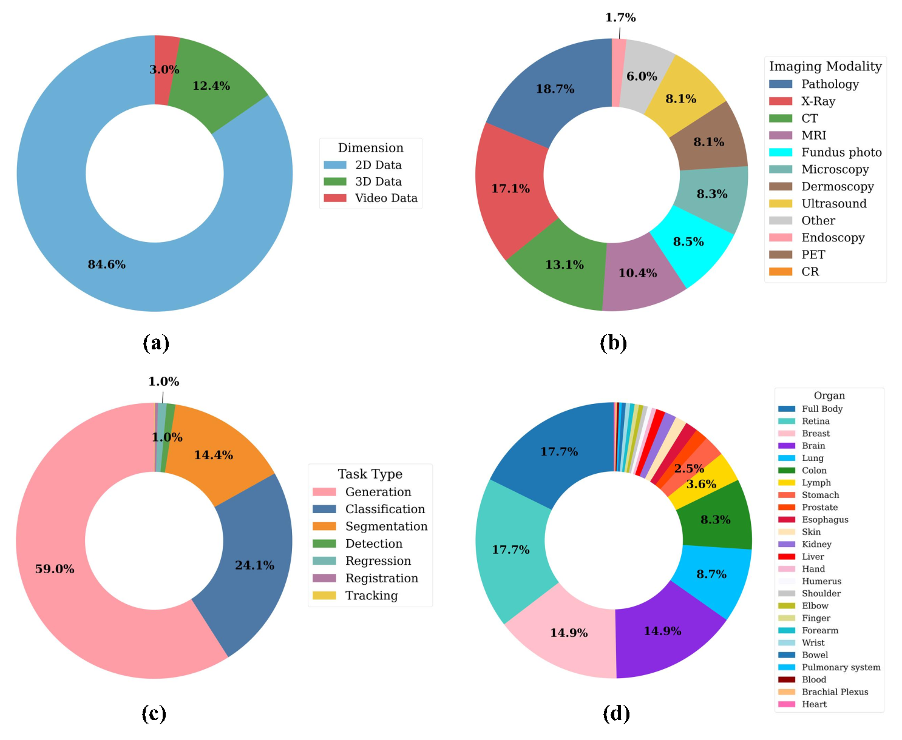

# 🌍 Project Imaging-X
<p align="center">
  <div align="center" style="display: flex; justify-content: center; gap: 20px;">
    
    
  </div>

  <p align="center">
    <a href=''>
      </a>
    <a href='https://ophnet-3d.github.io/'>
      </a>
    <a href=''>
      
    </a>
  </p>
</p>
A strategic initiative to consolidate 1000+ open medical imaging datasets worldwide, breaking down data silos through systematic integration to build the foundational infrastructure for next-generation medical AI models.
> **Challenge**: Medical imaging lacks large-scale unified datasets due to clinical expertise requirements and privacy constraints, limiting the development of powerful medical foundation models.

> **Solution**: We surveyed 1000+ open-access medical image datasets, developed a systematic integration paradigm, and created a unified repository with structured metadata and reference links.

> **Impact**: Transforming fragmented small datasets into cohesive large-scale resources to accelerate medical AI research and enable robust foundation models for the biomedical community.
<!-- 
A comprehensive survey of 1,000+ open-access medical image datasets with systematic analysis of their modalities, tasks, anatomies, and potential for integration into foundation models.

> Foundation models have demonstrated remarkable success across diverse domains and tasks, primarily due to the thrive of large-scale, diverse, and high-quality datasets. However, in the field of medical imaging, the curation and annotation of such medical datasets are highly challenging due to the reliance on clinical expertise and strict ethical and privacy constraints, resulting in a scarcity of large-scale unified medical datasets and hindering the development of powerful medical foundation models.
> In this work, we present a comprehensive survey of over 1,000 open-access medical image datasets, providing a thorough analysis of their modalities, tasks, anatomies, annotations, limitations, and potential for integration.
> Through this systematic examination, our findings reveal that most existing datasets are modest in scale, fragmented across specific tasks, and narrowly scoped, which in turn limits their utility for developing versatile and robust medical foundation models.
> To address these gaps, we develop a systematic paradigm for integrating public datasets with shared modalities or tasks, thereby transforming multiple small datasets into a larger, more cohesive resource.
> In addition, we compile all surveyed datasets into a unified, structured table that clearly summarizes their key characteristics and provides reference links, offering the community an accessible and comprehensive repository.
> By mapping the current landscape and proposing strategies for dataset consolidation, our survey supports data discovery, guides dataset creation, and advances medical foundation models for the biomedical imaging research community.
-->
> If you spot any mistakes or have suggestions, feel free to reach out by email: yejin@pjlab.org.cn, huming@pjlab.org.cn, qiaoyu@pjlab.org.cn, chenyirong@pjlab.org.cn, hejunjun@pjlab.org.cn

## 📖 Citation
If you find this repository or our survey helpful in your research, please kindly cite our paper:

📄 **Paper**: [Dataset Review](assets/Dataset_Review.pdf)

```bibtex
# Citation information will be updated once the paper is published on arXiv
```

---

## 🏥 Medical Datasets Overview


*Comprehensive visualization of medical imaging datasets showing anatomical region distribution, imaging modalities, and AI task types, spanning the evolution of medical imaging from 2000 to 2025*

### 🔍 Dataset Taxonomy & Statistical Analysis

<div align="center">
<table>
<tr>
<td width="50%">

<p><em>Systematic categorization framework for efficient dataset discovery and organization</em></p>
</td>
<td width="50%">

<p><em>Statistical breakdown: (a) Data dimension distribution (b) Imaging modality distribution (c) Task type distribution (d) Anatomical organ distribution</em></p>
</td>
</tr>
</table>
</div>

---

## 🤖 Medical Foundation Model Development


These datasets form the foundation for training next-generation medical AI models, enabling breakthroughs in automated diagnosis and treatment planning.

---

## 📋 Table of Contents

- [Awesome Medical Datasets](#awesome-medical-datasets)
  - [📖 Citation](#-citation)
  - [📋 Table of Contents](#-table-of-contents)
  - [📈 Medical Dataset Publication Trends](#-medical-dataset-publication-trends)
  - [🏥 Medical Imaging Dataset Ecosystem](#-medical-imaging-dataset-ecosystem)
  - [🤖 Medical Foundation Model Development](#-medical-foundation-model-development)
  - [🔍 Taxonomy and Retrieval System](#-taxonomy-and-retrieval-system)
  - [📊 2D Medical Imaging Datasets](#-2d-medical-imaging-datasets)
    - [🫁 CT Datasets](#-ct-datasets)
    - [🦴 X-ray Datasets](#-x-ray-datasets) 
    - [🧠 MRI Datasets](#-mri-datasets)
    - [👁️ Fundus Photography](#️-fundus-photography)
    - [🧫 Histopathology](#-histopathology)
    - [🩺 Ultrasound](#-ultrasound)
    - [📹 Endoscopy](#-endoscopy)
    - [👥 Dermoscopy](#-dermoscopy)
    - [🔬 Microscopy](#-microscopy)
    - [👁️‍🗨️ OCT](#️️-oct)
    - [☢️ PET](#️-pet)
    - [🌡️ Infrared](#-infrared)
    - [🧩 Others](#-others-2d)
  - [🧊 3D Medical Imaging Datasets](#-3d-medical-imaging-datasets)
    - [🫁 3D CT](#-3d-ct)
    - [🧠 3D MRI](#-3d-mri)
    - [☢️ 3D PET](#️-3d-pet)
    - [🩺 3D Ultrasound](#-3d-ultrasound)
    - [🧩 3D Other Datasets](#-other-3d)
  - [🎬 Video Medical Datasets](#-video-medical-imaging-datasets)

---

## 📊 2D Medical Imaging Datasets

2D medical imaging datasets represent the foundation of medical AI research, covering diverse modalities from traditional radiography to advanced optical coherence tomography.

### 👥 Dermoscopy
<a href="#-table-of-contents" style="float:right;">⬆ Back to Top</a>

| # | Dataset | Year | Dim | Modality | Structure | Images | Label | Task | Diseases |
|---|---|---|---|---|---|---|---|---|---|
| 1 | [ISIC18](https://workshop2018.isic-archive.com/) | 2018 | 2D | Dermoscopy | Skin | 2.7k | Yes | Seg | Skin lesion |
| 2 | [ISIC20](https://challenge.isic-archive.com/) | 2020 | 2D | Dermoscopy | Skin | 33.1k | Yes | Cls | Benign melanoma, malignant melanoma |
| 3 | [ISIC16](https://challenge.isic-archive.com/landing/2016/) | 2016 | 2D | Dermoscopy | Skin | 1.3k | Yes | Seg | Skin lesion |
| 4 | [ISIC17](https://challenge.isic-archive.com/landing/2017/) | 2016 | 2D | Dermoscopy | Skin | 2.8k | Yes | Seg | Skin lesion |
| 5 | [Derm7pt](https://derm.cs.sfu.ca/Welcome.html) | 2021 | 2D | Dermoscopy | Skin | 2.0k | Yes | Cls | Skin lesion |
| 6 | [ISIC19](https://challenge2019.isic-archive.com/) | 2019 | 2D | Dermoscopy | Skin | 25.3k | Yes | Cls | Cells |
| 7 | [Fizpatrick 17k](https://github.com/mattgroh/fitzpatrick17k) | 2021 | 2D | Dermoscopy | Skin | 16.6k | Yes | Cls | NA |
| 8 | [MED-NODE](https://www.cs.rug.nl/~imaging/databases/melanoma_naevi/) | 2015 | 2D | Dermoscopy | Skin | 170 | Yes | Cls | Brain |
| 9 | [PAD-UFES-20](https://data.mendeley.com/datasets/zr7vgbcyr2/1) | 2020 | 2D | Dermoscopy | Skin | 2.3k | Yes | Cls | Thoracic diseases |
| 10 | [PH2](https://www.fc.up.pt/addi/ph2\%20database.html) | 2014 | 2D | Dermoscopy | Skin | 200 | Yes | Cls | Cells |
| 11 | [DFUC 2020](https://dfu-challenge.github.io/) | 2020 | 2D | Dermoscopy | Foot | 2.0k | Yes | Seg | Breast cancer |
| 12 | [SD-128 / SD-198 / SD-260](https://workshop2021.isic-archive.com) | 2021 | 2D | Dermoscopy | Skin | 6.6k | Yes | Cls | Fetal structure |
| 13 | [ImageCLEF 2016](https://www.imageclef.org/2016/medical) | 2015 | 2D | Multi | Skin, Cell, Breast | 31k | Yes | Cls | Head |
| 14 | [Monkeypox Skin Image Dataset](https://www.heywhale.com/mw/dataset/62eb75d6fef0903951b1f199) | 2022 | 2D | Dermoscopy | Skin | 40.2k | Yes | Cls | Monkeypox |
| 15 | [Vitiligo Images](https://www.heywhale.com/mw/dataset/5ddca5fbca27f8002c4a1614) | 2019 | 2D | Dermoscopy | Skin | 368 | No | NA | Vitiligo |
| 16 | [ImageCLEF 2016](https://www.imageclef.org/2016/medical) | NA | 2D | Multi | Skin, Cell, Breast | 31k | Yes | Cls | NA |

### 👁️‍🗨️ OCT
<a href="#-table-of-contents" style="float:right;">⬆ Back to Top</a>

| # | Dataset | Year | Dim | Modality | Structure | Images | Label | Task | Diseases |
|---|---|---|---|---|---|---|---|---|---|
| 1 | [OCT2017](https://www.kaggle.com/paultimothymooney/kermany2018/code) | 2018 | 2D | OCT | Retina | 83.5k | Yes | Cls | NA |
| 2 | [Retinal OCT - C8](https://www.kaggle.com/obulisainaren/retinal-oct-c8) | 2021 | 2D | OCT | Retina | 24k | Yes | Cls | NA |
| 3 | [iChallenge - AGE19](https://age.grand-challenge.org/) | 2019 | 2D | OCT | Retina | 1.6k | Yes | Cls | NA |
| 4 | [DRAC22](https://drac22.grand-challenge.org/) | 2022 | 2D | OCT | Retina | 174 | Yes | Seg | Diabetic Retinopathy Lesions |
| 5 | [iChallenge - GOALS](https://ichallenges.grand-challenge.org/iChallenge-GON3/) | 2022 | 2D | OCT | Retina | 300 | Yes | Seg | NA |
| 6 | [Eye OCT Datasets](https://tianchi.aliyun.com/dataset/dataDetail?dataId=90672) | 2021 | 2D | OCT | Retina | 148 | Yes | Cls | NA |
| 7 | [APTOS-2021](https://tianchi.aliyun.com/dataset/dataDetail?dataId=120006) | 2022 | 2D | OCT | Retina | 2.6k | Yes | Pred | Diabetic Retinopathy |
| 8 | [APTOS Cross-Country Datasets_stage1](https://tianchi.aliyun.com/dataset/dataDetail?dataId=127971) | 2022 | 2D | OCT | Retina | 2.6k | Yes | Pred | NA |
| 9 | [MedMNIST](https://medmnist.com/v1) | 2020 | 2D | Multi | Retina, Breast, Lung | 100k | Yes | Cls | NA |
| 10 | [Canada OCT Retinal Images (Subset)](https://borealisdata.ca/dataset.xhtml?persistentId=doi:10.5683/SP/UIOXXK) | 2018 | 2D | OCT | Retina | 25 | Yes | Seg | Retinal Structures |
| 11 | [SinaFarsiu-002-Fang_TMI_2013](https://people.duke.edu/~sf59/software.html) | 2013 | 2D | OCT | Retina | 195 | Yes | Seg | NA |
| 12 | [SinaFarsiu-003-Fang_BOE_2012](https://people.duke.edu/~sf59/software.html) | 2012 | 2D | OCT | Retina | 51 | Yes | Seg | NA |
| 13 | [SinaFarsiu-008-Chiu_BOE_2012](https://people.duke.edu/~sf59/software.html) | 2012 | 2D | OCT | Retina | 23 | Yes | Seg | NA |
| 14 | [SinaFarsiu-009-Chiu_BOE_2013](https://people.duke.edu/~sf59/software.html) | 2013 | 2D | OCT | Retina | 840 | Yes | Seg | NA |
| 15 | [SinaFarsiu-010-Rabbani_IOVS_2014](https://people.duke.edu/~sf59/software.html) | 2015 | 2D | OCT | Retina | 24 | Yes | Seg | NA |
| 16 | [SinaFarsiu-012-Estrada_TMI_2015](https://people.duke.edu/~sf59/software.html) | 2015 | 2D | OCT | Retina | 60 | Yes | Seg | NA |
| 17 | [SinaFarsiu-013-Estrada_PAMI_2015](https://people.duke.edu/~sf59/software.html) | 2015 | 2D | OCT | Retina | 90 | Yes | Seg | NA |
| 18 | [SinaFarsiu-018-Yang_BOE_2021](https://people.duke.edu/~sf59/software.html) | 2021 | 2D | OCT | Retina | 784 | Yes | Seg | NA |
| 19 | [APTOS Cross-Country Datasets_stage2](https://tianchi.aliyun.com/dataset/dataDetail?dataId=127971) | 2022 | 2D | OCT | Retina | 3.3k | Yes | Pred | Diabetic Retinopathy |

### 🌡️ Infrared
<a href="#-table-of-contents" style="float:right;">⬆ Back to Top</a>

| # | Dataset | Year | Dim | Modality | Structure | Images | Label | Task | Diseases |
|---|---|---|---|---|---|---|---|---|---|
| 1 | [RAVIR](https://ravir.grand-challenge.org/) | 2022 | 2D | Infrared | Retina | 42 | Yes | Seg | Blood vessel |
| 2 | [MRL Eye Glasses cls](http://mrl.cs.vsb.cz/eyedataset) | 2018 | 2D | Infrared | Retina | 84.9k | Yes | Cls | NA |
| 3 | [MRL Eye Eye state cls](http://mrl.cs.vsb.cz/eyedataset) | 2018 | 2D | Infrared | Retina | 84.9k | Yes | Cls | NA |
| 4 | [MRL Eye Reflections cls](http://mrl.cs.vsb.cz/eyedataset) | 2018 | 2D | Infrared | Retina | 84.9k | Yes | Cls | NA |
| 5 | [MRL Eye Image quality cls](http://mrl.cs.vsb.cz/eyedataset) | 2018 | 2D | Infrared | Retina | 84.9k | Yes | Cls | NA |
| 6 | [MRL Eye Sensor type cls](http://mrl.cs.vsb.cz/eyedataset) | 2018 | 2D | Infrared | Retina | 84.9k | Yes | Cls | NA |

### 🧩 Others
<a href="#-table-of-contents" style="float:right;">⬆ Back to Top</a>

| # | Dataset | Year | Dim | Modality | Structure | Images | Label | Task | Diseases |
|---|---|---|---|---|---|---|---|---|---|
| 1 | [Intel & MobileODT Cervical Cancer Screening](https://www.kaggle.com/competitions/intel-mobileodt-cervical-cancer-screening/overview) | 2017 | 2D | Colposcopy | Vagina | 1,993 | Yes | Cls | Cervical cancer |
| 2 | [ADDI ALZHEIMER'S DETECTION CHALLENGE](https://www.aicrowd.com/challenges/addi-alzheimers-detection-challenge) | 2021 | 2D | Series Data | NA | 34,614 | Yes | Cls | Lung adenocarcinoma |
| 3 | [The Digital Mammography DREAM Challenge](https://www.synapse.org/Synapse:syn4224222/wiki/401743) | 2016 | 2D | Mammography | Breast | 640,000 | Yes | Cls | Atrophic AMD |
| 4 | [BigNeuron](https://alleninstitute.org/bigneuron/about/) | 2016 | 2D | NA | Brain | 2,166 | Yes | Recon | Diabetic foot ulcer |
| 5 | [Human Activity Classification with Radar](https://humanactivitiyclassificationwithradar.grand-challenge.org) | 2019 | 2D | Others | NA | 1,854 | Yes | Cls | NA |
| 6 | [KvasirCapsule-SEG](https://www.kaggle.com/datasets/debeshjha1/kvasircapsuleseg) | 2021 | 2D | Colposcopy (Capsule) | Polyp | 55 | Yes | Seg | Polyp |
| 7 | [SCDB](https://opendatalab.org.cn/SCDB) | 2020 | 2D | Others | Skin | 4 | Yes | Cls | Skin lesion |
| 8 | [ROSE](https://imed.nimte.ac.cn/dataofrose.html) | NA | 2D | OCTA (CT) | Eye | 229 | Yes | Seg | NA |
| 9 | [CMMD](https://wiki.cancerimagingarchive.net/pages/viewpage.action?pageId=70230508) | 2021 | 2D | Mammography | Breast | 1,775 | Yes | Seg, Cls | Breast Cancer |
| 10 | [Br35H](https://www.heywhale.com/mw/dataset/61d3e5682d30dc001701f728) | 2022 | 2D | MR | Brain | 3,000 | Yes | Cls | Brain Tumor |
| 11 | [CDD-CESM](https://wiki.cancerimagingarchive.net/pages/viewpage.action?pageId=109379611) | 2021 | 2D | Mammography | NA | 2,006 | Yes | Seg, Cls | Breast Cancer |
| 12 | [OralCancer](https://www.kaggle.com/datasets/shivam17299/oral-cancer-lips-and-tongue-images) | 2020 | 2D | Digital Photography | Lip, Tongue | 131 | Yes | Cls | Oral Cancer |
| 13 | [Oral_Diseases](https://www.kaggle.com/datasets/salmansajid05/oral-diseases) | 2023 | 2D | Digital Photography | NA | 12,944 | Yes | Cls, Det | Dental conditions |
| 14 | [MRL Eye Gender](http://mrl.cs.vsb.cz/eyedataset) | 2018 | 2D | Infrared Reflectance Imaging | Retina | 84,898 | Yes | Cls | NA |
| 15 | [MITOS-ATYPIA-14](https://mitos-atypia-14.grand-challenge.org/) | 2013 | 2D | Biopsy slides | Breast | 1,420 | Yes | Cls | Breast Cancer |
| 16 | [VinDr-Mammo](https://www.physionet.org/content/vindr-mammo/1.0.0/) | NA | 2D | Mammography | Breast | 19,992 | Yes | Det | Breast Cancer |
| 17 | [VinDr-SpineXR](https://vindr.ai/datasets/spinexr==) | NA | 2D | X-ray | Spine | 10,469 | Yes | NA | Spinal Lesions |
| 18 | [VinDr-PCXR](https://physionet.org/content/vindr-pcxr/1.0.0/) | NA | 2D | X-ray | Chest | 9,125 | Yes | NA | NA |
| 19 | [VinDr-CXR](https://physionet.org/content/vindr-cxr/1.0.0/) | NA | 2D | X-ray | Chest | 18,000 | Yes | NA | NA |
| 20 | [HAM10000](https://www.isic-archive.com/) | NA | 2D | Dermoscopy | Skin | 10,015 | Yes | Cls | Skin Cancer |
| 21 | [RFMiD](https://riadd.grand-challenge.org/download-all-classes/) | NA | 2D | Fundus | Retina | 3,200 | Yes | Cls | Ophthalmic Diseases |
| 22 | [Chaksu](https://doi.org/10.6084/m9.figshare.20123135) | NA | 2D | Fundus | Retina | 1,345 | Yes | Seg | Glaucoma |
| 23 | [PBC_dataset_normal_DIB](https://data.mendeley.com/datasets/snkd93bnjr/1) | NA | 2D | Microscopy | Blood | 0 | Yes | Cls | NA |


## 🧊 3D Medical Imaging Datasets

3D medical imaging datasets enable volumetric analysis and spatial understanding crucial for advanced medical AI applications.

### 🫁 CT Datasets
<a href="#-table-of-contents" style="float:right;">⬆ Back to Top</a>

| # | Dataset | Year | Dim | Modality | Structure | Images | Label | Task | Diseases |
|---|---|---|---|---|---|---|---|---|---|
| 1 | [LoDoPaB-CT](https://lodopab.grand-challenge.org/) | 2020 | 2D | CT | Lung | 28 | Yes | Recon | NA |
| 2 | [5K+ CT Images on Fractured Limbs](https://github.com/kc-santosh/medical-imaging-datasets) | 2021 | 2D | CT | Limbs | 24 | Yes | Seg | Bone Fracture |
| 3 | [AREN0534](https://wiki.cancerimagingarchive.net/pages/viewpage.action?pageId=91357265) | 2021 | 3D, 2D | Multi | Kidney, Lung | 239 | No | Est | Kidney Tumor |
| 4 | [CT Medical Images](https://www.kaggle.com/kmader/siim-medical-images) | 2017 | 2D | CT | Lung | 475 | Yes | Seg | NA |
| 5 | [National Lung Screening Trial](https://wiki.cancerimagingarchive.net/display/NLST/National+Lung+Screening+Trial) | 2013 | 3D, 2D | CT, Pathology | Lung | 26.7k | No | Cls | Lung Cancer |
| 6 | [RSNA Intracranial Hemorrhage Detection](https://www.kaggle.com/c/rsna-intracranial-hemorrhage-detection/data) | 2019 | 2D | CT | Brain | 874k | Yes | Loc | Intracranial Hemorrhage |
| 7 | [CT diagnosis of COVID-19](https://covid-ct.grand-challenge.org/) | 2021 | 2D | CT | Lung | 275 | Yes | Cls | Lung COVID-19 |
| 8 | [COVID-19-CT SCAN IMAGES](https://tianchi.aliyun.com/dataset/dataDetail?dataId=93666) | 2021 | 2D | CT | Lung | 1.4k | Yes | Cls | Lung COVID-19 |
| 9 | [COVID_CT_COVID-CT](https://tianchi.aliyun.com/dataset/dataDetail?dataId=106604) | 2021 | 2D | CT | Lung | 746 | Yes | Cls | Lung COVID-19 |
| 10 | [Chest CT-Scan images Dataset](https://tianchi.aliyun.com/dataset/93929) | 2021 | 2D | CT | Lung | 1k | Yes | Cls | Lung Cancer |
| 11 | [Cranium Image Dataset](https://tianchi.aliyun.com/dataset/dataDetail?dataId=82967) | 2020 | 2D | CT | Brain | 50 | Yes | Det | Intracranial Hemorrhage |
| 12 | [SARS-COV-2 Ct-Scan Dataset](https://tianchi.aliyun.com/dataset/dataDetail?dataId=93874) | 2021 | 2D | CT | Lung | 2.5k | Yes | Cls | Lung Disease |
| 13 | [MedMNIST](https://medmnist.com/v1) | 2020 | 2D | Multi | Retina, Breast, Lung | 100k | Yes | Cls | Multi-disease |
| 14 | [The Visible Human Project](https://www.nlm.nih.gov/research/visible/visible_human.html) | 1994 | 3D, 2D | CT, MR, | Full Body | 2 | No | NA | Skin Lesion |
| 15 | [ImageCLEF 2016](https://www.imageclef.org/2016/medical) | 2015 | 2D | Multi | Skin, Cell, Breast | 31k | Yes | Cls | Head |
| 16 | [RadImageNet (Subset: CT)](https://www.radimagenet.com/) | 2022 | 2D | CT | Full Body | 292.4k | Yes | Cls | Abdomen, lung, |
| 17 | [Brain CT Images with ICH Masks](https://www.kaggle.com/datasets/vbookshelf/computed-tomography-ct-images) | 2019 | 2D | CT | Brain | 82 | Yes | Seg | Intracranial Hemorrhage |
| 18 | [CMB-CRC](https://wiki.cancerimagingarchive.net/pages/viewpage.action?pageId=93257955) | 2022 | 3D, 2D | Multi | Colon | 472 | No | Seg, Cls | Colorectal Cancer |
| 19 | [CMB-GEC](https://wiki.cancerimagingarchive.net/pages/viewpage.action?pageId=127665431) | 2022 | 3D, 2D | CT, WSI, PET | Brain | 14 | No | Seg, Cls | Melanoma |
| 20 | [CMB-MEL](https://wiki.cancerimagingarchive.net/pages/viewpage.action?pageId=93258432) | 2022 | 3D, 2D | Multi | Brain | 255 | No | Seg | Melanoma |
| 21 | [CMB-MML](https://wiki.cancerimagingarchive.net/pages/viewpage.action?pageId=93258436) | 2021 | 2D, 3D | Multi | NA | 60 | No | NA | Multiple Myeloma |
| 22 | [CMB-PCA](https://wiki.cancerimagingarchive.net/pages/viewpage.action?pageId=95224082) | 2022 | 2D, 3D | CT, MR, WSI | Prostate | 31 | No | Cls, Pred | Prostate Cancer |
| 23 | [CPTAC-LSCC_CT_PET](https://wiki.cancerimagingarchive.net/pages/viewpage.action?pageId=33948248) | 2018 | 2D, 3D | CT, PET, HistoPathology? | NA | 238 | No | NA | NA |
| 24 | [Finding and Measuring Lungs in CT Data](https://www.heywhale.com/mw/dataset/5d71de448499bc002c0ae1fc) | 2019 | 2D, 3D | CT | Lung | 534 | Yes | Seg | NA |
| 25 | [Head CT Image Data](https://www.heywhale.com/mw/dataset/5d7213eb8499bc002c0af1e8) | 2019 | 2D | CT | Head | 200 | Yes | Cls | NA |
| 26 | [LDCTIQAC2023](https://ldctiqac2023.grand-challenge.org/ldctiqac2023/) | 2023 | 2D | CT | NA | 1k | Yes | Reg | NA |
| 27 | [APOLLO-5](https://wiki.cancerimagingarchive.net/display/Public/APOLLO-5) | 2022 | 2D, 3D | Multi | NA | 6.2k | No | NA | NA |
| 28 | [Lung-Fused-CT-Pathology](https://wiki.cancerimagingarchive.net/pages/viewpage.action?pageId=39878702) | 2018 | 2D, 3D | CT, HistoPathology? | Lung | 36 | Yes | Seg | Lung Disease |
| 29 | [CMB-LCA](https://wiki.cancerimagingarchive.net/pages/viewpage.action?pageId=93258420) | 2022 | 2D, 3D | Multi | NA | 0 | No | NA | NA |
| 30 | [RIDER Phantom PET-CT](https://wiki.cancerimagingarchive.net/display/Public/RIDER+Phantom+PET-CT) | 2011 | 2D | CT, PET | NA | 2.2k | No | NA | NA |
| 31 | [AHOD0831](https://wiki.cancerimagingarchive.net/pages/viewpage.action?pageId=119705284) | 2022 | 3D, 2D | Multi | NA | 0 | No | NA | Hodgkin Lymphoma |
| 32 | [Prostate-MRI](https://wiki.cancerimagingarchive.net/display/Public/PROSTATE-MRI) | 2011 | 3D, 2D | Multi | Prostate | 26 | No | NA | Prostate Cancer |
| 33 | [AREN0532](https://wiki.cancerimagingarchive.net/pages/viewpage.action?pageId=109379682) | 2022 | 3D, 2D | Multi | NA | 1k | No | NA | Wilms Tumor |
| 34 | [ImageCLEF 2016 (Duplicate)](https://www.imageclef.org/2016/medical) | 2015 | 2D | Multi | Skin, Cell, Breast | 31k | Yes | Cls | Head |
| 35 | [QUBIQ2020](https://qubiq.grand-challenge.org/) | 2020 | 2D | CT, MR | Kidney, Pancreas, | 150 | Yes | Seg | NA |
| 36 | [QUBIQ2021_2D_CT](https://qubiq21.grand-challenge.org/QUBIQ2021/) | 2021 | 2D | CT, MR | Kidney, Pancreas, | 268 | Yes | Seg | NA |

### 🦴 X-ray Datasets
<a href="#-table-of-contents" style="float:right;">⬆ Back to Top</a>

| # | Dataset | Year | Dim | Modality | Structure | Images | Label | Task | Diseases |
|---|---|---|---|---|---|---|---|---|---|
| 1 | [Chest X-ray](https://www.kaggle.com/paultimothymooney/chest-xray-pneumonia) | 2018 | 2D | X-Ray | Lung | 5.9k | Yes | Cls | Pneumonia |
| 2 | [CoronaHack](https://www.kaggle.com/praveengovi/coronahack-chest-xraydataset) | 2020 | 2D | X-Ray | Lung | 5.9k | Yes | Cls | COVID-19, Pneumonia |
| 3 | [NIH Chest X-ray 14](https://www.kaggle.com/nih-chest-xrays/data) | 2017 | 2D | X-Ray | Lung | 112.1k | Yes | Cls | Thorax diseases |
| 4 | [COVIDx CXR-2](https://www.kaggle.com/andyczhao/covidx-cxr2) | 2020 | 2D | X-Ray | Lung | 30.9k | Yes | Cls | COVID-19 |
| 5 | [Pneumothorax Masks X-Ray](https://www.kaggle.com/vbookshelf/pneumothorax-chest-xray-images-and-masks) | 2020 | 2D | X-Ray | Lung | 12.0k | Yes | Seg | Pneumothorax |
| 6 | [IRMA X-ray](https://www.kaggle.com/raddar/irma-xray-dataset) | 2020 | 2D | X-Ray | Brain, Lung | 14.7k | Yes | Cls | NA |
| 7 | [Chest XR COVID-19](https://cxr-covid19.grand-challenge.org) | 2021 | 2D | X-Ray | Lung | 21.4k | Yes | Cls | COVID-19 |
| 8 | [COVID-19-Image](https://github.com/ieee8023/covid-chestxray-dataset) | 2020 | 2D | X-Ray | Lung | 93 | Yes | Cls | COVID-19 |
| 9 | [Chest X-ray PA Dataset](https://data.mendeley.com/datasets/jctsfj2sfn/1) | 2021 | 2D | X-Ray | Lung | 4.6k | No | Cls | COVID-19, Pneumonia |
| 10 | [NHANES II X-ray](https://www.nlm.nih.gov/databases/download/nhanes.html) | 2021 | 2D | X-Ray | Lung | 17.1k | No | NA | NA |
| 11 | [KNOAP2020](https://knoap2020.grand-challenge.org/Home/) | 2020 | 2D, 3D | MR, X-Ray | Knee | 30 | Yes | Pred | Osteoarthritis |
| 12 | [AASCE](https://aasce19.grand-challenge.org/Award/) | 2019 | 2D | X-Ray | Spine | 609 | Yes | Reg | NA |
| 13 | [Covid-19 Image Dataset](https://www.kaggle.com/datasets/pranavraikokte/covid19-image-dataset) | 2021 | 2D | X-Ray | Lung | 345 | Yes | Cls | Lung diseases |
| 14 | [Pulmonary Chest X-Ray (ChinaSet)](https://tianchi.aliyun.com/dataset/dataDetail?dataId=94377) | 2021 | 2D | X-Ray | Lung | 800 | Yes | Cls | Lung diseases |
| 15 | [MURA](https://stanfordmlgroup.github.io/competitions/mura/) | 2021 | 2D | X-Ray | Multi-bone | 40.0k | Yes | Cls | Musculoskeletal |
| 16 | [SIIM-ACR Pneumothorax Seg](https://www.kaggle.com/c/siim-acr-pneumothorax-segmentation/data) | 2020 | 2D | X-Ray | Lung | 12.1k | Yes | Seg | Pneumothorax |
| 17 | [MIAS Mammography](http://peipa.essex.ac.uk/info/mias.html) | 2021 | 2D | X-Ray | Breast | 322 | Yes | Cls | Breast cancer |
| 18 | [MedMNIST](https://medmnist.com/v1) | 2020 | 2D | Multi | Retina, Breast, Lung | 100k | Yes | Cls | Multi-diseases |
| 19 | [RSNA Pneumonia Detection](https://www.kaggle.com/competitions/rsna-pneumonia-detection-challenge) | 2018 | 2D | X-Ray | Lung | 26.7k | Yes | Det | Lung diseases |
| 20 | [VinBigData Chest X-ray](https://www.kaggle.com/competitions/vinbigdata-chest-xray-abnormalities-detection) | 2020 | 2D | X-Ray | Lung | 15.0k | Yes | Det | Heart atrium |
| 21 | [CheXpert](https://stanfordmlgroup.github.io/competitions/chexpert/) | 2021 | 2D | X-Ray | Lung | 224.3k | Yes | Cls | Diabetic retinopathy |
| 22 | [SIIM-FISABIO-RSNA COVID-19](https://www.kaggle.com/competitions/siim-covid19-detection/data) | 2021 | 2D | X-Ray | Lung | 6.1k | Yes | Det | Tuberculosis |
| 23 | [NODE21](https://node21.grand-challenge.org/) | 2021 | 2D | X-Ray | Lung | 5.5k | Yes | Det | Breast cancer |
| 24 | [ImageCLEF 2016](https://www.imageclef.org/2016/medical) | 2016 | 2D | Multi | Skin, Cell, Breast | 31.0k | Yes | Cls | Head |
| 25 | [TCB-Challenge](https://www.idpoisson.fr/tcbchallenge/) | 2016 | 2D | X-Ray | Bone | 174 | Yes | Cls | Osteoporotic bone |
| 26 | [CRASS](https://crass.grand-challenge.org/Home/) | 2012 | 2D | X-Ray | Clavicle | 518 | Yes | Seg | Clavicles |
| 27 | [COVIDGR](https://github.com/ari-dasci/OD-covidgr) | 2020 | 2D | X-Ray | Lung | 852 | Yes | Cls | COVID-19 |
| 28 | [ChestX-Det](https://opendatalab.com/OpenDataLab/ChestX-Det) | 2021 | 2D | X-Ray | Lung | 3.6k | Yes | Seg | Lung diseases |
| 29 | [RANZCR CLiP](https://www.kaggle.com/competitions/ranzcr-clip-catheter-line-classification/data) | 2020 | 2D | X-Ray | Breast | 30.1k | Yes | Cls | NA |
| 30 | [CPCXR](https://opendatalab.org.cn/CPCXR/download) | 2020 | 2D | X-Ray | Lung | 1.2k | Yes | NA | Pneumonia, COVID-19 |
| 31 | [JSRT](http://db.jsrt.or.jp/eng.php) | 2000 | 2D | X-Ray | Lung | 247 | Yes | Cls | Lung nodule |
| 32 | [Synthetic COVID-19 CXR](https://opendatalab.org.cn/Synthetic_COVID-19_CXR_Dataset) | 2020 | 2D | X-Ray | Lung | 21.3k | Yes | Cls, Gen | COVID-19 |
| 33 | [Cephalometric X-ray Image](https://opendatalab.org.cn/Cephalometric_X-ray_Image) | 2014 | 2D | X-Ray | Skull | 400 | Yes | Loc | NA |
| 34 | [CMB-CRC](https://wiki.cancerimagingarchive.net/pages/viewpage.action?pageId=93257955) | 2022 | 2D, 3D | Multi | Colon | 472 | No | Seg, Cls | Colorectal cancer |
| 35 | [MIDRC-RICORD-1c](https://wiki.cancerimagingarchive.net/pages/viewpage.action?pageId=70230281) | 2021 | 2D | X-Ray | Lung | 1.3k | Yes | Cls | NA |
| 36 | [Chest X-ray Imaging](https://www.heywhale.com/mw/dataset/62c2ac49913a54a66037f872) | 2017 | 2D | X-Ray | Lung | 5.9k | Yes | Cls | NA |
| 37 | [COVID-19 Chest X-ray DB](https://www.heywhale.com/mw/dataset/6027caee891f960015c863d7) | 2021 | 2D | X-Ray | NA | 3.9k | Yes | Cls | COVID-19 |
| 38 | [SZ-CXR](https://arxiv.org/pdf/1803.01199v1.pdf) | 2018 | 2D | X-Ray | Lung | 566 | Yes | Seg | NA |
| 39 | [Pulmonary Chest X-Ray Seg](https://tianchi.aliyun.com/dataset/dataDetail?dataId=94377) | 2021 | 2D | X-Ray | Lung | 800 | Yes | Seg | Lung diseases |
| 40 | [DENTEX](https://dentex.grand-challenge.org/data/) | 2023 | 2D | X-Ray | Brain | 1.0k | Yes | Det | NA |
| 41 | [CL-Detection2023](https://cl-detection2023.grand-challenge.org/) | 2023 | 2D | X-Ray | NA | 555 | Yes | Det | NA |
| 42 | [ISBI2023 CEPHA29](http://vision.seecs.edu.pk/CEPHA29/) | NA | 2D | X-Ray | NA | 1.0k | Yes | Loc | NA |
| 43 | [ARCADE](https://arcade.grand-challenge.org/arcade/) | 2023 | 2D | X-Ray | NA | 1.5k | Yes | Seg | NA |
| 44 | [MedFM2023](https://medfm2023.grand-challenge.org/) | 2023 | 2D | X-Ray | NA | 4.8k | Yes | Cls | NA |
| 45 | [CoronARe](https://coronare.grand-challenge.org/) | NA | 2D | X-Ray | NA | 0 | Yes | Recon | Coronary artery diseases |
| 46 | [VICTRE](https://www.cancerimagingarchive.net/collection/victre/) | 2019 | 2D | X-Ray | Breast | 217.9k | No | NA | NA |
| 47 | [APOLLO-5](https://wiki.cancerimagingarchive.net/display/Public/APOLLO-5) | 2022 | 2D, 3D | Multi | NA | 6.2k | No | NA | NA |
| 48 | [CMB-LCA](https://wiki.cancerimagingarchive.net/pages/viewpage.action?pageId=93258420) | 2022 | 2D, 3D | Multi | NA | 0 | No | NA | NA |
| 49 | [AHOD0831](https://wiki.cancerimagingarchive.net/pages/viewpage.action?pageId=119705284) | 2022 | 2D, 3D | Multi | NA | 0 | No | NA | Hodgkin Lymphoma |
| 50 | [CheXmask](https://physionet.org/content/chexmask-cxr-segmentation-data/0.1/) | 2023 | 2D | X-Ray | NA | 676.8k | Yes | Seg | Lung diseases |
| 51 | [Knee Osteoarthritis Dataset](https://www.kaggle.com/datasets/shashwatwork/knee-osteoarthritis-dataset-with-severity/data) | 2020 | 2D | X-Ray | Knee | 0 | Yes | Cls | Knee osteoarthritis |
| 52 | [RUS_CHN](https://aistudio.baidu.com/datasetdetail/69582/0) | 2021 | 2D | X-Ray | Hand | 0 | Yes | Cls | Hand joints |
| 53 | [RSNA Bone Age](https://www.rsna.org/rsnai/ai-image-challenge/rsna-pediatric-bone-age-challenge-2017) | 2017 | 2D | X-Ray | Hand | 14.2k | Yes | Est | Hand bone |
| 54 | [CXR-LT](https://physionet.org/content/cxr-lt-iccv-workshop-cvamd/2.0.0/) | 2023 | 2D | X-Ray | Breast, Lung | 377.1k | Yes | Cls | Multi-diseases |
| 55 | [PENGWIN2024-Task2](https://pengwin.grand-challenge.org/) | 2025 | 2D | X-Ray | Pelvic Bone | 150 | Yes | Seg | Pelvic bone fragments |
| 56 | [ICG-CXR](https://progemu.github.io/) | 2025 | 2D | X-Ray | Lung | 11.4k | Yes | Gen | Lung diseases |

### 🧠 MRI Datasets
<a href="#-table-of-contents" style="float:right;">⬆ Back to Top</a>

| # | Dataset | Year | Dim | Modality | Structure | Images | Label | Task | Diseases |
|---|---|---|---|---|---|---|---|---|---|
| 1 | [AREN0534](https://wiki.cancerimagingarchive.net/pages/viewpage.action?pageId=91357265) | 2021 | 2D, 3D | Multi | Kidney, Lung | 239 | No | Est | Kidney Tumor |
| 2 | [KNOAP2020](https://knoap2020.grand-challenge.org/Home/) | 2020 | 2D, 3D | MR, X-Ray | Knee | 30 | Yes | Pred | Osteoarthritis |
| 3 | [braimMRI](https://tianchi.aliyun.com/dataset/dataDetail?dataId=127459) | 2022 | 2D | MR | Brain | 110 | Yes | Seg | Brain Tumor |
| 4 | [Brain-MRI](https://tianchi.aliyun.com/dataset/127583) | 2020 | 2D | MR | Brain | 110 | Yes | Seg | Brain Disease |
| 5 | [SpinalDisease2020](https://tianchi.aliyun.com/competition/entrance/531796/information) | 2020 | 2D | MR | Spine | 150 | Yes | Det | Spinal Disease |
| 6 | [The Visible Human Project](https://www.nlm.nih.gov/research/visible/visible_human.html) | 1994 | 2D, 3D | CT, MR, Others | Full Body | 2 | No | NA | Skin Lesion |
| 7 | [ImageCLEF 2016](https://www.imageclef.org/2016/medical) | 2015 | 2D | Multi | Skin, Cell, Breast | 31k | Yes | Cls | H |
| 8 | [CMB-CRC](https://wiki.cancerimagingarchive.net/pages/viewpage.action?pageId=93257955) | 2022 | 2D, 3D | Multi | Colon | 472 | No | Seg, Cls | Colorectal Cancer |
| 9 | [CMB-MML](https://wiki.cancerimagingarchive.net/pages/viewpage.action?pageId=93258436) | 2021 | 2D, 3D | Multi | NA | 60 | No | Pred | Multiple Myeloma |
| 10 | [CMB-PCA](https://www.cancerimagingarchive.net/collection/cmb-pca/) | 2022 | 2D, 3D | CT, MR, Histo | Prostate | 31 | No | Cls, Pred | Prostate Cancer |
| 11 | [ICDC-Glioma (GLIOMA01)_3D-MR](https://wiki.cancerimagingarchive.net/pages/viewpage.action?pageId=70227341) | 2021 | 2D, 3D | MR, Histo | NA | 650 | No | NA | Glioma |
| 12 | [Prostate Fused-MRI-Pathology](https://www.cancerimagingarchive.net/collection/prostate-fused-mri-pathology/) | 2016 | 2D, 3D | MR, Histo | Prostate (Pelvis) | 29 | No | NA | Prostate Cancer |
| 13 | [Cardiac Atrial Images](https://www.heywhale.com/mw/dataset/5e4de9618ee624002d4c4117) | 2020 | 2D | MR | Atrium | 8k | Yes | Seg | Cardiac Disease |
| 14 | [APOLLO-5](https://wiki.cancerimagingarchive.net/display/Public/APOLLO-5) | 2022 | 2D, 3D | Multi | NA | 6.2k | No | NA | NA |
| 15 | [CMB-LCA](https://wiki.cancerimagingarchive.net/pages/viewpage.action?pageId=93258420) | 2022 | 2D, 3D | Multi | NA | 0 | No | NA | Lung Cancer |
| 16 | [AHOD0831](https://wiki.cancerimagingarchive.net/pages/viewpage.action?pageId=119705284) | 2022 | 2D, 3D | Multi | NA | 0 | No | NA | Hodgkin Lymphoma |
| 17 | [Prostate-MRI](https://wiki.cancerimagingarchive.net/display/Public/PROSTATE-MRI) | 2011 | 2D, 3D | Multi | Prostate | 26 | No | NA | Prostate Cancer |
| 18 | [AREN0532](https://wiki.cancerimagingarchive.net/pages/viewpage.action?pageId=109379682) | 2022 | 2D, 3D | Multi | NA | 1k | No | NA | Wilms Tumor |
| 19 | [ImageCLEF 2015](https://www.imageclef.org/2015) | NA | 2D, 3D | Multi | Skin, Cell, Breast | 0 | Yes | Cls | NA |
| 20 | [RadImageNet (Subset: MR)](https://www.radimagenet.com/) | 2022 | 2D | MR | Full Body | 673k | Yes | Cls | Whole Body Abnorm. |
| 21 | [QUBIQ2020](https://qubiq.grand-challenge.org/) | 2020 | 2D | CT, MR | Kidney, | 150 | Yes | Seg | Pathologies |
| 22 | [QUBIQ2021_2D_MR](https://qubiq21.grand-challenge.org/QUBIQ2021/) | 2021 | 2D | CT, MR | Kidney, | 268 | Yes | Seg | Pathologies |

### 👁️ Fundus Photography
<a href="#-table-of-contents" style="float:right;">⬆ Back to Top</a>

| # | Dataset | Year | Dim | Modality | Structure | Images | Label | Task | Diseases |
|---|---|---|---|---|---|---|---|---|---|
| 1 | [DRISHTI-GS](http://cvit.iiit.ac.in/projects/mip/drishti-gs/mip-dataset2/Home.php) | 2014 | 2D | Fundus Photo | Retina | 101 | Yes | Seg | Optic Disc |
| 2 | [CHASE](https://blogs.kingston.ac.uk/retinal/chasedb1/) | 2009 | 2D | Fundus Photo | Retina | 28 | Yes | Seg | NA |
| 3 | [STARE](http://cecas.clemson.edu/~ahoover/stare/) | 2004 | 2D | Fundus Photo | Retina | 40 | Yes | Seg | NA |
| 4 | [DRIVE](https://drive.grand-challenge.org/) | 2003 | 2D | Fundus Photo | Retina | 40 | Yes | Seg | NA |
| 5 | [IDRID2018](https://idrid.grand-challenge.org/) | 2018 | 2D | Fundus Photo | Retina | 81 | Yes | Seg, Cls | Diabetic Retinopathy |
| 6 | [EyePACS](https://www.kaggle.com/c/diabetic-retinopathy-detection/data) | 2015 | 2D | Fundus Photo | Retina | 88.7k | Yes | Cls | Diabetic Retinopathy |
| 7 | [DRHAGIS](https://paperswithcode.com/dataset/dr-hagis) | 2017 | 2D | Fundus Photo | Retina | 40 | Yes | Seg | DR Lesions |
| 8 | [ODIR](https://odir2019.grand-challenge.org/) | 2019 | 2D | Fundus Photo | Retina | 8k | Yes | Cls | Ocular Diseases (DR screening) |
| 9 | [RIADD (RFMiD)](https://riadd.grand-challenge.org/) | 2020 | 2D | Fundus Photo | Retina | 3.2k | Yes | Cls | Retinal Diseases |
| 10 | [MESSIDOR-2](https://www.adcis.net/en/third-party/messidor2/) | 2013 | 2D | Fundus Photo | Retina | 1.7k | Yes | Cls | Diabetic Retinopathy |
| 11 | [iChallenge-ADAM](https://amd.grand-challenge.org/) | 2020 | 2D | Fundus Photo | Retina | 400 | Yes | Cls | Diabetic Retinopathy |
| 12 | [AIROGS](https://airogs.grand-challenge.org/) | 2021 | 2D | Fundus Photo | Retina | 101.4k | No | Cls | Diabetic Retinopathy |
| 13 | [DiaRetDB](https://www.it.lut.fi/project/imageret/) | 2009 | 2D | Fundus Photo | Retina | 89 | No | Det | DR Lesions |
| 14 | [HRF](https://www5.cs.fau.de/fileadmin/research/datasets/fundus-images/healthy.zip) | NA | 2D | Fundus | Retina | 45 | No | Seg | NA |
| 15 | [iChallenge-PALM19](https://palm.grand-challenge.org/) | 2019 | 2D | Fundus | Retina | 800 | Yes | Seg | NA |
| 16 | [Retina Fundus Image Reg.](https://tianchi.aliyun.com/dataset/dataDetail?dataId=90112) | 2021 | 2D | Fundus Photo | Retina | 129 | Yes | Reg | NA |
| 17 | [APTOS-2019](https://tianchi.aliyun.com/dataset/dataDetail?dataId=120007) | 2021 | 2D | Fundus Photo | Retina | 3.7k | Yes | Cls | Diabetic Retinopathy |
| 18 | [MedMNIST](https://medmnist.com/v1) | 2020 | 2D | Multi | Retina, Breast, Lung | 100k | Yes | Cls | NA |
| 19 | [DeepDR-Task1](https://isbi.deepdr.org/) | 2020 | 2D | Fundus Photo | Eye Vessel | 2k | Yes | Cls | Breast Cancer |
| 20 | [ImageCLEF 2016](https://www.imageclef.org/2016/medical) | 2015 | 2D | Multi | Skin, Cell, Breast | 31k | Yes | Cls | Head |
| 21 | [RITE](https://opendatalab.com/RITE) | 2013 | 2D | Fundus | Retina | 40 | Yes | Seg | Retinal Vessel |
| 22 | [GAMMA (Task1, CFP)](https://gamma.grand-challenge.org/) | 2021 | 2D | Fundus (CFP) | Retina | 200 | Yes | Cls | Grading |
| 23 | [RIM-ONE](http://medimrg.webs.ull.es/research/retinal-imaging/rim-one/) | 2020 | 2D | Fundus | Retina | 485 | Yes | Seg | Optic Disc and Cup |
| 24 | [APTOS 2019 Blindness Det.](https://www.kaggle.com/competitions/aptos2019-blindness-detection/overview) | 2019 | 2D | Fundus | Retina | 5.6k | Yes | Cls | Grading |
| 25 | [Glaucoma Detection](https://www.kaggle.com/datasets/sshikamaru/glaucoma-detection) | 2020 | 2D | Fundus | Retina | 650 | Yes | Cls | Glaucoma |
| 26 | [ACRIMA](https://figshare.com/s/c2d31f850af14c5b5232) | 2019 | 2D | Fundus | Retina | 705 | Yes | Cls | Glaucoma |
| 27 | [AO-SLO Photoreceptor Seg.](https://people.duke.edu/~sf59/Chiu_BOE_2013_dataset.htm) | 2013 | 2D | Fundus | Retina | 840 | Yes | Seg | AO-SLO Cone Photoreceptor |
| 28 | [Arteriovenous Nicking](https://people.eng.unimelb.edu.au/thivun/projects/AV_nicking_quantification/) | NA | 2D | Fundus | Retina | 90 | Yes | Cls | Retinal Artery-Vein Nicking |
| 29 | [Retina](https://www.kaggle.com/datasets/jr2ngb/cataractdataset) | 2019 | 2D | Fundus | Retina | 601 | Yes | Cls | Fundus Diseases |
| 30 | [Yangxi](https://zenodo.org/record/3393265) | 2019 | 2D | Fundus | Retina | 20.4k | Yes | Cls | Eye Axis |
| 31 | [William Hoyt](https://novel.utah.edu/Hoyt/disc_swelling.php) | 2004 | 2D | Fundus | Retina | 856 | Yes | Cls | Fundus Diseases |
| 32 | [Vampire](https://vampire.computing.dundee.ac.uk/vesselseg.html) | 2011 | 2D | Fundus | Retina | 8 | Yes | Seg | Vessel |
| 33 | [Retinal Fundus Imgs for Glaucoma](https://deepblue.lib.umich.edu/data/concern/data_sets/3b591905z?locale=en) | 2018 | 2D | Fundus | Retina | 2.9k | Yes | Cls | NA |
| 34 | [RetinaCheck (IOSTAR)](http://www.retinacheck.org/download-iostar-retinal-vessel-segmentation-dataset) | 2016 | 2D | Fundus | Retina | 30 | Yes | Seg | Vessel |
| 35 | [Ophthalmic Slit Lamp](https://plos.figshare.com/articles/dataset/Predicting_the_progression_of_ophthalmic_disease_based_on_slit-lamp_images_using_a_deep_temporal_sequence_network/6883823) | 2018 | 2D | Fundus | Retina | 60 | No | NA | NA |
| 36 | [Miles Iris](https://drive.google.com/drive/folders/0B5OBp4zckpLnYkpBcWlubC0tcTA) | 2013 | 2D | Fundus (Iris) | Retina | 833 | No | Cls | Retinal Structures |
| 37 | [JSIEC](https://www.kaggle.com/datasets/linchundan/fundusimage1000) | 2019 | 2D | Fundus | Retina | 1k | Yes | Cls | Fundus Diseases |
| 38 | [INSPIRE (Stereo)](https://medicine.uiowa.edu/eye/inspire-datasets) | 2011 | 2D | Fundus | Retina | 30 | Yes | Reg | NA |
| 39 | [INSPIRE (AVR)](https://medicine.uiowa.edu/eye/inspire-datasets) | 2011 | 2D | Fundus | Retina | 40 | Yes | Reg | NA |
| 40 | [HRF Quality Assessment](https://www5.cs.fau.de/research/data/fundus-images/) | 2013 | 2D | Fundus | Retina | 36 | Yes | Reg | NA |
| 41 | [HRF Segmentation](https://www5.cs.fau.de/research/data/fundus-images/) | 2013 | 2D | Fundus | Retina | 45 | Yes | Seg | Vessel |
| 42 | [iChallenge-REFUGE2](https://refuge.grand-challenge.org/) | 2020 | 2D | Fundus Photo (CFP) | Retina | 1.6k | Yes | Cls | Glaucoma |
| 43 | [GAMMA](https://gamma.grand-challenge.org/) | 2021 | 2D, 3D | Fundus | Retina | 200 | Yes | Cls | NA |
| 44 | [OIA-ODIR](https://odir2019.grand-challenge.org/introduction/) | 2019 | 2D | Fundus | NA | 10k | Yes | Cls | NA |
| 45 | [VARPA](http://www.varpa.es/research/ophtalmology.html) | 2019 | 2D | Fundus | Retina | 58 | Yes | Cls | NA |
| 46 | [ORVS](https://opendatalab.org.cn/ORVS) | 2020 | 2D | Fundus | Retina | 49 | Yes | Seg | NA |
| 47 | [Retinal Img Quality Assess](https://www.heywhale.com/mw/dataset/5e95d871e7ec38002d034efe) | 2020 | 2D | Fundus | Retina | 216 | Yes | Cls | NA |
| 48 | [iChallenge-GAMMA_3D-OCT](https://gamma.grand-challenge.org/) | 2021 | 2D | Fundus | Retina | 300 | Yes | Seg | Glaucoma |
| 49 | [DeepDR-Task2](https://isbi.deepdr.org/) | 2020 | 2D | Fundus | NA | 2k | Yes | Reg | NA |
| 50 | [DeepDR-Task3 {liu2022deepdrid](https://isbi.deepdr.org/) | 2020 | 2D | Fundus | NA | 246 | Yes | Cls | NA |
| 51 | [MMAC2023 {li2023automated](https://codalab.lisn.upsaclay.fr/competitions/12441) | 2023 | 2D | Fundus | NA | 0 | Yes | Cls | NA |
| 52 | [RFMiD 2.0 {pachade2021retinal](https://zenodo.org/record/7505822) | 2023 | 2D | Fundus Photo | NA | 860 | Yes | Cls | Retinal Fundus Multi-Disease |
| 53 | [MuReD](https://data.mendeley.com/datasets/pc4mb3h8hz/1) | 2022 | 2D | Fundus Photo | NA | 2.2k | Yes | Cls | Retinal Diseases |
| 54 | [Retinal Vessel Tortuosity](http://bioimlab.dei.unipd.it/Retinal Vessel Tortuosity.htm) | 2008 | 2D | Fundus Photo | Retina | 60 | Yes | Reg | NA |
| 55 | ImageCLEF 2016 | NA | 2D | Multi | Skin, Cell, Breast | 31k | Yes | Cls | NA |
| 56 | [PARAGUAY {benitez2021dataset](https://zenodo.org/record/3872227) | NA | 2D | Fundus Photo | NA | 0 | Yes | Cls | Diabetic Retinopathy |
| 57 | [BEH](https://github.com/mirtanvirislam/Deep-Learning-Based-Glaucoma-Detection-with-Cropped-Optic-Cup-and-Disc-and-Blood-Vessel-Segmentation) | NA | 2D | Fundus Photo | NA | 0 | Yes | NA | Glaucoma |
| 58 | [BiDR](https://www.kaggle.com/datasets/pkdarabi/diagnosis-of-diabetic-retinopathy) | NA | 2D | Fundus Photo | NA | 0 | Yes | NA | Diabetic Retinopathy |
| 59 | [HarvardGlaucoma](https://dataverse.harvard.edu/dataset.xhtml?persistentId=doi:10.7910/DVN/2EVN4B) | NA | 2D | Fundus Photo | NA | 0 | Yes | NA | Glaucoma |
| 60 | FUND | NA | 2D | Fundus Photo | NA | 0 | Yes | NA | NA |
| 61 | [LAG](https://github.com/smilell/AG-CNN) | NA | 2D | Fundus Photo | NA | 0 | Yes | NA | Glaucoma |
| 62 | [DHRF](https://www.kaggle.com/datasets/nikkich9/derbi-hackathon-retinal-fundus-image-dataset) | NA | 2D | Fundus Photo | Retina | 6.2k | Yes | Cls | Diabetic Retinopathy |
| 63 | E-ophta | NA | 2D | Fundus Photo | Retina | 926 | Yes | Seg | NA |
| 64 | [FIVES {jin2022fives](https://figshare.com/articles/dataset/FIVES_A_Fundus_Image_Dataset_for_AI-based_Vessel_Segmentation/21727913) | NA | 2D | Fundus Photo | Retina | 800 | Yes | Seg | Vessel |
| 65 | [OcularD](https://www.nature.com/articles/s41598-024-84922-y) | NA | 2D | Fundus Photo | Retina | 6.4k | Yes | Cls | NA |
| 66 | [PAPILA](https://doi.org/10.6084/m9.figshare.14798004.v1) | NA | 2D | Fundus Photo | Retina | 488 | Yes | Seg | NA |
| 67 | [Papilledema](https://www.kaggle.com/datasets/shashwatwork/identification-of-pseudopapilledema) | 2018 | 2D | Fundus Photo | Retina | 1.4k | Yes | Cls | Papilledema |
| 68 | [ROD](https://www.kaggle.com/datasets/gracemariabinu/retinal-occlusion-dataset/data) | 2023 | 2D | Fundus Photo | Retina | 281 | Yes | Cls | Retinal Occlusion |
| 69 | [ToxoFundus {CARDOZO2023109056](https://www.kaggle.com/datasets/andrewmvd/ocular-toxoplasmosis-fundus-images-dataset) | 2023 | 2D | Fundus Photo | Retina | 411 | Yes | Cls | Ocular Toxoplasmosis |
| 70 | [GAMMA (Task3, CFP) {wu2023gamma](https://gamma.grand-challenge.org/) | 2021 | 2D | Fundus (CFP) | Retina | 200 | Yes | Seg | Optic Disc and Cup |
| 71 | [iChallenge-GAMMA_2D-Fundus {wu2023gamma](https://gamma.grand-challenge.org/) | 2021 | 2D | Fundus | Retina | 300 | Yes | Seg | Glaucoma |

### 🧫 Histopathology
<a href="#-table-of-contents" style="float:right;">⬆ Back to Top</a>

| # | Dataset | Year | Dim | Modality | Structure | Images | Label | Task | Diseases |
|---|---|---|---|---|---|---|---|---|---|
| 1 | [PANDA_radboud](https://www.kaggle.com/c/prostate-cancer-grade-assessment/data?select=train.csv) | 2020 | 2D | Histopathology (Patch) | Prostate | 5.1k | Yes | Seg | Prostate Cancer |
| 2 | [Gleason {nir2018automatic](https://gleason2019.grand-challenge.org/Home/) | 2019 | 2D | Histopathology (Patch) | Prostate | 331 | Yes | Seg | Prostate Cancer |
| 3 | [PathologyVQA {he2020pathvqa](https://pathvqachallenge.grand-challenge.org) | 2020 | 2D | Histopathology (Patch) | Full Body | 5.0k | Yes | VQA | NA |
| 4 | [SLN-Breast {campanella2019breast](https://wiki.cancerimagingarchive.net/pages/viewpage.action?pageId=52763339) | 2019 | 2D | Histopathology (WSI) | Lymph | 166 | Yes | Cls | Breast Lymph Node |
| 5 | [MoNuSeg {kumar2019multi](https://monuseg.grand-challenge.org/Home/) | 2018 | 2D | Histopathology (Patch) | Nuclei | 51 | Yes | Seg | NA |
| 6 | [MoNuSAC2020 {verma2021monusac2020](https://monusac-2020.grand-challenge.org/) | 2019 | 2D | Histopathology (Patch) | Lung, Prostate, | 914 | Yes | Seg | NA |
| 7 | [DigestPath19 {da2022digestpath](https://digestpath2019.grand-challenge.org/Home/) | 2019 | 2D | Histopathology (WSI) | Colon | 212 | Yes | Det | Signet Ring Cell |
| 8 | [CAMELYON17 {litjens20181399](https://camelyon17.grand-challenge.org/Data/) | 2016 | 2D | Histopathology (WSI) | Breast | 500 | Yes | Cls | Breast Cancer |
| 9 | [ANHIR {borovec2020anhir](https://anhir.grand-challenge.org/) | 2018 | 2D | Histopathology (WSI) | Kidney, Breast, | 481 | Yes | Reg | NA |
| 10 | [Overlapping Cervical Cells {lu2016evaluation](https://cs.adelaide.edu.au/~carneiro/isbi14_challenge/) | 2015 | 2D | Histopathology (Patch) | Cervix | 17 | Yes | Seg | Cervical Cells |
| 11 | [MIDOG2022 {aubreville2023mitosis](https://imig.science/midog/) | 2022 | 2D | Histopathology (Patch) | Lung, Breast, Skin | 405 | Yes | Det | Mitotic Figure |
| 12 | [ACROBAT {bulten2019epithelium](https://acrobat.grand-challenge.org/) | 2023 | 2D | Histopathology (WSI) | Breast | 750 | Yes | Reg | NA |
| 13 | [BRIGHT {allison2014understanding](https://research.ibm.com/haifa/Workshops/BRIGHT/) | 2021 | 2D | Histopathology (Patch) | Breast | 5.1k | Yes | Cls | Pathological Benign |
| 14 | [CoNIC2022 {graham2021conic](https://conic-challenge.grand-challenge.org/) | 2022 | 2D | Histopathology (Patch) | Colon | 5.0k | Yes | Seg | Colon Nuclei |
| 15 | [PanNuke {gamper2019pannuke](https://warwick.ac.uk/fac/sci/dcs/research/tia/data/pannuke) | 2021 | 2D | Histopathology (WSI) | Multi-organ | 481 | Yes | Seg, Cls | Multiple Cancers |
| 16 | [Malignant Lymphoma Cls {orlov2010automatic](https://tianchi.aliyun.com/dataset/dataDetail?dataId=94414) | 2021 | 2D | Histopathology (Patch) | Lymph | 374 | Yes | Cls | Lymphoma |
| 17 | [PAIP2021 {paip2021_challenge](https://paip2021.grand-challenge.org/) | 2021 | 2D | Histopathology (WSI) | Colon, Prostate | 150 | Yes | Det | Colon/Prostate Cancer |
| 18 | [Breast Cancer Cell Seg {gelasca2008evaluation](https://tianchi.aliyun.com/dataset/dataDetail?dataId=90152) | 2021 | 2D | Histopathology (Patch) | Breast | 58 | Yes | Seg | Breast Cancer |
| 19 | [MedMNIST {medmnistv1](https://medmnist.com/v1) | 2020 | 2D | Multi | Retina, Breast, Lung | 100k | Yes | Cls | Multi-disease |
| 20 | [Histopathologic Cancer Det {histopathologic_cancer_detection_kaggle](https://www.kaggle.com/competitions/histopathologic-cancer-detection) | 2018 | 2D | Histopathology (Patch) | Lymph | 220k | Yes | Cls | Breast Cancer |
| 21 | [HuBMAP {hubmap-kidney-segmentation](https://www.kaggle.com/competitions/hubmap-kidney-segmentation/overview) | 2020 | 2D | Histopathology (Patch) | Kidney | 15 | Yes | Seg | Kidney Tissue |
| 22 | [ACDC-LungHP {li2020deep](https://acdc-lunghp.grand-challenge.org/) | 2019 | 2D | Histopathology (WSI) | Lung | 200 | Yes | Seg | Lung Cancer |
| 23 | [SegPC 2021 {gupta10segpc](https://segpc-2021.grand-challenge.org/SegPC-2021/) | 2021 | 2D | Histopathology (Patch) | Blood | 498 | Yes | Seg | Plasma Cells |
| 24 | [MIDOG2021 {aubreville2023mitosis](https://imi.thi.de/midog/) | 2021 | 2D | Histopathology (Patch) | Full Body | 200 | Yes | Det | Prostate Cancer |
| 25 | [Dermofit Image Library](https://workshop2021.isic-archive.com/) | 2021 | 2D | Histopathology (Patch) | Skin | 1.3k | Yes | Cls | Lung Adenocarcinoma |
| 26 | [Weakly Supervised Cell Seg {ma2024multimodality](https://neurips22-cellseg.grand-challenge.org/) | 2022 | 2D | Histopathology (Patch) | Full Body | 30 | Yes | Seg | Prostate Cancer |
| 27 | [TIGER-wsibulk {vanrijthoven2022tiger_roi](https://tiger.grand-challenge.org/Home/) | 2022 | 2D | Histopathology (WSI) | Breast | 93 | Yes | Seg | Pneumothorax |
| 28 | [BCI {liu2022bci](https://bci.grand-challenge.org/) | 2022 | 2D | Histopathology (Patch) | Breast | 4.9k | Yes | Gen | Lesion |
| 29 | [WSSS4LUAD](https://wsss4luad.grand-challenge.org) | 2021 | 2D | Histopathology (Patch) | Lung | 10.2k | Yes | Seg | Coronary Artery |
| 30 | [Breast Cancer Seg](https://bcsegmentation.grand-challenge.org) | 2019 | 2D | Histopathology (Patch) | Breast | 151 | Yes | Seg | Neurons |
| 31 | [NuCLS](https://nucls.grand-challenge.org/NuCLS/) | 2021 | 2D | Histopathology (Patch) | Nuclei | 3.1k | Yes | Seg | Kidney |
| 32 | [ImageCLEF 2016](https://www.imageclef.org/2016/medical) | 2015 | 2D | Multi | Skin, Cell, Breast | 31k | Yes | Cls | Head |
| 33 | [PAIP2020](https://paip2020.grand-challenge.org/Home/) | 2020 | 2D | Histopathology (WSI) | Liver | 118 | Yes | Cls | Colorectal Cancer |
| 34 | [HEROHE](https://ecdp2020.grand-challenge.org/Home/) | 2019 | 2D | Histopathology (WSI) | Lung | 510 | Yes | Cls | GI diseases |
| 35 | [Lymphocyte Assessment](https://lysto.grand-challenge.org/) | 2019 | 2D | Histopathology (Patch) | Lymphocyte | 20k | Yes | Cls | Lymphocyte Number |
| 36 | [LYON19](https://lyon19.grand-challenge.org) | 2019 | 2D | Histopathology (Patch) | Lymphocyte | 441 | Yes | Cls | Lymphocytes |
| 37 | [GlaS](https://warwick.ac.uk/fac/cross_fac/tia/data/glascontest) | 2015 | 2D | Histopathology (Patch) | Cell | 165 | Yes | Seg | Colorectal Adenocarcinoma |
| 38 | [CoNSeP](https://warwick.ac.uk/fac/sci/dcs/research/tia/data/hovernet/) | 2018 | 2D | Histopathology (Patch) | Colon | 41 | Yes | Seg | Colorectal Nuclei |
| 39 | [PCam](https://opendatalab.com/PCam) | 2018 | 2D | Histopathology (Patch) | Breast | 328k | Yes | Seg | Metastatic Tissue |
| 40 | [LC25000](https://opendatalab.com/LC25000) | 2019 | 2D | Histopathology (Patch) | Colon | 25k | Yes | Cls | Lung and Colon Tissue |
| 41 | [PanNuke (Seg)](https://huggingface.co/datasets/RationAI/PanNuke) | 2021 | 2D | Histopathology (Patch) | Full Body | 7.9k | Yes | Seg | Nucleus |
| 42 | [BreakHis (40x)](https://web.inf.ufpr.br/vri/databases/breast-cancer-histopathological-database-breakhis/) | 2016 | 2D | Histopathology (Patch) | Breast | 2.0k | Yes | Cls | Breast Tumors |
| 43 | [SICAPv2](https://opendatalab.org.cn/SICAPv2/download) | 2020 | 2D | Histopathology (Patch) | Prostate | 18.8k | Yes | Cls | Prostate Cancer |
| 44 | [Kumar](https://opendatalab.org.cn/Kumar/download) | 2018 | 2D | Histopathology (Patch) | Cell | 54 | Yes | Seg | Multi-organ Nuclei |
| 45 | [HErlev](https://opendatalab.org.cn/HErlev/download) | 2008 | 2D | Histopathology (Patch) | Cervix | 5.6k | Yes | Cls | Cervical Cancer |
| 46 | [CRC100K](https://opendatalab.org.cn/CRC100K/download) | 2018 | 2D | Histopathology (Patch) | Colon | 100k | Yes | Cls | Colorectal Cancer |
| 47 | [BRCA-M2C](https://opendatalab.org.cn/BRCA-M2C/) | 2021 | 2D | Histopathology (Patch) | Breast | 120 | Yes | Seg | Breast Cancer |
| 48 | [warwick](https://opendatalab.org.cn/warwick) | 2015 | 2D | Histopathology (Patch) | Colon | 330 | Yes | Seg | Colorectal Gland |
| 49 | [CRAG](https://github.com/XiaoyuZHK/CRAG-Dataset_Aug_ToCOCO) | 2019 | 2D | Histopathology (Patch) | Colon | 213 | Yes | Seg | Colorectal Cancer |
| 50 | [Chaoyang](https://drive.google.com/drive/folders/1xsrHjn-WyHGazYtpMqHo9h2w349eYCYO?usp=sharing) | 2021 | 2D | Histopathology (Patch) | Blood | 6.2k | Yes | Cls | Red Blood Cell |
| 51 | [CMB-CRC](https://wiki.cancerimagingarchive.net/pages/viewpage.action?pageId=93257955) | 2022 | 3D, 2D | Multi | Colon | 472 | No | Seg, Cls | Colorectal Cancer |
| 52 | [CMB-GEC](https://wiki.cancerimagingarchive.net/pages/viewpage.action?pageId=127665431) | 2022 | 3D, 2D | CT, Histopathology (WSI), PET | Brain | 14 | No | Seg, Cls | Melanoma |
| 53 | [CMB-MEL](https://wiki.cancerimagingarchive.net/pages/viewpage.action?pageId=93258432) | 2022 | 3D, 2D | Multi | Brain | 255 | No | Seg | Melanoma |
| 54 | [CMB-MML](https://wiki.cancerimagingarchive.net/pages/viewpage.action?pageId=93258436) | 2021 | 2D, 3D | Multi | NA | 60 | No | Pred | Multiple Myeloma |
| 55 | [CMB-PCA](https://wiki.cancerimagingarchive.net/pages/viewpage.action?pageId=95224082) | 2022 | 2D, 3D | CT, MR, Histopathology (WSI) | Prostate | 31 | No | Cls, Pred | Prostate Cancer |
| 56 | [AGGC22](https://aggc22.grand-challenge.org/) | 2022 | 2D | Histopathology (Patch) | Gland | 150 | Yes | Seg | Gland Segmentation |
| 57 | [TUPAC](https://tupac.grand-challenge.org/TUPAC/) | 2015 | 2D | Histopathology (Patch) | Brain | 573 | Yes | Reg | Breast Cancer |
| 58 | [Prostate Fused-MRI-Pathology {madabhushi2016fused](https://www.cancerimagingarchive.net/collection/prostate-fused-mri-pathology/) | 2016 | 2D, 3D | MR, Histopathology (WSI) | Prostate | 29 | No | NA | Prostate Cancer |
| 59 | [Malaria Cell Image Dataset {yang2019deep](https://lhncbc.nlm.nih.gov/LHC-downloads/downloads.html\#malaria-datasets) | 2021 | 2D | Histopathology (Patch) | Cell | 27.6k | Yes | Cls | Malaria |
| 60 | [HEp-2 Cell Classification {larsen2014hep](https://www.heywhale.com/mw/dataset/5ec3c6883241a100378d5d4a) | 2020 | 2D | Histopathology (Patch) | Cell | 13.6k | Yes | Cls | HEp-2 Cells |
| 61 | [Breast Cancer Cell Seg Dataset](https://www.heywhale.com/mw/dataset/5e9c625bebb37f002c61526a) | 2020 | 2D | Histopathology (Patch) | Breast, Cell | 58 | Yes | Seg | Breast Cancer |
| 62 | [TIGER-wsirois](https://tiger.grand-challenge.org/Home/) | 2022 | 2D | Histopathology (Patch) | Breast | 2.0k | Yes | Seg | Breast Cancer |
| 63 | [TIGER-wsitils](https://tiger.grand-challenge.org/Home/) | 2022 | 2D | Histopathology (Patch) | Breast | 82 | Yes | Reg | Breast Cancer |
| 64 | [Breast Cancer Cell Seg 2](https://www.heywhale.com/mw/dataset/5e9e9b35ebb37f002c625423) | 2020 | 2D | Histopathology (Patch) | Breast | 58 | Yes | Seg | Breast cancer |
| 65 | [Malignant Lymphoma Cls Dataset](https://www.heywhale.com/mw/dataset/5e9d607febb37f002c61ad3a) | 2020 | 2D | Histopathology (Patch) | Lymph | 374 | Yes | Cls | Lymphoma |
| 66 | [Lung and Colon Histopathology](https://www.heywhale.com/mw/dataset/5e956c33e7ec38002d03132c) | 2020 | 2D | Histopathology (Patch) | Lung, Colon | 25k | Yes | Cls | Lung and Colon Cancer |
| 67 | [FocusPath {Hosseini_2019](https://www.heywhale.com/mw/dataset/5e85dc8b95b029002ca7ea03) | 2020 | 2D | Histopathology (Patch) | NA | 864 | Yes | IQA | Histopathology Image |
| 68 | [Blood Cell Images](https://www.heywhale.com/mw/dataset/5d9ea5a9037db3002d3ec502) | 2019 | 2D | Histopathology (Patch) | Blood | 12.5k | Yes | Det | Blood Cell |
| 69 | [Colorectal Histology MNIST](https://zenodo.org/record/53169) | 2016 | 2D | Histopathology (Patch) | Colon | 5.0k | Yes | Cls | Colorectal Tissue |
| 70 | [BreakHis 100x](https://opendatalab.com/BreakHis) | 2016 | 2D | Histopathology (Patch) | Breast | 9.1k | Yes | Cls | Breast Cancer |
| 71 | [BreakHis 200x](https://opendatalab.com/BreakHis) | 2016 | 2D | Histopathology (Patch) | Breast | 9.1k | Yes | Cls | Breast Cancer |
| 72 | [BreakHis 400x](https://opendatalab.com/BreakHis) | 2016 | 2D | Histopathology (Patch) | Breast | 9.1k | Yes | Cls | Breast Cancer |
| 73 | [BCNB Task-1 {xu2021predicting](https://bcnb.grand-challenge.org/Home/) | 2021 | 2D | Histopathology (WSI) | Breast | 1.1k | Yes | Cls | Leukemia |
| 74 | [BCNB Task-2](https://bcnb.grand-challenge.org/Home/) | 2021 | 2D | Histopathology (WSI) | Breast | 1.1k | Yes | Cls | Breast Cancer |
| 75 | [BCNB Task-3](https://bcnb.grand-challenge.org/Home/) | 2021 | 2D | Histopathology (WSI) | Breast | 1.1k | Yes | Cls | Breast Cancer |
| 76 | [BCNB Task-4](https://bcnb.grand-challenge.org/Home/) | 2021 | 2D | Histopathology (WSI) | Breast | 1.1k | Yes | Cls | Breast Cancer |
| 77 | [BCNB Task-5](https://bcnb.grand-challenge.org/Home/) | 2021 | 2D | Histopathology (WSI) | Breast | 1.1k | Yes | Cls | Breast Cancer |
| 78 | [BCNB Task-6](https://bcnb.grand-challenge.org/Home/) | 2021 | 2D | Histopathology (WSI) | Breast | 1.1k | Yes | Cls | Breast Cancer |
| 79 | [PANDA](https://www.kaggle.com/c/prostate-cancer-grade-assessment/data?select=train.csv) | 2020 | 2D | Histopathology (Patch) | Prostate | 10.6k | Yes | Cls | Prostate Cancer |
| 80 | [PANDA_karolinska](https://www.kaggle.com/c/prostate-cancer-grade-assessment/data?select=train.csv) | 2020 | 2D | Histopathology (Patch) | Prostate | 5.5k | Yes | Seg | Prostate Cancer |
| 81 | [PAIP 2023 {akbar2019automated](https://2023paip.grand-challenge.org/) | 2022 | 2D | Histopathology (Patch) | Pancreas | 103 | Yes | Seg | Liver Cancer |
| 82 | [ATEC23](https://github.com/cwwang1979/MICCAI_ATEC23challenge) | 2023 | 2D | Histopathology (WSI) | Ovary | 468 | Yes | Cls | Ovarian Cancer |
| 83 | [ACROBAT2023](https://acrobat.grand-challenge.org/overview/) | 2023 | 2D | Histopathology (WSI) | Breast | 1.2k | Yes | Reg | Breast Cancer |
| 84 | [OCELOT2023](https://ocelot2023.grand-challenge.org/) | 2023 | 2D | Histopathology (WSI) | Colon | 667 | Yes | Det | Colon Cancer |
| 85 | [OCEAN](https://zenodo.org/record/7844718) | 2023 | 2D | Histopathology (WSI) | Ovary | 1.6k | Yes | Cls | Ovarian Cancer |
| 86 | [Endo-Aid](https://endo-aid.grand-challenge.org/) | 2022 | 2D | Histopathology (WSI) | GI Tract | 91 | No | Cls | GI Polyps |
| 87 | [PAIP2023 {akbar2019automated](https://2023paip.grand-challenge.org/) | 2022 | 2D | Histopathology (Patch) | Pancreas | 103 | Yes | Seg | Pancreatic Cancer |
| 88 | [PatchCamelyon{gc_patchcamelyon_2018](https://patchcamelyon.grand-challenge.org/) | 2018 | 2D | Histopathology (Patch) | Lymph Node | 295k | Yes | Cls | Metastatic Tissue |
| 89 | [Bone Marrow Cytomorphology{tcia_bone_marrow_cytomorphology_2021](https://wiki.cancerimagingarchive.net/pages/viewpage.action?pageId=101941770) | 2021 | 2D | Histopathology (Patch) | Bone Marrow | 171k | Yes | Cls | Blood Cells |
| 90 | [Lung-Fused-CT-Pathology{Rusu2017EurRadiol_LungFused](https://wiki.cancerimagingarchive.net/pages/viewpage.action?pageId=39878702) | 2018 | 2D, 3D | CT, Histopathology (WSI) | Lung | 36 | Yes | Seg | Lung Cancer |
| 91 | [HNSCC-mIF-mIHC{Ghahremani2023MICCAI_HNSCCmIFmIHC](https://wiki.cancerimagingarchive.net/pages/viewpage.action?pageId=70226184) | 2020 | 2D | Histopathology (Patch) | Head | Neck | 3.2k | No | NA |
| 92 | [SN-AM{Gupta2020MedIA_SNAM](https://wiki.cancerimagingarchive.net/pages/viewpage.action?pageId=52757009) | 2019 | 2D | Histopathology (Patch) | Lymph Node | 190 | Yes | Seg | Melanoma |
| 93 | [Ovarian Bevacizumab Response{tcia_ovarian_bev_response_2023](https://wiki.cancerimagingarchive.net/pages/viewpage.action?pageId=83593077) | 2023 | 2D | Histopathology (WSI) | Ovary | 285 | No | NA | Ovarian Cancer |
| 94 | [CMB-LCA{tcia_cmb_lca_2022](https://wiki.cancerimagingarchive.net/pages/viewpage.action?pageId=93258420) | 2022 | 2D, 3D | Multi | Lung | 0 | No | NA | Lung Cancer |
| 95 | [CPTAC-COAD{tcia_cptac_coad_2021](https://wiki.cancerimagingarchive.net/pages/viewpage.action?pageId=70227852) | 2021 | 2D | Histopathology (WSI) | Colon | 373 | Yes | Cls | Colon Adenocarcinoma |
| 96 | [Hungarian-Colorectal-Screening{tcia_hungarian_crc_2022](https://wiki.cancerimagingarchive.net/pages/viewpage.action?pageId=91357370) | 2022 | 2D | Histopathology (WSI) | Colorectal | 200 | No | NA | Colorectal Polyps |
| 97 | [DLBCL-Morphology{tcia_dlbcl_morphology_2022](https://wiki.cancerimagingarchive.net/pages/viewpage.action?pageId=119702520) | 2022 | 2D | Histopathology (Patch) | Lymph Node | 246 | Yes | Seg | DLBCL |
| 98 | [CPTAC-OV{tcia_cptac_ov_2021](https://wiki.cancerimagingarchive.net/pages/viewpage.action?pageId=70227856) | 2021 | 2D | Histopathology (WSI) | Ovary | 222 | No | NA | Ovarian Cancer |
| 99 | [CODEX imaging of HCC{tcia_codex_hcc_2023](https://wiki.cancerimagingarchive.net/pages/viewpage.action?pageId=140313174) | 2023 | 2D | Histopathology (WSI) | Liver | 646 | No | NA | Liver HCC |
| 100 | [Prostate-MRI{tcia_prostate_mri_2011](https://wiki.cancerimagingarchive.net/display/Public/PROSTATE-MRI) | 2011 | 3D, 2D | Multi | Prostate | 26 | No | NA | Prostate Cancer |
| 101 | [CPTAC-BRCA{tcia_cptac_brca_2021](https://wiki.cancerimagingarchive.net/pages/viewpage.action?pageId=70227748) | 2021 | 2D | Histopathology (WSI) | Breast | 642 | No | NA | Breast Cancer |
| 102 | [AML-Cytomorphology_LMU{Matek2019NatMI_AML](https://wiki.cancerimagingarchive.net/pages/viewpage.action?pageId=61080958) | 2019 | 2D | Histopathology (WSI) | Blood | 18.4k | Yes | Cls | Acute Myeloid Leukemia |
| 103 | [MiMM_SBILab {gupta2019mimm_sbilab](https://wiki.cancerimagingarchive.net/pages/viewpage.action?pageId=52756988) | 2019 | 2D | Histopathology (WSI) | Bone Marrow | 85 | Yes | Loc | Multiple Myeloma |
| 104 | [Pan-Cancer-Nuclei-Seg](https://wiki.cancerimagingarchive.net/pages/viewpage.action?pageId=64685083) | 2020 | 2D | Histopathology (WSI) | Multi-organ | 5.1k | Yes | Seg | Pan-Cancer |
| 105 | [TIL-WSI-TCGA](https://wiki.cancerimagingarchive.net/pages/viewpage.action?pageId=33948919) | 2018 | 2D | Histopathology (WSI) | Multi-organ | 5.2k | Yes | Cls | Pan-Cancer |
| 106 | [C-NMC 2019](https://wiki.cancerimagingarchive.net/pages/viewpage.action?pageId=52758223) | 2019 | 2D | Histopathology (WSI) | Blood | 15.1k | Yes | Cls | Leukemia |
| 107 | [CPTAC-AML](https://wiki.cancerimagingarchive.net/pages/viewpage.action?pageId=47677483) | 2019 | 2D | Histopathology (WSI) | Bone Marrow | 122 | No | NA | Acute Myeloid Leukemia |
| 108 | [CATCH](https://wiki.cancerimagingarchive.net/pages/viewpage.action?pageId=101941773) | 2022 | 2D | Histopathology (WSI) | Skin | 350 | Yes | Seg | Skin Cancer |
| 109 | [NADT-Prostate](https://wiki.cancerimagingarchive.net/pages/viewpage.action?pageId=91357374) | 2021 | 2D | Histopathology (WSI) | Prostate | 1.4k | No | NA | Prostate Cancer |
| 110 | [HER2 tumor ROIs](https://wiki.cancerimagingarchive.net/pages/viewpage.action?pageId=119702524) | 2022 | 2D | Histopathology (WSI) | Breast | 273 | Yes | Seg | HER2+ Breast Cancer |
| 111 | [CRC_FFPE-CODEX_CellNeighs](https://wiki.cancerimagingarchive.net/pages/viewpage.action?pageId=70227790) | 2020 | 2D | Histopathology (WSI) | Colorectal | 200 | No | NA | Colorectal Cancer |
| 112 | [Post-NAT-BRCA {martel2019assessment](https://wiki.cancerimagingarchive.net/pages/viewpage.action?pageId=52758117) | 2019 | 2D | Histopathology (WSI) | Breast | 96 | Yes | Cls | Breast Cancer |
| 113 | [Osteosarcoma Tumor Assessment](https://wiki.cancerimagingarchive.net/pages/viewpage.action?pageId=52756935) | 2019 | 2D | Histopathology (WSI) | Bone | 1.1k | Yes | Cls | Osteosarcoma |
| 114 | [Quilt-1M {ikezogwo2023quilt1m](https://github.com/wisdomikezogwo/quilt1m) | 2023 | 2D | Histopathology (Patch) | Multi-organ | 1M | Yes | VQA | Multi-organ Pathology |

### 🩺 Ultrasound
<a href="#-table-of-contents" style="float:right;">⬆ Back to Top</a>

| # | Dataset | Year | Dim | Modality | Structure | Images | Label | Task | Diseases |
|---|---|---|---|---|---|---|---|---|---|
| 1 | [HC18](https://hc18.grand-challenge.org) | 2018 | 2D | US | Skull | 1.3k | Yes | Meas | NA |
| 2 | [BUSI](https://scholar.cu.edu.eg/?q=afahmy/pages/dataset) | 2019 | 2D | US | Breast | 647 | Yes | Seg | Breast Cancer |
| 3 | [APOLLO-5](https://wiki.cancerimagingarchive.net/display/Public/APOLLO-5) | 2022 | 2D, 3D | Multi | NA | 6.2k | No | NA | NA |
| 4 | [CMB-LCA](https://wiki.cancerimagingarchive.net/pages/viewpage.action?pageId=93258420) | 2022 | 2D, 3D | Multi | NA | 0 | No | NA | NA |
| 5 | [ImageCLEF 2015](https://www.imageclef.org/2015/medical) | 2015 | 2D, 3D | Multi | Skin, Cell, Breast | 0 | Yes | Cls | NA |
| 6 | [ImageCLEF 2016](https://www.imageclef.org/2016/medical) | 2016 | 2D | Multi | Skin, Cell, Breast | 31k | Yes | Cls | Head |
| 7 | [RadImageNet (Subset: US)](https://www.radimagenet.com/) | 2022 | 2D | US | Full Body | 390k | Yes | Cls | Abdominal Structures |
| 8 | [BreastMNIST](https://medmnist.com/) | 2021 | 2D | US | Breast | 156 | Yes | Cls | Breast Cancer |
| 9 | [AREN0534](https://wiki.cancerimagingarchive.net/pages/viewpage.action?pageId=91357265) | 2021 | 2D, 3D | Multi | Kidney, Lung | 239 | No | Est | Kidney Tumor |
| 10 | [CLUST15](https://clust.ethz.ch/) | 2015 | 2D | US | Liver | 34 | Yes | Track | NA |
| 11 | [Ultrasound Nerve Segmentation](https://www.kaggle.com/competitions/ultrasound-nerve-segmentation) | 2016 | 2D | US | Brachial Plexus | 11.3k | Yes | Seg | NA |
| 12 | [TN-SCUI2020](https://tn-scui2020.grand-challenge.org/Home/) | 2020 | 2D | US | Thyroid | 3.6k | Yes | Seg | Leukemia |
| 13 | [ImageCLEF 2016](https://www.imageclef.org/2016/medical) | 2015 | 2D | Multi | Skin, Cell, Breast | 31k | Yes | Cls | Head |
| 14 | [CMB-CRC](https://wiki.cancerimagingarchive.net/pages/viewpage.action?pageId=93257955) | 2022 | 2D, 3D | Multi | Colon | 472 | No | Seg, Cls | Colorectal Cancer |
| 15 | [CMB-MEL](https://www.cancerimagingarchive.net/collection/cmb-mel/) | 2022 | 2D, 3D | Multi | Brain | 255 | No | Seg | Melanoma, Cerebral microbleed |
| 16 | [PSFHS](https://ps-fh-aop-2023.grand-challenge.org/) | 2023 | 2D | US | NA | 4.7k | Yes | Seg | NA |
| 17 | [USenhance2023](https://ultrasoundenhance2023.grand-challenge.org/) | 2023 | 2D | US | NA | 1.5k | Yes | Recon | NA |
| 18 | [AREN0532](https://www.cancerimagingarchive.net/collection/aren0532/) | 2022 | 2D, 3D | Multi | NA | 1k | No | NA | Wilms Tumor |
| 19 | [TN3K](https://github.com/haifangong/TRFE-Net-for-thyroid-nodule-segmentation) | 2021 | 2D | US | Head and Neck | 3.5k | Yes | Seg | Thyroid Nodules |
| 20 | [CAMUS](http://camus.creatis.insa-lyon.fr/challenge/) | 2019 | 2D | US | Heart | 1.8k | Yes | Seg | Cardiac Disease |
| 21 | [DDTI {gong2021multi-task](https://github.com/haifangong/TRFE-Net-for-thyroid-nodule-segmentation) | 2020 | 2D | US | Thyroid | 637 | Yes | Seg | Thyroid Nodule |

### 📹 Endoscopy
<a href="#-table-of-contents" style="float:right;">⬆ Back to Top</a>

| # | Dataset | Year | Dim | Modality | Structure | Images | Label | Task | Diseases |
|---|---|---|---|---|---|---|---|---|---|
| 1 | [Kavsir{pogorelov2017kvasir](https://datasets.simula.no/kvasir/) | 2017 | 2D | Endoscopy | Colon | 14k | Yes | Cls | NA |
| 2 | [EndoSlam{ozyoruk2020endoslam](https://github.com/CapsuleEndoscope/EndoSLAM) | 2021 | 2D | Endoscopy | Colon, Liver, Stomach, Kidney | 76.8k | Yes | Recon, Est | NA |
| 3 | [SARAS-MESAD{bawa2021saras](https://saras-mesad.grand-challenge.org/Home/) | 2021 | 2D | Endoscopy | Prostate | 50.3k | No | Det | GI disease |
| 4 | [EAD19{ali2019endoscopy](https://ead2019.grand-challenge.org/Data/) | 2018 | 2D | Endoscopy | Stomach, Bladder, Colon | 2.1k | Yes | Det | Endo Artifact |
| 5 | [EndoCV2020-Sub Challenge1{ali2022endoscopic](https://endocv.grand-challenge.org/) | 2019 | 2D | Endoscopy | Colon | 2.3k | Yes | Det, Seg | Polyp |
| 6 | [EndoVis15{bernal2017comparative](https://polyp.grand-challenge.org/) | 2015 | 2D | Endoscopy | Colon | 612 | Yes | Seg | Polyp |
| 7 | [Surgical tool detection challenge (m2cai16-tool){twinanda2016single](http://camma.u-strasbg.fr/m2cai2016/) | 2016 | 2D | Endoscopy | Gallbladder | 15 | Yes | Det | NA |
| 8 | [AIDA-E_1](https://aidasub-cleceliachy.grand-challenge.org/) | 2015 | 2D | Endoscopy | Stomach, Liver | 181 | Yes | Cls | Celiac Disease |
| 9 | [AIDA-E_2](https://aidasub-clebarrett.grand-challenge.org/home/) | 2015 | 2D | Endoscopy | Esophagus | 157 | Yes | Cls | Barrett's Esophagus |
| 10 | [AIDA-E_3](https://aidasub-chromogastro.grand-challenge.org/home/) | 2015 | 2D | Endoscopy | Stomach, Colon | 88 | Yes | Cls | Metaplasia, Dysplasia |
| 11 | [CVC-ClinicDB{vazquez2017benchmark](https://tianchi.aliyun.com/dataset/dataDetail?dataId=93690) | 2021 | 2D | Endoscopy | Bowel | 1.4k | Yes | Seg | Polyp |
| 12 | [Kvasir-SEG{jha2019kvasir](https://tianchi.aliyun.com/dataset/dataDetail?dataId=84385) | 2020 | 2D | Endoscopy | Bowel | 8k | Yes | Seg | NA |
| 13 | [FetReg{bano2021fetreg](https://www.synapse.org/\#!Synapse:syn25313156/wiki/610166) | 2022 | 2D | Endoscopy | Uterus | 2.7k | Yes | Seg | Placental Vasculature |
| 14 | [SARAS-ESAD{bawa2021saras](https://saras-esad.grand-challenge.org) | 2020 | 2D | Endoscopy | Bowel | 33.4k | Yes | Det | Skin lesion |
| 15 | [ImageCLEF 2016{deherrera2016imageclef](https://www.imageclef.org/2016/medical) | 2015 | 2D | Multi | Skin, Cell, Breast | 31k | Yes | Cls | H |
| 16 | [ISBI-AIDA-CECI](https://aidasub-cleceliachy.grand-challenge.org/) | 2015 | 2D | Endoscopy | Liver, Stomach | 181 | Yes | Cls | Celiac diseases |
| 17 | [SUN_SEG{ji2022video](https://github.com/GewelsJI/VPS) | 2022 | 2D+Video | Endoscopy | Colon | 49.1k | Yes | Seg, Det, Cls | Polyp |
| 18 | [HyperKvasir{borgli2020hyperkvasir](https://datasets.simula.no/hyper-kvasir/) | 2020 | 2D+Video | Endoscopy | Esophagus, Stomach, Colon | 6.5k | Yes | Cls, Caption, Loc | GI disease |
| 19 | [Gastrointestinal Image ANAlysis (GIANA)](https://giana.grand-challenge.org/) | 2016 | 2D | Endoscopy | Colon | 600 | Yes | Cls | Vascular Malformation |
| 20 | [EndoVis 2015 - DAGI](https://endovissub-abnormal.grand-challenge.org/EndoVisSub-Abnormal/) | 2015 | 2D | Endoscopy | NA | 389 | Yes | Det | Cholecystectomy |
| 21 | [EndoVis 2015 - EBCD](https://endovissub-barrett.grand-challenge.org/) | 2015 | 2D | Endoscopy | NA | 150 | Yes | Seg | Barrett's Epithelium |
| 22 | [EndoCV2020-Sub Challenge2{ali2020endoscopy](https://edd2020.grand-challenge.org/) | 2019 | 2D | Endoscopy | NA | 386 | Yes | Det | NA |
| 23 | [EndoVis 2015 - APDCV{bernal2017comparative](https://polyp.grand-challenge.org/) | 2015 | 2D | Endoscopy | NA | 612 | Yes | Seg | Colonic Polyp |
| 24 | [EndoVis 2015 - IST_2D-Endoscopy](https://endovissub-instrument.grand-challenge.org/EndoVisSub-Instrument/) | 2015 | 2D+Video | Endoscopy | NA | 100 | Yes | Seg | Surgical Instruments |
| 25 | [EndoVis 2018 - RSS{allan20202018roboticscenesegmentation](https://endovissub2018-roboticscenesegmentation.grand-challenge.org/home/) | 2018 | 2D | Endoscopy | NA | 2.8k | Yes | Seg | Surgical Instruments |
| 26 | [ISBI-AIDA-EMIBS](https://isbi-aida.grand-challenge.org) | 2015 | 2D | Endoscopy | NA | 262 | Yes | Cls | Gastric |
| 27 | [ISBI-AIDA-GCICS](https://isbi-aida.grand-challenge.org) | 2015 | 2D | Endoscopy | NA | 176 | Yes | Cls | Gastric |
| 28 | [EndoVis2023-SIMS](https://www.synapse.org/\#!Synapse:syn47193563/wiki/620035) | 2023 | 2D | Endoscopy | NA | 0 | Yes | Seg | Endoscopy |
| 29 | [EndoVis2023-Syn-ISS](https://www.synapse.org/\#!Synapse:syn50908388/wiki/620516) | 2023 | 2D | Endoscopy | NA | 0 | Yes | Seg | NA |
| 30 | [P2ILF](https://p2ilf.grand-challenge.org/) | 2022 | 2D+3D | Endoscopy | NA | 15 | Yes | Reg | Multi-organ |
| 31 | [EndoVis2023-SurgRIPE{xu2025surgripe](https://www.synapse.org/\#!Synapse:syn51471789/wiki/622255) | 2023 | 2D | Endoscopy | NA | 0 | Yes | Est | NA |
| 32 | [m2caiSeg{maqbool2020m2caiseg](https://www.kaggle.com/datasets/salmanmaq/m2caiseg) | 2020 | 2D | Endoscopy | Instrument | 614 | Yes | Seg | NA |
| 33 | [CVC-EndoSceneStill{vazquez2017benchmark](https://www.biobancovasco.org/en/Sample-and-data-catalog/Databases/PD178-PICCOLO-EN.html) | NA | 2D | Endoscopy | NA | 3.4k | Yes | Seg | Polyp |
| 34 | [Endo-FM{wang2023foundation](https://github.com/med-air/Endo-FM) | NA | 2D+Video | Endoscopy | NA | 0 | Yes | Seg, Cls, Det | NA |
| 35 | [SegSTRONG-C{ding2024segstrong](https://github.com/hding2455/CaRTS) | NA | 2D+Video | Endoscopy | NA | 17 | Yes | Seg | NA |
| 36 | [SegCol{ju2024segcol](https://www.synapse.org/\#!Synapse:syn54124209) | NA | 2D+Video | Colposcopy, Endoscopy | NA | 78 | Yes | Seg | NA |
| 37 | [FedSurg](https://www.synapse.org/Synapse:syn53137385/wiki/625370) | 2024 | 2D+Video | Endoscopy | NA | 30 | Yes | Cls | Laparoscopic appendectomy |

### 🔬 Microscopy
<a href="#-table-of-contents" style="float:right;">⬆ Back to Top</a>

| # | Dataset | Year | Dim | Modality | Structure | Images | Label | Task | Diseases |
|---|---|---|---|---|---|---|---|---|---|
| 1 | [CellTracking2019 {mavska2023cell](http://celltrackingchallenge.net/) | 2019 | 2D | Microscopy | Cell | 1.4M | Yes | Tracking | NA |
| 2 | [CREMI](https://cremi.org) | 2016 | 2D | Microscopy | Brain | 375 | Yes | Seg | NA |
| 3 | [Bacteria Detection {wieczorek2024transformer](https://tianchi.aliyun.com/dataset/dataDetail?dataId=94411) | 2021 | 2D | Microscopy | NA | 366 | Yes | Seg | NA |
| 4 | [Blood Cell Images](https://tianchi.aliyun.com/dataset/dataDetail?dataId=89038) | 2021 | 2D | Microscopy | Blood | 12.5k | Yes | Cls | Blood |
| 5 | [Leukemia Classification {DeepLeukemia2020](https://tianchi.aliyun.com/dataset/dataDetail?dataId=90101) | 2021 | 2D | Microscopy | NA | 15.1k | Yes | Cls | Leukemia |
| 6 | [CellTracking2021 {mavska2023cell](http://celltrackingchallenge.net/) | 2021 | 2D+3D+Video | Microscopy | Cell | 0 | Yes | Tracking, Seg | Lung Disease |
| 7 | [B-ALL Classification {gupta2019isbi](https://competitions.codalab.org/competitions/20395) | 2018 | 2D | Microscopy | Cell | 15.1k | Yes | Cls | Brain Tumor |
| 8 | [2018 Data Science Bowl {caicedo2019nucleus](https://www.kaggle.com/competitions/data-science-bowl-2018) | 2018 | 2D | Microscopy | Nuclei | 670 | Yes | Seg | Skin Lesions |
| 9 | [GSB2016](https://www.imageclef.org/2016/medical) | 2015 | 2D | Multi | Skin, Cell, Breast | 31k | Yes | Cls | Head |
| 10 | [OCCISC (SemSeg) {lu2016evaluation](https://cs.adelaide.edu.au/~carneiro/isbi14_challenge/) | 2014 | 2D | Microscopy | Cell | 945 | Yes | Seg | Cervical Cytology |
| 11 | [ICIAR 2018 (Microscopy) {aresta2019bach](https://iciar2018-challenge.grand-challenge.org/Dataset/) | 2017 | 2D | Microscopy | Breast | 400 | Yes | Cls | Breast Cancer |
| 12 | [CBC (Counting) {alam2019machine](https://github.com/MahmudulAlam/Complete-Blood-Cell-Count-Dataset) | 2019 | 2D | Microscopy | Full Body | 420 | Yes | Reg | NA |
| 13 | [HuSHeM {shaker2017dictionary](https://opendatalab.com/HuSHeM) | 2017 | 2D | Microscopy | Pelvic | 216 | Yes | Cls | Sperm Head Morphology |
| 14 | [Kaggle-HPA {le2022analysis](https://www.kaggle.com/competitions/hpa-single-cell-image-classification/data) | 2021 | 2D | Microscopy | NA | 89.5k | Yes | Seg | Protein Localization |
| 15 | [nanni2016texture](https://figshare.com/s/d6fb591f1beb4f8efa6f) | 2016 | 2D | Microscopy | Retina | 195 | Yes | Cls | Cell Shape |
| 16 | [Corneal Endothelial Cell {CornealEndothelial2019](https://github.com/daboe01/SREP-18-33533B) | 2019 | 2D | Microscopy | Retina | 385 | Yes | Seg | NA |
| 17 | [Corneal Nerve {DeBonnay2022](http://bioimlab.dei.unipd.it/Data\%20Sets.htm) | 2008 | 2D | Microscopy | Retina | 90 | Yes | Cls | Corneal Abnormalities |
| 18 | [Corneal Nerve Tortuosity {scarpa2011automatic](http://bioimlab.dei.unipd.it/Data\%20Sets.htm) | 2011 | 2D | Microscopy | Retina | 30 | Yes | Cls | Nerve Tortuosity |
| 19 | [Cervix93 Cytology {phoulady2018new](https://github.com/parham-ap/cytology_dataset) | 2018 | 2D | Microscopy | Cervix | 93 | Yes | Cls | Cervical Cancer |
| 20 | [DLBCL-Morph {vrabac2020dlbclmorph](https://github.com/stanfordmlgroup/DLBCL-Morph) | 2020 | 2D | Microscopy | Retina | 152.2k | Yes | Reg | DLBCL Lymphoma |
| 21 | [2-PM Vessel Dataset {teikari2016deep](https://opendatalab.org.cn/2-PM_Vessel_Dataset) | 2016 | 2D | Microscopy | Vessel | 12 | Yes | Seg | NA |
| 22 | [BBBC041 {li2021multi](https://opendatalab.org.cn/BBBC041/download) | 2012 | 2D | Microscopy | Cell | 1.3k | Yes | Seg | Malaria |
| 23 | [FMD {zhang2018poisson](https://github.com/yinhaoz/denoising-fluorescence) | 2019 | 2D | Microscopy | Surface | 5.1k | Yes | Cls, Seg | Surface Defect |
| 24 | [Blood Cell Detection {BloodCellDetection2022](https://www.heywhale.com/mw/dataset/62c2af90913a54a66038165a) | 2022 | 2D | Microscopy | NA | 874 | Yes | Det | NA |
| 25 | [Tuberculosis Image {rahman2020reliable](https://www.heywhale.com/mw/dataset/5efc4de063975d002c9792de) | 2020 | 2D | Microscopy | NA | 1.3k | Yes | Det | Tuberculosis |
| 26 | [MHSMA {javadi2019novel](https://github.com/soroushj/mhsma-dataset) | 2019 | 2D | Microscopy | NA | 1.5k | Yes | Cls | NA |
| 27 | [ICIAR 2018 (Microscopy) {aresta2019bach](https://iciar2018-challenge.grand-challenge.org/) | 2017 | 2D | Microscopy, WSI | NA | 400 | Yes | Seg | Breast Cancer |
| 28 | [ImageCLEF 2016 {GSB2016](https://www.imageclef.org/2016/medical) | 2016 | 2D | Multi | Skin, Cell, Breast | 31k | Yes | Cls | NA |
| 29 | [CellTracking2024 {mavska2023cell](http://celltrackingchallenge.net/) | 2024 | 2D+3D+Video | Microscopy | Cell | 0 | Yes | Tracking, Seg | NA |
| 30 | [CellTracking2022 {mavska2023cell](http://celltrackingchallenge.net/) | 2022 | 2D+3D+Video | Microscopy | Cell | 0 | Yes | Tracking, Seg | NA |
| 31 | [CellTracking2023 {mavska2023cell](http://celltrackingchallenge.net/) | 2023 | 2D+3D+Video | Microscopy | Cell | 0 | Yes | Tracking, Seg | NA |
| 32 | [OCCISC (InstSeg) {alam2019machine](https://cs.adelaide.edu.au/~carneiro/isbi14_challenge/) | 2014 | 2D | Microscopy | Cell | 945 | Yes | Seg | NA |
| 33 | [CBC (Detection) {rahman2020reliable](https://github.com/MahmudulAlam/Complete-Blood-Cell-Count-Dataset) | 2019 | 2D | Microscopy | Full Body | 420 | Yes | Det | NA |
| 34 | [ICIAR 2018 (WSI) {aresta2019bach](https://iciar2018-challenge.grand-challenge.org/) | 2018 | 2D | Microscopy, WSI | NA | 400 | Yes | Seg | Breast Cancer |

### ☢️ PET
<a href="#-table-of-contents" style="float:right;">⬆ Back to Top</a>

| # | Dataset | Year | Dim | Modality | Structure | Images | Label | Task | Diseases |
|---|---|---|---|---|---|---|---|---|---|
| 1 | [AREN0534](https://wiki.cancerimagingarchive.net/pages/viewpage.action?pageId=91357265) | 2021 | 3D, 2D | Multi | Kidney, Lung | 239 | No | Est | Kidney |
| 2 | [ImageCLEF 2016](https://www.imageclef.org/2016/medical) | 2015 | 2D | Multi | Skin, Cell, Breast | 31k | Yes | Cls | H |
| 3 | [CMB-CRC](https://wiki.cancerimagingarchive.net/pages/viewpage.action?pageId=93257955) | 2022 | 3D, 2D | Multi | Colon | 472 | No | Seg, Cls | Colorectal Cancer (H |
| 4 | [CMB-GEC](https://wiki.cancerimagingarchive.net/pages/viewpage.action?pageId=127665431) | 2022 | 3D, 2D | CT, WSI, PET | Brain | 14 | No | Seg, Cls | Melanoma (Cerebral microbleeds) |
| 5 | [CMB-MEL](https://wiki.cancerimagingarchive.net/pages/viewpage.action?pageId=93258432) | 2022 | 3D, 2D | Multi | Brain | 255 | No | Seg | Melanoma (Cerebral microbleeds) |
| 6 | [CMB-MML](https://wiki.cancerimagingarchive.net/pages/viewpage.action?pageId=93258436) | 2021 | 2D, 3D | Multi | NA | 60 | No | Pred | Multiple Myeloma |
| 7 | [CPTAC-LSCC_CT_PET](https://wiki.cancerimagingarchive.net/pages/viewpage.action?pageId=33948248) | 2018 | 2D, 3D | CT, PET, Histo | NA | 238 | No | NA | NA |
| 8 | [APOLLO-5](https://wiki.cancerimagingarchive.net/display/Public/APOLLO-5) | 2022 | 2D, 3D | Multi | NA | 6.2k | No | NA | NA |
| 9 | [RIDER Phantom PET-CT](https://wiki.cancerimagingarchive.net/display/Public/RIDER+Phantom+PET-CT) | 2011 | 2D | CT, PET | NA | 2.2k | No | NA | NA |
| 10 | [AHOD0831](https://wiki.cancerimagingarchive.net/pages/viewpage.action?pageId=119705284) | 2022 | 3D, 2D | Multi | NA | 0 | No | NA | Hodgkin Lymphoma |
| 11 | [AREN0532](https://wiki.cancerimagingarchive.net/pages/viewpage.action?pageId=109379682) | 2022 | 3D, 2D | Multi | NA | 1k | No | NA | Wilms Tumor |

### 🫁 3D CT Datasets
<a href="#-table-of-contents" style="float:right;">⬆ Back to Top</a>

| # | Dataset | Year | Dim | Modality | Structure | Volumes | Label | Task | Diseases |
|---|---|---|---|---|---|---|---|---|---|
| 1 | [TotalSegmentator{wasserthal2023totalsegmentator](https://totalsegmentator.com/) | 2022 | 3D | CT | Full Body | 1204 | Yes | Seg | Varied pathologies |
| 2 | [AutoPET{gatidis2022a](https://autopet.grand-challenge.org/) | 2022 | 3D | CT/PET | Whole-body | 1014 | Yes | Seg | Cancer |
| 3 | [AutoPET II{gatidis2023autopetii](https://autopet-ii.grand-challenge.org/) | 2023 | 3D | CT/ PET | Whole-body | 1219 | Yes | Seg | Cancer |
| 4 | [ULS23{degrauw2025the](https://uls23.grand-challenge.org/uls23/) | 2023 | 3D | CT | Chest, Abdomen, Pelvis | 39468 | Yes | Seg | Oncological lesions |
| 5 | [DeepLesion{yan2018deeplesion](https://nihcc.app.box.com/v/DeepLesion) | 2018 | 2D/3D | CT | Bone, Abdomen, Mediastinum, Liver, Lung, Kidney... | 32735 | Yes | Det | Various lesions |
| 6 | [CT-ORG{rister2019ctorg](https://www.cancerimagingarchive.net/collection/ct-org/) | 2019 | 3D | CT | Bladder, Bone, Brain, Kidney, Liver, Lung | 140 | Yes | Seg | Liver lesions, Metastatic disease |
| 7 | [SegTHOR{lambert2019segthor](https://competitions.codalab.org/competitions/21145) | 2019 | 3D | CT | Heart, Aorta, Trachea, Esophagus | 60 | Yes | Seg | Lung cancer |
| 8 | [AbdomenAtlas{li2024abdomenatlas](https://www.zongweiz.com/dataset) | 2024 | 3D | CT | Abdomen | 20460 | Yes | Seg | Multi-organ |
| 9 | [CT-RATE{hamamci2024developing](https://huggingface.co/datasets/ibrahimhamamci/CT-RATE) | 2024 | 3D | CT | Chest | 50188 | Yes | Cls | Chest abnormalities |
| 10 | [M3D{bai2024md](https://github.com/BAAI-DCAI/M3D) | 2024 | 3D | CT/MR | Whole-body | 120000 | Yes | Seg/Rec/Reg/Loc | Multiple pathologies |
| 11 | [AMOS22{ji2022amos](https://amos22.grand-challenge.org/) | 2022 | 3D | CT/MR | Abdomen | 600 | Yes | Seg | Multi-disease |
| 12 | [AMOS-MM{ji2024amosmm](https://doi.org/10.5281/zenodo.10992155) | 2024 | 3D | CT | Abdomen | 2300 | Yes | syn/Rec | Abdominal diseases |
| 13 | [FLARE21{ma2022fast](https://flare.grand-challenge.org/FLARE21/) | 2021 | 3D | CT | Liver, Kidney, Spleen, Pancreas | 511 | Yes | Seg | Multi-organ |
| 14 | [FLARE22{ma2023unleashing](https://flare22.grand-challenge.org/) | 2022 | 3D | CT | Abdomen | 2300 | Yes | Seg | Pan-cancer |
| 15 | [FLARE23{ma2024automatic](https://codalab.lisn.upsaclay.fr/competitions/12239) | 2023 | 3D | CT | Abdomen | 4500 | Yes | Seg | Pan-cancer |
| 16 | [WORD{luo2022word](https://github.com/HiLab-git/WORD) | 2021 | 3D | CT | Abdomen | 150 | Yes | Seg | Cancer |
| 17 | [RAOS{luo2024rethinking](https://github.com/Luoxd1996/RAOS) | 2024 | 3D | CT/MR | Abdomen | 4130 | Yes | Seg | Abdominal cancers |
| 18 | [SLIVER07{heimann2009comparison](https://sliver07.grand-challenge.org/) | 2007 | 3D | CT | Liver | 30 | Yes | Seg | Liver |
| 19 | [LiTS{bilic2019the](https://competitions.codalab.org/competitions/17094) | 2017 | 3D | CT | Liver | 201 | Yes | Seg | Liver tumors |
| 20 | [Pancreas-CT{roth2015deeporgan](https://www.cancerimagingarchive.net/collection/pancreas-ct/) | 2016 | 3D | CT | Pancreas | 80 | Yes | Seg | Healthy controls |
| 21 | [CHAOS CT{kavur2021chaos](https://chaos.grand-challenge.org/) | 2019 | 3D | CT | Liver | 40 | Yes | Seg | Healthy subjects |
| 22 | [CHAOS MRI{kavur2021chaos](https://chaos.grand-challenge.org/) | 2019 | 3D | CT/MR | Abdomen | 160 | Yes | Seg | Healthy |
| 23 | [KiTS19{heller2019the](https://kits19.grand-challenge.org/) | 2019 | 3D | CT | Kidneys | 300 | Yes | Seg | Kidney cancer |
| 24 | [KiTS21{heller2023the](https://kits21.kits-challenge.org/) | 2021 | 3D | CT | Kidneys | 400 | Yes | Seg | Kidney diseases |
| 25 | [KiTS23{unknown2024kidney](https://kits-challenge.org/kits23/) | 2023 | 3D | CT | Kidneys | 599 | Yes | Seg | Kidney cancer |
| 26 | [KiPA22{hu2023boundaryaware](https://kipa22.grand-challenge.org/) | 2022 | 3D | CT | Kidney | 130 | Yes | Seg | Renal Cancer |
| 27 | [AbdomenCT-1K{ma2022abdomenctk](https://github.com/JunMa11/AbdomenCT-1K) | 2021 | 3D | CT | Abdomen | 1062 | Yes | Seg | Multi-disease cases |
| 28 | [MSD03-Liver{antonelli2022medical](http://medicaldecathlon.com/) | 2018 | 3D | CT | Liver | 210 | Yes | Seg | Liver cancer |
| 29 | [MSD06-Lung{antonelli2022medical](http://medicaldecathlon.com/) | 2018 | 3D | CT | Lung | 96 | Yes | Seg | Lung cancer |
| 30 | [MSD07-Pancreas{antonelli2022medical](http://medicaldecathlon.com/) | 2018 | 3D | CT | Pancreas | 420 | Yes | Seg | Pancreatic masses |
| 31 | [MSD08-HepaticVessel{antonelli2022medical](http://medicaldecathlon.com/dataaws/) | 2018 | 3D | CT | Liver | 443 | Yes | Seg | Liver tumors |
| 32 | [MSD09-Spleen{antonelli2022medical](http://medicaldecathlon.com/) | 2018 | 3D | CT | Spleen | 61 | Yes | Seg | N/A |
| 33 | [MSD10-Colon{antonelli2022medical](http://medicaldecathlon.com/) | 2018 | 3D | CT | Colon | 190 | Yes | Seg | Colorectal Cancer |
| 34 | [EXACT09{lo2012extraction](http://image.diku.dk/exact/information.php) | 2009 | 3D | CT | Lung | 40 | Yes | Seg | Lung diseases |
| 35 | [LOLA11{vanrikxoort2021lobe](https://lola11.grand-challenge.org) | 2011 | 3D | CT | Chest | 55 | Yes | Seg | Lung abnormalities |
| 36 | [LUNA16{setio2017validation](https://luna16.grand-challenge.org/) | 2016 | 3D | CT | Lung | 888 | Yes | Det/Cls | Lung cancer |
| 37 | [ATM'22{zhang2023multisite](https://atm22.grand-challenge.org) | 2022 | 3D | CT | Lung | 500 | Yes | Seg | Pulmonary diseases |
| 38 | [AIIB23{nan2024hunting](https://codalab.lisn.upsaclay.fr/competitions/13238) | 2023 | 3D | CT | Airway | 312 | Yes | Seg | Fibrotic lung disease |
| 39 | [BIMCV COVID-19+{delaiglesiavaya2020bimcv](https://bimcv.cipf.es/bimcv-projects/bimcv-covid19/) | 2020 | 2D/ 3D | CT/ X-RAY | Lung | 2428 | Yes | Seg/ Cls/ Loc | COVID-19 pneumonia |
| 40 | [COVID-19-AR{desai2020chest](https://www.cancerimagingarchive.net/collection/covid-19-ar/) | 2020 | 2D/ 3D | CT/ X-RAY | Chest | 105 | Yes | Cls | COVID-19 |
| 41 | [CT Images in COVID-19{an2020ct](https://www.cancerimagingarchive.net/collection/ct-images-in-covid-19/) | 2020 | 3D | CT | Chest | 771 | No | Cls | COVID-19 pneumonia |
| 42 | [Chest CT Scans with COVID-19{morozov2020mosmeddata](https://www.kaggle.com/datasets/soham1024/chest-ct-scans-with-covid19) | 2020 | 3D | CT | Chest | 20 | Yes | Cls | COVID-19 |
| 43 | [MIDRC-RICORD-1a{tsai2021the](https://wiki.cancerimagingarchive.net/pages/viewpage.action?pageId=133072661) | 2020 | 3D | CT | Chest | 120 | Yes | Seg/Cls | COVID-19 |
| 44 | [COVID-19-20 Lung CT Lesion Segmentation Challenge{ma2021covid](https://covid-segmentation.grand-challenge.org/COVID-19-20/) | 2020 | 3D | CT | Lung | 295 | Yes | Seg | COVID-19 |
| 45 | [COVID-19-NY-SBU{saltz2021stony](https://www.cancerimagingarchive.net/collection/covid-19-ny-sbu/) | 2021 | 2D/ 3D | CT/ MR/ PET/ X-RAY | Brain/ Chest | 1384 | No | Cls | COVID-19 |
| 46 | [COVID19-CT-1000{shakouri2021covidctdataset](https://doi.org/10.7910/DVN/6ACUZJ) | 2021 | 2D/ 3D | CT | Lung | 1000 | Yes | Cls | COVID-19 |
| 47 | [MIDRC-RICORD-1B{tsai2021medical](https://www.cancerimagingarchive.net/collection/midrc-ricord-1b/) | 2021 | 3D | CT | Chest | 120 | Yes | Cls | COVID-19 negative |
| 48 | [STOIC2021{revel2021study](https://stoic2021.grand-challenge.org/) | 2021 | 3D | CT | Lung | 10735 | Yes | Cls | COVID-19 |
| 49 | [COVID-19 CT scans{jun2020covid](https://tianchi.aliyun.com/dataset/dataDetail?dataId=90014) | 2021 | 3D | CT | Lung | 20 | Yes | Seg | COVID-19 infection |
| 50 | [COV19-CT-DB{kollias2023a](https://mlearn.lincoln.ac.uk/eccv-2022-ai-mia/) | 2022 | 3D | CT | Chest | 7750 | Yes | Cls | COVID-19 |
| 51 | [LNQ2023{dorent2025lnq](https://lnq2023.grand-challenge.org/) | 2023 | 3D | CT | Chest | 513 | Yes | Seg | Lymph node metastases |
| 52 | [Parse2022{luo2023efficient](https://parse2022.grand-challenge.org/) | 2022 | 3D | CT | Pulmonary artery | 200 | Yes | Seg | Pulmonary hypertension |
| 53 | [LNDb{pedrosa2019lndb](https://lndb.grand-challenge.org/) | 2019 | 3D | CT | Lung | 294 | Yes | Cls/Det/Seg | Lung cancer |
| 54 | [FUMPE{masoudi2018a](https://www.kaggle.com/andrewmvd/pulmonary-embolism-in-ct-images) | 2018 | 3D | CT | Lung | 35 | Yes | Seg/Det | Pulmonary embolism |
| 55 | [InSTANCE2022{li2023the](https://instance.grand-challenge.org/Instance2022/) | 2022 | 3D | CT | Brain | 200 | Yes | Seg | Intracranial Hemorrhage |
| 56 | [ISLES 2024{isles2024](https://www.isles-challenge.org/) | 2024 | 3D | CT/MR | Brain | 250 | Yes | Seg | Acute/subacute ischemic stroke |
| 57 | [HaN-Seg{podobnik2023hanseg](https://han-seg2023.grand-challenge.org/) | 2023 | 3D | CT/MR | Head and Neck | 42 | Yes | Seg | Head and Neck Cancer |
| 58 | [SegRap2023{luo2023segrap](https://segrap2023.grand-challenge.org/) | 2023 | 3D | CT | Head, Neck | 400 | Yes | Seg | Nasopharyngeal carcinoma |
| 59 | [PDDCA{raudaschl2017evaluation](https://www.imagenglab.com/newsite/pddca/) | 2015 | 3D | CT | Brainstem, Mandible, Optic nerves, Chiasm, Paro... | 48 | Yes | Seg | Head and neck cancer |
| 60 | [StructSeg2019 Task 1{shi2023structseg](https://structseg2019.grand-challenge.org/) | 2019 | 3D | CT | Head and Neck | 60 | Yes | Seg | Head and Neck Cancer |
| 61 | [StructSeg2019 Task 2{shi2023structseg](https://structseg2019.grand-challenge.org/) | 2019 | 3D | CT | Head and Neck | 60 | Yes | Seg | Nasopharyngeal carcinoma |
| 62 | [StructSeg2019 Task 3{shi2023structseg](https://structseg2019.grand-challenge.org/) | 2019 | 3D | CT | Chest | 60 | Yes | Seg | Lung cancer |
| 63 | [StructSeg2019 Task 4{shi2023structseg](https://structseg2019.grand-challenge.org/) | 2019 | 3D | CT | Lung | 60 | Yes | Seg | Lung cancer |
| 64 | [Learn2Reg Lung CT{hering2021learnreg](https://learn2reg.grand-challenge.org/) | 2020 | 3D | CT | Thorax | 30 | Yes | Reg | Respiratory motion |
| 65 | [Learn2Reg NLST{team2013data](https://learn2reg.grand-challenge.org/) | 2022 | 3D | CT | Thorax | 420 | Yes | Reg | Lung cancer |
| 66 | [Learn2Reg Abdomen CT-CT{hering2021learnreg](https://learn2reg.grand-challenge.org/) | 2020 | 3D | CT | Abdomen | 50 | Yes | Reg | Multi-organ |
| 67 | [Learn2Reg Abdomen MR-CT{hering2021learnreg](https://learn2reg.grand-challenge.org/) | 2021 | 3D | CT/MRI | Abdomen | 122 | Yes | Reg | Multi-modal |
| 68 | [Continuous Registration{marstal2019the](https://continuousregistration.grand-challenge.org/home/) | 2019 | 3D | CT/MR | Lung/Brain | 142 | Yes | Reg | Respiratory motion/COPD |
| 69 | [Continuous Registration DIRLAB{castillo2009a](https://continuousregistration.grand-challenge.org/data/) | 2018 | 3D | CT | Lungs | 20 | Yes | Reg/lmk | Respiratory-induced motion |
| 70 | [Continuous Registration EMPIRE{murphy2011evaluation](https://empire10.grand-challenge.org/) | 2010 | 3D | CT | Lungs | 60 | Yes | Reg | Lung conditions |
| 71 | [HECKTOR 2020{andrearczyk2020overview](https://www.aicrowd.com/challenges/miccai-2020-hecktor) | 2020 | 3D | CT/ PET | Head and Neck | 254 | Yes | Seg | Head and Neck Cancer |
| 72 | [HECKTOR 2021{unknown2022untitled](https://www.aicrowd.com/challenges/miccai-2021-hecktor) | 2021 | 3D | CT/ PET | Head and Neck | 325 | Yes | Seg/ Reg | Head and Neck Cancer |
| 73 | [HECKTOR 2022{andrearczyk2023overview](https://www.aicrowd.com/challenges/miccai-2022-hecktor) | 2022 | 3D | CT/ PET | Head and Neck | 883 | Yes | Seg/ Reg | Head and Neck Cancer |
| 74 | [VerSe19{sekuboyina2021verse](https://verse2019.grand-challenge.org/) | 2019 | 3D | CT | Spine | 160 | Yes | Seg/Lab | Spine diseases |
| 75 | [VerSe20{liebl2021a](https://verse2020.grand-challenge.org/) | 2020 | 3D | CT | Spine | 300 | Yes | Seg/Lab | Spine diseases |
| 76 | [CTSpine1K{deng2021ctspinek](https://github.com/MIRACLE-Center/CTSpine1K) | 2021 | 3D | CT | Spine | 1005 | Yes | Seg | Spine diseases |
| 77 | [CTPelvic1K{liu2021deep](https://github.com/MIRACLE-Center/CTPelvic1K) | 2020 | 3D | CT | Pelvic | 1184 | Yes | Seg | Pelvic bone conditions |
| 78 | [RibFrac2020{jin2020deeplearningassisted](https://ribfrac.grand-challenge.org/) | 2020 | 3D | CT | Ribs | 660 | Yes | Seg/Cls/Det | Rib fractures |
| 79 | [BTCV Abdomen{landman2015miccai](https://www.synapse.org/\#!Synapse:syn3193805/wiki/217752) | 2015 | 3D | CT | Abdomen | 50 | Yes | Seg | N/A |
| 80 | [BTCV Cervical{landman2015miccai](https://www.synapse.org/\#!Synapse:syn3193805/wiki/217752) | 2015 | 3D | CT | Cervix | 50 | Yes | Seg | Cervical cancer |
| 81 | [ACRIN-HNSCC-FDG-PET-CT (ACRIN 6685){lowe2019multicenter](https://www.cancerimagingarchive.net/collection/acrin-hnscc-fdg-pet-ct/) | 2016 | 3D | CT/MR/NM/PET | Head and Neck | 260 | Yes | Cls | Head and Neck Cancer |
| 82 | [ACRIN-DSC-MR-Brain (ACRIN 6677){kinahan2019data](https://www.cancerimagingarchive.net/collection/acrin-dsc-mr-brain/) | 2019 | 2D/3D | CT/MR | Brain | 123 | Yes | Cls | Glioblastoma |
| 83 | [ACRIN-FLT-Breast (ACRIN 6688){kostakoglu2015a](https://www.cancerimagingarchive.net/collection/acrin-flt-breast/) | 2017 | 3D | CT/ PET | Breast | 83 | Yes | Cls | Breast Cancer |
| 84 | [ACRIN-FMISO-Brain (ACRIN 6684){kinahan2018data](https://www.cancerimagingarchive.net/collection/acrin-fmiso-brain/) | 2016 | 3D | CT/MR/ PET | Brain | 45 | Yes | Seg/Cls | Glioblastoma |
| 85 | [ACRIN-NSCLC-FDG-PET (ACRIN 6668){kinahan2019data](https://www.cancerimagingarchive.net/collection/acrin-nsclc-fdg-pet/) | 2020 | 3D | CT/ PET | Lung | 242 | Yes | Cls | Lung cancer |
| 86 | [AREN0532{aren0532dataset](https://www.cancerimagingarchive.net/collection/aren0532/) | 2022 | 2D/3D | CR/ CT/ MR/ PET/ RTIMAGE/ US | Kidney | 544 | No | Cls | Wilms tumor |
| 87 | [AREN0532-Tumor-Annotations{rozenfeld2023aren0532annotations](https://www.cancerimagingarchive.net/analysis-result/aren0532-tumor-annotations/) | 2023 | 3D | CT/MR | Kidney | 543 | Yes | Seg | Wilms' Tumor |
| 88 | [AREN0533{aren0533dataset](https://www.cancerimagingarchive.net/collection/aren0533/) | 2022 | 3D | CR/ CT/ MR/ US | Kidney | 294 | No | Cls | Wilms tumor |
| 89 | [AREN0533-Tumor-Annotations{rozenfeld2023aren0533annotations](https://wiki.cancerimagingarchive.net/pages/viewpage.action?pageId=140312904) | 2023 | 3D | CR/ CT/ MR/ US | Kidney | 294 | Yes | Seg | Wilms tumor |
| 90 | [AREN0534{aren0534dataset](https://www.cancerimagingarchive.net/collection/aren0534/) | 2021 | 2D/ 3D | CT/ MR/ PET/ US | Kidney | 239 | Yes | Seg | Wilms tumor |
| 91 | [AHOD0831{kelly2022combination](https://www.cancerimagingarchive.net/collection/ahod0831/) | 2022 | 2D/3D | CR/ CT/ DX/ MR/ NM/ OT/ PET/ SC/ XA | Lymphatic | 165 | Yes | Seg | Hodgkin Lymphoma |
| 92 | [AHOD0831-Tumor-Annotations{rozenfeld2023annotations](https://doi.org/10.7937/4QAD-4280) | 2023 | 3D | CT/ PET | Lymph nodes, spleen, salivary glands, Waldeyer'... | 165 | Yes | Seg | Hodgkin Lymphoma |
| 93 | [HNSCC-3DCT-RT{bejarano2018headandneck](https://www.cancerimagingarchive.net/collection/hnscc-3dct-rt/) | 2018 | 3D | CT | Head and Neck | 31 | Yes | Seg | Head and Neck Cancer |
| 94 | [HNSCC{grossberg2018imaging](https://www.cancerimagingarchive.net/collection/hnscc/) | 2020 | 3D | CT/MR/PET | Head and Neck | 627 | Yes | Seg | Head and Neck Cancer |
| 95 | [CT COLONOGRAPHY{smith2015data](https://www.cancerimagingarchive.net/collection/ct-colonography/) | 2015 | 3D | CT | Colon | 825 | Yes | Cls | Colon Cancer |
| 96 | [CT-Lymph-Nodes{roth2015a](https://www.cancerimagingarchive.net/collection/ct-lymph-nodes/) | 2015 | 2D/3D | CT | Mediastinum / Abdomen | 176 | Yes | Det/Seg | Lymphadenopathy |
| 97 | [CC-Radiomics-Phantom{mackin2017data](https://www.cancerimagingarchive.net/collection/cc-radiomics-phantom/) | 2017 | 3D | CT | Phantom | 17 | No | Cls | Lung cancer |
| 98 | [CC-Radiomics-Phantom-2{hassan2019computed](https://www.cancerimagingarchive.net/collection/cc-radiomics-phantom-2/) | 2019 | 3D | CT | Phantom | 251 | No | - | Phantom study |
| 99 | [CC-Radiomics-Phantom-3{ger2019data](https://www.cancerimagingarchive.net/collection/cc-radiomics-phantom-3/) | 2019 | 3D | CT | Head/Chest | 275 | Yes | Seg | N/A |
| 100 | [CC-Tumor Heterogeneity{mayr2023cervical](https://www.cancerimagingarchive.net/collection/cc-tumor-heterogeneity/) | 2023 | 3D | CT/MR/ PET | Cervix | 23 | Yes | Seg/Cls | Cervical cancer |
| 101 | [TCGA-BLCA{kirk2016blca](https://www.cancerimagingarchive.net/collection/tcga-blca/) | 2014 | 3D | CT/ MR/ PET/ X-RAY | Bladder | 120 | No | Cls | Bladder carcinoma |
| 102 | [TCGA-COAD{kirk2016coad](https://www.cancerimagingarchive.net/collection/tcga-coad/) | 2014 | 3D | CT | Colon | 25 | No | Cls | Colon cancer |
| 103 | [TCGA-ESCA{lucchesi2016the](https://www.cancerimagingarchive.net/collection/tcga-esca/) | 2014 | 3D | CT | Esophagus | 16 | No | Cls | Esophageal carcinoma |
| 104 | [TCGA-GBM{scarpace2016the](https://www.cancerimagingarchive.net/collection/tcga-gbm/) | 2014 | 3D | CT/ DX/ MR | Brain | 575 | No | Cls | Glioblastoma Multiforme |
| 105 | [TCGA-HNSC{zuley2016the](https://www.cancerimagingarchive.net/collection/tcga-hnsc/) | 2014 | 3D | CT/ MR/ PET | Head and Neck | 479 | No | Cls | Head and Neck Cancer |
| 106 | [TCGA-KICH{linehan2016the](https://www.cancerimagingarchive.net/collection/tcga-kich/) | 2016 | 3D | CT/MR | Kidney | 15 | No | Cls | Kidney cancer |
| 107 | [TCGA-KIRC{akin2016the](https://www.cancerimagingarchive.net/collection/tcga-kirc/) | 2016 | 3D | CR/CT/MR | Kidney | 2654 | Yes | Cls | Kidney cancer |
| 108 | [TCGA-KIRC-Radiogenomics{shinagare2015radiogenomics](https://www.cancerimagingarchive.net/analysis-result/tcga-kirc-radiogenomics/) | 2015 | 3D | CT/MR | Kidney | 103 | Yes | Cls | Renal cell carcinoma |
| 109 | [TCGA-KIRP{linehan2016the](https://www.cancerimagingarchive.net/collection/tcga-kirp/) | 2014 | 3D | CT/ MR/ PET | Kidney | 33 | No | Cls | Kidney cancer |
| 110 | [TCGA-LGG{bakas2017advancing](https://www.cancerimagingarchive.net/collection/tcga-lgg/) | 2014 | 3D | CT/MR | Brain | 199 | Yes | Cls | Lower Grade Glioma |
| 111 | [TCGA-LIHC{erickson2016the](https://www.cancerimagingarchive.net/collection/tcga-lihc/) | 2014 | 2D/3D | CT/MR/ PET | Liver | 97 | No | Cls | Liver cancer |
| 112 | [TCGA-LUAD{albertina2016the](https://www.cancerimagingarchive.net/collection/tcga-luad/) | 2016 | 3D | CT/ NM/ PT | Lung | 69 | No | Cls | Lung cancer |
| 113 | [TCGA-LUSC{kirk2016lusc](https://www.cancerimagingarchive.net/collection/tcga-lusc/) | 2016 | 3D | CT/ PET | Lung | 37 | No | Cls | Lung cancer |
| 114 | [TCGA-OV{holback2016the](https://www.cancerimagingarchive.net/collection/tcga-ov/) | 2016 | 3D | CT/ MR/ OT | Ovary | 143 | No | Cls | Ovarian cancer |
| 115 | [TCGA-OV-Radiogenomics{vargas2017radiogenomics](https://www.cancerimagingarchive.net/analysis-result/tcga-ov-radiogenomics/) | 2016 | 3D | CT | Ovary | 93 | Yes | Cls | Ovarian cancer |
| 116 | [TCGA-OV-Proteogenomics{beer2019data](https://doi.org/10.7937/TCIA.2019.9stoinf1) | 2020 | 3D | CT | Ovary | 20 | No | Seg | Ovarian cancer |
| 117 | [TCGA-PRAD{zuley2016the](https://www.cancerimagingarchive.net/collection/tcga-prad/) | 2015 | 3D | CT/MR/PET | Prostate | 14 | No | Cls | Prostate cancer |
| 118 | [TCGA-READ{kirk2016read](https://www.cancerimagingarchive.net/collection/tcga-read/) | 2014 | 3D | CT/MR | Rectum | 3 | No | Cls | Rectum adenocarcinoma |
| 119 | [TCGA-SARC{roche2016the](https://www.cancerimagingarchive.net/collection/tcga-sarc/) | 2014 | 3D | CT/MR | Chest/ Abdomen/ Leg/ Spine | 33 | No | Cls | Sarcoma |
| 120 | [TCGA-UCEC{erickson2016the](https://www.cancerimagingarchive.net/collection/tcga-ucec/) | 2020 | 3D | CT/ MR/ PET/ X-RAY | Uterus | 65 | No | Cls | Uterine cancer |
| 121 | [CPTAC-CCRCC{cptac2018the](https://www.cancerimagingarchive.net/collection/cptac-ccrcc/) | 2018 | 2D/ 3D | CT/ MICROSCOPY/ MR | Kidney | 262 | Yes | Cls | Renal cell carcinoma |
| 122 | [CPTAC-CM{cptac2018the](https://www.cancerimagingarchive.net/collection/cptac-cm/) | 2018 | 2D/ 3D | CT/ MR/ PT | Skin | 95 | No | Cls/ Seg | Cutaneous Melanoma |
| 123 | [CPTAC-GBM{cptac2018the](https://www.cancerimagingarchive.net/collection/cptac-gbm/) | 2018 | 2D/ 3D | CT/ MICROSCOPY/ MR | Brain | 200 | No | Cls | Glioblastoma |
| 124 | [CPTAC-HNSCC{cptac2018the](https://www.cancerimagingarchive.net/collection/cptac-hnscc/) | 2018 | 3D | CT/MR/WSI | Head and Neck | 207 | Yes | Cls | Head and Neck Cancer |
| 125 | [CPTAC-LSCC{cptac2018the](https://www.cancerimagingarchive.net/collection/cptac-lscc/) | 2018 | 2D/3D | CT/ MICROSCOPY/ PET | Lung | 212 | No | Cls | Lung cancer |
| 126 | [CPTAC-LUAD{cptac2018luad](https://www.cancerimagingarchive.net/collection/cptac-luad/) | 2018 | 2D/ 3D | CT/ MR/ PET | Lung | 244 | No | Cls | Lung cancer |
| 127 | [CPTAC-PDA{cptac2018pda](https://www.cancerimagingarchive.net/collection/cptac-pda/) | 2018 | 3D | CT/ MR/ PET/ US | Pancreas | 168 | No | Cls | Pancreatic cancer |
| 128 | [CPTAC-SAR{cptac2019the](https://www.cancerimagingarchive.net/collection/cptac-sar/) | 2019 | 2D/ 3D | CT/ MR/ PET/ US | Abdomen/ Arm/ Bladder/ Chest/ Head–Neck/ Kidney/ Leg/... | 88 | No | Cls | Sarcomas |
| 129 | [CPTAC-UCEC{cptac2019the](https://www.cancerimagingarchive.net/collection/cptac-ucec/) | 2019 | 2D/ 3D | CT/ MR/ PET/ US | Uterus | 250 | No | Cls | Endometrial Carcinoma |
| 130 | [NSCLC-Radiomics{aerts2014decoding](https://www.cancerimagingarchive.net/collection/nsclc-radiomics/) | 2014 | 3D | CT | Lung | 422 | Yes | Seg/Cls | Lung cancer |
| 131 | [NSCLC-Radiomics-Genomics{aerts2014decoding](https://www.cancerimagingarchive.net/collection/nsclc-radiomics-genomics/) | 2014 | 3D | CT | Lung | 89 | Yes | Cls | Lung cancer |
| 132 | [NSCLC-Radiogenomics{bakr2018a](https://www.cancerimagingarchive.net/collection/nsclc-radiogenomics/) | 2015 | 3D | CT/ PET | Chest | 211 | Yes | Seg/ Cls | Lung cancer |
| 133 | [NSCLC-Cetuximab (RTOG-0617){bradley2018data](https://www.cancerimagingarchive.net/collection/nsclc-cetuximab/) | 2018 | 3D | CT | Chest | 490 | No | Cls | Lung cancer |
| 134 | [NSCLC-Radiomics-Interobserver1{wee2019data](https://www.cancerimagingarchive.net/collection/nsclc-radiomics-interobserver1/) | 2019 | 3D | CT | Lung | 22 | Yes | Seg | Lung cancer |
| 135 | [CMB-CRC{biobank2022cancer](https://doi.org/10.7937/DJG7-GZ87) | 2022 | 2D/3D | CT/ MR/ PET/ US/ WSI | Colon | 12 | No | Cls | Colorectal Cancer |
| 136 | [CMB-GEC{biobank2022cancer](https://www.cancerimagingarchive.net/collection/cmb-gec/) | 2022 | 2D/3D | CT/ MICROSCOPY/ MR/ PET | Esophagus | 17 | No | Seg/Cls | Gastroesophageal Cancer |
| 137 | [CMB-LCA{biobank2022cancer](https://www.cancerimagingarchive.net/collection/cmb-lca/) | 2022 | 2D/3D | CT/ DX/ MR/ NM/ PT/ US | Lung | 16 | No | Cls | Lung cancer |
| 138 | [CMB-MEL{biobank2022cancer](https://doi.org/10.7937/GWSP-WH72) | 2022 | 2D/ 3D | CT/ PET/ US/ WSI | Skin | 40 | No | Cls | Melanoma |
| 139 | [CMB-MML{biobank2022cancer](https://www.cancerimagingarchive.net/collection/cmb-mml/) | 2022 | 2D/3D | CR/ CT/ DX/ HISTOPATHOLOGY/ MR/ PET/ XA | Blood/Bone | 138 | No | Cls | Multiple Myeloma |
| 140 | [CMB-PCA{biobank2022cancer](https://www.cancerimagingarchive.net/collection/cmb-pca/) | 2022 | 2D/3D | CT/ DX/ MR/ NM/ PET/ RF | Prostate | 50 | No | Cls | Prostate cancer |
| 141 | [Crowds-Cure-2017{kalpathycramer2019crowds](https://www.cancerimagingarchive.net/analysis-result/crowds-cure-2017/) | 2017 | 3D | CT | Lung, Kidney, Liver, Ovary | 352 | Yes | Seg/Det | Cancer |
| 142 | [Crowds-Cure-2018{urban2019crowds](https://www.cancerimagingarchive.net/analysis-result/crowds-cure-2018/) | 2019 | 3D | CT | Bladder/ Brain/ Colon/ Head-Neck/ Kidney/ Lung/ Pancr | 324 | Yes | Det/Reg | Metastatic diseases |
| 143 | [QIN-Breast{li2015multiparametric](https://www.cancerimagingarchive.net/collection/qin-breast/) | 2015 | 3D | CT/ MR/ PET | Breast | 68 | Yes | Cls | Breast cancer |
| 144 | [QIN-HEADNECK{fedorov2016dicom](https://www.cancerimagingarchive.net/collection/qin-headneck/) | 2015 | 3D | CT/ PET | Head and Neck | 279 | Yes | Seg | Head and neck carcinomas |
| 145 | [QIN LUNG CT{goldgof2015data](https://www.cancerimagingarchive.net/collection/qin-lung-ct/) | 2015 | 3D | CT | Lung | 47 | No | Cls | Lung cancer |
| 146 | [QIN-LungCT-Seg{kalpathycramer2015multisite](https://www.cancerimagingarchive.net/analysis-result/qin-lungct-seg/) | 2015 | 3D | CT | Chest | 31 | Yes | Seg | Lung cancer |
| 147 | [QIBA CT-1C{fenimore2016data](https://www.cancerimagingarchive.net/collection/qiba-ct-1c/) | 2011 | 3D | CT | Phantom | 1 | Yes | Seg | N/A |
| 148 | [QIBA-VolCT-1B{mcnittgray2020qiba](https://www.cancerimagingarchive.net/analysis-result/qiba-volct-1b/) | 2020 | 3D | CT | Lung | 40 | Yes | Seg | Lung cancer |
| 149 | [QIBA-CT-Liver-Phantom{zhao2021qiba](https://www.cancerimagingarchive.net/collection/qiba-ct-liver-phantom/) | 2021 | 3D | CT | Liver | 684 | No | Seg/Det | Liver pathology |
| 150 | [Multi-Modality Vertebra Recognition{cai2015multimodality](http://spineweb.digitalimaginggroup.ca/dataset.php) | 2015 | 2D/3D | CT/MR | Spine | 0 | Yes | Loc/Reg/Rec | Spine diseases |
| 151 | [xVertSeg{korez2015xvertseg](http://lit.fe.uni-lj.si/xVertSeg/) | 2016 | 3D | CT | Lumbar vertebrae | 25 | Yes | Seg/Cls | Vertebral fractures |
| 152 | [Computational Methods and Clinical Applications for Spine Imaging{vrtovec2016computational](http://csi-workshop.weebly.com/challenges.html) | 2015 | 3D | CT | Spine | 312 | Yes | Seg/Loc | Spinal diseases |
| 153 | [ACNS0332{hwang2021chemotherapy](https://doi.org/10.7937/TCIA.582B-XZ89) | 2021 | 3D | CT/MR | Brain/Spine | 85 | Yes | Seg | Brain cancer |
| 154 | [AHEP0731{katzenstein2021riskbased](https://www.cancerimagingarchive.net/collection/ahep0731/) | 2021 | 3D | CT/ MR/ PET/ US/ XA | Liver/ Chest | 190 | No | Seg/ Cls | Liver Cancer |
| 155 | [Anti-PD-1 Lung{patnana2019data](https://www.cancerimagingarchive.net/collection/anti-pd-1_lung/) | 2019 | 3D | CT/ PET/ SC | Lung | 46 | No | Cls | Lung cancer |
| 156 | [Anti-PD-1 Immunotherapy Melanoma{patnana2019antipd](https://www.cancerimagingarchive.net/collection/anti-pd-1_melanoma/) | 2019 | 3D | CT/ MR/ PT | Skin | 47 | No | Cls | Melanoma |
| 157 | [BREAST-DIAGNOSIS{bloch2015breastdiagnosis](https://www.cancerimagingarchive.net/collection/breast-diagnosis/) | 2011 | 2D/ 3D | CT/ MG/ MR/ PT | Breast | 88 | Yes | Cls | Breast cancer |
| 158 | [CALGB50303{bartlett2020rituximab](https://www.cancerimagingarchive.net/collection/calgb50303/) | 2021 | 3D | CT/ PET | Chest/ Abdomen/ Pelvis | 155 | Yes | Cls | Diffuse Large B-Cell Lymphoma |
| 159 | [ELCAP Public Lung Image Database{reeves2009a](http://www.via.cornell.edu/lungdb.html) | 2003 | 3D | CT | Lung | 50 | Yes | Det | Lung nodules |
| 160 | [GLIS-RT{shusharina2020crossmodality](https://www.cancerimagingarchive.net/collection/glis-rt/) | 2021 | 2D/3D | CT/MR | Brain | 230 | Yes | Seg/Reg | Brain tumors |
| 161 | [HEAR-EU{gerber2017a](https://doi.org/10.1038/sdata.2017.132) | 2017 | 3D | CT | Cochlea | 80 | Yes | Seg | Sensorineural hearing loss |
| 162 | [Head-Neck Cetuximab (RTOG 0522){ang2014randomized](https://www.cancerimagingarchive.net/collection/head-neck-cetuximab/) | 2013 | 3D | CT/ PET | Head and Neck | 111 | No | Cls | Head and Neck Carcinomas |
| 163 | [Head-Neck-PET-CT{vallires2017radiomics](https://wiki.cancerimagingarchive.net/display/Public/Head-Neck-PET-CT) | 2017 | 3D | CT/ PET | Head and Neck | 298 | Yes | Seg/ Cls | Head and Neck Cancer |
| 164 | [Head-Neck-Radiomics-HN1{aerts2014decoding](https://www.cancerimagingarchive.net/collection/head-neck-radiomics-hn1/) | 2019 | 3D | CT/ PET | Head/ Neck | 137 | Yes | Seg | Head and Neck Cancer |
| 165 | [LCTSC{yang2018autosegmentation](https://www.cancerimagingarchive.net/collection/lctsc/) | 2017 | 3D | CT | Lung | 60 | Yes | Seg | Lung cancer |
| 166 | [LDCT-and-Projection-data{moen2021lowdose](https://www.cancerimagingarchive.net/collection/ldct-and-projection-data/) | 2020 | 3D | CT | Head, Chest, Abdomen | 299 | Yes | Rec | Various pathologies |
| 167 | [LIDC-IDRI{iii2011the](https://www.cancerimagingarchive.net/collection/lidc-idri/) | 2011 | 3D | CT | Lung | 1018 | Yes | Seg/Det | Lung cancer |
| 168 | [Lung-PET-CT-Dx{li2020a](https://www.cancerimagingarchive.net/collection/lung-pet-ct-dx/) | 2020 | 3D | CT/ PET | Lung | 355 | Yes | Cls/ Det | Lung cancer |
| 169 | [LungCT-Diagnosis{grove2015quantitative](https://www.cancerimagingarchive.net/collection/lungct-diagnosis/) | 2014 | 3D | CT | Lung | 61 | Yes | Cls | Lung cancer |
| 170 | [National Lung Screening Trial (NLST){team2013data](https://www.cancerimagingarchive.net/collection/nlst/) | 2013 | 3D | CT/ MICROSCOPY | Chest | 26254 | Yes | Cls | Lung cancer |
| 171 | [OPC-Radiomics{kwan2018radiomic](https://www.cancerimagingarchive.net/collection/opc-radiomics/) | 2020 | 3D | CT | Head and Neck | 606 | Yes | Seg/Cls | Oropharyngeal Carcinoma |
| 172 | [Parkinson{'](https://www.ppmi-info.org/access-data-specimens/download-data) | 2010 | 3D | MR/ PET/ SPECT | Brain | 683 | Yes | Cls | Parkinson's Disease |
| 173 | [Pediatric-CT-SEG{jordan2022pediatric](https://www.cancerimagingarchive.net/collection/pediatric-ct-seg/) | 2021 | 3D | CT | Chest/ Abdomen/ Pelvis | 359 | Yes | Seg | Non-cancer pediatric exams |
| 174 | [Public Lung Database To Address Drug Response{reeves2009a](http://www.via.cornell.edu/crpf.html) | 2009 | 3D | CT | Lung | 93 | Yes | Seg/Det | Lung cancer |
| 175 | [QIDW{latour2015quantitative](https://qidw.rsna.org/) | 2015 | 3D | CT/ MR/ PET/ US | Lung | 52000 | No | Cls | Quality assurance |
| 176 | [RIDER Lung PET-CT{muzi2015data](https://www.cancerimagingarchive.net/collection/rider-lung-pet-ct/) | 2015 | 3D | CT/ PET | Lung | 243 | No | Cls | Lung cancer |
| 177 | [SMIR Full Body CT{kistler2013the](https://www.smir.ch/objects/214315) | 2013 | 3D | CT | Skeleton | 50 | No | Seg | - |
| 178 | [SPIE-AAPM Lung CT Challenge{armatoiii2015spieaapmnci](https://www.cancerimagingarchive.net/collection/spie-aapm-lung-ct-challenge/) | 2015 | 3D | CT | Lung | 70 | Yes | Cls | Lung cancer |
| 179 | [Vestibular-Schwannoma-SEG{shapey2021segmentation](https://www.cancerimagingarchive.net/collection/vestibular-schwannoma-seg/) | 2021 | 3D | MR/ RTDOSE/ RTPLAN/ RTSTRUCT | Brain | 242 | Yes | Seg | Vestibular schwannoma |
| 180 | [MM-WHS{zhuang2019evaluation](http://www.sdspeople.fudan.edu.cn/zhuangxiahai/0/mmwhs/) | 2017 | 3D | CT/MR | Heart | 120 | Yes | Seg | Cardiac conditions |
| 181 | [Soft-tissue-Sarcoma{vallieres2015a](https://www.cancerimagingarchive.net/collection/soft-tissue-sarcoma/) | 2015 | 3D | CT/ MR/ PET | Extremities | 51 | Yes | Seg/Cls | Soft-tissue sarcoma |
| 182 | [Seg Soft Tissue{tianchi2021softtissue](https://tianchi.aliyun.com/dataset/dataDetail?dataId=89694) | 2021 | 3D | CT/MR/PET | Soft tissue | 51 | Yes | Seg | Soft-tissue sarcomas (preprocessed) |
| 183 | [Left Atrial Wall Thickness Challenge{karim2018algorithms](https://www.cardiacatlas.org/challenges/left-atrial-wall-thickness-challenge/) | 2016 | 3D | CT/MR | Heart | 20 | Yes | Seg | Atrial Fibrillation |
| 184 | [MELA22{song2022mediastinal](https://mela.grand-challenge.org/) | 2022 | 3D | CT | Mediastinum | 1100 | Yes | Det | Mediastinal lesions |
| 185 | [Head and Neck Auto Segmentation Challenge{raudaschl2017evaluation](http://www.imagenglab.com/wiki/mediawiki/index.php?title=2015_MICCAI_Challenge) | 2015 | 3D | CT | Brainstem, Mandible, Chiasm, Optic Nerves, Paro... | 48 | Yes | Seg | Head and Neck Neoplasms |
| 186 | [RSNA STR Pulmonary Embolism Detection{colak2021the](https://www.kaggle.com/competitions/rsna-str-pulmonary-embolism-detection) | 2020 | 3D | CT | Lung | 12195 | Yes | Cls/Det | Pulmonary embolism |
| 187 | [KNIGHT{heller2021nehellerknight](https://research.ibm.com/haifa/Workshops/KNIGHT/) | 2021 | 3D | CT | Kidney | 400 | Yes | Cls | Renal cancer |
| 188 | [Data Science Bowl 2017{kuan2017deep](https://www.kaggle.com/c/data-science-bowl-2017) | 2017 | 3D | CT | Lungs | 2101 | Yes | Cls | Lung cancer |
| 189 | [OSIC Pulmonary Fibrosis Progression{consortium2020osic](https://www.kaggle.com/competitions/osic-pulmonary-fibrosis-progression) | 2020 | 3D | CT | Lung | 200 | Yes | Reg | Pulmonary fibrosis |
| 190 | [The Visible Human Project{banvard2002the](https://www.nlm.nih.gov/research/visible/visible_human.html) | 1994 | 2D/3D | CT/MR | Full Body | 2 | No | Atlas | Anatomical reference |
| 191 | [ABCs{shusharina2020anatomical](https://abcs.mgh.harvard.edu/index.php/data/data-description) | 2020 | 3D | CT/MR | Brain | 75 | Yes | Seg | Glioma |
| 192 | [MATCH{mueller2021the](https://www.aapm.org/GrandChallenge/MATCH/) | 2021 | 2D/3D | CT/X-RAY | Lung | 9 | Yes | Loc/Trk | Lung cancer |
| 193 | [CTVIE19{kipritidis2019the](https://www.aapm.org/GrandChallenge/CTVIE/default.asp) | 2019 | 3D | CT | Lung | 64 | Yes | Seg | Lung cancer |
| 194 | [ImageCLEFtuberculosis 2018{dicentecid2018overview](https://www.imageclef.org/2018/tuberculosis) | 2018 | 3D | CT | Chest | 1513 | Yes | Cls | Tuberculosis |
| 195 | [ImageCLEF 2017 Tuberculosis{dicentecid2017overview](https://www.imageclef.org/2017/tuberculosis) | 2017 | 3D | CT | Chest | 944 | Yes | Cls | Tuberculosis |
| 196 | [fastPET-LD{green2021fastpetld](https://fastpet-ld.grand-challenge.org/) | 2021 | 3D | CT/ PET | Whole Body | 68 | Yes | Det | Oncologic Imaging |
| 197 | [Low Dose CT{moen2020lowdose](https://www.aapm.org/GrandChallenge/LowDoseCT/) | 2016 | 3D | CT | Liver | 30 | Yes | Det | Liver lesions |
| 198 | [LUMIC{grob2019accuracy](https://lumic.grand-challenge.org/) | 2018 | 3D | CT | Lung | 13 | Yes | Reg/Seg | Pulmonary perfusion defects |
| 199 | [CAD-PE{name2020cadpe](https://arxiv.org/abs/2003.13440) | 2013 | 3D | CT | Liver | 91 | Yes | Seg | Pulmonary Embolism |
| 200 | [ANODE09{vanginneken2010comparing](https://anode09.grand-challenge.org/) | 2009 | 3D | CT | Lung | 55 | Yes | Det | Lung cancer |
| 201 | [VESSEL12{rudyanto2014comparing](https://vessel12.grand-challenge.org/) | 2012 | 3D | CT | Lung | 20 | Yes | Seg | Respiratory diseases |
| 202 | [RIDER Lung CT{zhao2015coffeebreak](https://www.cancerimagingarchive.net/collection/rider-lung-ct/) | 2015 | 3D | CT | Lung | 32 | Yes | Seg | Lung cancer |
| 203 | [OpenKBP{babier2021openkbp](https://www.aapm.org/GrandChallenge/OpenKBP/) | 2020 | 3D | CT | Head and Neck | 340 | Yes | Reg | Head and Neck Cancer |
| 204 | [CT-vs-PET-Ventilation-Imaging{eslick2022ct](https://www.cancerimagingarchive.net/collection/ct-vs-pet-ventilation-imaging/) | 2022 | 3D | CT/ PET | Lung | 20 | No | Cls | Lung cancer |
| 205 | [HCC-TACE-Seg{moawad2021multimodality](https://www.cancerimagingarchive.net/collection/hcc-tace-seg/) | 2021 | 3D | CT | Liver | 105 | Yes | Seg | Liver cancer |
| 206 | [MOOD 2022-abdominal{zimmerer2022medical](http://medicalood.dkfz.de/web/) | 2022 | 3D | CT | Abdomen | 550 | Yes | Seg/Cls | Anomalies |
| 207 | [StageII-Colorectal-CT{tong2022abdominal](https://www.cancerimagingarchive.net/collection/stageii-colorectal-ct/) | 2022 | 3D | CT | Abdomen | 230 | No | Cls | Colorectal cancer |
| 208 | [Pseudo-PHI-DICOM-Data{rutherford2021a](https://www.cancerimagingarchive.net/collection/pseudo-phi-dicom-data/) | 2021 | 2D/3D | CT/MR/PET/X-RAY | Various | 21 | No | Reg | Various cancers |
| 209 | [4D-Lung{hugo2017a](https://www.cancerimagingarchive.net/collection/4d-lung/) | 2016 | 3D | CT | Lung | 20 | Yes | Seg | Lung cancer |
| 210 | [Lung Phantom{zhao2015lung](https://www.cancerimagingarchive.net/collection/lung-phantom/) | 2015 | 3D | CT | Thorax | 1 | No | Seg | Synthetic lung nodules |
| 211 | [NaF PROSTATE{kurdziel2015data](https://www.cancerimagingarchive.net/collection/naf-prostate/) | 2013 | 3D | CT/ PET | Prostate | 9 | No | Cls | Prostate cancer |
| 212 | [EndoVis 2022 - P2ILF 3D-CT{ali2022preoperative](https://p2ilf.grand-challenge.org/Data/) | 2022 | 3D | CT/ENDOSCOPY | Liver | 15 | Yes | Seg | Liver Tumor |
| 213 | [Finding and Measuring Lungs in CT Data{mader2019finding](https://www.kaggle.com/datasets/kmader/finding-lungs-in-ct-data) | 2019 | 2D/3D | CT | Lungs | 538 | Yes | Seg | Lung diseases |
| 214 | [SynthRAD2023{thummerer2023synthrad](https://synthrad2023.grand-challenge.org/) | 2023 | 3D | CT/MR | Brain, Pelvis | 1080 | Yes | Syn | Oncological |
| 215 | [IACTA-EST2023{giancardo2023the](https://lgiancauth.github.io/iacta-est-2023/) | 2023 | 3D | CT | Brain | 402 | Yes | Cls | Acute Ischemic Stroke |
| 216 | [ISBI2023 challenge - APIS{apis2023isbi](https://bivl2ab.uis.edu.co/challenges/apis) | 2023 | 3D | CT | Brain | 96 | Yes | Seg | N/A |
| 217 | [AUTO-RTP{gooding2024fully](https://auto-rtp.grand-challenge.org/) | 2022 | 3D | CT | Prostate, Seminal Vesicles, Pelvic Lymph Nodes | 10 | Yes | Seg | Prostate cancer |
| 218 | [Subsolid Nodules{lassen2015robust](https://subsolidnodules.grand-challenge.org/) | 2025 | 3D | CT | Lung | 59 | Yes | Seg | Lung cancer |
| 219 | [DICOM-LIDC-IDRI-Nodules{fedorov2020dicom](https://www.cancerimagingarchive.net/analysis-result/dicom-lidc-idri-nodules/) | 2018 | 3D | CT | Lung | 875 | Yes | Seg | Lung cancer |
| 220 | [Burdenko-GBM-Progression{zolotova2023burdenkos](https://www.cancerimagingarchive.net/collection/burdenko-gbm-progression/) | 2023 | 3D | CT/MR | Brain | 180 | Yes | Seg/Cls | Glioblastoma |
| 221 | [PDMR-833975-119-R{tatum2020imaging](https://doi.org/10.7937/TCIA.0ECK-C338) | 2020 | 3D | CT/MR/PET | Pancreas | 20 | No | Cls | Pancreatic adenocarcinoma |
| 222 | [APOLLO-5-LSCC{apollo2021lscc](https://doi.org/10.7937/TCIA.QQ0G-EB24) | 2021 | 3D | CT/PET | Lung | 36 | Yes | Seg | Lung squamous cell carcinoma |
| 223 | [APOLLO-5-LUAD{apollo2021luad](https://doi.org/10.7937/BDM9-4623) | 2021 | 3D | CT | Lung | 5 | Yes | Seg | Lung adenocarcinoma |
| 224 | [APOLLO-5-ESCA{apollo2021esca](https://doi.org/10.7937/n69a-7a26) | 2021 | 3D | CT | Esophagus | 4 | Yes | Seg | Esophageal squamous cell carcinoma |
| 225 | [APOLLO-5-PAAD{apollo2021paad](https://doi.org/10.7937/tcia.1yeg-5740) | 2021 | 3D | CT | Pancreas | 1 | Yes | Seg | Pancreatic adenocarcinoma |
| 226 | [APOLLO-5-THYM{apollo2021thym](https://doi.org/10.7937/tcia.0pg4-nh82) | 2021 | 3D | CT | Thymus | 4 | Yes | Seg | Thymoma |
| 227 | [Lung-Fused-CT-Pathology{madabhushi2018fused](https://www.cancerimagingarchive.net/collection/lung-fused-ct-pathology/) | 2018 | 2D/3D | CT/MICROSCOPY | Lung | 6 | Yes | Seg | Lung cancer |
| 228 | [LUAD-CT-Survival{institute2017long](https://wiki.cancerimagingarchive.net/pages/viewpage.action?pageId=24284406) | 2017 | 3D | CT | Lung (Thorax) | 40 | Yes | Seg | Lung Adenocarcinoma |
| 229 | [ARAR0331{rodriguezgalindo2022radiation](https://www.cancerimagingarchive.net/collection/arar0331/) | 2022 | 3D | CT/MR/ PET | Head | 108 | Yes | Seg | Nasopharyngeal cancer |
| 230 | [GammaKnife-Hippocampal{porter2022gamma](https://www.cancerimagingarchive.net/collection/gammaknife-hippocampal/) | 2022 | 3D | CT/ MR/ RTSTRUCT | Hippocampus | 390 | Yes | Seg | Brain conditions |
| 231 | [A091105{gounder2023sorafenib](https://www.cancerimagingarchive.net/collection/a091105/) | 2023 | 3D | CT/MR | Soft tissue | 83 | No | Seg | Desmoid tumors |
| 232 | [Colorectal-Liver-Metastases{simpson2024preoperative](https://www.cancerimagingarchive.net/collection/colorectal-liver-metastases/) | 2023 | 3D | CT/SEG | Liver | 197 | Yes | Seg | Colorectal cancer liver metastases |
| 233 | [Head-Neck-CT-Atlas{grossberg2017data](https://doi.org/10.7937/K9/TCIA.2017.umz8dv6s) | 2017 | 3D | CT/ MR/ PET | Head/Neck | 215 | Yes | Seg | Head and neck cancer |
| 234 | [NRG-1308 (RTOG 1308){giaddui2016data](https://www.cancerimagingarchive.net/collection/nrg-1308/) | 2015 | 3D | CT | Lung | 12 | Yes | Seg | Lung cancer |
| 235 | [Phantom FDA{gavrielides2015data](https://www.cancerimagingarchive.net/collection/phantom-fda/) | 2015 | 3D | CT | Lungs | 7 | No | Reg | Lung cancer |
| 236 | [CTpred-Sunitinib-panNET{chen2023prediction](https://www.cancerimagingarchive.net/collection/ctpred-sunitinib-pannet/) | 2022 | 3D | CT | Pancreas | 38 | Yes | Cls | Pancreatic neuroendocrine tumors |
| 237 | [CALGB50303-Tumor-Annotations{rozenfeld2023annotations](https://www.cancerimagingarchive.net/analysis-result/calgb50303-tumor-annotations/) | 2023 | 3D | CT/ PET | Lymphatic system | 155 | Yes | Seg/ Cls | Diffuse Large B-Cell Lymphoma |
| 238 | [RIDER-LungCT-Seg{wee2020rider](https://www.cancerimagingarchive.net/analysis-result/rider-lungct-seg/) | 2020 | 3D | CT | Lung | 31 | Yes | Seg | Lung cancer |
| 239 | [Radiomic-Feature-Standards{mcnittgray2020standardization](https://www.cancerimagingarchive.net/analysis-result/radiomic-feature-standards/) | 2020 | 3D | CT | Chest | 13 | Yes | Seg | Lung cancer |
| 240 | [PleThora{kiser2020plethora](https://www.cancerimagingarchive.net/analysis-result/plethora/) | 2020 | 3D | CT | Thoracic | 402 | Yes | Seg | Lung cancer |
| 241 | [MRI-DIR{ger2018synthetic](https://www.cancerimagingarchive.net/collection/mri-dir/) | 2018 | 3D | CT/MR | Head-Neck | 9 | No | Reg | Head and Neck Cancer |
| 242 | [Ivy Glioblastoma Atlas Project (IvyGAP){puchalski2018an](https://www.cancerimagingarchive.net/collection/ivygap/) | 2016 | 3D | CT/MR | Brain | 39 | Yes | Seg/Cls | Glioblastoma |
| 243 | [RIDER Pilot{lidc2023rider](https://www.cancerimagingarchive.net/collection/rider-pilot/) | 2023 | 2D/3D | CR/CT/DX | Lung | 8 | No | Cls | Lung cancer |
| 244 | [RADCURE{welch2024radcure](https://www.cancerimagingarchive.net/collection/radcure/) | 2024 | 3D | CT | Head and Neck | 3346 | Yes | Seg | Head and Neck Cancer |
| 245 | [Adrenal-ACC-Ki67-Seg{moawad2023voxellevel](https://www.cancerimagingarchive.net/collection/adrenal-acc-ki67-seg/) | 2023 | 3D | CT | Adrenal | 53 | Yes | Seg | Adrenocortical carcinoma |
| 246 | [Prostate-Anatomical-Edge-Cases{kanwar2023stresstesting](https://www.cancerimagingarchive.net/collection/prostate-anatomical-edge-cases/) | 2023 | 3D | CT | Prostate, Rectum, Bladder, Femoral Heads | 131 | Yes | Seg | Prostate Cancer |
| 247 | [3D-IRCADb{ircad2010dircadb](https://www.ircad.fr/research/data-sets/liver-segmentation-3d-ircadb-01/) | 2010 | 3D | CT | Liver | 20 | Yes | Seg | Liver tumors |
| 248 | [SEG.A. 2023{unknown2024segmentation](https://multicenteraorta.grand-challenge.org/) | 2023 | 3D | CT | Aorta | 56 | Yes | Seg | Aortic diseases |
| 249 | [P2ILF{ali2025an](https://p2ilf.grand-challenge.org/) | 2022 | 2D/3D | CT/MR | Liver | 186 | Yes | Seg/Reg | Liver cancer |
| 250 | [SynthStrip{hoopes2022synthstrip](https://w3id.org/synthstrip) | 2022 | 2D/3D | CT/MR/PET | Brain | 622 | Yes | Seg | Glioblastoma |
| 251 | [MOOD{zimmerer2022mood](https://www.synapse.org/Synapse:syn21343101/wiki/599515) | 2024 | 3D | CT/MR | Brain/Abdomen | 1358 | Yes | Det/Loc | Incidental pathologies |
| 252 | [PENGWIN2024-Task1{sang2025benchmark](https://pengwin.grand-challenge.org/) | 2024 | 3D | CT | Pelvis | 150 | Yes | Seg | Pelvic fractures |
| 253 | [TriALS2024-Task1{huang2024triphasicaided](https://github.com/xmed-lab/TriALS) | 2024 | 3D | CT | Liver | 201 | Yes | Seg | Liver tumors |
| 254 | [TriALS2024-Task2{elbatel2024triphasicaided](https://doi.org/10.5281/zenodo.10992127) | 2024 | 3D | CT | Liver | 240 | Yes | Seg | Hepatocellular carcinoma |
| 255 | [National Lung Screening Trial (NLST) 2D-Pathology{team2013data](https://www.cancerimagingarchive.net/collection/nlst/) | 2013 | 2D/3D | CT/ MICROSCOPY | Chest | 451 | Yes | Cls | Lung cancer |
| 256 | [QUBIQ2021 3D CT{li2024qubiq](https://qubiq21.grand-challenge.org/QUBIQ2021/) | 2021 | 3D | CT | Pancreas | 118 | Yes | Seg | Pancreatic lesions |
| 257 | [orCaScore{wolterink2016an](https://orcascore.grand-challenge.org/) | 2014 | 3D | CT | Heart | 72 | Yes | Det/Seg | Cardiovascular diseases |
| 258 | [INSPECT{huang2023inspect](https://som-shahlab.github.io/inspect-website/) | 2023 | 3D | CT | Lungs | 23248 | Yes | Cls | Pulmonary embolism |
| 259 | [BIMCV-R{chen2024bimcvr](https://huggingface.co/datasets/cyd0806/BIMCV-R) | 2024 | 2D/3D | CT | Thoracic | 8069 | Yes | Rec | Multiple diseases |
| 260 | [Mandibular-CT-Dataset{wallner2019computed](https://figshare.com/articles/dataset/Mandibular_CT_Dataset_Collection/6167726/5) | 2018 | 3D | CT | Mandible | 10 | Yes | Seg | N/A |
| 261 | [Semi-TeethSeg{wang2023semisupervised](https://zenodo.org/record/7840021) | 2023 | 2D/3D | CT/X-RAY | Teeth | 38000 | Yes | Seg | Dental issues |

### 🧠 3D MR Datasets
<a href="#-table-of-contents" style="float:right;">⬆ Back to Top</a>

| # | Dataset | Year | Dim | Modality | Structure | Volumes | Label | Task | Diseases |
|---|---|---|---|---|---|---|---|---|---|
| 1 | [TotalSegmentator MRI{akincidantonoli2025totalsegmentator](https://zenodo.org/doi/10.5281/zenodo.11367004) | 2024 | 3D | MR | Whole-body | 616 | Yes | Seg | Various pathologies |
| 2 | [ACDC{bernard2018deep](https://www.creatis.insa-lyon.fr/Challenge/acdc/) | 2017 | 3D | MR | Heart | 150 | Yes | Seg/ Cls | Cardiac conditions |
| 3 | [M&Ms{campello2021multicentre](https://www.ub.edu/mnms/) | 2020 | 3D | MR | Heart | 375 | Yes | Seg | Cardiac diseases |
| 4 | [M&Ms-2{camara2021statistical](https://www.ub.edu/mnms-2/) | 2021 | 3D | MR | Heart | 360 | Yes | Seg | Cardiac conditions |
| 5 | [LAScarQS 2022{li2023left](https://zmiclab.github.io/projects/lascarqs22/) | 2022 | 3D | MR | Heart | 194 | Yes | Seg/Quan | Left atrial scar quantification and segmentation |
| 6 | [LAScarQS++ 2024{lascarqs2024](https://www.zmic.org.cn/care_2024/track2/) | 2024 | 3D | MR | Heart | 200+ | Yes | Seg/Quan | Multi-center left atrial and scar segmentation |
| 7 | [MyoPS2020{zhuang2019multivariate](http://www.sdspeople.fudan.edu.cn/zhuangxiahai/0/MyoPS20/) | 2020 | 3D | MR | Heart | 45 | Yes | Seg | Myocardial infarction |
| 8 | [MyoPS++ 2024{myops2024](https://www.zmic.org.cn/care_2024/track4/) | 2024 | 3D | MR | Heart | 200+ | Yes | Seg | Multi-center myocardial pathology |
| 9 | [MM-WHS{zhuang2019evaluation](http://www.sdspeople.fudan.edu.cn/zhuangxiahai/0/mmwhs/) | 2017 | 3D | CT/MR | Heart | 120 | Yes | Seg | Cardiac conditions |
| 10 | [WHS++ 2024{whs2024](https://www.zmic.org.cn/care_2024/track5/) | 2024 | 3D | CT/MR | Heart | 200+ | Yes | Seg | Multi-center whole heart segmentation |
| 11 | [CuRIOUS2018-MR FLAIR{xiao2020evaluation](https://curious2018.grand-challenge.org/) | 2018 | 3D | MR/ US | Brain | 33 | Yes | Reg | Brain tumors |
| 12 | [CuRIOUS2018-US{xiao2019evaluation](https://curious2018.grand-challenge.org/) | 2018 | 3D | MR/ US | Brain | 32 | Yes | Reg | Brain tumors |
| 13 | [CuRIOUS2018-MR T1W{xiao2019evaluation](https://curious2018.grand-challenge.org/Home/) | 2018 | 3D | MR/ US | Brain | 33 | Yes | Reg | Brain tumor |
| 14 | [CuRIOUS2019-MR-FLAIR{xiao2017retrospective](https://curious2019.grand-challenge.org/Data/) | 2019 | 3D | MR/ US | Brain | 32 | Yes | Reg | Low-grade gliomas |
| 15 | [CuRIOUS2019{xiao2019evaluation](https://curious2019.grand-challenge.org/Home/) | 2019 | 3D | MR/ US | Brain | 33 | Yes | Reg | Brain tumor |
| 16 | [CuRIOUS2019 US{xiao2017retrospective](https://curious2019.grand-challenge.org/Home/) | 2019 | 3D | MR/ US | Brain | 33 | Yes | Reg | Low-grade gliomas |
| 17 | [CuRIOUS2019-MR T1W{xiao2017retrospective](https://curious2019.grand-challenge.org/) | 2019 | 3D | MR/ US | Brain | 33 | Yes | Reg | Brain tumor |
| 18 | [CuRIOUS2022{behboodi2024open](https://curious2022.grand-challenge.org/) | 2022 | 3D | MR/ US | Brain | 33 | Yes | Seg | Low-grade gliomas |
| 19 | [CrossMoDA2021{dorent2023crossmoda](https://crossmoda.grand-challenge.org/CrossMoDA/) | 2021 | 3D | MR | Brain | 347 | Yes | Seg | Vestibular Schwannoma |
| 20 | [CrossMoDA2022{dorent2023crossmoda](https://crossmoda2022.grand-challenge.org/crossmoda2022/) | 2022 | 3D | MR | Brain | 347 | Yes | Seg/ Cls | Vestibular Schwannoma |
| 21 | [CrossMoDA2023{dorent2023crossmoda](https://crossmoda-challenge.ml/) | 2023 | 3D | MR | Brain | 544 | Yes | Seg | Vestibular Schwannoma |
| 22 | [OASIS-1{marcus2007open](https://www.oasis-brains.org) | 2007 | 3D | MR | Brain | 416 | Yes | Seg/ Cls | Alzheimer's Disease |
| 23 | [OASIS-2{marcus2010open](https://sites.wustl.edu/oasisbrains/home/oasis-2/) | 2010 | 3D | MR | Brain | 1200 | Yes | Cls | Alzheimer's Disease |
| 24 | [OASIS-3{lamontagne2019oasis](https://www.oasis-brains.org/) | 2019 | 3D | CT/MR/ PET | Brain | 5699 | Yes | Seg/Cls | Alzheimer's Disease |
| 25 | [Learn2Reg OASIS{hering2021learnreg](https://learn2reg.grand-challenge.org/) | 2020 | 3D | MR | Brain | 416 | Yes | Reg | Alzheimer's Disease |
| 26 | [Learn2Reg Hippocampus MR{antonelli2022medical](https://learn2reg.grand-challenge.org/) | 2020 | 3D | MR | Brain | 263 | Yes | Reg | Anatomical segmentation |
| 27 | [Learn2Reg LUMIR{hering2021learnreg](https://learn2reg.grand-challenge.org/) | 2024 | 3D | MR/US | Brain | 269 | Yes | Reg | Multi-modal |
| 28 | [PROMISE09{unknown2017untitled](https://www.na-mic.org/wiki/2009_prostate_segmentation_challenge_MICCAI) | 2009 | 3D | MR | Prostate | 15 | Yes | Seg | Prostate cancer |
| 29 | [PROMISE12{litjens2014evaluation](https://promise12.grand-challenge.org/) | 2012 | 3D | MR | Prostate | 50 | Yes | Seg | Prostate cancer |
| 30 | [Prostate-3T{litjens2015data](https://www.cancerimagingarchive.net/collection/prostate-3t/) | 2013 | 3D | MR | Prostate | 64 | Yes | Seg | Prostate cancer |
| 31 | [Prostate-Diagnosis{bloch2015data](https://www.cancerimagingarchive.net/collection/prostate-diagnosis/) | 2015 | 3D | MR | Prostate | 92 | Yes | Seg/ Cls | Prostate cancer |
| 32 | [PROSTATEx{armato2018prostatex](https://wiki.cancerimagingarchive.net/pages/viewpage.action?pageId=163875860) | 2016 | 3D | MR | Prostate | 204 | Yes | Cls | Prostate cancer |
| 33 | [PROSTATEx-2{litjens2017spieaapm](https://www.aapm.org/GrandChallenge/PROSTATEx-2/) | 2017 | 3D | MR | Prostate | 162 | Yes | Cls | Prostate cancer |
| 34 | [QIN Breast DCE-MR{huang2014variations](https://www.cancerimagingarchive.net/collection/qin-breast-dce-mri/) | 2014 | 3D | MR | Breast | 10 | Yes | Seg | Breast cancer |
| 35 | [QIN-SARCOMA{huang2016qinsarcoma](https://www.cancerimagingarchive.net/collection/qin-sarcoma/) | 2014 | 3D | MR | Breast, Calf, Chest, Elbow, Knee, Leg, Shoulder... | 15 | No | Cls | Soft-tissue sarcoma |
| 36 | [QIN GBM Treatment Response{mamonov2016data](https://www.cancerimagingarchive.net/collection/qin-gbm-treatment-response/) | 2015 | 2D/ 3D | MR | Brain | 54 | No | Cls | Glioblastoma Multiforme |
| 37 | [QIN-BRAIN-DSC-MR{schmainda2016glioma](https://www.cancerimagingarchive.net/collection/qin-brain-dsc-mri/) | 2016 | 3D | MR | Brain | 49 | Yes | Seg | Glioma |
| 38 | [QIN-PROSTATE-Repeatability{fedorov2018an](https://www.cancerimagingarchive.net/collection/qin-prostate-repeatability/) | 2018 | 3D | MR | Prostate | 15 | Yes | Seg | Prostate cancer |
| 39 | [QIN-BREAST-02{yankeelov2019data](https://www.cancerimagingarchive.net/collection/qin-breast-02/) | 2019 | 3D | MR | Breast | 13 | No | Cls | Breast cancer |
| 40 | [Prostate-MR-US-Biopsy{natarajan2020prostate](https://doi.org/10.7937/TCIA.2020.A61IOC1A) | 2020 | 3D | MR/ US | Prostate | 1151 | Yes | Reg/Seg | Prostate Cancer |
| 41 | [Prostate MR Segmentation Dataset{liu2020shapeaware](https://liuquande.github.io/SAML/) | 2020 | 3D | MR | Prostate | 116 | Yes | Seg | Prostate cancer |
| 42 | [PROSTATEx-Seg-Zones{meyer2020prostatex](https://www.cancerimagingarchive.net/analysis-result/prostatex-seg-zones/) | 2020 | 3D | MR | Prostate | 98 | Yes | Seg | Prostate cancer |
| 43 | [PROSTATEx-Seg-HiRes{meyer2020anisotropic](https://wiki.cancerimagingarchive.net/pages/viewpage.action?pageId=61080779) | 2020 | 3D | MR | Prostate | 66 | Yes | Seg | Prostate cancer |
| 44 | [PI-CAI{saha2022artificial](https://pi-cai.grand-challenge.org/PI-CAI/) | 2022 | 3D | MR | Prostate | 1500 | Yes | Seg/ Cls | Prostate cancer |
| 45 | [$$-RegPro2023{baum2023mr](https://muregpro.github.io/) | 2023 | 3D | MR/ US | Prostate | 108 | Yes | Reg/lmk | Prostate cancer |
| 46 | [SKI10{heimann2010segmentation](https://ski10.grand-challenge.org/Home/) | 2010 | 3D | MR | Bone, Cartilage | 150 | Yes | Seg | Osteoarthritis |
| 47 | [TADPOLE{marinescu2020predicting](https://tadpole.grand-challenge.org/Home/) | 2017 | 3D | MR/ PET | Brain | 1667 | Yes | Cls/ Reg | Alzheimer's Disease |
| 48 | [MSSEG-2{commowick2021msseg](https://portal.fli-iam.irisa.fr/msseg-2/data/) | 2021 | 3D | MR | Brain | 100 | Yes | Seg | Multiple sclerosis |
| 49 | [MSSEG 2016{commowick2021multiple](https://portal.fli-iam.irisa.fr/msseg-challenge/) | 2016 | 2D/ 3D | MR | Brain | 15 | Yes | Seg | Multiple sclerosis |
| 50 | [MSSEG 2008{styner2008d](http://www.ia.unc.edu/MSseg/index.html) | 2008 | 3D | MR | Brain | 38 | Yes | Seg | Multiple Sclerosis |
| 51 | [Cam-CAN{taylor2017the](https://camcan-archive.mrc-cbu.cam.ac.uk/dataaccess/) | 2015 | 3D | MEG/ MR | Brain | 3000 | No | Cls | Healthy ageing |
| 52 | [ISLES 2015{maier2016isles](https://www.isles-challenge.org/ISLES2015/) | 2015 | 3D | MR | Brain | 114 | Yes | Seg | Ischemic stroke |
| 53 | [ISLES 2016{winzeck2018isles](http://www.isles-challenge.org/ISLES2016/) | 2016 | 3D | MR | Brain | 75 | Yes | Seg | Ischemic stroke |
| 54 | [ISLES 2017{winzeck2018isles](https://www.isles-challenge.org/ISLES2017/) | 2017 | 3D | MR | Brain | 75 | Yes | Seg | Ischemic stroke |
| 55 | [ISLES 2018{hakim2021predicting](http://www.isles-challenge.org/ISLES2018/) | 2018 | 3D | MR | Brain | 103 | Yes | Seg | Ischemic stroke |
| 56 | [ISLES 2022{hernandezpetzsche2022isles](https://isles22.grand-challenge.org/) | 2022 | 3D | MR | Brain | 400 | Yes | Seg | Ischemic stroke |
| 57 | [ISLES 2024{isles2024](https://www.isles-challenge.org/) | 2024 | 3D | MR | Brain | 250 | Yes | Seg | Acute/subacute ischemic stroke |
| 58 | [WMH{hugojkuijf2019standardized](https://wmh.isi.uu.nl/) | 2017 | 3D | MR | Brain | 170 | Yes | Seg | White matter hyperintensities |
| 59 | [BraTS 2012{menze2015the](https://www.smir.ch/BRATS/Start2012) | 2012 | 3D | MR | Brain | 50 | Yes | Seg | Glioma |
| 60 | [BraTS 2013{menze2015the](https://www.smir.ch/BRATS/Start2013) | 2013 | 3D | MR | Brain | 60 | Yes | Seg | Glioma |
| 61 | [BraTS 2014{menze2015the](https://www.smir.ch/BRATS/Start2014) | 2014 | 3D | MR | Brain | 238 | Yes | Seg | Glioma |
| 62 | [BraTS 2015{menze2015the](https://www.smir.ch/BRATS/Start2015) | 2015 | 3D | MR | Brain | 253 | Yes | Seg/Prog | Glioma |
| 63 | [BraTS 2016{menze2015untitled](https://www.smir.ch/BRATS/Start2016) | 2016 | 3D | MR | Brain | 391 | Yes | Seg/Prog | Glioma |
| 64 | [BraTS 2017{bakas2017advancing](https://www.med.upenn.edu/sbia/brats2017/data.html) | 2017 | 3D | MR | Brain | 477 | Yes | Seg/Surv | Glioma |
| 65 | [BraTS 2018{menze2015the](https://www.med.upenn.edu/sbia/brats2018/data.html) | 2018 | 3D | MR | Brain | 542 | Yes | Seg/Surv | Glioma |
| 66 | [BraTS 2019{menze2015the](https://www.med.upenn.edu/cbica/brats2019/data.html) | 2019 | 3D | MR | Brain | 626 | Yes | Seg/Surv | Glioma |
| 67 | [BraTS 2020{bakas2020miccai](https://www.med.upenn.edu/cbica/brats2020/data.html) | 2020 | 3D | MR | Brain | 660 | Yes | Seg/Surv | Glioma |
| 68 | [BraTS 2021{baid2021the](https://www.med.upenn.edu/cbica/brats2021/) | 2021 | 3D | MR | Brain | 2040 | Yes | Seg/MGMT | Glioma |
| 69 | [BraTS 2022{bakas2017advancing](https://www.synapse.org/\#!Synapse:syn27046444/wiki/616571) | 2022 | 3D | MR | Brain | 1470 | Yes | Seg | Glioma |
| 70 | [BraTS 2023{bakas2023the](https://www.synapse.org/\#!Synapse:syn51156910/wiki/622351) | 2023 | 3D | MR | Brain | 5880 | Yes | Seg | Glioma |
| 71 | [MSD01 BrainTumour{antonelli2022medical](http://medicaldecathlon.com/) | 2018 | 3D | MR | Brain | 750 | Yes | Seg | Brain tumor |
| 72 | [MSD02 Heart{antonelli2022medical](http://medicaldecathlon.com/) | 2018 | 3D | MR | Heart | 30 | Yes | Seg | Cardiac conditions |
| 73 | [MSD04 Hippocampus{antonelli2022medical](http://medicaldecathlon.com/) | 2018 | 3D | MR | Hippocampus | 394 | Yes | Seg | Anatomical segmentation |
| 74 | [MSD05 Prostate{antonelli2022medical](http://medicaldecathlon.com/) | 2018 | 3D | MR | Prostate | 48 | Yes | Seg | Prostate cancer |
| 75 | [FeTA 2021{payette2021an](https://feta-2021.grand-challenge.org/) | 2021 | 3D | MR | Brain | 50 | Yes | Seg | Congenital Disorders |
| 76 | [FeTA 2022{payette2022fetal](https://feta.grand-challenge.org/feta-2022/) | 2022 | 3D | MR | Brain | 80 | Yes | Seg | Neurodevelopment disorders |
| 77 | [fastMR{zbontar2018fastmri](https://fastmri.med.nyu.edu/) | 2020 | 2D/ 3D | MR | Brain/ Knee/ Prostate/ Breast | 1594 | No | Rec | Multi-organ |
| 78 | [High Anisotropy MR{neubert2013automatic](http://spineweb.digitalimaginggroup.ca/dataset.php) | 2013 | 3D | MR | Spine | 17 | No | Rec | Spine conditions |
| 79 | [1000 Functional Connectomes Project{biswal2010toward](http://fcon_1000.projects.nitrc.org/fcpClassic/FcpTable.html) | 2010 | 3D | MR | Brain | 1414 | No | Cls | Adult ADHD |
| 80 | [Language Processing Children{wang2022a](https://openneuro.org/datasets/ds003604/versions/1.0.6) | 2022 | 3D | MR | Brain | 322 | Yes | Cls | Language impairment |
| 81 | [ISPY1 (ACRIN 6657){newitt2016multicenter](https://www.cancerimagingarchive.net/collection/ispy1/) | 2016 | 3D | MR | Breast | 847 | Yes | Seg/ Cls | Breast cancer |
| 82 | [ACRIN-Contralateral-Breast-MR{kinahan2021acrincontralateralbreastmr](https://www.cancerimagingarchive.net/collection/acrin-contralateral-breast-mr/) | 2021 | 3D | CR/MR | Breast | 984 | No | Cls | Breast Cancer |
| 83 | [ACRIN 6698/I-SPY2 Breast DWI{newitt2021acrin](https://www.cancerimagingarchive.net/collection/acrin-6698/) | 2021 | 3D | MR | Breast | 385 | Yes | Seg/ Cls | Breast cancer |
| 84 | [ADNI{mueller2005ways](https://adni.loni.usc.edu) | 2017 | 3D | MR/ PET | Brain | 2500 | No | Cls | Alzheimer's Disease |
| 85 | [ADNIDOD{weiner2017effects](https://ida.loni.usc.edu/login.jsp?project=ADNIDOD) | 2017 | 3D | MR/ PET | Brain | 195 | No | Cls | Alzheimer's Disease |
| 86 | [ABVIB{rodriguez2019psychometric](https://ida.loni.usc.edu/login.jsp?project=ABVIB) | 2017 | 3D | MR | Brain | 280 | No | Cls | Alzheimer's Disease |
| 87 | [AIBL{ellis2009the](https://www.aibl.csiro.au/adni/index.html) | 2017 | 3D | MR/ PET | Brain | 278 | Yes | Cls | Alzheimer's Disease |
| 88 | [AOMIC-ID1000{snoek2021the](https://openneuro.org/datasets/ds003097/versions/1.2.1) | 2021 | 3D | MR | Brain | 928 | No | Reg | Healthy adults |
| 89 | [BOLD Verb Generation{krishnan2021functional](https://openneuro.org/datasets/ds003145/versions/1.0.2) | 2020 | 4D | MR | Brain | 143 | No | Reg | Developmental language disorder |
| 90 | [Brain Correlates of Math Development{suarezpellicioni2019a](https://openneuro.org/datasets/ds001486/versions/1.3.1) | 2018 | 3D | MR | Brain | 132 | No | Cls | Developmental disorders |
| 91 | [Brain Segmentation Testing Protocol{kempton2011a](https://www.nitrc.org/projects/bstp/) | 2011 | 3D | MR | Brain | 312 | Yes | Seg | Alzheimer's Disease |
| 92 | [BrainMetShare{grvik2020deep](https://stanfordaimi.azurewebsites.net/datasets/ae0182f1-d5b6-451a-8177-d1f39f019962) | 2020 | 3D | MR | Brain | 156 | Yes | Seg | Brain metastases |
| 93 | [Breast-MR-NACT-Pilot{newitt2016single](https://www.cancerimagingarchive.net/collection/breast-mri-nact-pilot/) | 2016 | 3D | MR | Breast | 64 | Yes | Seg | Breast cancer |
| 94 | [CAMR Rat Brain MR Data{hsu2020camri](https://openneuro.org/datasets/ds002870/versions/1.0.1) | 2020 | 3D | MR | Brain | 264 | No | Reg | Animal model study |
| 95 | [Caltech Conte Center{kliemann2022caltech](https://openneuro.org/datasets/ds003798/versions/1.0.5) | 2022 | 3D | MR | Brain | 117 | No | Cls | Healthy |
| 96 | [Cognitive Training{lee2020cognitive](https://openneuro.org/datasets/ds002843/versions/1.0.1) | 2020 | 3D | MR | Brain | 166 | No | Cls | Cognitive training study |
| 97 | [Colin 3T/7T High-resolution Atlas{khan2014highresolution](https://www.nitrc.org/projects/colin3t7t/) | 2014 | 3D | MR | Brain | 19 | No | Reg | Brain diseases |
| 98 | [Concrete Permuted Rule Operations{ito2017cognitive](https://openneuro.org/datasets/ds003701) | 2021 | 3D | MR | Brain | 96 | No | Cls | Cognitive function |
| 99 | [Cortical Myelin T1w/T2w{baranger2021aberrant](https://openneuro.org/datasets/ds003653/versions/1.0.0) | 2021 | 3D | MR | Brain | 86 | No | Cls | Unipolar depressive disorders |
| 100 | [Cross-Sectional Multidomain Lexical Processing{lytle2020a](https://openneuro.org/datasets/ds002236/versions/1.1.0) | 2019 | 3D | MR | Brain | 91 | No | Cls | Language processing study |
| 101 | [Prefrontal Cortex Development{nussenbaum2021developmental](https://openneuro.org/datasets/ds003499/versions/1.0.1) | 2021 | 3D | MR | Brain | 90 | No | Cls | Developmental study |
| 102 | [Duke-Breast-Cancer-MR{saha2018a](https://www.cancerimagingarchive.net/collection/duke-breast-cancer-mri/) | 2021 | 3D | MR | Breast | 922 | Yes | Seg/ Cls | Invasive breast cancer |
| 103 | [Dynamic Passive Threat{meyer2019dynamic](https://openneuro.org/datasets/ds002320/versions/1.1.0) | 2019 | 3D | MR | Brain | 295200 | No | Cls | Threat processing study |
| 104 | [Emotion Regulation Ageing Brain{lloyd2021longitudinal](https://openneuro.org/datasets/ds002620/versions/1.0.0) | 2020 | 3D | MR | Brain | 34 | No | Cls | Normal ageing |
| 105 | [Resting State Bilinguals{gold2018exploring](https://openneuro.org/datasets/ds001747/versions/1.0.0) | 2019 | 3D | MR | Brain | 823 | No | Cls | Healthy adults |
| 106 | [Brain Genomics Superstruct Project (GSP){holmes2015brain](https://www.neuroinfo.org/gsp) | 2015 | 3D | MR | Brain | 1570 | No | Seg | Healthy adults |
| 107 | [Human Connectome Project (HCP){vanessen2013the](https://www.humanconnectome.org/) | 2017 | 3D | MR | Brain | 1206 | No | Cls/Rec | Healthy young adults |
| 108 | [IXI Dataset{biomedicalimageanalysisgroup2024ixi](http://brain-development.org/ixi-dataset/) | 2024 | 3D | MR | Brain | 600 | No | Reg/Rec | Healthy adults |
| 109 | [KNOAP2020{hirvasniemi2023the](https://knoap2020.grand-challenge.org/Home/) | 2020 | 2D/ 3D | MR/X-RAY | Knee | 453 | Yes | Cls | Knee Osteoarthritis |
| 110 | [LGG-1p19qDeletion{erickson2017data](https://www.cancerimagingarchive.net/collection/lgg-1p19qdeletion/) | 2017 | 3D | MR | Brain | 159 | Yes | Seg/ Cls | Low Grade Glioma |
| 111 | [Lausanne TOF-MRA Aneurysm Cohort{dinoto2022towards](https://openneuro.org/datasets/ds003949) | 2021 | 3D | MR | Brain | 284 | Yes | Det | Brain aneurysm |
| 112 | [MASiVar{cai2021masivar](https://openneuro.org/datasets/ds003416/versions/2.0.2) | 2021 | 3D | MR | Brain | 319 | No | Trk | Healthy subjects |
| 113 | [MIRIAD dataset{malone2013miriadpublic](http://miriad.drc.ion.ucl.ac.uk/) | 2013 | 3D | MR | Brain | 708 | No | Reg | Alzheimer's Disease |
| 114 | [MPI-Leipzig Mind-Brain-Body{babayan2019a](https://openneuro.org/datasets/ds000221/versions/1.0.0) | 2019 | 3D | EEG/MR | Brain | 318 | No | Cls | Healthy cohort |
| 115 | [Cue Induced Craving MR{tomova2020acute](https://openneuro.org/datasets/ds003242) | 2020 | 3D | MR | Brain | 598 | No | Rec | Normal neurophysiological states |
| 116 | [Children Adults Animated Film MR{richardson2018development](https://openneuro.org/datasets/ds000228/versions/1.1.0) | 2018 | 3D | MR | Brain | 155 | No | Rec | Developmental study |
| 117 | [Mouse rest multicentre{grandjean2019common](https://openneuro.org/datasets/ds001720) | 2019 | 3D | MR | Brain | 255 | No | Cls | Healthy mouse model |
| 118 | [Multi-echo Cambridge{power2018ridding](https://openneuro.org/datasets/ds000258/versions/1.0.0) | 2018 | 3D | MR | Brain | 89 | No | Rec | Healthy neurotypical |
| 119 | [NARPS{botviniknezer2019fmri](https://openneuro.org/datasets/ds001734) | 2019 | 3D | MR | Brain | 108 | No | Cls | Healthy participants |
| 120 | [Narratives{nastase2021the](https://openneuro.org/datasets/ds002345) | 2019 | 3D | MR | Brain | 891 | No | Cls | Healthy participants |
| 121 | [Naturalistic Neuroimaging Database{hanke2021a](https://openneuro.org/datasets/ds002837/versions/2.0.0) | 2021 | 3D | MR | Brain | 86 | No | Cls | Healthy controls |
| 122 | [Neurocognitive aging data release with behavioral{spreng2022neurocognitive](https://openneuro.org/datasets/ds003592/versions/1.0.10) | 2022 | 3D | MR | Brain | 301 | No | Cls | Healthy cognitive aging |
| 123 | [PETfrog{larsen2020maturation](https://openneuro.org/datasets/ds002385/versions/1.1.0) | 2020 | 3D | MR/ PET | Brain | 238 | No | Cls | Brain development |
| 124 | [Pragmatic Language{rasgadotoledo2021a](https://openneuro.org/datasets/ds003481) | 2021 | 3D | MR | Brain | 145 | No | Loc | Pragmatic comprehension deficits |
| 125 | [REMBRANDT{madhavan2009rembrandt](https://www.cancerimagingarchive.net/collection/rembrandt/) | 2014 | 3D | MR | Brain | 130 | Yes | Seg/ Cls | Gliomas |
| 126 | [SIMON Dataset{bellec2019structural](https://doi.org/10.15387/fcp_indi.retro.simon) | 2019 | 3D | MR | Brain | 73 | No | Reg | Healthy Control |
| 127 | [SUDMEX CONN{angelesvaldez2022the](https://openneuro.org/datasets/ds003346) | 2021 | 3D | MR | Brain | 138 | No | Cls | Cocaine use disorder |
| 128 | [Serum Grey Matter Cortical Thickness{morey2019widespread](https://openneuro.org/datasets/ds002380) | 2020 | 3D | MR | Brain | 143 | No | Reg | Brain morphometry study |
| 129 | [Speech disfluencies: Neurophysiological aspect in normal population{pechenkova2021speech](https://openneuro.org/datasets/ds003469/versions/1.0.0) | 2021 | 3D | MR | Brain | 81 | No | Cls | Speech disorders |
| 130 | [T1 Chronotype Sleep Study{zareba2022neuroimaging](https://openneuro.org/datasets/ds003826/versions/3.0.0) | 2021 | 3D | MR | Brain | 136 | No | Cls | Healthy |
| 131 | [TCGA-GBM-QI-Radiogenomics{gevaert2014glioblastoma](https://www.cancerimagingarchive.net/analysis-result/tcga-gbm-qi-radiogenomics/) | 2014 | 3D | MR | Brain | 55 | Yes | Seg | Glioblastoma |
| 132 | [TCGA-GBM-Radiogenomics{gevaert2014glioblastoma](https://www.cancerimagingarchive.net/analysis-result/tcga-gbm-radiogenomics/) | 2014 | 3D | MR | Brain | 75 | Yes | Seg | Glioblastoma |
| 133 | [TCGA-BRCA{lingle2016untitled](https://www.cancerimagingarchive.net/collection/tcga-brca/) | 2014 | 2D/ 3D | MG/MR | Breast | 139 | No | Cls | Breast cancer |
| 134 | [TCGA-CESC{lucchesi2016the](https://www.cancerimagingarchive.net/collection/tcga-cesc/) | 2014 | 3D | MR | Cervix | 54 | No | Cls | Cervical cancer |
| 135 | [TCGA-Breast-Radiogenomics{guo2015prediction](https://www.cancerimagingarchive.net/analysis-result/tcga-breast-radiogenomics/) | 2015 | 3D | MR | Breast | 84 | Yes | Seg/ Cls | Breast cancer |
| 136 | [BraTS-TCGA-GBM{bakas2017advancing](https://www.cancerimagingarchive.net/analysis-result/brats-tcga-gbm/) | 2017 | 3D | MR | Brain | 135 | Yes | Seg | Glioma |
| 137 | [BraTS-TCGA-LGG{bakas2017advancing](https://www.cancerimagingarchive.net/analysis-result/brats-tcga-lgg/) | 2017 | 3D | MR | Brain | 108 | Yes | Seg | Glioma |
| 138 | [TCGA-LGG-Mask{bakas2017advancing](https://www.cancerimagingarchive.net/analysis-result/tcga-lgg-mask/) | 2017 | 3D | MR | Brain | 188 | Yes | Seg | Low Grade Glioma |
| 139 | [Stockholm Sleepy Brain Study{nilsonne2021a](https://openneuro.org/datasets/ds000201/versions/1.0.3) | 2018 | 3D | MR | Brain | 84 | No | Cls | Sleep deprivation |
| 140 | [Harm Avoidance Gray Matter{schuerbeek2016the](https://openneuro.org/datasets/ds000202/versions/00001) | 2016 | 3D | MR | Brain | 95 | No | Cls | Personality traits |
| 141 | [Human Voice Areas{pernet2015the](https://openneuro.org/datasets/ds000158/versions/1.0.0) | 2015 | 3D | MR | Brain | 218 | Yes | Cls | Healthy |
| 142 | [UCLA Consortium for Neuropsychiatric Phenomics LA5c Study{poldrack2016a](https://openneuro.org/datasets/ds000030/versions/1.0.0) | 2016 | 3D | MR | Brain | 273 | No | Cls | Neuropsychiatric Disorders |
| 143 | [Washington University 120{power2017temporal](https://openneuro.org/datasets/ds000243) | 2017 | 3D | MR | Brain | 120 | No | Rest | Healthy young adults |
| 144 | [White matter deficits in cocaine use disorder V1.0{tondo2021white](https://openneuro.org/datasets/ds003599/versions/1.0.0) | 2021 | 3D | MR | Brain | 133 | No | Cls | Cocaine Use Disorder |
| 145 | [Working memory in healthy and schizophrenic individuals{towlson2018brain](https://openneuro.org/datasets/ds000115/versions/00001) | 2016 | 3D | MR | Brain | 99 | No | Cls | Schizophrenia |
| 146 | [rsfMR comorbidity SmokingandSchizophrenia{liao2018preservation](https://openneuro.org/datasets/ds001461/versions/1.0.3) | 2018 | 3D | MR | Brain | 92 | Yes | Cls | Schizophrenia and nicotine dependence |
| 147 | [IVDM3Seg{zeng2018evaluation](https://ivdm3seg.weebly.com/) | 2018 | 3D | MR | Intervertebral Discs | 96 | Yes | Seg/Loc | Spine diseases |
| 148 | [MRNet{bien2018deeplearningassisted](https://stanfordmlgroup.github.io/competitions/mrnet/) | 2018 | 3D | MR | Knee | 1370 | Yes | Cls | Knee MR abnormalities |
| 149 | [EMIDEC{lalande2020emidec](https://emidec.com/) | 2020 | 3D | MR | Heart | 150 | Yes | Seg/ Cls | Myocardial infarction |
| 150 | [iSeg2017{wang2019benchmark](https://iseg2017.web.unc.edu/) | 2017 | 3D | MR | Brain | 23 | Yes | Seg | Neurodevelopmental conditions |
| 151 | [UW-Madison GI Tract Image Segmentation{lee2024dataset](https://www.kaggle.com/competitions/uw-madison-gi-tract-image-segmentation) | 2022 | 3D | MR | Stomach, Small Bowel, Large Bowel | 467 | Yes | Seg | Gastrointestinal cancers |
| 152 | [MUDI2019{pizzolato2020acquiring](http://cmic.cs.ucl.ac.uk/cdmri19/challenge.html) | 2019 | 3D | MR | Brain | 1344 | Yes | Rec | Healthy |
| 153 | [iSeg-2019{sun2021multisite](https://iseg2019.web.unc.edu/) | 2019 | 3D | MR | Brain | 39 | Yes | Seg | Healthy development |
| 154 | [Longitudinal Multiple Sclerosis Lesion Segmentation{carass2017longitudinal](https://smart-stats-tools.org/lesion-challenge-2015) | 2015 | 3D | MR | Brain | 82 | Yes | Seg | Multiple sclerosis |
| 155 | [COSMOS 2022{chen2022carotid](https://vessel-wall-segmentation-2022.grand-challenge.org/) | 2022 | 3D | MR | Carotid Artery | 75 | Yes | Seg | Atherosclerosis |
| 156 | [cSeg-2022{sun2023selfsupervised](https://tarheels.live/cseg2022/) | 2022 | 3D | MR | Cerebellum | 33 | Yes | Seg | Normal development |
| 157 | [Brain Tumor Progression Prediction{schmainda2018data](https://www.cancerimagingarchive.net/collection/brain-tumor-progression/) | 2021 | 3D | MR | Brain | 40 | Yes | Cls | Brain cancer |
| 158 | [Heart Segmentation in MR Images](https://tianchi.aliyun.com/dataset/dataDetail?dataId=90148) | 2021 | 3D | MR | Heart | 30 | Yes | Seg | Cardiac conditions |
| 159 | [VWS 2021{yuan2021carotid](https://vessel-wall-segmentation.grand-challenge.org/) | 2021 | 3D | MR | Carotid Arteries | 50 | Yes | Seg | Atherosclerosis |
| 160 | [Atrial Segmentation Challenge{xiong2021a](https://www.cardiacatlas.org/atriaseg2018-challenge/) | 2018 | 3D | MR | Heart | 154 | Yes | Seg | Atrial fibrillation |
| 161 | [IronTract Challenge 2019{maffei2022insights](https://irontract.mgh.harvard.edu/) | 2019 | 3D | MR | Brain | 2 | Yes | Trk | Anatomical structure |
| 162 | [DiSCo 2021{rafaelpatino2021the](http://hardi.epfl.ch/static/events/2021_challenge/) | 2021 | 3D | MR | Brain | 3 | Yes | Reg | Tractography challenge |
| 163 | [RealNoiseMR 2021{ganz2021realnoisemri](https://realnoisemri.grand-challenge.org/) | 2021 | 3D | MR | Brain | 25 | Yes | Rec | Denoising challenge |
| 164 | [MOOD 2022-brain{zimmerer2022mood](http://medicalood.dkfz.de/web/) | 2022 | 3D | MR | Brain | 800 | Yes | Cls/Loc | General pathologies |
| 165 | [AAPM-RT-MAC{cardenas2019data](https://www.cancerimagingarchive.net/collection/aapm-rt-mac/) | 2019 | 3D | MR | Head-Neck | 55 | Yes | Seg | Head and Neck Cancer |
| 166 | [HVSMR 2016{pace2015interactive](http://segchd.csail.mit.edu/data.html) | 2016 | 3D | MR | Heart | 20 | Yes | Seg | Congenital heart disease |
| 167 | [MRBrainS13{mendrik2015mrbrains](https://mrbrains13.isi.uu.nl) | 2013 | 3D | MR | Brain | 20 | Yes | Seg | Age-related brain conditions |
| 168 | [HARDI Reconstruction Challenge Dataset{daducci2013hardi](http://hardi.epfl.ch/static/events/2013_ISBI/) | 2013 | 3D | MR | Brain | 6 | Yes | Rec | Diffusion imaging |
| 169 | [CAUSE07{vanginneken2007d](https://cause07.grand-challenge.org/) | 2007 | 3D | MR | Brain | 38 | Yes | Seg | Neurological Disorders |
| 170 | [PROMISE09{unknown2017untitled](https://www.na-mic.org/wiki/2009_prostate_segmentation_challenge_MICCAI) | 2009 | 3D | MR | Prostate | 15 | Yes | Seg | Prostate cancer |
| 171 | [ISMRM2015{maierhein2015tractography](https://tractometer.org/ismrm2015/dwi_data) | 2015 | 3D | MR | Brain | 34 | Yes | Rec/Trk | Tractography challenge |
| 172 | [Where is VALDO?{sudre2024where](https://valdo.grand-challenge.org) | 2021 | 3D | MR | Brain | 306 | Yes | Seg/Det/Loc | Cerebral Small Vessel Disease |
| 173 | [NEATBrainS15{mendrik2015mrbrains](https://www.isi.uu.nl/research/challenges/neatbrains/) | 2015 | 3D | MR | Brain | 20 | Yes | Seg | Age-related brain conditions |
| 174 | [MRBrainS18{kuijf2024mr](https://mrbrains18.isi.uu.nl/data/) | 2018 | 3D | MR | Brain | 30 | Yes | Seg | Diabetes, Dementia, Alzheimer's |
| 175 | [STACOM 2011{tobongomez2013benchmarking](https://www.cardiacatlas.org/motion-tracking-2011-challenge/) | 2011 | 3D | MR/ US | Heart | 1158 | Yes | Reg/Trk | Healthy volunteers |
| 176 | [3T Brain-Behavior MR{boekel2015a](https://www.nitrc.org/projects/confrep2014) | 2014 | 3D | MR | Brain | 36 | No | Reg | Healthy subjects |
| 177 | [Connectivity Test-Retest MR{lin2015a](http://fcon_1000.projects.nitrc.org/indi/CoRR/html/bnu_1.html) | 2015 | 3D | MR | Brain | 342 | No | Trk | Healthy volunteers |
| 178 | [Mindboggle-101{klein2012labeled](https://mindboggle.info/data.html) | 2012 | 3D | MR | Brain | 101 | Yes | Seg | Anatomical segmentation |
| 179 | [Individual Brain Charting (IBC){pinho2020individual](https://project.inria.fr/IBC/) | 2020 | 3D | MR | Brain | 600 | Yes | Cls | Healthy |
| 180 | [Raider{haxby2011a](https://github.com/HaxbyLab/raiders_data) | 2015 | 3D | MR | Brain | 11 | No | Cls | Healthy |
| 181 | [Diffusion MR Data Harmonisation{tax2019crossscanner](https://projects.iq.harvard.edu/cdmri2017/challenge) | 2017 | 3D | MR | Brain | 14 | Yes | Reg | Cross-scanner harmonization |
| 182 | [MEMENTO{luca2021on](https://my.vanderbilt.edu/memento/sub-challenge-2/) | 2019 | 3D | MR | Brain | 1536 | Yes | Reg | Neurodegenerative diseases |
| 183 | [MUDI2019{pizzolato2020acquiring](http://cmic.cs.ucl.ac.uk/cdmri19/challenge.html) | 2019 | 3D | MR | Brain | 6720 | No | Reg/Rec | Microstructure imaging |
| 184 | [CMRxMotion{wang2022the](http://cmr.miccai.cloud/) | 2022 | 3D | MR | Heart | 360 | Yes | Seg/ Cls | Not specified |
| 185 | [PDMR-BL0293-F563{tatum2019a](https://www.cancerimagingarchive.net/collection/pdmr-bl0293-f563/) | 2019 | 3D | MR | Liver/Bone | 19 | No | Cls | Bladder cancer metastasis |
| 186 | [PDMR-292921-168-R{tatum2020imaging](https://www.cancerimagingarchive.net/collection/pdmr-292921-168-r/) | 2020 | 3D | MR/SR | Abdomen | 20 | No | Cls | Pancreatic adenocarcinoma |
| 187 | [PDMR-997537-175-T{tatum2020imaging](https://www.cancerimagingarchive.net/collection/pdmr-997537-175-t/) | 2020 | 3D | MR/SR | Colon | 24 | No | Cls | Colon adenocarcinoma |
| 188 | [PDMR-425362-245-T{tatum2020imaging](https://www.cancerimagingarchive.net/collection/pdmr-425362-245-t/) | 2021 | 3D | MR/SR | Abdomen | 20 | No | Cls | Melanoma |
| 189 | [PDMR-521955-158-R4{tatum2022imaging](https://www.cancerimagingarchive.net/collection/pdmr-521955-158-r4/) | 2022 | 3D | MR/SR | Pancreas/ Lung | 20 | No | Cls | Pancreatic adenocarcinoma |
| 190 | [ICDC-Glioma{amin2020canine](https://www.cancerimagingarchive.net/collection/icdc-glioma/) | 2021 | 2D/ 3D | MICROSCOPY/ MR | Brain | 78 | No | Seg | Glioma |
| 191 | [Generation R Pediatric MR Resources{muetzel2016restingstate](https://www.nitrc.org/projects/genr) | 2014 | 3D | MR | Brain | 666 | No | Cls | Normative developmental |
| 192 | [High-quality diffusion-weighted imaging of Parkinson{'](https://www.nitrc.org/projects/parktdi) | 2014 | 3D | MR | Brain | 53 | No | Cls | Parkinson's disease |
| 193 | [MGH Neonatal/Pediatric ADC Atlases{ou2017using](https://www.nitrc.org/projects/mgh_adcatlases/) | 2015 | 3D | MR | Brain | 201 | Yes | Reg | Acute brain injury |
| 194 | [RIDER Phantom MR{jackson2015rider](https://www.cancerimagingarchive.net/collection/rider-phantom-mri/) | 2011 | 3D | MR | Phantom | 10 | No | QA | Phantom study |
| 195 | [RIDER Breast MR{meyer2015rider](https://www.cancerimagingarchive.net/collection/rider-breast-mri/) | 2011 | 3D | MR | Breast | 40 | No | Cls | Breast cancer |
| 196 | [ATLAS2023{quinton2023a](https://atlas-challenge.u-bourgogne.fr/) | 2023 | 3D | MR | Liver | 90 | Yes | Seg | Hepatocellular carcinoma |
| 197 | [SMILE-UHURA2023{chatterjee2024smileuhura](https://www.synapse.org/\#!Synapse:syn47164761/wiki/620033) | 2023 | 3D | MR | Brain | 25 | Yes | Seg | Cerebral Small Vessel Diseases |
| 198 | [CMRxRecon{wang2024cmrxrecon](https://doi.org/10.5281/zenodo.7840229) | 2023 | 2D/ 3D | MR | Heart | 300 | Yes | Rec/Seg | Cardiac diseases |
| 199 | [CAS2023](https://codalab.lisn.upsaclay.fr/competitions/9804) | 2023 | 3D | MR | Brain | 150 | Yes | Seg | Anatomical segmentation |
| 200 | [CROWN2023{vos2023data](https://crown.isi.uu.nl/) | 2023 | 3D | MR | Brain | 600 | Yes | Cls/ Reg | Multiple pathologies |
| 201 | [QuantConn{newlin2024miccaicdmri](https://doi.org/10.5281/zenodo.7848195) | 2023 | 3D | MR | Brain | 206 | Yes | Rec | Microstructure quantification |
| 202 | [BONBID-HIE2023{bao2025boston](https://bonbid-hie2023.grand-challenge.org/bonbid-hie2023/) | 2023 | 3D | MR | Brain | 133 | Yes | Seg | Hypoxic Ischemic Encephalopathy |
| 203 | [LLD-MMR2023{lou2023liver](https://github.com/LMMMEng/LLD-MMR2023) | 2023 | 3D | MR | Liver | 498 | Yes | Cls | Liver diseases |
| 204 | [WBMR-NF{hospital2023neurofibromatosis](https://mgh-3dqi.github.io/) | 2023 | 3D | MR | Whole-body | 400 | Yes | Seg/Det | Neurofibromatosis |
| 205 | [SLCN{williams2023surface](https://slcn.grand-challenge.org/) | 2023 | 3D | MR | Brain | 514 | Yes | Reg/Cls | Neurodevelopmental disorders |
| 206 | [SPPIN2023{buser2025automated](https://sppin.grand-challenge.org/) | 2023 | 3D | MR | Abdomen | 96 | Yes | Seg | Neuroblastoma |
| 207 | [Shifts Challenge 2022{malinin2022shifts](https://shifts.grand-challenge.org/) | 2022 | 3D | MR | Brain | 172 | Yes | Seg | Multiple sclerosis |
| 208 | [Mouse-Astrocytoma{jansen2015tcia](https://www.cancerimagingarchive.net/collection/mouse-astrocytoma/) | 2017 | 3D | MR | Brain | 48 | No | Cls | Glioblastoma Multiforme |
| 209 | [GBM-MR-NER-Outcomes{jain2014outcome](https://doi.org/10.7937/K9/TCIA.2014.FAB7YRPZ) | 2014 | 3D | MR | Brain | 45 | No | Reg | Glioblastoma |
| 210 | [UPENN-GBM{bakas2022the](https://www.cancerimagingarchive.net/collection/upenn-gbm/) | 2022 | 3D | MR | Brain | 3680 | Yes | Seg | Glioblastoma |
| 211 | [ISPY1-Tumor-SEG-Radiomics{chitalia2022expert](https://doi.org/10.7937/TCIA.XC7A-QT20) | 2022 | 3D | MR | Breast | 163 | Yes | Seg | Breast cancer |
| 212 | [I-SPY2 Trial{li2022ispy](https://www.cancerimagingarchive.net/collection/ispy2/) | 2022 | 3D | MR | Breast | 719 | Yes | Seg/ Cls | Breast cancer |
| 213 | [IvyGAP-Radiomics{pati2020reproducibility](https://www.cancerimagingarchive.net/analysis-result/ivygap-radiomics/) | 2020 | 3D | MR | Brain | 37 | Yes | Seg | Glioblastoma |
| 214 | [Brain-TR-GammaKnife{wang2023a](https://www.cancerimagingarchive.net/collection/brain-tr-gammaknife/) | 2023 | 3D | MR | Brain | 47 | Yes | Seg/ Cls | Brain cancer |
| 215 | [ExACT{owczarczyk2023expert](https://www.cancerimagingarchive.net/collection/exact/) | 2023 | 3D | MR | Anus | 30 | Yes | Cls/Loc | Anal cancer |
| 216 | [ACNS0332-Tumor-Annotations{rozenfeld2022annotations](https://wiki.cancerimagingarchive.net/pages/viewpage.action?pageId=133073385) | 2022 | 3D | MR | Brain | 85 | Yes | Seg | Brain tumor |
| 217 | [UCSF-PDGM{calabrese2022the](https://www.cancerimagingarchive.net/collection/ucsf-pdgm/) | 2022 | 3D | MR | Brain | 501 | Yes | Seg | Diffuse Gliomas |
| 218 | [RHUH-GBM{unknown2023the](https://www.cancerimagingarchive.net/collection/rhuh-gbm/) | 2023 | 3D | MR | Brain | 40 | Yes | Seg | Glioblastoma |
| 219 | [RIDER Neuro MR{barboriak2015data](https://www.cancerimagingarchive.net/collection/rider-neuro-mri/) | 2011 | 3D | MR | Brain | 19 | No | Cls | Brain cancer |
| 220 | [Meningioma-SEG-CLASS{vassantachart2023segmentation](https://www.cancerimagingarchive.net/collection/meningioma-seg-class/) | 2023 | 3D | MR | Brain | 96 | Yes | Seg/ Cls | Intracranial meningiomas |
| 221 | [Mouse-Mammary{jansen2015tcia](https://www.cancerimagingarchive.net/collection/mouse-mammary/) | 2015 | 3D | MR | Mammary | 32 | No | Cls | Breast Cancer |
| 222 | [MRQy-Quality-Measures{sadri2020mrqy](https://www.cancerimagingarchive.net/analysis-result/mrqy-quality-measures/) | 2020 | 3D | MR | Brain, Cervix | 233 | No | QA | Brain and Cervical Cancers |
| 223 | [DICOM-Glioma-SEG{beers2018dicomseg](https://www.cancerimagingarchive.net/analysis-result/dicom-glioma-seg/) | 2020 | 3D | MR | Brain | 167 | Yes | Seg | Brain cancer |
| 224 | [ADAM2020{timmins2021comparing](https://adam.isi.uu.nl/) | 2020 | 3D | MR | Brain | 255 | Yes | Seg/Det/Cls | Intracranial aneurysms |
| 225 | [CSI15{unknown2016computational](https://csi2015.weebly.com/challenges.html) | 2015 | 2D/ 3D | MR/X-RAY | Spine | 345 | Yes | Cls/Seg | Spine conditions |
| 226 | [LPBA40{shattuck2007construction](https://continuousregistration.grand-challenge.org/data/) | 2001 | 3D | MR | Brain | 40 | Yes | Seg | Healthy |
| 227 | [Continuous Registration ISBR18{organizers2018continuous](https://continuousregistration.grand-challenge.org/home/) | 2018 | 3D | MR | Brain | 18 | Yes | Seg | Registration challenge |
| 228 | [CUMC12{center2018cumc](https://continuousregistration.grand-challenge.org/data/) | 2018 | 3D | MR | Head and Neck | 18 | Yes | Seg | Not specified |
| 229 | [MGH10{hering2021learnreg](https://continuousregistration.grand-challenge.org/data/) | 2018 | 3D | MR | Brain | 10 | Yes | Seg | Anatomical segmentation |
| 230 | [BrainPTM 2021{nelkenbaum2020automatic](https://brainptm-2021.grand-challenge.org/) | 2021 | 3D | MR | Brain | 75 | Yes | Seg | Brain tumors |
| 231 | [OpenMind{wald2024an](https://huggingface.co/datasets/AnonRes/OpenMind) | 2024 | 3D | MR | Head and Neck | 114570 | Yes | Seg/Rec | Health Status |

### ☢️ 3D PET Datasets
<a href="#-table-of-contents" style="float:right;">⬆ Back to Top</a>

| # | Dataset | Year | Dim | Modality | Structure | Volumes | Label | Task | Diseases |
|---|---|---|---|---|---|---|---|---|---|
| 1 | [QIN PET Phantom{beichel2015qin](https://www.cancerimagingarchive.net/collection/qin-pet-phantom/) | 2014 | 3D | PET | Body | 2 | Yes | Seg | Phantom study |
| 2 | [AutoPET{gatidis2022a](https://autopet.grand-challenge.org/) | 2022 | 3D | PET/CT | Whole-body | 1014 | Yes | Seg | Cancer |
| 3 | [AutoPET II{gatidis2023autopetii](https://autopet-ii.grand-challenge.org/) | 2023 | 3D | PET/CT | Whole-body | 1219 | Yes | Seg | Cancer |
| 4 | [COVID-19-NY-SBU{saltz2021stony](https://www.cancerimagingarchive.net/collection/covid-19-ny-sbu/) | 2021 | 2D/ 3D | PET/CT/ MR/ X-RAY | Brain/ Chest | 1384 | No | Cls | COVID-19 |
| 5 | [HECKTOR 2020{andrearczyk2020overview](https://www.aicrowd.com/challenges/miccai-2020-hecktor) | 2020 | 3D | PET/CT | Head and Neck | 254 | Yes | Seg | Head and Neck Cancer |
| 6 | [HECKTOR 2021{unknown2022untitled](https://www.aicrowd.com/challenges/miccai-2021-hecktor) | 2021 | 3D | PET/CT | Head and Neck | 325 | Yes | Seg/ Reg | Head and Neck Cancer |
| 7 | [HECKTOR 2022{andrearczyk2023overview](https://www.aicrowd.com/challenges/miccai-2022-hecktor) | 2022 | 3D | PET/CT | Head and Neck | 883 | Yes | Seg/ Reg | Head and Neck Cancer |
| 8 | [ACRIN-HNSCC-FDG-PET-CT (ACRIN 6685){lowe2019multicenter](https://www.cancerimagingarchive.net/collection/acrin-hnscc-fdg-pet-ct/) | 2016 | 3D | PET/CT/MR/NM | Head and Neck | 260 | Yes | Cls | Head and Neck Cancer |
| 9 | [ACRIN-FLT-Breast (ACRIN 6688){kostakoglu2015a](https://www.cancerimagingarchive.net/collection/acrin-flt-breast/) | 2017 | 3D | PET/CT | Breast | 83 | Yes | Cls | Breast Cancer |
| 10 | [ACRIN-FMISO-Brain (ACRIN 6684){kinahan2018data](https://www.cancerimagingarchive.net/collection/acrin-fmiso-brain/) | 2016 | 3D | PET/CT/MR | Brain | 45 | Yes | Seg/Cls | Glioblastoma |
| 11 | [ACRIN-NSCLC-FDG-PET (ACRIN 6668){kinahan2019data](https://www.cancerimagingarchive.net/collection/acrin-nsclc-fdg-pet/) | 2020 | 3D | PET/CT | Lung | 242 | Yes | Cls | Lung cancer |
| 12 | [AREN0532{aren0532dataset](https://www.cancerimagingarchive.net/collection/aren0532/) | 2022 | 2D/3D | PET/CR/ CT/ MR/ RTIMAGE/ US | Kidney | 544 | No | Cls | Wilms tumor |
| 13 | [AREN0534{aren0534dataset](https://www.cancerimagingarchive.net/collection/aren0534/) | 2021 | 2D/ 3D | PET/CT/ MR/ US | Kidney | 239 | Yes | Seg | Wilms tumor |
| 14 | [AHOD0831{kelly2022combination](https://www.cancerimagingarchive.net/collection/ahod0831/) | 2022 | 2D/3D | PET/CR/ CT/ DX/ MR/ NM/ OT/ SC/ XA | Lymphatic | 165 | Yes | Seg | Hodgkin Lymphoma |
| 15 | [AHOD0831-Tumor-Annotations{rozenfeld2023annotations](https://doi.org/10.7937/4QAD-4280                  ) | 2023 | 3D | PET/CT | Lymph nodes, spleen, salivary glands, Waldeyer'... | 165 | Yes | Seg | Hodgkin Lymphoma |
| 16 | [HNSCC{grossberg2018imaging](https://www.cancerimagingarchive.net/collection/hnscc/) | 2020 | 3D | PET/CT/MR | Head and Neck | 627 | Yes | Seg | Head and Neck Cancer |
| 17 | [CC-Tumor Heterogeneity{mayr2023cervical](https://www.cancerimagingarchive.net/collection/cc-tumor-heterogeneity/) | 2023 | 3D | PET/CT/MR | Cervix | 23 | Yes | Seg/Cls | Cervical cancer |
| 18 | [TCGA-BLCA{kirk2016the](https://www.cancerimagingarchive.net/collection/tcga-blca/) | 2014 | 3D | PET/CT/ MR/ X-RAY | Bladder | 120 | No | Cls | Bladder carcinoma |
| 19 | [TCGA-HNSC{zuley2016the](https://www.cancerimagingarchive.net/collection/tcga-hnsc/) | 2014 | 3D | PET/CT/ MR | Head and Neck | 479 | No | Cls | Head and Neck Cancer |
| 20 | [TCGA-KIRP{linehan2016the](https://www.cancerimagingarchive.net/collection/tcga-kirp/) | 2014 | 3D | PET/CT/ MR | Kidney | 33 | No | Cls | Kidney cancer |
| 21 | [TCGA-LIHC{erickson2016the](https://www.cancerimagingarchive.net/collection/tcga-lihc/) | 2014 | 2D/3D | PET/CT/MR | Liver | 97 | No | Cls | Liver cancer |
| 22 | [TCGA-LUSC{kirk2016the](https://www.cancerimagingarchive.net/collection/tcga-lusc/) | 2016 | 3D | PET/CT | Lung | 37 | No | Cls | Lung cancer |
| 23 | [TCGA-PRAD{zuley2016the](https://www.cancerimagingarchive.net/collection/tcga-prad/) | 2015 | 3D | PET/CT/MR | Prostate | 14 | No | Cls | Prostate cancer |
| 24 | [TCGA-UCEC{erickson2016the](https://www.cancerimagingarchive.net/collection/tcga-ucec/) | 2020 | 3D | PET/CT/ MR/ X-RAY | Uterus | 65 | No | Cls | Uterine cancer |
| 25 | [CPTAC-LSCC{cptac2018the](https://www.cancerimagingarchive.net/collection/cptac-lscc/) | 2018 | 2D/3D | PET/CT/ MICROSCOPY | Lung | 212 | No | Cls | Lung cancer |
| 26 | [CPTAC-LUAD{unknown2018untitled](https://www.cancerimagingarchive.net/collection/cptac-luad/) | 2018 | 2D/ 3D | PET/CT/ MR | Lung | 244 | No | Cls | Lung cancer |
| 27 | [CPTAC-PDA{unknown2018untitled](https://www.cancerimagingarchive.net/collection/cptac-pda/) | 2018 | 3D | PET/CT/ MR/ US | Pancreas | 168 | No | Cls | Pancreatic cancer |
| 28 | [CPTAC-SAR{cptac2019the](https://www.cancerimagingarchive.net/collection/cptac-sar/) | 2019 | 2D/ 3D | PET/CT/ MR/ US | Abdomen/ Arm/ Bladder/ Chest/ Head–Neck/ Kidney/ Leg/... | 88 | No | Cls | Sarcomas |
| 29 | [CPTAC-UCEC{cptac2019the](https://www.cancerimagingarchive.net/collection/cptac-ucec/) | 2019 | 2D/ 3D | PET/CT/ MR/ US | Uterus | 250 | No | Cls | Endometrial Carcinoma |
| 30 | [NSCLC-Radiogenomics{bakr2018a](https://www.cancerimagingarchive.net/collection/nsclc-radiogenomics/) | 2015 | 3D | PET/CT | Chest | 211 | Yes | Seg/ Cls | Lung cancer |
| 31 | [CMB-CRC{biobank2022cancer](https://doi.org/10.7937/DJG7-GZ87) | 2022 | 2D/3D | PET/CT/ MR/ US/ WSI | Colon | 12 | No | Cls | Colorectal Cancer |
| 32 | [CMB-GEC{biobank2022cancer](https://www.cancerimagingarchive.net/collection/cmb-gec/) | 2022 | 2D/3D | PET/CT/ MICROSCOPY/ MR | Esophagus | 17 | No | Seg/Cls | Gastroesophageal Cancer |
| 33 | [CMB-MEL{biobank2022cancer](https://doi.org/10.7937/GWSP-WH72) | 2022 | 2D/ 3D | PET/CT/ US/ WSI | Skin | 40 | No | Cls | Melanoma |
| 34 | [CMB-MML{biobank2022cancer](https://www.cancerimagingarchive.net/collection/cmb-mml/) | 2022 | 2D/3D | PET/CR/ CT/ DX/ HISTOPATHOLOGY/ MR/ XA | Blood/Bone | 138 | No | Cls | Multiple Myeloma |
| 35 | [CMB-PCA{biobank2022cancer](https://www.cancerimagingarchive.net/collection/cmb-pca/) | 2022 | 2D/3D | PET/CT/ DX/ MR/ NM/ RF | Prostate | 50 | No | Cls | Prostate cancer |
| 36 | [QIN-Breast{li2015multiparametric](https://www.cancerimagingarchive.net/collection/qin-breast/) | 2015 | 3D | PET/CT/ MR | Breast | 68 | Yes | Cls | Breast cancer |
| 37 | [QIN-HEADNECK{fedorov2016dicom](https://www.cancerimagingarchive.net/collection/qin-headneck/) | 2015 | 3D | PET/CT | Head and Neck | 279 | Yes | Seg | Head and neck carcinomas |
| 38 | [AHEP0731{katzenstein2021riskbased](https://www.cancerimagingarchive.net/collection/ahep0731/) | 2021 | 3D | PET/CT/ MR/ US/ XA | Liver/ Chest | 190 | No | Seg/ Cls | Liver Cancer |
| 39 | [Anti-PD-1 Lung{patnana2019data](https://www.cancerimagingarchive.net/collection/anti-pd-1_lung/) | 2019 | 3D | PET/CT/ SC | Lung | 46 | No | Cls | Lung cancer |
| 40 | [CALGB50303{bartlett2020rituximab](https://www.cancerimagingarchive.net/collection/calgb50303/) | 2021 | 3D | PET/CT | Chest/ Abdomen/ Pelvis | 155 | Yes | Cls | Diffuse Large B-Cell Lymphoma |
| 41 | [Head-Neck Cetuximab (RTOG 0522){ang2014randomized](https://www.cancerimagingarchive.net/collection/head-neck-cetuximab/) | 2013 | 3D | PET/CT | Head and Neck | 111 | No | Cls | Head and Neck Carcinomas |
| 42 | [Head-Neck-PET-CT{vallires2017radiomics](https://wiki.cancerimagingarchive.net/display/Public/Head-Neck-PET-CT) | 2017 | 3D | PET/CT | Head and Neck | 298 | Yes | Seg/ Cls | Head and Neck Cancer |
| 43 | [Head-Neck-Radiomics-HN1{aerts2014decoding](https://www.cancerimagingarchive.net/collection/head-neck-radiomics-hn1/) | 2019 | 3D | PET/CT | Head/ Neck | 137 | Yes | Seg | Head and Neck Cancer |
| 44 | [Lung-PET-CT-Dx{li2020a](https://www.cancerimagingarchive.net/collection/lung-pet-ct-dx/) | 2020 | 3D | PET/CT | Lung | 355 | Yes | Cls/ Det | Lung cancer |
| 45 | [Anti-PD-1 Immunotherapy Melanoma{patnana2019antipd](https://www.cancerimagingarchive.net/collection/anti-pd-1_melanoma/) | 2019 | 3D | PET/CT/MR | Skin | 47 | No | Cls | Melanoma |
| 46 | [BREAST-DIAGNOSIS{bloch2015breastdiagnosis](https://www.cancerimagingarchive.net/collection/breast-diagnosis/) | 2011 | 2D/ 3D | PET/CT/MG/MR | Breast | 88 | Yes | Cls | Breast cancer |
| 47 | [Parkinson{'](https://www.ppmi-info.org/access-data-specimens/download-data) | 2010 | 3D | PET/MR/SPECT | Brain | 683 | Yes | Cls | Parkinson's Disease |
| 48 | [QIDW{latour2015quantitative](https://qidw.rsna.org/) | 2015 | 3D | PET/CT/MR/US | Lung | 52000 | No | QA | Quality assurance |
| 49 | [RIDER Lung PET-CT{muzi2015data](https://www.cancerimagingarchive.net/collection/rider-lung-pet-ct/) | 2015 | 3D | PET/CT | Lung | 243 | No | Cls | Lung cancer |
| 50 | [Soft-tissue-Sarcoma{vallieres2015a](https://www.cancerimagingarchive.net/collection/soft-tissue-sarcoma/) | 2015 | 3D | PET/CT/MR | Extremities | 51 | Yes | Seg/Cls | Soft-tissue sarcoma |
| 51 | [Seg Soft Tissue{tianchi2021softtissue](https://tianchi.aliyun.com/dataset/dataDetail?dataId=89694) | 2021 | 3D | PET/CT/MR | Soft tissue | 51 | Yes | Seg | Soft-tissue sarcomas (preprocessed) |
| 52 | [fastPET-LD{green2021fastpetld](https://fastpet-ld.grand-challenge.org/) | 2021 | 3D | PET/CT | Whole Body | 68 | Yes | Det | Oncologic Imaging |
| 53 | [CT-vs-PET-Ventilation-Imaging{eslick2022ct](https://www.cancerimagingarchive.net/collection/ct-vs-pet-ventilation-imaging/) | 2022 | 3D | PET/CT | Lung | 20 | No | Cls | Lung cancer |
| 54 | [NaF PROSTATE{kurdziel2015data](https://www.cancerimagingarchive.net/collection/naf-prostate/) | 2013 | 3D | PET/CT | Prostate | 9 | No | Cls | Prostate cancer |
| 55 | [Pseudo-PHI-DICOM-Data{rutherford2021a](https://www.cancerimagingarchive.net/collection/pseudo-phi-dicom-data/) | 2021 | 2D/3D | PET/CT/MR/X-RAY | Various | 21 | No | Reg | Various cancers |
| 56 | [PDMR-833975-119-R{tatum2020imaging](https://doi.org/10.7937/TCIA.0ECK-C338) | 2020 | 3D | PET/CT/MR | Pancreas | 20 | No | Cls | Pancreatic adenocarcinoma |
| 57 | [APOLLO-5-LSCC{apollo2021lscc](https://doi.org/10.7937/TCIA.QQ0G-EB24) | 2021 | 3D | PET/CT | Lung | 36 | Yes | Seg | Lung squamous cell carcinoma |
| 58 | [ARAR0331{rodriguezgalindo2022radiation](https://www.cancerimagingarchive.net/collection/arar0331/) | 2022 | 3D | PET/CT/MR | Head | 108 | Yes | Seg | Nasopharyngeal cancer |
| 59 | [CALGB50303-Tumor-Annotations{rozenfeld2023annotations](https://www.cancerimagingarchive.net/analysis-result/calgb50303-tumor-annotations/) | 2023 | 3D | PET/CT | Lymphatic system | 155 | Yes | Seg/ Cls | Diffuse Large B-Cell Lymphoma |
| 60 | [OASIS-3{lamontagne2019oasis](https://www.oasis-brains.org/) | 2019 | 3D | PET/CT/MR | Brain | 5699 | Yes | Seg/Cls | Alzheimer's Disease |
| 61 | [TADPOLE{marinescu2020predicting](https://tadpole.grand-challenge.org/Home/) | 2017 | 3D | PET/MR | Brain | 1667 | Yes | Cls/ Reg | Alzheimer's Disease |
| 62 | [ADNI{mueller2005ways](https://adni.loni.usc.edu) | 2017 | 3D | PET/MR | Brain | 2500 | No | Cls | Alzheimer's Disease |
| 63 | [ADNIDOD{weiner2017effects](https://ida.loni.usc.edu/login.jsp?project=ADNIDOD) | 2017 | 3D | PET/MR | Brain | 195 | No | Cls | Alzheimer's Disease |
| 64 | [AIBL{ellis2009the](https://www.aibl.csiro.au/adni/index.html) | 2017 | 3D | PET/MR | Brain | 278 | Yes | Cls | Alzheimer's Disease |
| 65 | [PETfrog{larsen2020maturation](https://openneuro.org/datasets/ds002385/versions/1.1.0) | 2020 | 3D | PET/MR | Brain | 238 | No | Cls | Brain development |

### 🩺 3D Ultrasound Datasets
<a href="#-table-of-contents" style="float:right;">⬆ Back to Top</a>

| # | Dataset | Year | Dim | Modality | Structure | Volumes | Label | Task | Diseases |
|---|---|---|---|---|---|---|---|---|---|
| 1 | [TDSC-ABUS2023{luo2025tumor](https://tdsc-abus2023.grand-challenge.org/) | 2023 | 3D | US | Breast | 200 | Yes | Seg/ Cls/ Det | Breast cancer |
| 2 | [CETUS2014{bernard2014challenge](https://www.creatis.insa-lyon.fr/Challenge/CETUS/index.html) | 2014 | 3D | US | Heart | 45 | Yes | Seg | Cardiac conditions |
| 3 | [MVSeg-3DTEE2023{carnahan2023towards](https://www.synapse.org/\#!Synapse:syn51186045/wiki/621356) | 2023 | 3D | US | Mitral valve | 175 | Yes | Seg | Mitral valve disease |
| 4 | [AREN0532{aren0532dataset](https://www.cancerimagingarchive.net/collection/aren0532/) | 2022 | 2D/3D | US/ CR/ CT/ MR/ PET/ RTIMAGE | Kidney | 544 | No | Cls | Wilms tumor |
| 5 | [AREN0533{aren0533dataset](https://www.cancerimagingarchive.net/collection/aren0533/) | 2022 | 3D | US/CR/CT/MR | Kidney | 294 | No | Cls | Wilms tumor |
| 6 | [AREN0533-Tumor-Annotations{rozenfeld2023aren0533annotations](https://wiki.cancerimagingarchive.net/pages/viewpage.action?pageId=140312904) | 2023 | 3D | US/CR/CT/MR | Kidney | 294 | Yes | Seg | Wilms tumor |
| 7 | [AREN0534{aren0534dataset](https://www.cancerimagingarchive.net/collection/aren0534/) | 2021 | 2D/3D | US/ CT/ MR/ PET | Kidney | 239 | Yes | Seg | Wilms tumor |
| 8 | [CPTAC-PDA{unknown2018untitled](https://www.cancerimagingarchive.net/collection/cptac-pda/) | 2018 | 3D | US/ CT/ MR/ PET | Pancreas | 168 | No | Cls | Pancreatic cancer |
| 9 | [CPTAC-SAR{cptac2019the](https://www.cancerimagingarchive.net/collection/cptac-sar/) | 2019 | 2D/3D | US/ CT/ MR/ PET | Abdomen/ Arm/ Bladder/ Chest/ Head–Neck/ Kidney/ Leg/ ... | 88 | No | Cls | Sarcomas |
| 10 | [CPTAC-UCEC{cptac2019the](https://www.cancerimagingarchive.net/collection/cptac-ucec/) | 2019 | 2D/3D | US/ CT/ MR/ PET | Uterus | 250 | No | Cls | Endometrial Carcinoma |
| 11 | [CMB-CRC{biobank2022cancer](https://doi.org/10.7937/DJG7-GZ87                                    ) | 2022 | 2D/3D | US/ CT/ MR/ PET/ WSI | Colon | 12 | No | Cls | Colorectal Cancer |
| 12 | [CMB-LCA{biobank2022cancer](https://www.cancerimagingarchive.net/collection/cmb-lca/) | 2022 | 2D/3D | US/ CT/ DX/ MR/ NM/ PT | Lung | 16 | No | Cls | Lung cancer |
| 13 | [CMB-MEL{biobank2022cancer](https://doi.org/10.7937/GWSP-WH72                                    ) | 2022 | 2D/3D | US/ CT/ PET/ WSI | Skin | 40 | No | Cls | Melanoma |
| 14 | [AHEP0731{katzenstein2021riskbased](https://www.cancerimagingarchive.net/collection/ahep0731/) | 2021 | 3D | US/ CT/ MR/ PET/ XA | Liver/Chest | 190 | No | Seg/Cls | Liver Cancer |
| 15 | [QIDW{latour2015quantitative](https://qidw.rsna.org/) | 2015 | 3D | US/ CT/ MR/ PET | Lung | 52000 | No | QA | Quality assurance |
| 16 | [CuRIOUS2018-MR FLAIR{xiao2020evaluation](https://curious2018.grand-challenge.org/) | 2018 | 3D | US/MR | Brain | 33 | Yes | Reg | Brain tumors |
| 17 | [CuRIOUS2018-US{xiao2019evaluation](https://curious2018.grand-challenge.org/) | 2018 | 3D | US/MR | Brain | 32 | Yes | Reg | Brain tumors |
| 18 | [CuRIOUS2018-MR T1W{xiao2019evaluation](https://curious2018.grand-challenge.org/Home/) | 2018 | 3D | US/MR | Brain | 33 | Yes | Reg | Brain tumor |
| 19 | [CuRIOUS2019-MR-FLAIR{xiao2017retrospective](https://curious2019.grand-challenge.org/Data/) | 2019 | 3D | US/MR | Brain | 32 | Yes | Reg | Low-grade gliomas |
| 20 | [CuRIOUS2019{xiao2019evaluation](https://curious2019.grand-challenge.org/Home/) | 2019 | 3D | US/MR | Brain | 33 | Yes | Reg | Brain tumor |
| 21 | [CuRIOUS2019 US{xiao2017retrospective](https://curious2019.grand-challenge.org/Home/) | 2019 | 3D | US/MR | Brain | 33 | Yes | Reg | Low-grade gliomas |
| 22 | [CuRIOUS2019-MR T1W{xiao2017retrospective](https://curious2019.grand-challenge.org/) | 2019 | 3D | US/MR | Brain | 33 | Yes | Reg | Brain tumor |
| 23 | [CuRIOUS2022{behboodi2024open](https://curious2022.grand-challenge.org/) | 2022 | 3D | US/MR | Brain | 33 | Yes | Seg | Low-grade gliomas |
| 24 | [Learn2Reg LUMIR{hering2021learnreg](https://learn2reg.grand-challenge.org/) | 2024 | 3D | US/MR | Brain | 269 | Yes | Reg | Multi-modal |
| 25 | [Prostate-MR-US-Biopsy{natarajan2020prostate](https://doi.org/10.7937/TCIA.2020.A61IOC1A) | 2020 | 3D | US/MR | Prostate | 1151 | Yes | Reg/Seg | Prostate Cancer |
| 26 | [$$-RegPro2023{baum2023mr](https://muregpro.github.io/) | 2023 | 3D | US/MR | Prostate | 108 | Yes | Reg/lmk | Prostate cancer |
| 27 | [STACOM 2011{tobongomez2013benchmarking](https://www.cardiacatlas.org/motion-tracking-2011-challenge/) | 2011 | 3D | US/MR | Heart | 1158 | Yes | Reg/Trk | Healthy volunteers |

### 🧩 3D Other Datasets
<a href="#-table-of-contents" style="float:right;">⬆ Back to Top</a>

| # | Dataset | Year | Dim | Modality | Structure | Volumes | Label | Task | Diseases |
|---|---|---|---|---|---|---|---|---|---|
| 1 | [MitoEM{wei2020mitoem](https://mitoem.grand-challenge.org/) | 2020 | 3D | 3D MICROSCOPY | Brain | 2 | Yes | Seg | Mitochondrial ultrastructure |
| 2 | [3D Platelet EM{guay2021dense](https://leapmanlab.github.io/dense-cell/) | 2021 | 3D | 3D MICROSCOPY | Platelet | 2 | Yes | Seg | Platelet ultrastructure |
| 3 | [PCa Bx 3Dpathology{xie2023d](https://www.cancerimagingarchive.net/collection/pca_bx_3dpathology/) | 2023 | 3D | 3D MICROSCOPY | Prostate | 50 | Yes | Seg/ Loc | Prostate cancer |
| 4 | [CADA{ivantsits2021cerebral](https://cada.grand-challenge.org/) | 2020 | 3D | 3D DSA | Brain | 131 | Yes | Det/ Seg/ Cls | Cerebral aneurysms |
| 5 | [ISBI2023 challenge - SHINY-ICARUS{dazeo2023shinyicarus](https://www.synapse.org/\#!Synapse:syn45774070) | 2022 | 3D | 3D DSA | Internal Carotid Artery | 82 | Yes | Seg | Internal carotid artery aneurysms |
| 6 | [CADA-AS{ivantsits2022detection](https://cada-as.grand-challenge.org/) | 2020 | 3D | 3D DSA | Brain | 110 | Yes | Seg | Cerebral aneurysms |
| 7 | [CADA-RRE{ivantsits2022detection](https://cada-rre.grand-challenge.org/) | 2020 | 3D | 3D DSA | Brain | 131 | Yes | Seg/Cls | Cerebral aneurysm |
| 8 | [XPRESS2023{nguyen2023the](https://xpress.grand-challenge.org/) | 2023 | 3D | 3D X-RAY | Brain | 3 | Yes | Seg | Neuroanatomy |
| 9 | [Learn2Reg ThoraxCBCT{hugo2017a](https://learn2reg.grand-challenge.org/) | 2023 | 3D | CBCT/FBCT | Thorax | 40 | Yes | Reg | Lung cancer |
| 10 | [Pancreatic-CT-CBCT-SEG{hong2021breathhold](https://www.cancerimagingarchive.net/collection/pancreatic-ct-cbct-seg/) | 2021 | 3D | CBCT/CT | Pancreas | 40 | Yes | Seg | Pancreatic cancer |
| 11 | [Pelvic-Reference-Data{yorke2019pelvic](https://www.cancerimagingarchive.net/collection/pelvic-reference-data/) | 2019 | 3D | CBCT/CT | Pelvis | 58 | Yes | Reg | Prostate cancer |
| 12 | [ToothFairy2023{bolelli2024segmenting](https://toothfairy.grand-challenge.org/toothfairy/) | 2023 | 3D | CBCT | Inferior Alveolar Nerve | 443 | Yes | Seg | Dental surgery planning |
| 13 | [RETOUCH{bogunovic2019retouch](https://retouch.grand-challenge.org/Home/) | 2017 | 3D | OCT | Retina | 112 | Yes | Seg | Retinal diseases |
| 14 | [ROCC{organizers2017retinal](https://rocc.grand-challenge.org/) | 2017 | 3D | OCT | Retina | 72 | Yes | Cls | Diabetic Retinopathy |
| 15 | [OCT Glaucoma Detection{maetschke2019a](https://doi.org/10.5281/zenodo.1481223                                    ) | 2018 | 3D | OCT | Optic nerve head | 1110 | Yes | Cls | Glaucoma |
| 16 | [OLIVES{prabhushankar2022olives](https://github.com/olivesgatech/OLIVES_Dataset) | 2022 | 2D/3D | OCT | Eye | 78822 | Yes | Cls | Diabetic conditions |
| 17 | [GAMMA{wu2022gamma](https://gamma.grand-challenge.org/) | 2021 | 2D/3D | OCT | Retina | 300 | Yes | Cls/Seg/Loc | Glaucoma |
| 18 | [Farsiu Ophthalmology 2013{farsiu2014quantitative](https://people.duke.edu/~sf59/RPEDC_Ophth_2013_dataset.htm) | 2013 | 3D | OCT | Retina | 384 | Yes | Seg/Cls | Age-related macular degeneration |
| 19 | [Chiu IOVS 2011{chiu2012validated](https://people.duke.edu/~sf59/Chiu_IOVS_2011_dataset.htm) | 2012 | 3D | OCT | Retina | 25 | Yes | Seg/Cls | Macular Degeneration |
| 20 | [Chiu BOE 2014 dataset{chiu2015kernel](https://people.duke.edu/~sf59/Chiu_BOE_2014_dataset.htm) | 2014 | 3D | OCT | Retina | 16 | Yes | Seg | Diabetic macular edema |
| 21 | [Srinivasan BOE 2014{srinivasan2014fully](https://people.duke.edu/~sf59/Srinivasan_BOE_2014_dataset.htm) | 2014 | 3D | OCT | Retina | 45 | Yes | Cls | Eye diseases |
| 22 | [Soltanian Optica 2021{soltanianzadeh2021weakly](https://people.duke.edu/~sf59/Soltanian_Optica_2021.htm) | 2021 | 3D | OCT | Retina | 8 | Yes | Seg | Glaucoma |
| 23 | [STAGE{fu2023structuralfunctional](https://doi.org/10.5281/zenodo.7835341                  ) | 2023 | 3D | OCT | Retina | 400 | Yes | Reg/Cls | Glaucoma |
| 24 | [Eye OCT Datasets{2021eye](https://tianchi.aliyun.com/dataset/dataDetail?dataId=90672) | 2021 | 3D | OCT | Retina | 148 | Yes | Cls/Seg | Retinal diseases |

## 🎬 Video Medical Datasets

Video datasets capture temporal dynamics in medical procedures and patient monitoring.

### 🎬 Video Datasets
<a href="#-table-of-contents" style="float:right;">⬆ Back to Top</a>

| # | Dataset | Year | Dim | Modality | Structure | Samples | Label | Task | Diseases |
|---|---|---|---|---|---|---|---|---|---|
| 1 | [CholecT50](https://cholectriplet2021.grand-challenge.org/) | 2023 | Video | Endoscopy | Gallbladder | 50 | No | Cls, Det | surgical instrument, action, target |
| 2 | [CholecTriplet 2021](https://cholectriplet2021.grand-challenge.org) | 2021 | Video | Endoscopy | Gallbladder | 45 | Yes | Cls, Det | surgical instrument, action, target |
| 3 | [SurgVisDom](https://surgvisdom.grand-challenge.org/) | 2020 | Video | Endoscopy | Bowel | 488 | Yes | Cls | skin lesion |
| 4 | [CATARACTS](https://cataracts.grand-challenge.org/) | 2017 | Video | Microscopy | Retina | 50 | Yes | Cls, Det | surgical workflow |
| 5 | [EndoVis 2018-SWAS](https://endovissub2017-workflow.grand-challenge.org/) | 2018 | Video | Endoscopy | Colon | 42 | Yes | Cls | surgical phase |
| 6 | [EndoVis 2019-SWSA](https://endovissub-workflowandskill.grand-challenge.org/EndoVisSub-WorkflowAndSkill/) | 2019 | Video | Endoscopy | Gallbladder | 30 | Yes | Cls | surgical phase, action, instrument |
| 7 | [EndoVis 2020-CATARACTS Workflow](https://cataracts2020.grand-challenge.org/) | 2020 | Video | Endoscopy | Retina | 50 | Yes | Cls | surgical workflow |
| 8 | [EndoVis 2020-MISAW](https://www.synapse.org/Synapse:syn21776936/wiki/601700) | 2020 | Video | RGB | Artificial vessel | 27 | Yes | Cls | surgical phase |
| 9 | [EndoVis 2021-PETRAW](https://www.synapse.org/\#!Synapse:syn25147789/wiki/608848) | 2021 | Video | Endoscopy | NA | 150 | Yes | Cls | surgical workflow |
| 10 | [EndoVis 2022-SurgToolLoc](https://surgtoolloc.grand-challenge.org/) | 2022 | Video | Endoscopy | NA | 24695 | Yes | Cls | surgical instrument |
| 11 | [T3 Challenge](https://thompson-challenge.grand-challenge.org/) | 2023 | Video | RGB | NA | 200 | Yes | Cls, Det, VQA | life-saving intervention procedure |
| 12 | [Endo-FM](https://github.com/med-air/Endo-FM) | 2023 | 2D, Video | Endoscopy | NA | 32896 | No | NA | NA |
| 13 | [OSS](https://www.synapse.org/Synapse:syn54123724/wiki/626561) | 2025 | Video | Endoscopy | NA | 330 | Yes | Cls | surgical suturing skill |
| 14 | [FedSurg](https://www.synapse.org/Synapse:syn53137385/wiki/625370) | 2024 | 2D, Video | Endoscopy | NA | 30 | Yes | Cls | laparoscopic grading of the appendicitis |
| 15 | [CardiacUDC](https://www.kaggle.com/datasets/xiaoweixumedicalai/cardiacudc-dataset) | 2023 | Video | Ultrasound | Heart | 992 | Yes | Seg, Cls | cardiac anatomical structures |
| 16 | [m2cai16-tool](https://service.tib.eu/ldmservice/dataset/m2cai16-tool) | 2016 | Video | Endoscopy | Gallbladder | 15 | Yes | Cls, Det | surgical instrument |
| 17 | [Cholec80](https://github.com/CAMMA-public/TF-Cholec80) | 2016 | Video | Endoscopy | Gallbladder | 80 | Yes | Cls | surgical phase |
| 18 | [SAGES-CVS](https://www.cvschallenge.org/the-challenge-2) | 2024 | Video | Endoscopy | Gallbladder, Cystic Duct, Cystic Artery, Hepatocystic Triangle, Liver | 18000 | Yes | Cls, Seg | surgical skill |
| 19 | [CatRelDet](https://ftp.itec.aau.at/datasets/ovid/relevant-cat-actions/index.html) | 2020 | Video | Microscopy | Retina | 8 | Yes | Cls, Det | surgical phase |
| 20 | [SurgicalActions160](https://ftp.itec.aau.at/datasets/SurgicalActions160/) | 2017 | Video | Endoscopy | Female Reproductive System | 160 | Yes | Cls, Retrieval | surgical phase |
| 21 | [OphNet](https://minghu0830.github.io/OphNet-benchmark/) | 2024 | Video | Microscopy | Retina | 743 | Yes | Cls | surgical phase |
| 22 | [NurVid](https://github.com/minghu0830/NurViD-benchmark) | 2023 | Video | RGB | NA | 1,538 | Yes | Cls | nursing procedure |
| 23 | [m2cai16-workflow](https://camma.unistra.fr/datasets/) | 2016 | Video | Endoscopy | Gallbladder | 41 | Yes | Cls | surgical phase |
| 24 | [EndoCV 2021](https://endocv2021.grand-challenge.org/) | 2021 | Video | Endoscopy | Polyp | 4019 | Yes | Det | surgical actions |
| 25 | [AdaptOR2021](https://adaptor2021.github.io/) | 2021 | Video | Endoscopy | Heart | 5584 | Yes | Det | 2D landmarks |
| 26 | [CholecTriplet2022](https://cholectriplet2022.grand-challenge.org/) | 2022 | Video | Endoscopy | Gallbladder | 45 | Yes | Cls, Det | surgical instrument, action, target |
| 27 | [m2cai16-tool-locations](http://ai.stanford.edu/~syyeung/toolDet.html) | 2016 | Video | Endoscopy | Gallbladder | 15 | Yes | Det, Track | surgical instrument |
| 28 | [A-AFMA](https://a-afma.grand-challenge.org/) | 2020 | Video | Ultrasound | Bladder | NA | Yes | Det | amniotic fluid |
| 29 | [GIANA](https://giana.grand-challenge.org/) | 2017 | Video | Endoscopy | Colon | 3500 | Yes | Seg, Det | angiodysplasia |
| 30 | [EndoVis 2021-SimSurgSkill](https://www.synapse.org/Synapse:syn25127311/wiki/608840) | 2021 | Video | Endoscopy | NA | 321 | Yes | Det | surgical skill |
| 31 | [AVOS](https://research.bidmc.org/surgical-informatics/avos) | 2024 | Video | Endoscopy | NA | 1997 | Yes | Det, Track | surgical instrument, action |
| 32 | [EndoVis 2022-SimCol-to-3D](https://www.synapse.org/Synapse:syn28548633/wiki/617126) | 2022 | Video | Endoscopy | Colon | 15 | Yes | Est | depth, camera pose |
| 33 | [KBD](https://endovissub2017-kidneyboundarydetection.grand-challenge.org/) | 2017 | Video | Endoscopy | Kidney | 4 | Yes | Seg | kidney boundary |
| 34 | [EndoVis15-IST](https://endovissub-instrument.grand-challenge.org/) | 2015 | 2D, Video | Endoscopy | NA | 100 | Yes | Seg, Track | surgical instrument |
| 35 | [Robotic Instrument Segmentation](https://endovissub2017-roboticinstrumentSeg.grand-challenge.org/) | 2017 | Video | Endoscopy | Bowel | 18 | Yes | Seg | surgical instrument |
| 36 | [ROBUST-MIS](https://www.synapse.org/Synapse:syn18779624/wiki/592660) | 2019 | Video | Endoscopy | Colon | 10 | Yes | Seg, Det | surgical instrument |
| 37 | [EndoVis20-CATARACTS](https://cataracts2020.grand-challenge.org/) | 2020 | Video | Endoscopy | NA | 50 | Yes | Seg | surgical instrument |
| 38 | [EndoVis21-HeiSurf](https://www.synapse.org/\#!Synapse:syn25101790/wiki/608802) | 2021 | Video | Endoscopy | NA | 33 | Yes | Seg, Det, Track | surgical phase, action, instrument, organ |
| 39 | [EndoVis22-P2ILF](https://p2ilf.grand-challenge.org/) | 2022 | Video | Endoscopy | Liver | 167 | Yes | Seg, Reg | liver |
| 40 | [SegSTRONG-C](https://github.com/hding2455/CaRTS) | 2024 | 2D, Video | Endoscopy | NA | 17 | Yes | Seg | Surgical instrument |
| 41 | [SegCol](https://www.synapse.org/\#!Synapse:syn54124209) | 2024 | 2D, Video | Endoscopy | NA | 78 | Yes | Seg | surgical instrument, colon folds |
| 42 | [FetReg](https://www.synapse.org/\#!Synapse:syn25313156/wiki/610166) | 2021 | Video | Endoscopy | Placenta | 2060 | Yes | Seg | vessel |
| 43 | [EndoVis23-PitVis](https://huggingface.co/datasets/UCL-WEISS/PitVis-2023) | 2024 | Video | Endoscopy | Brain, Pituitary gland | 25 | Yes | Seg, Det, Cls | surgical phase |
| 44 | [EndoVis23-SurgToolLoc](https://opencas.dkfz.de/endovis/challenges/2023/) | 2023 | Video | Endoscopy | Pituitary, Abdomen | 949 | Yes | Seg, Det, Cls | surgical instrument |
| 45 | [EndoVis18-RSS](https://endovissub2018-roboticsceneSeg.grand-challenge.org/Data/) | 2018 | Video | Endoscopy | Abdomen | 15 | Yes | Seg, Track | surgical instrument |
| 46 | [EndoVis22-SAR-RARP50](https://rdr.ucl.ac.uk/projects/SAR-RARP50_Seg_of_surgical_instrumentation_and_Action_Recognition_on_Robot-Assisted_Radical_Prostatectomy_Challenge/191091) | 2022 | Video | Endoscopy | Prostate | 50 | Yes | Seg, Cls | surgical instrument, action |
| 47 | [PhaKIR](https://phakir.re-mic.de/) | 2024 | Video | Endoscopy | Gallbladder | 13 | Yes | Seg, Det, Cls | surgical phase, instrument, instrument keypoint |
| 48 | [SurgVU](https://surgvu24.grand-challenge.org/) | 2024 | Video | Endoscopy | Abdomen | 155 | Yes | Seg, Det, Cls | surgical phase, instrument |
| 49 | [Cataract-1K](https://github.com/Negin-Ghamsarian/Cataract-1K) | 2023 | Video | Microscopy | Retina, Iris, Pupil | 2256 | Yes | Seg, Det, Cls | surgical phase, instrument, abnormality |
| 50 | [LensID](https://ftp.itec.aau.at/datasets/ovid/LensID/) | 2021 | Video | Endoscopy | Retina | 2589 | Yes | Det, Seg | surgical phase, instrument, anatomy |
| 51 | [AutoLaparo](https://autolaparo.github.io/) | 2022 | Video | Endoscopy | Uterus | 21 | Yes | Seg | surgical phase, action, instrument and key anatomy |
| 52 | [CholecSeg8k](https://huggingface.co/datasets/minwoosun/CholecSeg8k) | 2020 | Video | Endoscopy | Gallbladder | 17 | Yes | Seg | surgical elements |
| 53 | [CholecInstanceSeg](https://github.com/cai4cai/cholec_instance_seg) | 2024 | Video | Endoscopy | Gallbladder | 85 | Yes | Seg | surgical instrument |
| 54 | [CaDIS](https://cataracts.grand-challenge.org/CaDIS/) | 2019 | Video | Microscopy | Retina, Iris, Pupil | 25 | Yes | Seg | surgical full scene |
| 55 | [Endoscapes2023](https://github.com/CAMMA-public/Endoscapes) | 2023 | Video | Endoscopy | Gallbladder | 201 | Yes | Cls, Det, Seg | surgical anatomy, instrument, skill |
| 56 | [The Dresden Surgical Anatomy Dataset](https://zenodo.org/records/6958337) | 2023 | Video | Endoscopy | Abdominal organs, vessel structures | 32 | Yes | Seg | surgical anatomy |
| 57 | [PolypGen](https://www.synapse.org/\#!Synapse:syn26376615/wiki/613312) | 2023 | Video | Endoscopy | Polyp | 2,225 | Yes | Seg | polyp |
| 58 | [ASU-Mayo polyp database](https://service.tib.eu/ldmservice/dataset/asu-mayo-clinic) | 2022 | Video | Endoscopy | Polyp | 38 | Yes | Seg | polyp |
| 59 | [GynSurg](https://ftp.itec.aau.at/datasets/GynSurge/) | 2025 | Video | Endoscopy | Uterus | 15 | Yes | Cls, Seg | surgical instrument, anatomy |
| 60 | [SurgT: Surgical Track](https://surgt.grand-challenge.org/Home/) | 2022 | video | Endoscopy | NA | 137 | Yes | Track | soft tissue |
| 61 | [STIR](https://www.selectdataset.com/dataset/26e0a0e638714c2537a15140182e6f1c) | 2023 | Video | Endoscopy | NA | 60 | Yes | Track | tissue keypoint |
| 62 | [HiSWA-RLLS](https://www.synapse.org/Synapse:syn54626087/wiki/626813) | 2024 | Video | Endoscopy | Liver | 50 | Yes | Det, Cls | surgical phase, action, instrument |
| 63 | [Egosurgery](https://github.com/Fujiry0/EgoSurgery) | 2024 | Video | Endoscopy | NA | 27000 | Yes | Cls, Det | surgical phase, instrument |
| 64 | [TN-SCUI2020](https://tn-scui2020.grand-challenge.org/) | 2020 | Video | Ultrasound | Thyroid gland | 637 | Yes | Cls | thyroid nodules |
| 65 | [EchoNet-Dynamic](https://echonet.github.io/dynamic/index.html) | 2020 | Video | Ultrasound | Heart | 10030 | Yes | Measurement | heart |
| 66 | [Gastrointestinal Atlas](http://www.gastrointestinalatlas.com/english/english.html) | 2000 | Video | Endoscopy | Bowel, Stomach | 5142 | No | NA | NA |
| 67 | [Cataract-101](https://zenodo.org/record/1220951) | 2018 | Video | Microscopy | Retina | 101 | Yes | Cls | surgical phase |
| 68 | [MedVidQA](https://opendatalab.org.cn/MedVidQA/download) | 2022 | Video | RGB | NA | 3010 | Yes | VQA | visual question answering |
| 69 | [HMC-QU](https://aistudio.baidu.com/datasetdetail/102406) | 2021 | Video | Ultrasound | Heart | 162 | Yes | Cls | myocardial infarction |
| 70 | [Endovis 2019-SCRE](https://endovissub2019-scared.grand-challenge.org/) | 2019 | Video | Endoscopy | Porcine cadaver | 9 | Yes | Recon, Est, Stereo Matching | depth |
| 71 | [HyperKvasir](https://github.com/simula/hyper-kvasir) | 2020 | Video | Endoscopy | Colon, Esophagus, Stomach | 373 | Yes | Seg, Det, Cls | polyp |
| 72 | [ERS](https://cvlab.eti.pg.gda.pl/publications/endoscopy-dataset) | 2022 | Video | Endoscopy | Gastrointestinal | 1520 | Yes | Cls, Seg | Abnormality |
| 73 | [SUN-SEG](https://github.com/GewelsJI/VPS) | 2022 | Video | Endoscopy | Colon | 1106 | Yes | Seg | Polyp |
| 74 | [SARAS-MESAD](https://saras-mesad.grand-challenge.org/dataset/) | 2021 | Video | Endoscopy | Prostate, Bladder | 4 | Yes | Det | surgical action |
| 75 | [Ophora-160K](https://github.com/uni-medical/Ophora) | 2025 | Video | Microscopy | Retina | 9819 | Yes | Captioning | Video caption |


| 2 | [CholecTriplet 2021](https://cholectriplet2021.grand-challenge.org) | 2021 | Video | Endoscopy | Gallbladder | 45 | Yes | Cls, Det | surgical instrument, action, target |
| 3 | [SurgVisDom](https://surgvisdom.grand-challenge.org/) | 2020 | Video | Endoscopy | Bowel | 488 | Yes | Cls | skin lesion |
| 4 | [CATARACTS](https://cataracts.grand-challenge.org/) | 2017 | Video | Microscopy | Retina | 50 | Yes | Cls, Det | surgical workflow |
| 5 | [EndoVis 2018-SWAS](https://endovissub2017-workflow.grand-challenge.org/) | 2018 | Video | Endoscopy | Colon | 42 | Yes | Cls | surgical phase |
| 6 | [EndoVis 2019-SWSA](https://endovissub-workflowandskill.grand-challenge.org/EndoVisSub-WorkflowAndSkill/) | 2019 | Video | Endoscopy | Gallbladder | 30 | Yes | Cls | surgical phase, action, instrument |
| 7 | [EndoVis 2020-CATARACTS Workflow](https://cataracts2020.grand-challenge.org/) | 2020 | Video | Endoscopy | Retina | 50 | Yes | Cls | surgical workflow |
| 8 | [EndoVis 2020-MISAW](https://www.synapse.org/Synapse:syn21776936/wiki/601700) | 2020 | Video | RGB | Artificial vessel | 27 | Yes | Cls | surgical phase |
| 9 | [EndoVis 2021-PETRAW](https://www.synapse.org/\#!Synapse:syn25147789/wiki/608848) | 2021 | Video | Endoscopy | NA | 150 | Yes | Cls | surgical workflow |
| 10 | [EndoVis 2022-SurgToolLoc](https://surgtoolloc.grand-challenge.org/) | 2022 | Video | Endoscopy | NA | 24695 | Yes | Cls | surgical instrument |
| 11 | [T3 Challenge](https://thompson-challenge.grand-challenge.org/) | 2023 | Video | RGB | NA | 200 | Yes | Cls, Det, VQA | life-saving intervention procedure |
| 12 | [Endo-FM](https://github.com/med-air/Endo-FM) | 2023 | 2D, Video | Endoscopy | NA | 32896 | No | NA | NA |
| 13 | [OSS](https://www.synapse.org/Synapse:syn54123724/wiki/626561) | 2025 | Video | Endoscopy | NA | 330 | Yes | Cls | surgical suturing skill |
| 14 | [FedSurg](https://www.synapse.org/Synapse:syn53137385/wiki/625370) | 2024 | 2D, Video | Endoscopy | NA | 30 | Yes | Cls | laparoscopic grading of the appendicitis |
| 15 | [CardiacUDC](https://www.kaggle.com/datasets/xiaoweixumedicalai/cardiacudc-dataset) | 2023 | Video | Ultrasound | Heart | 992 | Yes | Seg, Cls | cardiac anatomical structures |
| 16 | [m2cai16-tool](https://service.tib.eu/ldmservice/dataset/m2cai16-tool) | 2016 | Video | Endoscopy | Gallbladder | 15 | Yes | Cls, Det | surgical instrument |
| 17 | [Cholec80](https://github.com/CAMMA-public/TF-Cholec80) | 2016 | Video | Endoscopy | Gallbladder | 80 | Yes | Cls | surgical phase |
| 18 | [SAGES-CVS](https://www.cvschallenge.org/the-challenge-2) | 2024 | Video | Endoscopy | Gallbladder, Cystic Duct, Cystic Artery, Hepatocystic Triangle, Liver | 18000 | Yes | Cls, Seg | surgical skill |
| 19 | [CatRelDet](https://ftp.itec.aau.at/datasets/ovid/relevant-cat-actions/index.html) | 2020 | Video | Microscopy | Retina | 8 | Yes | Cls, Det | surgical phase |
| 20 | [SurgicalActions160](https://ftp.itec.aau.at/datasets/SurgicalActions160/) | 2017 | Video | Endoscopy | Female Reproductive System | 160 | Yes | Cls, Retrieval | surgical phase |
| 21 | [OphNet](https://minghu0830.github.io/OphNet-benchmark/) | 2024 | Video | Microscopy | Retina | 743 | Yes | Cls | surgical phase |
| 22 | [NurVid](https://github.com/minghu0830/NurViD-benchmark) | 2023 | Video | RGB | NA | 1,538 | Yes | Cls | nursing procedure |
| 23 | [m2cai16-workflow](https://camma.unistra.fr/datasets/) | 2016 | Video | Endoscopy | Gallbladder | 41 | Yes | Cls | surgical phase |
| 24 | [EndoCV 2021](https://endocv2021.grand-challenge.org/) | 2021 | Video | Endoscopy | Polyp | 4019 | Yes | Det | surgical actions |
| 25 | [AdaptOR2021](https://adaptor2021.github.io/) | 2021 | Video | Endoscopy | Heart | 5584 | Yes | Det | 2D landmarks |
| 26 | [CholecTriplet2022](https://cholectriplet2022.grand-challenge.org/) | 2022 | Video | Endoscopy | Gallbladder | 45 | Yes | Cls, Det | surgical instrument, action, target |
| 27 | [m2cai16-tool-locations](http://ai.stanford.edu/~syyeung/toolDet.html) | 2016 | Video | Endoscopy | Gallbladder | 15 | Yes | Det, Track | surgical instrument |
| 28 | [A-AFMA](https://a-afma.grand-challenge.org/) | 2020 | Video | Ultrasound | Bladder | NA | Yes | Det | amniotic fluid |
| 29 | [GIANA](https://giana.grand-challenge.org/) | 2017 | Video | Endoscopy | Colon | 3500 | Yes | Seg, Det | angiodysplasia |
| 30 | [EndoVis 2021-SimSurgSkill](https://www.synapse.org/Synapse:syn25127311/wiki/608840) | 2021 | Video | Endoscopy | NA | 321 | Yes | Det | surgical skill |
| 31 | [AVOS](https://research.bidmc.org/surgical-informatics/avos) | 2024 | Video | Endoscopy | NA | 1997 | Yes | Det, Track | surgical instrument, action |
| 32 | [EndoVis 2022-SimCol-to-3D](https://www.synapse.org/Synapse:syn28548633/wiki/617126) | 2022 | Video | Endoscopy | Colon | 15 | Yes | Est | depth, camera pose |
| 33 | [KBD](https://endovissub2017-kidneyboundarydetection.grand-challenge.org/) | 2017 | Video | Endoscopy | Kidney | 4 | Yes | Seg | kidney boundary |
| 34 | [EndoVis15-IST](https://endovissub-instrument.grand-challenge.org/) | 2015 | 2D, Video | Endoscopy | NA | 100 | Yes | Seg, Track | surgical instrument |
| 35 | [Robotic Instrument Segmentation](https://endovissub2017-roboticinstrumentSeg.grand-challenge.org/) | 2017 | Video | Endoscopy | Bowel | 18 | Yes | Seg | surgical instrument |
| 36 | [ROBUST-MIS](https://www.synapse.org/Synapse:syn18779624/wiki/592660) | 2019 | Video | Endoscopy | Colon | 10 | Yes | Seg, Det | surgical instrument |
| 37 | [EndoVis20-CATARACTS](https://cataracts2020.grand-challenge.org/) | 2020 | Video | Endoscopy | NA | 50 | Yes | Seg | surgical instrument |
| 38 | [EndoVis21-HeiSurf](https://www.synapse.org/\#!Synapse:syn25101790/wiki/608802) | 2021 | Video | Endoscopy | NA | 33 | Yes | Seg, Det, Track | surgical phase, action, instrument, organ |
| 39 | [EndoVis22-P2ILF](https://p2ilf.grand-challenge.org/) | 2022 | Video | Endoscopy | Liver | 167 | Yes | Seg, Reg | liver |
| 40 | [SegSTRONG-C](https://github.com/hding2455/CaRTS) | 2024 | 2D, Video | Endoscopy | NA | 17 | Yes | Seg | Surgical instrument |
| 41 | [SegCol](https://www.synapse.org/\#!Synapse:syn54124209) | 2024 | 2D, Video | Endoscopy | NA | 78 | Yes | Seg | surgical instrument, colon folds |
| 42 | [FetReg](https://www.synapse.org/\#!Synapse:syn25313156/wiki/610166) | 2021 | Video | Endoscopy | Placenta | 2060 | Yes | Seg | vessel |
| 43 | [EndoVis23-PitVis](https://huggingface.co/datasets/UCL-WEISS/PitVis-2023) | 2024 | Video | Endoscopy | Brain, Pituitary gland | 25 | Yes | Seg, Det, Cls | surgical phase |
| 44 | [EndoVis23-SurgToolLoc](https://opencas.dkfz.de/endovis/challenges/2023/) | 2023 | Video | Endoscopy | Pituitary, Abdomen | 949 | Yes | Seg, Det, Cls | surgical instrument |
| 45 | [EndoVis18-RSS](https://endovissub2018-roboticsceneSeg.grand-challenge.org/Data/) | 2018 | Video | Endoscopy | Abdomen | 15 | Yes | Seg, Track | surgical instrument |
| 46 | [EndoVis22-SAR-RARP50](https://rdr.ucl.ac.uk/projects/SAR-RARP50_Seg_of_surgical_instrumentation_and_Action_Recognition_on_Robot-Assisted_Radical_Prostatectomy_Challenge/191091) | 2022 | Video | Endoscopy | Prostate | 50 | Yes | Seg, Cls | surgical instrument, action |
| 47 | [PhaKIR](https://phakir.re-mic.de/) | 2024 | Video | Endoscopy | Gallbladder | 13 | Yes | Seg, Det, Cls | surgical phase, instrument, instrument keypoint |
| 48 | [SurgVU](https://surgvu24.grand-challenge.org/) | 2024 | Video | Endoscopy | Abdomen | 155 | Yes | Seg, Det, Cls | surgical phase, instrument |
| 49 | [Cataract-1K](https://github.com/Negin-Ghamsarian/Cataract-1K) | 2023 | Video | Microscopy | Retina, Iris, Pupil | 2256 | Yes | Seg, Det, Cls | surgical phase, instrument, abnormality |
| 50 | [LensID](https://ftp.itec.aau.at/datasets/ovid/LensID/) | 2021 | Video | Endoscopy | Retina | 2589 | Yes | Det, Seg | surgical phase, instrument, anatomy |
| 51 | [AutoLaparo](https://autolaparo.github.io/) | 2022 | Video | Endoscopy | Uterus | 21 | Yes | Seg | surgical phase, action, instrument and key anatomy |
| 52 | [CholecSeg8k](https://huggingface.co/datasets/minwoosun/CholecSeg8k) | 2020 | Video | Endoscopy | Gallbladder | 17 | Yes | Seg | surgical elements |
| 53 | [CholecInstanceSeg](https://github.com/cai4cai/cholec_instance_seg) | 2024 | Video | Endoscopy | Gallbladder | 85 | Yes | Seg | surgical instrument |
| 54 | [CaDIS](https://cataracts.grand-challenge.org/CaDIS/) | 2019 | Video | Microscopy | Retina, Iris, Pupil | 25 | Yes | Seg | surgical full scene |
| 55 | [Endoscapes2023](https://github.com/CAMMA-public/Endoscapes) | 2023 | Video | Endoscopy | Gallbladder | 201 | Yes | Cls, Det, Seg | surgical anatomy, instrument, skill |
| 56 | [The Dresden Surgical Anatomy Dataset](https://zenodo.org/records/6958337) | 2023 | Video | Endoscopy | Abdominal organs, vessel structures | 32 | Yes | Seg | surgical anatomy |
| 57 | [PolypGen](https://www.synapse.org/\#!Synapse:syn26376615/wiki/613312) | 2023 | Video | Endoscopy | Polyp | 2,225 | Yes | Seg | polyp |
| 58 | [ASU-Mayo polyp database](https://service.tib.eu/ldmservice/dataset/asu-mayo-clinic) | 2022 | Video | Endoscopy | Polyp | 38 | Yes | Seg | polyp |
| 59 | [GynSurg](https://ftp.itec.aau.at/datasets/GynSurge/) | 2025 | Video | Endoscopy | Uterus | 15 | Yes | Cls, Seg | surgical instrument, anatomy |
| 60 | [SurgT: Surgical Track](https://surgt.grand-challenge.org/Home/) | 2022 | video | Endoscopy | NA | 137 | Yes | Track | soft tissue |
| 61 | [STIR](https://www.selectdataset.com/dataset/26e0a0e638714c2537a15140182e6f1c) | 2023 | Video | Endoscopy | NA | 60 | Yes | Track | tissue keypoint |
| 62 | [HiSWA-RLLS](https://www.synapse.org/Synapse:syn54626087/wiki/626813) | 2024 | Video | Endoscopy | Liver | 50 | Yes | Det, Cls | surgical phase, action, instrument |
| 63 | [Egosurgery](https://github.com/Fujiry0/EgoSurgery) | 2024 | Video | Endoscopy | NA | 27000 | Yes | Cls, Det | surgical phase, instrument |
| 64 | [TN-SCUI2020](https://tn-scui2020.grand-challenge.org/) | 2020 | Video | Ultrasound | Thyroid gland | 637 | Yes | Cls | thyroid nodules |
| 65 | [EchoNet-Dynamic](https://echonet.github.io/dynamic/index.html) | 2020 | Video | Ultrasound | Heart | 10030 | Yes | Measurement | heart |
| 66 | [Gastrointestinal Atlas](http://www.gastrointestinalatlas.com/english/english.html) | 2000 | Video | Endoscopy | Bowel, Stomach | 5142 | No | NA | NA |
| 67 | [Cataract-101](https://zenodo.org/record/1220951) | 2018 | Video | Microscopy | Retina | 101 | Yes | Cls | surgical phase |
| 68 | [MedVidQA](https://opendatalab.org.cn/MedVidQA/download) | 2022 | Video | RGB | NA | 3010 | Yes | VQA | visual question answering |
| 69 | [HMC-QU](https://aistudio.baidu.com/datasetdetail/102406) | 2021 | Video | Ultrasound | Heart | 162 | Yes | Cls | myocardial infarction |
| 70 | [Endovis 2019-SCRE](https://endovissub2019-scared.grand-challenge.org/) | 2019 | Video | Endoscopy | Porcine cadaver | 9 | Yes | Recon, Est, Stereo Matching | depth |
| 71 | [HyperKvasir](https://github.com/simula/hyper-kvasir) | 2020 | Video | Endoscopy | Colon, Esophagus, Stomach | 373 | Yes | Seg, Det, Cls | polyp |
| 72 | [ERS](https://cvlab.eti.pg.gda.pl/publications/endoscopy-dataset) | 2022 | Video | Endoscopy | Gastrointestinal | 1520 | Yes | Cls, Seg | Abnormality |
| 73 | [SUN-SEG](https://github.com/GewelsJI/VPS) | 2022 | Video | Endoscopy | Colon | 1106 | Yes | Seg | Polyp |
| 74 | [SARAS-MESAD](https://saras-mesad.grand-challenge.org/dataset/) | 2021 | Video | Endoscopy | Prostate, Bladder | 4 | Yes | Det | surgical action |
| 75 | [Ophora-160K](https://github.com/uni-medical/Ophora) | 2025 | Video | Microscopy | Retina | 9819 | Yes | Captioning | Video caption |


---

## 🌟 Star History

[](https://star-history.com/#USERNAME/Awesome-Medical-Datasets&Date)

---

<div align="center">

**Made with ❤️ for the Medical AI Research Community**

[⬆ Back to Top](#-awesome-medical-datasets)

</div>
