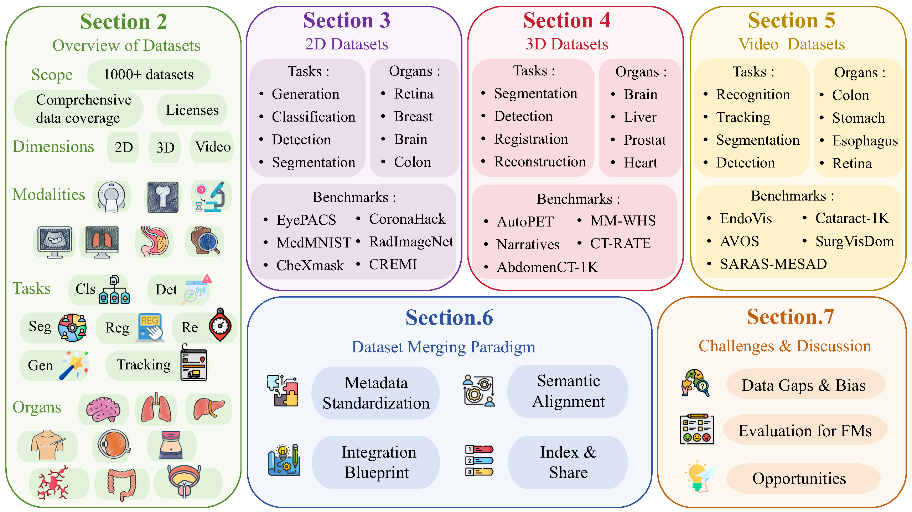
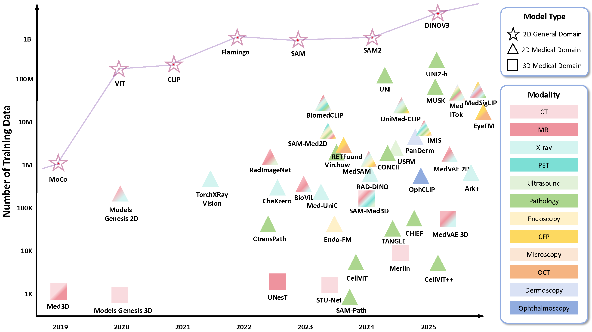
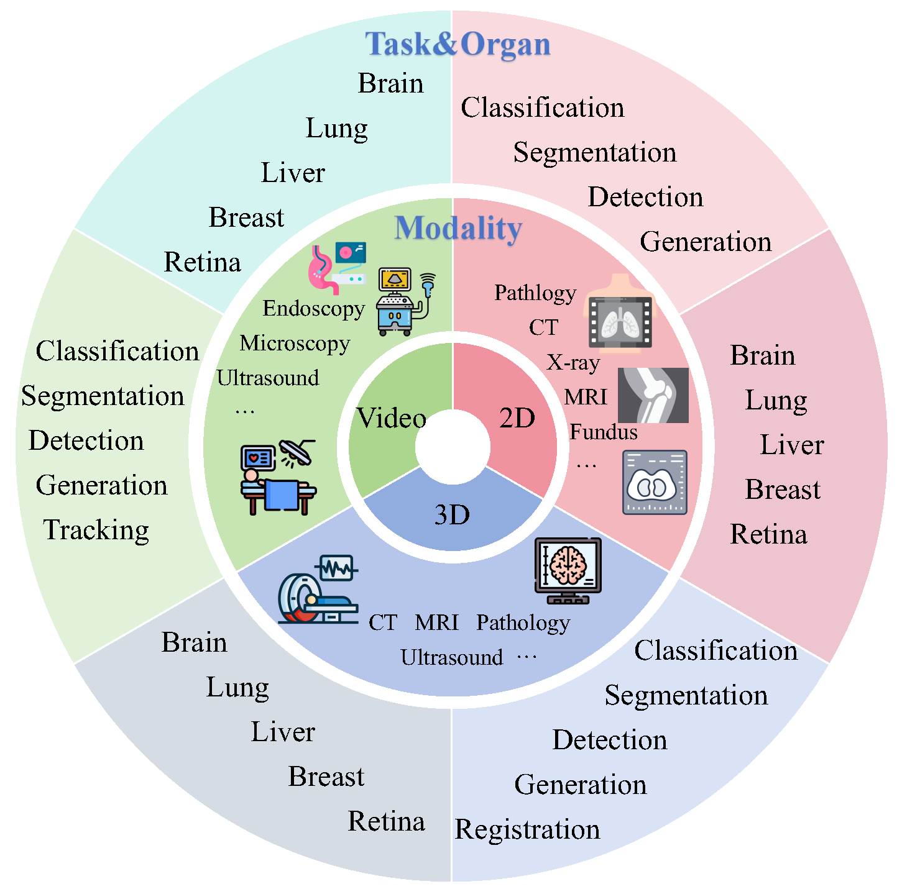

# 🌍 Project Imaging-X
<p align="center">
  <div align="center" style="display: flex; justify-content: center; gap: 20px;">
    
    
  </div>

  <p align="center">
    <a href=''>
      </a>
    <a href='https://ophnet-3d.github.io/'>
      </a>
    <a href=''>
      
    </a>
  </p>
</p>
A strategic initiative to consolidate 1000+ open medical imaging datasets worldwide, breaking down data silos through systematic integration to build the foundational infrastructure for next-generation medical AI models.
> **Challenge**: Medical imaging lacks large-scale unified datasets due to clinical expertise requirements and privacy constraints, limiting the development of powerful medical foundation models.

> **Solution**: We surveyed 1000+ open-access medical image datasets, developed a systematic integration paradigm, and created a unified repository with structured metadata and reference links.

> **Impact**: Transforming fragmented small datasets into cohesive large-scale resources to accelerate medical AI research and enable robust foundation models for the biomedical community.
<!-- 
A comprehensive survey of 1,000+ open-access medical image datasets with systematic analysis of their modalities, tasks, anatomies, and potential for integration into foundation models.

> Foundation models have demonstrated remarkable success across diverse domains and tasks, primarily due to the thrive of large-scale, diverse, and high-quality datasets. However, in the field of medical imaging, the curation and annotation of such medical datasets are highly challenging due to the reliance on clinical expertise and strict ethical and privacy constraints, resulting in a scarcity of large-scale unified medical datasets and hindering the development of powerful medical foundation models.
> In this work, we present a comprehensive survey of over 1,000 open-access medical image datasets, providing a thorough analysis of their modalities, tasks, anatomies, annotations, limitations, and potential for integration.
> Through this systematic examination, our findings reveal that most existing datasets are modest in scale, fragmented across specific tasks, and narrowly scoped, which in turn limits their utility for developing versatile and robust medical foundation models.
> To address these gaps, we develop a systematic paradigm for integrating public datasets with shared modalities or tasks, thereby transforming multiple small datasets into a larger, more cohesive resource.
> In addition, we compile all surveyed datasets into a unified, structured table that clearly summarizes their key characteristics and provides reference links, offering the community an accessible and comprehensive repository.
> By mapping the current landscape and proposing strategies for dataset consolidation, our survey supports data discovery, guides dataset creation, and advances medical foundation models for the biomedical imaging research community.
-->
> If you spot any mistakes or have suggestions, feel free to reach out by email: yejin@pjlab.org.cn, huming@pjlab.org.cn, qiaoyu@pjlab.org.cn, chenyirong@pjlab.org.cn, hejunjun@pjlab.org.cn

## 📖 Citation
If you find this repository or our survey helpful in your research, please kindly cite our paper:

📄 **Paper**: [Dataset Review](assets/Dataset_Review.pdf)

```bibtex
# Citation information will be updated once the paper is published on arXiv
```

---

## 🏥 Medical Datasets Overview


A comprehensive analysis of 1000+ medical imaging datasets spanning anatomical regions, imaging modalities, and AI tasks, showcasing the evolution of medical imaging from 2000 to 2025.

---

## 🏥 Medical Imaging Dataset Ecosystem  



Our comprehensive taxonomy covers the entire spectrum of medical imaging modalities, from traditional radiography to advanced molecular imaging.

---

## 🤖 Medical Foundation Model Development



These datasets form the foundation for training next-generation medical AI models, enabling breakthroughs in automated diagnosis and treatment planning.

---

## 🔍 Taxonomy and Retrieval System



Our systematic categorization enables efficient dataset discovery based on:
- **Medical Domain**: Radiology, Pathology, Ophthalmology, etc.
- **Imaging Modality**: CT, MRI, X-ray, Ultrasound, etc.  
- **Anatomical Region**: Brain, Chest, Abdomen, Extremities, etc.
- **Task Type**: Classification, Segmentation, Detection, etc.
- **Disease Category**: Cancer, Cardiovascular, Neurological, etc.

---

## 📋 Table of Contents

- [Awesome Medical Datasets](#awesome-medical-datasets)
  - [📖 Citation](#-citation)
  - [📋 Table of Contents](#-table-of-contents)
  - [📈 Medical Dataset Publication Trends](#-medical-dataset-publication-trends)
  - [🏥 Medical Imaging Dataset Ecosystem](#-medical-imaging-dataset-ecosystem)
  - [🤖 Medical Foundation Model Development](#-medical-foundation-model-development)
  - [🔍 Taxonomy and Retrieval System](#-taxonomy-and-retrieval-system)
  - [📊 2D Medical Imaging Datasets](#-2d-medical-imaging-datasets)
    - [🫁 CT Datasets](#-ct-datasets)
    - [🦴 X-ray Datasets](#-x-ray-datasets) 
    - [🧠 MRI Datasets](#-mri-datasets)
    - [👁️ Fundus Photography](#️-fundus-photography)
    - [🔬 Histopathology](#-histopathology)
    - [🩺 Ultrasound](#-ultrasound)
    - [🔍 Endoscopy](#-endoscopy)
    - [👥 Dermoscopy](#-dermoscopy)
    - [🧪 Microscopy](#-microscopy)
    - [👁️‍🗨️ OCT](#️️-oct)
    - [☢️ PET](#️-pet)
    - [🔥 Infrared](#-infrared)
    - [🔬 Others](#-others-2d)
  - [📦 3D Medical Imaging Datasets](#-3d-medical-imaging-datasets)
    - [🫁 3D CT](#-3d-ct)
    - [🧠 3D MRI](#-3d-mri)
    - [☢️ 3D PET](#️-3d-pet)
    - [🩺 3D Ultrasound](#-3d-ultrasound)
    - [🔬 Other 3D](#-other-3d)
  - [🎥 Video Medical Imaging Datasets](#-video-medical-imaging-datasets)

---

## 📊 2D Medical Imaging Datasets

2D medical imaging datasets represent the foundation of medical AI research, covering diverse modalities from traditional radiography to advanced optical coherence tomography.

### 🫁 CT Datasets
<a href="#-table-of-contents" style="float:right;">⬆ Back to Top</a>

| Dataset | Domain | Modality | Images | License | Task | Disease Type | Year | Link |
|---|---|---|---|---|---|---|---|---|

### 🦴 X-ray Datasets
<a href="#-table-of-contents" style="float:right;">⬆ Back to Top</a>

| Dataset | Domain | Modality | Images | License | Task | Disease Type | Year | Link |
|---|---|---|---|---|---|---|---|---|
| [ImageCLEF 2015](nan) | Orthopedic | X-Ray | 150 | Custom | Segmentation | Pelvic bone fragments | 2025 | [🔗](nan) |
| [DENTEX](https://dentex.grand-challenge.org/data/) | Neurological | X-Ray | 1.0k | - | Detection | Various | 2023 | [🔗](https://dentex.grand-challenge.org/data/) |
| [CL-Detection2023](https://cl-detection2023.grand-challenge.org/) | Multi-organ | X-Ray | 555 | - | Detection | Various | 2023 | [🔗](https://cl-detection2023.grand-challenge.org/) |
| [ISBI2023 CEPHA29](http://vision.seecs.edu.pk/CEPHA29/) | Multi-organ | X-Ray | 1.5k | - | Segmentation | Various | 2023 | [🔗](http://vision.seecs.edu.pk/CEPHA29/) |
| [MedFM2023](https://medfm2023.grand-challenge.org/) | Multi-organ | X-Ray | 4.8k | CC-BY-SA 4.0 | Classification | Various | 2023 | [🔗](https://medfm2023.grand-challenge.org/) |
| [CheXmask](https://physionet.org/content/chexmask-cxr-segmentation-data/0.1/) | Multi-organ | X-Ray | 676.8k | CC BY-NC-SA | Segmentation | Lung diseases | 2023 | [🔗](https://physionet.org/content/chexmask-cxr-segmentation-data/0.1/) |
| [CMB-CRC](https://wiki.cancerimagingarchive.net/pages/viewpage.action?pageId=93257955) | Oncology | Multi | 472 | TCIA | Seg, Cls | Colorectal cancer | 2022 | [🔗](https://wiki.cancerimagingarchive.net/pages/viewpage.action?pageId=93257955) |
| [APOLLO-5](https://wiki.cancerimagingarchive.net/display/Public/APOLLO-5) | Multi-organ | Multi | 6.2k | TCIA | N/A | Various | 2022 | [🔗](https://wiki.cancerimagingarchive.net/display/Public/APOLLO-5) |
| [CMB-LCA](https://wiki.cancerimagingarchive.net/pages/viewpage.action?pageId=93258420) | Multi-organ | Multi | 0 | TCIA | N/A | Various | 2022 | [🔗](https://wiki.cancerimagingarchive.net/pages/viewpage.action?pageId=93258420) |
| [AHOD0831](https://wiki.cancerimagingarchive.net/pages/viewpage.action?pageId=119705284) | Multi-organ | CT, MR, PET, X-Ray | 0 | TCIA | N/A | Hodgkin Lymphoma | 2022 | [🔗](https://wiki.cancerimagingarchive.net/pages/viewpage.action?pageId=119705284) |
| [Chest XR COVID-19](https://cxr-covid19.grand-challenge.org) | Pulmonary | X-Ray | 21.4k | - | Classification | COVID-19 | 2021 | [🔗](https://cxr-covid19.grand-challenge.org) |
| [Chest X-ray PA Dataset](https://data.mendeley.com/datasets/jctsfj2sfn/1) | Pulmonary | X-Ray | 4.6k | CC BY 4.0 | Classification | COVID-19, Pneumonia | 2021 | [🔗](https://data.mendeley.com/datasets/jctsfj2sfn/1) |
| [NHANES II X-ray](https://www.nlm.nih.gov/databases/download/nhanes.html) | Pulmonary | X-Ray | 17.1k | - | N/A | Various | 2021 | [🔗](https://www.nlm.nih.gov/databases/download/nhanes.html) |
| [CoronaHack Chest X-Ray](https://tianchi.aliyun.com/dataset/dataDetail?dataId=94307) | Pulmonary | X-Ray | 5.3k | CC BY-NC-SA | Classification | Lung Cancer | 2021 | [🔗](https://tianchi.aliyun.com/dataset/dataDetail?dataId=94307) |
| [Covid-19 Image Dataset](https://www.kaggle.com/datasets/pranavraikokte/covid19-image-dataset) | Pulmonary | X-Ray | 345 | CC-BY-SA 4.0 | Classification | Lung diseases | 2021 | [🔗](https://www.kaggle.com/datasets/pranavraikokte/covid19-image-dataset) |
| [Pulmonary Chest X-Ray (ChinaSet)](https://tianchi.aliyun.com/dataset/dataDetail?dataId=94377) | Pulmonary | X-Ray | 800 | CC BY-NC-SA | Classification | Lung diseases | 2021 | [🔗](https://tianchi.aliyun.com/dataset/dataDetail?dataId=94377) |
| [MURA](https://stanfordmlgroup.github.io/competitions/mura/) | Orthopedic | X-Ray | 40.0k | CC BY-NC-SA | Classification | Musculoskeletal | 2021 | [🔗](https://stanfordmlgroup.github.io/competitions/mura/) |
| [MIAS Mammography](http://peipa.essex.ac.uk/info/mias.html) | Breast Imaging | X-Ray | 322 | CC BY-NC-SA | Classification | Breast cancer | 2021 | [🔗](http://peipa.essex.ac.uk/info/mias.html) |
| [CheXpert](https://stanfordmlgroup.github.io/competitions/chexpert/) | Pulmonary | X-Ray | 224.3k | Research Use | Classification | Diabetic retinopathy | 2021 | [🔗](https://stanfordmlgroup.github.io/competitions/chexpert/) |
| [SIIM-FISABIO-RSNA COVID-19](https://www.kaggle.com/competitions/siim-covid19-detection/data) | Pulmonary | X-Ray | 6.1k | CC BY-NC 4.0 | Detection | Tuberculosis | 2021 | [🔗](https://www.kaggle.com/competitions/siim-covid19-detection/data) |
| [NODE21](https://node21.grand-challenge.org/) | Pulmonary | X-Ray | 5.5k | CC BY-NC-ND | Detection | Breast cancer | 2021 | [🔗](https://node21.grand-challenge.org/) |
| [ChestX-Det](https://opendatalab.com/OpenDataLab/ChestX-Det) | Pulmonary | X-Ray (CXR) | 3.6k | - | Segmentation | Lung diseases | 2021 | [🔗](https://opendatalab.com/OpenDataLab/ChestX-Det) |
| [MIDRC-RICORD-1c](https://wiki.cancerimagingarchive.net/pages/viewpage.action?pageId=70230281) | Pulmonary | X-Ray | 1.3k | TCIA | Classification | Various | 2021 | [🔗](https://wiki.cancerimagingarchive.net/pages/viewpage.action?pageId=70230281) |
| [COVID-19 Chest X-ray DB](https://www.heywhale.com/mw/dataset/6027caee891f960015c863d7) | Pulmonary | X-Ray | 3.9k | CC-BY-SA 4.0 | Classification | COVID-19 | 2021 | [🔗](https://www.heywhale.com/mw/dataset/6027caee891f960015c863d7) |
| [Pulmonary Chest X-Ray Seg](https://tianchi.aliyun.com/dataset/dataDetail?dataId=94377) | Pulmonary | X-Ray | 800 | CC BY-NC-SA | Segmentation | Lung diseases | 2021 | [🔗](https://tianchi.aliyun.com/dataset/dataDetail?dataId=94377) |
| [Pulmonary Chest X-Ray Cls](https://tianchi.aliyun.com/dataset/dataDetail?dataId=94377) | Pulmonary | X-Ray | 800 | CC BY-NC-SA | Classification | Lung diseases | 2021 | [🔗](https://tianchi.aliyun.com/dataset/dataDetail?dataId=94377) |
| [RUS_CHN](https://aistudio.baidu.com/datasetdetail/69582/0) | Multi-organ | X-Ray | 0 | - | Classification | Hand joints | 2021 | [🔗](https://aistudio.baidu.com/datasetdetail/69582/0) |
| [CoronaHack](https://www.kaggle.com/praveengovi/coronahack-chest-xraydataset) | Pulmonary | X-Ray | 5.9k | CC BY 4.0 | Classification | COVID-19, Pneumonia | 2020 | [🔗](https://www.kaggle.com/praveengovi/coronahack-chest-xraydataset) |
| [COVIDx CXR-2](https://www.kaggle.com/andyczhao/covidx-cxr2) | Pulmonary | X-Ray | 30.9k | CC BY-NC-SA | Classification | COVID-19 | 2020 | [🔗](https://www.kaggle.com/andyczhao/covidx-cxr2) |
| [Pneumothorax Masks X-Ray](https://www.kaggle.com/vbookshelf/pneumothorax-chest-xray-images-and-masks) | Pulmonary | X-Ray | 12.0k | - | Segmentation | Pneumothorax | 2020 | [🔗](https://www.kaggle.com/vbookshelf/pneumothorax-chest-xray-images-and-masks) |
| [IRMA X-ray](https://www.kaggle.com/raddar/irma-xray-dataset) | Pulmonary | X-Ray | 14.7k | - | Classification | Various | 2020 | [🔗](https://www.kaggle.com/raddar/irma-xray-dataset) |
| [COVID-19-Image](https://github.com/ieee8023/covid-chestxray-dataset) | Pulmonary | X-Ray | 93 | CC BY-NC-SA | Classification | COVID-19 | 2020 | [🔗](https://github.com/ieee8023/covid-chestxray-dataset) |
| [KNOAP2020](https://knoap2020.grand-challenge.org/Home/) | Multi-organ | MR (T1, T2), X-Ray | 30 | - | Prediction | Osteoarthritis | 2020 | [🔗](https://knoap2020.grand-challenge.org/Home/) |
| [SIIM-ACR Pneumothorax Seg](https://www.kaggle.com/c/siim-acr-pneumothorax-segmentation/data) | Pulmonary | X-Ray | 12.1k | CC BY-NC-SA | Segmentation | Pneumothorax | 2020 | [🔗](https://www.kaggle.com/c/siim-acr-pneumothorax-segmentation/data) |
| [MedMNIST](https://medmnist.com/v1) | Pulmonary | Multi | 100k | CC BY 4.0, CC BY-NC 4.0 | Classification | Multi-diseases | 2020 | [🔗](https://medmnist.com/v1) |
| [VinBigData Chest X-ray](https://www.kaggle.com/competitions/vinbigdata-chest-xray-abnormalities-detection) | Pulmonary | X-Ray | 15.0k | - | Detection | Heart atrium | 2020 | [🔗](https://www.kaggle.com/competitions/vinbigdata-chest-xray-abnormalities-detection) |
| [COVIDGR](https://github.com/ari-dasci/OD-covidgr) | Pulmonary | X-Ray (CXR) | 852 | - | Classification | COVID-19 | 2020 | [🔗](https://github.com/ari-dasci/OD-covidgr) |
| [RANZCR CLiP](https://www.kaggle.com/competitions/ranzcr-clip-catheter-line-classification/data) | Breast Imaging | X-Ray | 30.1k | - | Classification | Various | 2020 | [🔗](https://www.kaggle.com/competitions/ranzcr-clip-catheter-line-classification/data) |
| [CPCXR](https://opendatalab.org.cn/CPCXR/download) | Pulmonary | X-Ray (CXR) | 1.2k | Custom | N/A | Pneumonia, COVID-19 | 2020 | [🔗](https://opendatalab.org.cn/CPCXR/download) |
| [Synthetic COVID-19 CXR](https://opendatalab.org.cn/Synthetic_COVID-19_CXR_Dataset) | Pulmonary | X-Ray (CXR) | 21.3k | MIT | Cls, Gen | COVID-19 | 2020 | [🔗](https://opendatalab.org.cn/Synthetic_COVID-19_CXR_Dataset) |
| [ChestX-Det_det](https://opendatalab.com/ChestX-Det/download) | Pulmonary | X-Ray | 3.5k | - | Detection | Chest diseases | 2020 | [🔗](https://opendatalab.com/ChestX-Det/download) |
| [Knee Osteoarthritis Dataset](https://www.kaggle.com/datasets/shashwatwork/knee-osteoarthritis-dataset-with-severity/data) | Multi-organ | X-Ray | 0 | - | Classification | Knee osteoarthritis | 2020 | [🔗](https://www.kaggle.com/datasets/shashwatwork/knee-osteoarthritis-dataset-with-severity/data) |
| [AASCE](https://aasce19.grand-challenge.org/Award/) | Orthopedic | X-Ray | 609 | - | Registration | Various | 2019 | [🔗](https://aasce19.grand-challenge.org/Award/) |
| [SIIM-ACR Pneumothorax Seg](https://www.kaggle.com/competitions/siim-acr-pneumothorax-segmentation/overview/description) | Pulmonary | X-Ray | 3.2k | - | Classification | Surgical action | 2019 | [🔗](https://www.kaggle.com/competitions/siim-acr-pneumothorax-segmentation/overview/description) |
| [CoronARe](https://coronare.grand-challenge.org/) | Breast Imaging | X-Ray (Mammo) | 217.9k | TCIA | N/A | Various | 2019 | [🔗](https://coronare.grand-challenge.org/) |
| [Chest X-ray](https://www.kaggle.com/paultimothymooney/chest-xray-pneumonia) | Pulmonary | X-Ray | 5.9k | CC BY 4.0 | Classification | Pneumonia | 2018 | [🔗](https://www.kaggle.com/paultimothymooney/chest-xray-pneumonia) |
| [RSNA Pneumonia Detection](https://www.kaggle.com/competitions/rsna-pneumonia-detection-challenge) | Pulmonary | X-Ray | 26.7k | - | Detection | Lung abnormalities | 2018 | [🔗](https://www.kaggle.com/competitions/rsna-pneumonia-detection-challenge) |
| [SZ-CXR](https://arxiv.org/pdf/1803.01199v1.pdf) | Pulmonary | X-Ray | 566 | CC BY-NC-SA | Segmentation | Various | 2018 | [🔗](https://arxiv.org/pdf/1803.01199v1.pdf) |
| [NIH Chest X-ray 14](https://www.kaggle.com/nih-chest-xrays/data) | Pulmonary | X-Ray | 112.1k | CC0 | Classification | Thorax diseases | 2017 | [🔗](https://www.kaggle.com/nih-chest-xrays/data) |
| [Chest X-ray Imaging](https://www.heywhale.com/mw/dataset/62c2ac49913a54a66037f872) | Pulmonary | X-Ray | 5.9k | CC BY 4.0 | Classification | Various | 2017 | [🔗](https://www.heywhale.com/mw/dataset/62c2ac49913a54a66037f872) |
| [X-ray Pneumonia Image Dataset](https://www.heywhale.com/mw/dataset/5d148fe9708b90002c629bdd) | Pulmonary | X-Ray | 5.9k | CC BY 4.0 | Classification | Pneumonia | 2017 | [🔗](https://www.heywhale.com/mw/dataset/5d148fe9708b90002c629bdd) |
| [RSNA Bone Age](https://www.rsna.org/rsnai/ai-image-challenge/rsna-pediatric-bone-age-challenge-2017) | Multi-organ | X-Ray | 14.2k | - | Estimation | Hand bone | 2017 | [🔗](https://www.rsna.org/rsnai/ai-image-challenge/rsna-pediatric-bone-age-challenge-2017) |
| [ImageCLEF 2016](https://www.imageclef.org/2016/medical) | Breast Imaging | Multi | 31.0k | - | Classification | Head | 2016 | [🔗](https://www.imageclef.org/2016/medical) |
| [TCB-Challenge](https://www.idpoisson.fr/tcbchallenge/) | Orthopedic | X-Ray (Bone Radiograph) | 174 | - | Classification | Osteoporotic bone | 2016 | [🔗](https://www.idpoisson.fr/tcbchallenge/) |
| [Cephalometric X-ray Image](https://opendatalab.org.cn/Cephalometric_X-ray_Image) | Multi-organ | X-Ray (OPG) | 400 | Academic use | Localization | Various | 2014 | [🔗](https://opendatalab.org.cn/Cephalometric_X-ray_Image) |
| [CRASS](https://crass.grand-challenge.org/Home/) | Multi-organ | X-Ray (CXR) | 518 | - | Segmentation | Clavicles | 2012 | [🔗](https://crass.grand-challenge.org/Home/) |
| [JSRT](http://db.jsrt.or.jp/eng.php) | Pulmonary | X-Ray (CXR) | 247 | Academic use | Classification | Lung nodule | 2000 | [🔗](http://db.jsrt.or.jp/eng.php) |

### 🧠 MRI Datasets
<a href="#-table-of-contents" style="float:right;">⬆ Back to Top</a>

| Dataset | Domain | Modality | Images | License | Task | Disease Type | Year | Link |
|---|---|---|---|---|---|---|---|---|
| [braimMRI](https://tianchi.aliyun.com/dataset/dataDetail?dataId=127459) | Neurological | MR | 110 | CC BY-NC-SA | Segmentation | Brain Tumor | 2022 | [🔗](https://tianchi.aliyun.com/dataset/dataDetail?dataId=127459) |
| [CMB-CRC](https://wiki.cancerimagingarchive.net/pages/viewpage.action?pageId=93257955) | Oncology | Multi | 472 | TCIA | Seg, Cls | Colorectal Cancer | 2022 | [🔗](https://wiki.cancerimagingarchive.net/pages/viewpage.action?pageId=93257955) |
| [CMB-PCA](https://wiki.cancerimagingarchive.net/pages/viewpage.action?pageId=95224082) | Oncology | CT, MR, Histo | 31 | TCIA | Cls, Pred | Prostate Cancer | 2022 | [🔗](https://wiki.cancerimagingarchive.net/pages/viewpage.action?pageId=95224082) |
| [APOLLO-5](https://wiki.cancerimagingarchive.net/display/Public/APOLLO-5) | Multi-organ | Multi | 6.2k | TCIA |  | Various | 2022 | [🔗](https://wiki.cancerimagingarchive.net/display/Public/APOLLO-5) |
| [CMB-LCA](https://wiki.cancerimagingarchive.net/pages/viewpage.action?pageId=93258420) | Oncology | Multi | 0 | TCIA |  | Lung Cancer | 2022 | [🔗](https://wiki.cancerimagingarchive.net/pages/viewpage.action?pageId=93258420) |
| [AHOD0831](https://wiki.cancerimagingarchive.net/pages/viewpage.action?pageId=119705284) | Multi-organ | Multi | 0 | TCIA |  | Hodgkin Lymphoma | 2022 | [🔗](https://wiki.cancerimagingarchive.net/pages/viewpage.action?pageId=119705284) |
| [AREN0532](https://wiki.cancerimagingarchive.net/pages/viewpage.action?pageId=109379682) | Oncology | Multi | 1k | TCIA |  | Wilms Tumor | 2022 | [🔗](https://wiki.cancerimagingarchive.net/pages/viewpage.action?pageId=109379682) |
| [RadImageNet (Subset: MR)](https://www.radimagenet.com/) | Multi-organ | MR | 673k | Commercial | Classification | Whole Body Abnorm. | 2022 | [🔗](https://www.radimagenet.com/) |
| [AREN0534](https://wiki.cancerimagingarchive.net/pages/viewpage.action?pageId=91357265) | Pulmonary | Multi | 239 | NCTN/NCORP | Estimation | Kidney Tumor | 2021 | [🔗](https://wiki.cancerimagingarchive.net/pages/viewpage.action?pageId=91357265) |
| [CMB-MML](https://wiki.cancerimagingarchive.net/pages/viewpage.action?pageId=93258436) | Multi-organ | Multi | 60 | TCIA | Prediction | Multiple Myeloma | 2021 | [🔗](https://wiki.cancerimagingarchive.net/pages/viewpage.action?pageId=93258436) |
| [ICDC-Glioma (GLIOMA01)_3D-MR](https://wiki.cancerimagingarchive.net/pages/viewpage.action?pageId=70227341) | Multi-organ | MR, Histo | 650 | TCIA |  | Glioma | 2021 | [🔗](https://wiki.cancerimagingarchive.net/pages/viewpage.action?pageId=70227341) |
| [QUBIQ2021_2D_MR](https://qubiq21.grand-challenge.org/QUBIQ2021/) | Multi-organ | CT, MR (T1) | 268 | - | Segmentation | Pathologies | 2021 | [🔗](https://qubiq21.grand-challenge.org/QUBIQ2021/) |
| [QUBIQ2021_2D_CT](https://qubiq21.grand-challenge.org/QUBIQ2021/) | Multi-organ | CT, MR (T1w) | 268 | - | Segmentation | Pathologies | 2021 | [🔗](https://qubiq21.grand-challenge.org/QUBIQ2021/) |
| [ICDC-Glioma (GLIOMA01)_2D-Histo](https://wiki.cancerimagingarchive.net/pages/viewpage.action?pageId=70227341) | Multi-organ | MR, Histo | 650 | TCIA |  | Glioma | 2021 | [🔗](https://wiki.cancerimagingarchive.net/pages/viewpage.action?pageId=70227341) |
| [QUBIQ2021_2D_CT](https://qubiq21.grand-challenge.org/QUBIQ2021/) | Multi-organ | 268 | Seg | CT, MR |  | 2D, 3D | 2021 | [🔗](https://qubiq21.grand-challenge.org/QUBIQ2021/) |
| [KNOAP2020](https://knoap2020.grand-challenge.org/Home/) | Multi-organ | MR (T1, T2), X-Ray | 30 | - | Prediction | Osteoarthritis | 2020 | [🔗](https://knoap2020.grand-challenge.org/Home/) |
| [Brain-MRI](https://tianchi.aliyun.com/dataset/127583) | Neurological | MR (Flair) | 110 | CC BY-NC-SA | Segmentation | Brain Disease | 2020 | [🔗](https://tianchi.aliyun.com/dataset/127583) |
| [SpinalDisease2020](https://tianchi.aliyun.com/competition/entrance/531796/information) | Orthopedic | MR (T1, T2) | 150 | CC BY-NC-SA | Detection | Spinal Disease | 2020 | [🔗](https://tianchi.aliyun.com/competition/entrance/531796/information) |
| [Cardiac Atrial Images](https://www.heywhale.com/mw/dataset/5e4de9618ee624002d4c4117) | Cardiac | MR | 8k | CC BY 4.0 | Segmentation | Cardiac Disease | 2020 | [🔗](https://www.heywhale.com/mw/dataset/5e4de9618ee624002d4c4117) |
| [QUBIQ2020](https://qubiq.grand-challenge.org/) | Multi-organ | CT, MR (T1, T2) | 150 | - | Segmentation | Pathologies | 2020 | [🔗](https://qubiq.grand-challenge.org/) |
| [Prostate Fused-MRI-Pathology](https://www.cancerimagingarchive.net/collection/prostate-fused-mri-pathology/) | Oncology | MR, Histo | 29 | TCIA |  | Prostate Cancer | 2016 | [🔗](https://www.cancerimagingarchive.net/collection/prostate-fused-mri-pathology/) |
| [ImageCLEF 2016](https://www.imageclef.org/2016/medical) | Breast Imaging | Multi | 31k | - | Classification | H | 2015 | [🔗](https://www.imageclef.org/2016/medical) |
| [Prostate-MRI](https://wiki.cancerimagingarchive.net/display/Public/PROSTATE-MRI) | Oncology | Multi | 26 | TCIA |  | Prostate Cancer | 2011 | [🔗](https://wiki.cancerimagingarchive.net/display/Public/PROSTATE-MRI) |
| [The Visible Human Project](https://www.nlm.nih.gov/research/visible/visible_human.html) | Multi-organ | CT, MR, Others | 2 | - |  | Skin Lesion | 1994 | [🔗](https://www.nlm.nih.gov/research/visible/visible_human.html) |

### 👁️ Fundus Photography
<a href="#-table-of-contents" style="float:right;">⬆ Back to Top</a>

| Dataset | Domain | Modality | Images | License | Task | Disease Type | Year | Link |
|---|---|---|---|---|---|---|---|---|
| [MMAC2023](https://codalab.lisn.upsaclay.fr/competitions/12441) | Multi-organ | Fundus | 0 | - | Classification | Various | 2023 | [🔗](https://codalab.lisn.upsaclay.fr/competitions/12441) |
| [RFMiD 2.0](https://zenodo.org/record/7505822) | Multi-organ | Fundus Photo | 860 | CC BY 4.0 | Classification | Retinal Fundus Multi-Disease | 2023 | [🔗](https://zenodo.org/record/7505822) |
| [ROD](https://www.kaggle.com/datasets/gracemariabinu/retinal-occlusion-dataset/data) | Ophthalmology | Fundus Photo | 281 | - | Classification | Retinal Occlusion | 2023 | [🔗](https://www.kaggle.com/datasets/gracemariabinu/retinal-occlusion-dataset/data) |
| [ToxoFundus](https://www.kaggle.com/datasets/andrewmvd/ocular-toxoplasmosis-fundus-images-dataset) | Ophthalmology | Fundus Photo | 411 | - | Classification | Ocular Toxoplasmosis | 2023 | [🔗](https://www.kaggle.com/datasets/andrewmvd/ocular-toxoplasmosis-fundus-images-dataset) |
| [MuReD](https://data.mendeley.com/datasets/pc4mb3h8hz/1) | Multi-organ | Fundus Photo | 2.2k | CC BY 4.0 | Classification | Retinal Diseases | 2022 | [🔗](https://data.mendeley.com/datasets/pc4mb3h8hz/1) |
| [AIROGS](https://airogs.grand-challenge.org/) | Ophthalmology | Fundus Photo | 101.4k | - | Classification | Diabetic Retinopathy | 2021 | [🔗](https://airogs.grand-challenge.org/) |
| [Retina Fundus Image Reg.](https://tianchi.aliyun.com/dataset/dataDetail?dataId=90112) | Ophthalmology | Fundus Photo | 129 | CC BY-NC-SA | Registration | Various | 2021 | [🔗](https://tianchi.aliyun.com/dataset/dataDetail?dataId=90112) |
| [APTOS-2019](https://tianchi.aliyun.com/dataset/dataDetail?dataId=120007) | Ophthalmology | Fundus Photo | 3.7k | CC BY-NC 4.0 | Classification | Diabetic Retinopathy | 2021 | [🔗](https://tianchi.aliyun.com/dataset/dataDetail?dataId=120007) |
| [GAMMA (Task1, CFP)](https://gamma.grand-challenge.org/) | Ophthalmology | Fundus (CFP) | 200 | - | Classification | Grading | 2021 | [🔗](https://gamma.grand-challenge.org/) |
| [GAMMA](https://gamma.grand-challenge.org/) | Ophthalmology | Fundus | 200 | - | Classification | Various | 2021 | [🔗](https://gamma.grand-challenge.org/) |
| [iChallenge-GAMMA_3D-OCT](https://gamma.grand-challenge.org/) | Ophthalmology | Fundus | 300 | - | Segmentation | Glaucoma | 2021 | [🔗](https://gamma.grand-challenge.org/) |
| [GAMMA (Task3, CFP)](https://gamma.grand-challenge.org/) | Ophthalmology | Fundus (CFP) | 200 | - | Segmentation | Optic Disc and Cup | 2021 | [🔗](https://gamma.grand-challenge.org/) |
| [iChallenge-GAMMA_2D-Fundus](https://gamma.grand-challenge.org/) | Ophthalmology | Fundus | 300 | - | Segmentation | Glaucoma | 2021 | [🔗](https://gamma.grand-challenge.org/) |
| [RIADD (RFMiD)](https://riadd.grand-challenge.org/) | Ophthalmology | Fundus Photo | 3.2k | - | Classification | Retinal Diseases | 2020 | [🔗](https://riadd.grand-challenge.org/) |
| [iChallenge-ADAM](https://amd.grand-challenge.org/) | Ophthalmology | Fundus Photo | 400 | CC BY 4.0 | Classification | Diabetic Retinopathy | 2020 | [🔗](https://amd.grand-challenge.org/) |
| [MedMNIST](https://medmnist.com/v1) | Pulmonary | Multi | 100k | CC BY 4.0 | Classification | Various | 2020 | [🔗](https://medmnist.com/v1) |
| [DeepDR-Task1](https://isbi.deepdr.org/) | Ophthalmology | Fundus Photo | 2k | CC-BY-SA 4.0 | Classification | Breast Cancer | 2020 | [🔗](https://isbi.deepdr.org/) |
| [RIM-ONE](http://medimrg.webs.ull.es/research/retinal-imaging/rim-one/) | Ophthalmology | Fundus | 485 | - | Segmentation | Optic Disc and Cup | 2020 | [🔗](http://medimrg.webs.ull.es/research/retinal-imaging/rim-one/) |
| [Glaucoma Detection](https://www.kaggle.com/datasets/sshikamaru/glaucoma-detection) | Ophthalmology | Fundus | 650 | CC0 | Classification | Glaucoma | 2020 | [🔗](https://www.kaggle.com/datasets/sshikamaru/glaucoma-detection) |
| [iChallenge-REFUGE2](https://refuge.grand-challenge.org/) | Ophthalmology | Fundus Photo (CFP) | 1.6k | CC-BY-NC | Classification | Glaucoma | 2020 | [🔗](https://refuge.grand-challenge.org/) |
| [ORVS](https://opendatalab.org.cn/ORVS) | Ophthalmology | Fundus | 49 | - | Segmentation | Various | 2020 | [🔗](https://opendatalab.org.cn/ORVS) |
| [Retinal Img Quality Assess.](https://www.heywhale.com/mw/dataset/5e95d871e7ec38002d034efe) | Ophthalmology | Fundus | 216 | CC BY 4.0 | Classification | Various | 2020 | [🔗](https://www.heywhale.com/mw/dataset/5e95d871e7ec38002d034efe) |
| [DeepDR-Task2](https://isbi.deepdr.org/) | Multi-organ | Fundus | 2k | CC-BY-SA 4.0 | Registration | Various | 2020 | [🔗](https://isbi.deepdr.org/) |
| [DeepDR-Task3](https://isbi.deepdr.org/) | Multi-organ | Fundus | 246 | CC-BY-SA 4.0 | Classification | Various | 2020 | [🔗](https://isbi.deepdr.org/) |
| [ODIR](https://odir2019.grand-challenge.org/) | Ophthalmology | Fundus Photo | 8k | - | Classification | Ocular Diseases (DR screening) | 2019 | [🔗](https://odir2019.grand-challenge.org/) |
| [HRF](https://www5.cs.fau.de/fileadmin/research/datasets/fundus-images/healthy.zip) | Ophthalmology | Fundus | 800 | CC BY 4.0 | Segmentation | Various | 2019 | [🔗](https://www5.cs.fau.de/fileadmin/research/datasets/fundus-images/healthy.zip) |
| [APTOS 2019 Blindness Det.](https://www.kaggle.com/competitions/aptos2019-blindness-detection/overview) | Ophthalmology | Fundus | 5.6k | - | Classification | Grading | 2019 | [🔗](https://www.kaggle.com/competitions/aptos2019-blindness-detection/overview) |
| [ACRIMA](https://figshare.com/s/c2d31f850af14c5b5232) | Ophthalmology | Fundus | 705 | CC BY 4.0 | Classification | Glaucoma | 2019 | [🔗](https://figshare.com/s/c2d31f850af14c5b5232) |
| [Arteriovenous Nicking](https://people.eng.unimelb.edu.au/thivun/projects/AV_nicking_quantification/) | Ophthalmology | Fundus | 601 | Unknown | Classification | Fundus Diseases | 2019 | [🔗](https://people.eng.unimelb.edu.au/thivun/projects/AV_nicking_quantification/) |
| [Yangxi](https://zenodo.org/record/3393265) | Ophthalmology | Fundus | 20.4k | CC BY 4.0 | Classification | Eye Axis | 2019 | [🔗](https://zenodo.org/record/3393265) |
| [JSIEC](https://www.kaggle.com/datasets/linchundan/fundusimage1000) | Ophthalmology | Fundus | 1k | DbCL 1.0 | Classification | Fundus Diseases | 2019 | [🔗](https://www.kaggle.com/datasets/linchundan/fundusimage1000) |
| [OIA-ODIR](https://odir2019.grand-challenge.org/introduction/) | Multi-organ | Fundus | 10k | - | Classification | Various | 2019 | [🔗](https://odir2019.grand-challenge.org/introduction/) |
| [VARPA](http://www.varpa.es/research/ophtalmology.html) | Ophthalmology | Fundus | 58 | - | Classification | Various | 2019 | [🔗](http://www.varpa.es/research/ophtalmology.html) |
| [IDRID2018](https://idrid.grand-challenge.org/) | Ophthalmology | Fundus Photo | 81 | - | Seg, Cls | Diabetic Retinopathy | 2018 | [🔗](https://idrid.grand-challenge.org/) |
| [Retinal Fundus Imgs for Glaucoma](https://deepblue.lib.umich.edu/data/concern/data_sets/3b591905z?locale=en) | Ophthalmology | Fundus | 2.9k | - | Classification | Various | 2018 | [🔗](https://deepblue.lib.umich.edu/data/concern/data_sets/3b591905z?locale=en) |
| [Ophthalmic Slit Lamp](https://plos.figshare.com/articles/dataset/Predicting_the_progression_of_ophthalmic_disease_based_on_slit-lamp_images_using_a_deep_temporal_sequence_network/6883823) | Ophthalmology | Fundus | 60 | - |  | Various | 2018 | [🔗](https://plos.figshare.com/articles/dataset/Predicting_the_progression_of_ophthalmic_disease_based_on_slit-lamp_images_using_a_deep_temporal_sequence_network/6883823) |
| [PARAGUAY](https://zenodo.org/record/3872227) | Ophthalmology | Fundus Photo | 1.4k | - | Classification | Papilledema | 2018 | [🔗](https://zenodo.org/record/3872227) |
| [DRHAGIS](https://paperswithcode.com/dataset/dr-hagis) | Ophthalmology | Fundus Photo | 40 | - | Segmentation | DR Lesions | 2017 | [🔗](https://paperswithcode.com/dataset/dr-hagis) |
| [RetinaCheck (IOSTAR)](http://www.retinacheck.org/download-iostar-retinal-vessel-segmentation-dataset) | Ophthalmology | Fundus | 30 | - | Segmentation | Vessel | 2016 | [🔗](http://www.retinacheck.org/download-iostar-retinal-vessel-segmentation-dataset) |
| [EyePACS](https://www.kaggle.com/c/diabetic-retinopathy-detection/data) | Ophthalmology | Fundus Photo | 88.7k | - | Classification | Diabetic Retinopathy | 2015 | [🔗](https://www.kaggle.com/c/diabetic-retinopathy-detection/data) |
| [ImageCLEF 2016](https://www.imageclef.org/2016/medical) | Breast Imaging | Multi | 31k | - | Classification | Head | 2015 | [🔗](https://www.imageclef.org/2016/medical) |
| [DRISHTI-GS](http://cvit.iiit.ac.in/projects/mip/drishti-gs/mip-dataset2/Home.php) | Ophthalmology | Fundus Photo | 101 | - | Segmentation | Optic Disc | 2014 | [🔗](http://cvit.iiit.ac.in/projects/mip/drishti-gs/mip-dataset2/Home.php) |
| [MESSIDOR-2](https://www.adcis.net/en/third-party/messidor2/) | Ophthalmology | Fundus Photo | 1.7k | Research | Classification | Diabetic Retinopathy | 2013 | [🔗](https://www.adcis.net/en/third-party/messidor2/) |
| [RITE](https://opendatalab.com/RITE) | Ophthalmology | Fundus | 40 | - | Segmentation | Retinal Vessel | 2013 | [🔗](https://opendatalab.com/RITE) |
| [AO-SLO Photoreceptor Seg.](https://people.duke.edu/~sf59/Chiu_BOE_2013_dataset.htm) | Ophthalmology | Fundus | 840 | Research | Segmentation | AO-SLO Cone Photoreceptor | 2013 | [🔗](https://people.duke.edu/~sf59/Chiu_BOE_2013_dataset.htm) |
| [Miles Iris](https://drive.google.com/drive/folders/0B5OBp4zckpLnYkpBcWlubC0tcTA) | Ophthalmology | Fundus (Iris) | 833 | - | Classification | Retinal Structures | 2013 | [🔗](https://drive.google.com/drive/folders/0B5OBp4zckpLnYkpBcWlubC0tcTA) |
| [HRF Quality Assessment](https://www5.cs.fau.de/research/data/fundus-images/) | Ophthalmology | Fundus | 36 | CC BY 4.0 | Registration | Various | 2013 | [🔗](https://www5.cs.fau.de/research/data/fundus-images/) |
| [HRF Segmentation](https://www5.cs.fau.de/research/data/fundus-images/) | Ophthalmology | Fundus | 45 | CC BY 4.0 | Segmentation | Vessel | 2013 | [🔗](https://www5.cs.fau.de/research/data/fundus-images/) |
| [Vampire](https://vampire.computing.dundee.ac.uk/vesselseg.html) | Ophthalmology | Fundus | 8 | - | Segmentation | Vessel | 2011 | [🔗](https://vampire.computing.dundee.ac.uk/vesselseg.html) |
| [INSPIRE (Stereo)](https://medicine.uiowa.edu/eye/inspire-datasets) | Ophthalmology | Fundus | 30 | Research | Registration | Various | 2011 | [🔗](https://medicine.uiowa.edu/eye/inspire-datasets) |
| [INSPIRE (AVR)](https://medicine.uiowa.edu/eye/inspire-datasets) | Ophthalmology | Fundus | 40 | Research | Registration | Various | 2011 | [🔗](https://medicine.uiowa.edu/eye/inspire-datasets) |
| [CHASE](https://blogs.kingston.ac.uk/retinal/chasedb1/) | Ophthalmology | Fundus Photo | 28 | - | Segmentation | Various | 2009 | [🔗](https://blogs.kingston.ac.uk/retinal/chasedb1/) |
| [DiaRetDB](https://www.it.lut.fi/project/imageret/) | Ophthalmology | Fundus Photo | 89 | - | Detection | DR Lesions | 2009 | [🔗](https://www.it.lut.fi/project/imageret/) |
| [Retinal Vessel Tortuosity](http://bioimlab.dei.unipd.it/Data%20Sets.htm) | Ophthalmology | Fundus Photo | 60 | - | Registration | Various | 2008 | [🔗](http://bioimlab.dei.unipd.it/Data%20Sets.htm) |
| [STARE](http://cecas.clemson.edu/~ahoover/stare/) | Ophthalmology | Fundus Photo | 40 | - | Segmentation | Various | 2004 | [🔗](http://cecas.clemson.edu/~ahoover/stare/) |
| [William Hoyt](https://novel.utah.edu/Hoyt/disc_swelling.php) | Ophthalmology | Fundus | 856 | - | Classification | Fundus Diseases | 2004 | [🔗](https://novel.utah.edu/Hoyt/disc_swelling.php) |
| [DRIVE](https://drive.grand-challenge.org/) | Ophthalmology | Fundus Photo | 40 | - | Segmentation | Various | 2003 | [🔗](https://drive.grand-challenge.org/) |

### 🔬 Histopathology
<a href="#-table-of-contents" style="float:right;">⬆ Back to Top</a>

| Dataset | Domain | Modality | Images | License | Task | Disease Type | Year | Link |
|---|---|---|---|---|---|---|---|---|
| [ACROBAT2023](https://acrobat.grand-challenge.org/overview/) | Multi-organ | 1.2k | Reg | Histopathology (WSI) | Breast Cancer | 2023 | 2023 | [🔗](https://acrobat.grand-challenge.org/overview/) |
| [OCEAN](https://zenodo.org/record/7844718) | Multi-organ | 1.6k | Cls | Histopathology (WSI) | Ovarian Cancer | 2022 | 2023 | [🔗](https://zenodo.org/record/7844718) |
| [CMB-GEC](https://wiki.cancerimagingarchive.net/pages/viewpage.action?pageId=127665431) | Multi-organ | 14 | Seg, Cls | Multi | Melanoma | 2022 | 2022 | [🔗](https://wiki.cancerimagingarchive.net/pages/viewpage.action?pageId=127665431) |
| [AGGC22](https://aggc22.grand-challenge.org/) | Multi-organ | 150 | Seg | Histopathology (Patch) | Gland Segmentation | 2015 | 2022 | [🔗](https://aggc22.grand-challenge.org/) |
| [TIGER-wsitils](https://tiger.grand-challenge.org/Home/) | Multi-organ | 82 | Reg | Histopathology (Patch) | Breast Cancer | 2020 | 2022 | [🔗](https://tiger.grand-challenge.org/Home/) |
| [Dermofit Image Library](https://workshop2021.isic-archive.com/) | Multi-organ | 1.3k | Cls | Histopathology (Patch) | Lung Adenocarcinoma | 2022 | 2021 | [🔗](https://workshop2021.isic-archive.com/) |
| [WSSS4LUAD](https://wsss4luad.grand-challenge.org) | Multi-organ | 10.2k | Seg | Histopathology (Patch) | Coronary Artery | 2019 | 2021 | [🔗](https://wsss4luad.grand-challenge.org) |
| [NuCLS](https://nucls.grand-challenge.org/NuCLS/) | Multi-organ | 3.1k | Seg | Histopathology (Patch) | Kidney | 2015 | 2021 | [🔗](https://nucls.grand-challenge.org/NuCLS/) |
| [PanNuke (Seg)](https://huggingface.co/datasets/RationAI/PanNuke) | Multi-organ | 7.9k | Seg | Histopathology (Patch) | Nucleus | 2016 | 2021 | [🔗](https://huggingface.co/datasets/RationAI/PanNuke) |
| [Chaoyang](https://drive.google.com/drive/folders/1xsrHjn-WyHGazYtpMqHo9h2w349eYCYO?usp=sharing) | Multi-organ | 6.2k | Cls | Histopathology (Patch) | Red Blood Cell | 2022 | 2021 | [🔗](https://drive.google.com/drive/folders/1xsrHjn-WyHGazYtpMqHo9h2w349eYCYO?usp=sharing) |
| [CMB-MML](https://wiki.cancerimagingarchive.net/pages/viewpage.action?pageId=93258436) | Multi-organ | 60 | Pred | Multi | Multiple Myeloma | 2022 | 2021 | [🔗](https://wiki.cancerimagingarchive.net/pages/viewpage.action?pageId=93258436) |
| [ICDC-Glioma_3D-MR](https://wiki.cancerimagingarchive.net/pages/viewpage.action?pageId=70227341) | Multi-organ | 650 | NA | MR, Histopathology (WSI) | Glioma | 2016 | 2021 | [🔗](https://wiki.cancerimagingarchive.net/pages/viewpage.action?pageId=70227341) |
| [BCNB Task-3](https://bcnb.grand-challenge.org/Home/) | Multi-organ | 1.1k | Cls | Histopathology (WSI) | Breast Cancer | 2021 | 2021 | [🔗](https://bcnb.grand-challenge.org/Home/) |
| [BCNB Task-5](https://bcnb.grand-challenge.org/Home/) | Multi-organ | 1.1k | Cls | Histopathology (WSI) | Breast Cancer | 2021 | 2021 | [🔗](https://bcnb.grand-challenge.org/Home/) |
| [NADT-Prostate](https://wiki.cancerimagingarchive.net/pages/viewpage.action?pageId=91357374) | Multi-organ | 1.4k | NA | Histopathology (WSI) | Prostate Cancer | 2022 | 2021 | [🔗](https://wiki.cancerimagingarchive.net/pages/viewpage.action?pageId=91357374) |
| [PAIP2020](https://paip2020.grand-challenge.org/Home/) | Multi-organ | 118 | Cls | Histopathology (WSI) | Colorectal Cancer | 2019 | 2020 | [🔗](https://paip2020.grand-challenge.org/Home/) |
| [SICAPv2](https://opendatalab.org.cn/SICAPv2/download) | Multi-organ | 18.8k | Cls | Histopathology (Patch) | Prostate Cancer | Various | 2020 | [🔗](https://opendatalab.org.cn/SICAPv2/download) |
| [Breast Cancer Cell Seg Dataset](https://www.heywhale.com/mw/dataset/5e9c625bebb37f002c61526a) | Multi-organ | 58 | Seg | Histopathology (Patch) | Breast Cancer | 2022 | 2020 | [🔗](https://www.heywhale.com/mw/dataset/5e9c625bebb37f002c61526a) |
| [Malignant Lymphoma Cls Dataset](https://www.heywhale.com/mw/dataset/5e9d607febb37f002c61ad3a) | Multi-organ | 374 | Cls | Histopathology (Patch) | Lymphoma | 2020 | 2020 | [🔗](https://www.heywhale.com/mw/dataset/5e9d607febb37f002c61ad3a) |
| [PANDA](https://www.kaggle.com/c/prostate-cancer-grade-assessment/data?select=train.csv) | Multi-organ | https://2023paip.grand-challenge.org/10.6k | Cls | Histopathology (Patch) | Prostate Cancer | 2020 | 2020 | [🔗](https://www.kaggle.com/c/prostate-cancer-grade-assessment/data?select=train.csv) |
| [CRC_FFPE-CODEX_CellNeighs](https://wiki.cancerimagingarchive.net/pages/viewpage.action?pageId=70227790) | Multi-organ | 200 | NA | Histopathology (WSI) | Colorectal Cancer | 2019 | 2020 | [🔗](https://wiki.cancerimagingarchive.net/pages/viewpage.action?pageId=70227790) |
| [Lymphocyte Assessment](https://lysto.grand-challenge.org/) | Multi-organ | 20k | Cls | Histopathology (Patch) | Lymphocyte Number | 2019 | 2019 | [🔗](https://lysto.grand-challenge.org/) |
| [CPTAC-AML](https://wiki.cancerimagingarchive.net/pages/viewpage.action?pageId=47677483) | Multi-organ | 122 | NA | Histopathology (WSI) | Acute Myeloid Leukemia | 2022 | 2019 | [🔗](https://wiki.cancerimagingarchive.net/pages/viewpage.action?pageId=47677483) |
| [Osteosarcoma Tumor Assessment](https://wiki.cancerimagingarchive.net/pages/viewpage.action?pageId=52756935) | Multi-organ | 1.1k | Cls | Histopathology (WSI) | Osteosarcoma | 2023 | 2019 | [🔗](https://wiki.cancerimagingarchive.net/pages/viewpage.action?pageId=52756935) |
| [PCam](https://opendatalab.com/PCam) | Multi-organ | 328k | Seg | Histopathology (Patch) | Metastatic Tissue | 2019 | 2018 | [🔗](https://opendatalab.com/PCam) |
| [Kumar](https://opendatalab.org.cn/Kumar/download) | Multi-organ | 54 | Seg | Histopathology (Patch) | Multi-organ Nuclei | 2008 | 2018 | [🔗](https://opendatalab.org.cn/Kumar/download) |
| [CRC100K](https://opendatalab.org.cn/CRC100K/download) | Multi-organ | 100k | Cls | Histopathology (Patch) | Colorectal Cancer | 2021 | 2018 | [🔗](https://opendatalab.org.cn/CRC100K/download) |
| [CPTAC-LSCC_CT_PET](https://wiki.cancerimagingarchive.net/pages/viewpage.action?pageId=33948248) | Multi-organ | 238 | NA | CT, PET, Histopathology (WSI) | Lung Squamous Cell Carcinoma | Various | 2018 | [🔗](https://wiki.cancerimagingarchive.net/pages/viewpage.action?pageId=33948248) |
| [TIL-WSI-TCGA](https://wiki.cancerimagingarchive.net/pages/viewpage.action?pageId=33948919) | Multi-organ | 5.2k | Cls | Histopathology (WSI) | Pan-Cancer | 2019 | 2018 | [🔗](https://wiki.cancerimagingarchive.net/pages/viewpage.action?pageId=33948919) |
| [Colorectal Histology MNIST](https://zenodo.org/record/53169) | Multi-organ | 5.0k | Cls | Histopathology (Patch) | Colorectal Tissue | 2016 | 2016 | [🔗](https://zenodo.org/record/53169) |
| [BreakHis 200x](https://opendatalab.com/BreakHis) | Multi-organ | 9.1k | Cls | Histopathology (Patch) | Breast Cancer | Various | 2016 | [🔗](https://opendatalab.com/BreakHis) |
| [BreakHis 400x](https://opendatalab.com/BreakHis) | Multi-organ | 9.1k | Cls | Histopathology (Patch) | Breast Cancer | 2021 | 2016 | [🔗](https://opendatalab.com/BreakHis) |
| [GlaS](https://warwick.ac.uk/fac/cross_fac/tia/data/glascontest) | Multi-organ | 165 | Seg | Histopathology (Patch) | Colorectal Adenocarcinoma | 2018 | 2015 | [🔗](https://warwick.ac.uk/fac/cross_fac/tia/data/glascontest) |
| [warwick](https://opendatalab.org.cn/warwick) | Multi-organ | 330 | Seg | Histopathology (Patch) | Colorectal Gland | 2019 | 2015 | [🔗](https://opendatalab.org.cn/warwick) |

### 🩺 Ultrasound
<a href="#-table-of-contents" style="float:right;">⬆ Back to Top</a>

| Dataset | Domain | Modality | Images | License | Task | Disease Type | Year | Link |
|---|---|---|---|---|---|---|---|---|
| [PSFHS](https://ps-fh-aop-2023.grand-challenge.org/) | Multi-organ | US | 4700 | - | Segmentation | Various | 2023 | [🔗](https://ps-fh-aop-2023.grand-challenge.org/) |
| [USenhance2023](https://ultrasoundenhance2023.grand-challenge.org/) | Multi-organ | US | 1500 | - | Reconstruction | Various | 2023 | [🔗](https://ultrasoundenhance2023.grand-challenge.org/) |
| [USenhance2023](https://ultrasoundenhance2023.grand-challenge.org/) | Multi-organ | 1.5k | Recon | US |  | 2D, 3D | 2023 | [🔗](https://ultrasoundenhance2023.grand-challenge.org/) |
| [APOLLO-5](https://wiki.cancerimagingarchive.net/display/Public/APOLLO-5) | Multi-organ | Multi | 6.2k | TCIA | N/A | Various | 2022 | [🔗](https://wiki.cancerimagingarchive.net/display/Public/APOLLO-5) |
| [CMB-LCA](https://wiki.cancerimagingarchive.net/pages/viewpage.action?pageId=93258420) | Multi-organ | Multi | 0 | TCIA | N/A | Various | 2022 | [🔗](https://wiki.cancerimagingarchive.net/pages/viewpage.action?pageId=93258420) |
| [RadImageNet (US)](https://www.radimagenet.com/) | Multi-organ | US | 390k | Commercial | Classification | Abdomen structures | 2022 | [🔗](https://www.radimagenet.com/) |
| [APOLLO-5](https://wiki.cancerimagingarchive.net/display/Public/APOLLO-5) | Multi-organ | Multi | 6203 | TCIA | N/A | Various | 2022 | [🔗](https://wiki.cancerimagingarchive.net/display/Public/APOLLO-5) |
| [CMB-LCA](https://wiki.cancerimagingarchive.net/pages/viewpage.action?pageId=93258420) | Multi-organ | Multi | 0 | TCIA | N/A | Various | 2022 | [🔗](https://wiki.cancerimagingarchive.net/pages/viewpage.action?pageId=93258420) |
| [RadImageNet (Subset: US)](https://www.radimagenet.com/) | Multi-organ | US | 389885 | Commercial | Classification | Abdominal Structures | 2022 | [🔗](https://www.radimagenet.com/) |
| [CMB-CRC](https://wiki.cancerimagingarchive.net/pages/viewpage.action?pageId=93257955) | Oncology | Multi | 472 | TCIA | Seg, Cls | Colorectal Cancer | 2022 | [🔗](https://wiki.cancerimagingarchive.net/pages/viewpage.action?pageId=93257955) |
| [CMB-MEL](https://www.cancerimagingarchive.net/collection/cmb-mel/) | Neurological | Multi | 255 | TCIA | Segmentation | Melanoma, Cerebral microbleed | 2022 | [🔗](https://www.cancerimagingarchive.net/collection/cmb-mel/) |
| [AREN0532](https://www.cancerimagingarchive.net/collection/aren0532/) | Oncology | Multi | 1021 | TCIA | N/A | Wilms Tumor | 2022 | [🔗](https://www.cancerimagingarchive.net/collection/aren0532/) |
| [APOLLO-5](https://wiki.cancerimagingarchive.net/display/Public/APOLLO-5) | Multi-organ | 6.2k | NA | Multi |  | 2D, 3D | 2022 | [🔗](https://wiki.cancerimagingarchive.net/display/Public/APOLLO-5) |
| [RadImageNet (Subset: US)](https://www.radimagenet.com/) | Multi-organ | 390k | Cls | US |  | 2D | 2022 | [🔗](https://www.radimagenet.com/) |
| [CMB-MEL](https://www.cancerimagingarchive.net/collection/cmb-mel/) | Multi-organ | 255 | Seg | Multi |  | 2D | 2022 | [🔗](https://www.cancerimagingarchive.net/collection/cmb-mel/) |
| [BreastMNIST](https://medmnist.com/) | Breast Imaging | US | 156 | CC BY 4.0 | Classification | Breast Cancer | 2021 | [🔗](https://medmnist.com/) |
| [AREN0534](https://wiki.cancerimagingarchive.net/pages/viewpage.action?pageId=91357265) | Pulmonary | Multi | 239 | NCTN/NCORP | Estimation | Kidney Tumor | 2021 | [🔗](https://wiki.cancerimagingarchive.net/pages/viewpage.action?pageId=91357265) |
| [TN3K](https://github.com/haifangong/TRFE-Net-for-thyroid-nodule-segmentation) | Multi-organ | US | 3493 | MIT | Segmentation | Thyroid Nodules | 2021 | [🔗](https://github.com/haifangong/TRFE-Net-for-thyroid-nodule-segmentation) |
| [AREN0534](https://wiki.cancerimagingarchive.net/pages/viewpage.action?pageId=91357265) | Multi-organ | 239 | Est | Multi |  | 2D | 2021 | [🔗](https://wiki.cancerimagingarchive.net/pages/viewpage.action?pageId=91357265) |
| [TN3K](https://github.com/haifangong/TRFE-Net-for-thyroid-nodule-segmentation) | Multi-organ | 3.5k | Seg | US |  | 2D | 2021 | [🔗](https://github.com/haifangong/TRFE-Net-for-thyroid-nodule-segmentation) |
| [TN-SCUI2020](https://tn-scui2020.grand-challenge.org/Home/) | Multi-organ | US | 3644 | Challenge specific | Segmentation | Leukemia | 2020 | [🔗](https://tn-scui2020.grand-challenge.org/Home/) |
| [DDTI](https://github.com/haifangong/TRFE-Net-for-thyroid-nodule-segmentation) | Multi-organ | US | 637 | - | Segmentation | Thyroid Nodule | 2020 | [🔗](https://github.com/haifangong/TRFE-Net-for-thyroid-nodule-segmentation) |
| [BUSI](https://scholar.cu.edu.eg/?q=afahmy/pages/dataset) | Breast Imaging | US | 647 | - | Segmentation | Breast Cancers | 2019 | [🔗](https://scholar.cu.edu.eg/?q=afahmy/pages/dataset) |
| [BUSI](https://scholar.cu.edu.eg/?q=afahmy/pages/dataset) | Breast Imaging | US | 647 | - | Segmentation | Breast Cancer | 2019 | [🔗](https://scholar.cu.edu.eg/?q=afahmy/pages/dataset) |
| [CAMUS](http://camus.creatis.insa-lyon.fr/challenge/) | Cardiac | US | 1800 | - | Segmentation | Cardiac Disease | 2019 | [🔗](http://camus.creatis.insa-lyon.fr/challenge/) |
| [HC18](https://hc18.grand-challenge.org) | Multi-organ | US | 1.3k | CC BY 4.0 | Measurement | Various | 2018 | [🔗](https://hc18.grand-challenge.org) |
| [HC18](https://hc18.grand-challenge.org) | Multi-organ | US | 1344 | CC BY 4.0 | Meas | Various | 2018 | [🔗](https://hc18.grand-challenge.org) |
| [HC18](https://hc18.grand-challenge.org) | Multi-organ | 1.3k | Meas | US |  | 2D | 2018 | [🔗](https://hc18.grand-challenge.org) |
| [ImageCLEF 2016](https://www.imageclef.org/2016/medical) | Breast Imaging | Multi | 31000 | - | Classification | Head | 2016 | [🔗](https://www.imageclef.org/2016/medical) |
| [Ultrasound Nerve Segmentation](https://www.kaggle.com/competitions/ultrasound-nerve-segmentation) | Multi-organ | US | 11270 | - | Segmentation | Various | 2016 | [🔗](https://www.kaggle.com/competitions/ultrasound-nerve-segmentation) |
| [Ultrasound Nerve Segmentation](https://www.kaggle.com/competitions/ultrasound-nerve-segmentation) | Multi-organ | 11.3k | Seg | US |  | 2D | 2016 | [🔗](https://www.kaggle.com/competitions/ultrasound-nerve-segmentation) |
| [ImageCLEF 2015](https://www.imageclef.org/2015/medical) | Breast Imaging | Multi | 0 | - | Classification | Various | 2015 | [🔗](https://www.imageclef.org/2015/medical) |
| [CLUST15](https://clust.ethz.ch/) | Multi-organ | US | 34 | - | Track | Various | 2015 | [🔗](https://clust.ethz.ch/) |
| [ImageCLEF 2016](https://www.imageclef.org/2016/medical) | Breast Imaging | Multi | 31000 | - | Classification | Head | 2015 | [🔗](https://www.imageclef.org/2016/medical) |
| [ImageCLEF 2015](https://www.imageclef.org/2015/medical) | Multi-organ | 0 | Cls | Multi |  | 2D | 2015 | [🔗](https://www.imageclef.org/2015/medical) |
| [ImageCLEF 2016](https://www.imageclef.org/2016/medical) | Multi-organ | 31k | Cls | Multi | Neck Tumor | 2022 | 2015 | [🔗](https://www.imageclef.org/2016/medical) |

### 🔍 Endoscopy
<a href="#-table-of-contents" style="float:right;">⬆ Back to Top</a>

| Dataset | Domain | Modality | Images | License | Task | Disease Type | Year | Link |
|---|---|---|---|---|---|---|---|---|
| [CVC-EndoSceneStill](https://www.biobancovasco.org/en/Sample-and-data-catalog/Databases/PD178-PICCOLO-EN.html) | Multi-organ | Polyp |  | Seg |  | Multi | 3433 | [🔗](https://www.biobancovasco.org/en/Sample-and-data-catalog/Databases/PD178-PICCOLO-EN.html) |
| [SegSTRONG-C](https://github.com/hding2455/CaRTS) | Multi-organ | Endoscopy | 30 | - | Classification | Laparoscopic appendectomy | 2024 | [🔗](https://github.com/hding2455/CaRTS) |
| [EndoVis2023-SIMS](https://www.synapse.org/\#!Synapse:syn47193563/wiki/620035) | Multi-organ | Endoscopy | 0 | - | Segmentation | Endoscopy | 2023 | [🔗](https://www.synapse.org/\#!Synapse:syn47193563/wiki/620035) |
| [EndoVis2023-Syn-ISS](https://www.synapse.org/\#!Synapse:syn50908388/wiki/620516) | Multi-organ | Endoscopy | 0 | CC BY-NC-ND | Segmentation | Various | 2023 | [🔗](https://www.synapse.org/\#!Synapse:syn50908388/wiki/620516) |
| [EndoVis2023-SurgRIPE](https://www.synapse.org/\#!Synapse:syn51471789/wiki/622255) | Multi-organ | Endoscopy | 0 | unknown | Estimation | Various | 2023 | [🔗](https://www.synapse.org/\#!Synapse:syn51471789/wiki/622255) |
| [FetReg](https://www.synapse.org/\#!Synapse:syn25313156/wiki/610166) | Multi-organ | Endoscopy | 2718 | CC BY 4.0 | Segmentation | Placental Vasculature | 2022 | [🔗](https://www.synapse.org/\#!Synapse:syn25313156/wiki/610166) |
| [SUN_SEG](https://github.com/GewelsJI/VPS) | Multi-organ | Endoscopy | 49136 | Research | Seg, Det, Cls | Polyp | 2022 | [🔗](https://github.com/GewelsJI/VPS) |
| [P2ILF](https://p2ilf.grand-challenge.org/) | Multi-organ | Endoscopy | 15 | CC BY-NC-SA 4.0 | Registration | Multi-organ | 2022 | [🔗](https://p2ilf.grand-challenge.org/) |
| [EndoSlam](https://github.com/CapsuleEndoscope/EndoSLAM) | Multi-organ | Endoscopy | 76837 | - | Recon, Est | Various | 2021 | [🔗](https://github.com/CapsuleEndoscope/EndoSLAM) |
| [SARAS-MESAD](https://saras-mesad.grand-challenge.org/Home/) | Multi-organ | Endoscopy | 50284 | CC BY-NC-SA 4.0 | Detection | GI disease | 2021 | [🔗](https://saras-mesad.grand-challenge.org/Home/) |
| [CVC-ClinicDB](https://tianchi.aliyun.com/dataset/dataDetail?dataId=93690) | Multi-organ | Endoscopy (Not Mention) | 1400 | CC BY-NC-SA 4.0 | Segmentation | Polyp | 2021 | [🔗](https://tianchi.aliyun.com/dataset/dataDetail?dataId=93690) |
| [EndoVis 2021 - FetReg](https://www.synapse.org/\#!Synapse:syn25313156/wiki/609152) | Multi-organ | Endoscopy | 2060 | - | Segmentation | Placental Vasculature | 2021 | [🔗](https://www.synapse.org/\#!Synapse:syn25313156/wiki/609152) |
| [Kvasir-SEG](https://tianchi.aliyun.com/dataset/dataDetail?dataId=84385) | Multi-organ | Endoscopy | 8000 | CC BY-NC-SA 4.0 | Segmentation | Various | 2020 | [🔗](https://tianchi.aliyun.com/dataset/dataDetail?dataId=84385) |
| [SARAS-ESAD](https://saras-esad.grand-challenge.org) | Multi-organ | Endoscopy | 33398 | CC BY-NC-SA 3.0 | Detection | Skin lesion | 2020 | [🔗](https://saras-esad.grand-challenge.org) |
| [HyperKvasir](https://datasets.simula.no/hyper-kvasir/) | Multi-organ | Endoscopy | 6500 | CC-BY-4.0 | Cls, Caption, Loc | GI disease | 2020 | [🔗](https://datasets.simula.no/hyper-kvasir/) |
| [m2caiSeg](https://www.kaggle.com/datasets/salmanmaq/m2caiseg) | Multi-organ | Endoscopy | 614 | CC BY-NC 4.0 | Segmentation | Various | 2020 | [🔗](https://www.kaggle.com/datasets/salmanmaq/m2caiseg) |
| [EndoCV2020-Sub Challenge1](https://endocv.grand-challenge.org/) | Multi-organ | Endoscopy | 2299 | CC BY-NC 4.0 | Det, Seg | Polyp | 2019 | [🔗](https://endocv.grand-challenge.org/) |
| [EndoCV2020-Sub Challenge2](https://edd2020.grand-challenge.org/) | Multi-organ | Endoscopy | 386 | CC BY-NC 4.0 | Detection | Various | 2019 | [🔗](https://edd2020.grand-challenge.org/) |
| [Endo-FM](https://github.com/med-air/Endo-FM) | Multi-organ | Endoscopy | 386 | CC BY-NC 4.0 | Segmentation | Polyp | 2019 | [🔗](https://github.com/med-air/Endo-FM) |
| [EAD19](https://ead2019.grand-challenge.org/Data/) | Multi-organ | Endoscopy | 2147 | - | Detection | Endo Artifact | 2018 | [🔗](https://ead2019.grand-challenge.org/Data/) |
| [EndoVis 2018 - RSS](https://endovissub2018-roboticscenesegmentation.grand-challenge.org/home/) | Multi-organ | Endoscopy | 2840 | - | Segmentation | Surgical Instruments | 2018 | [🔗](https://endovissub2018-roboticscenesegmentation.grand-challenge.org/home/) |
| [Kavsir](https://datasets.simula.no/kvasir/) | Multi-organ | Endoscopy | 14000 | Research | Classification | Various | 2017 | [🔗](https://datasets.simula.no/kvasir/) |
| [Surgical tool detection challenge (m2cai16-tool)](http://camma.u-strasbg.fr/m2cai2016/) | Multi-organ | Endoscopy | 15 | - | Detection | Various | 2016 | [🔗](http://camma.u-strasbg.fr/m2cai2016/) |
| [Gastrointestinal Image ANAlysis (GIANA)](https://giana.grand-challenge.org/) | Multi-organ | Endoscopy | 600 | - | Classification | Vascular Malformation | 2016 | [🔗](https://giana.grand-challenge.org/) |
| [EndoVis15](https://polyp.grand-challenge.org/) | Multi-organ | Endoscopy | 612 | - | Segmentation | Polyp | 2015 | [🔗](https://polyp.grand-challenge.org/) |
| [AIDA-E_1 (Confocal Endoscopy in Celiac Imaging)](https://aidasub-cleceliachy.grand-challenge.org/) | Multi-organ | Endoscopy | 181 | - | Classification | Celiac Disease | 2015 | [🔗](https://aidasub-cleceliachy.grand-challenge.org/) |
| [AIDA-E_2 (Esophagus microendoscopy images in Barrett's surveillance)](https://aidasub-clebarrett.grand-challenge.org/home/) | Multi-organ | Endoscopy | 157 | - | Classification | Barrett's Esophagus | 2015 | [🔗](https://aidasub-clebarrett.grand-challenge.org/home/) |
| [AIDA-E_3](https://aidasub-chromogastro.grand-challenge.org/home/) | Multi-organ | Endoscopy | 88 | - | Classification | Metaplasia, Dysplasia | 2015 | [🔗](https://aidasub-chromogastro.grand-challenge.org/home/) |
| [ImageCLEF 2016](https://www.imageclef.org/2016/medical) | Breast Imaging | Multi | 31000 | - | Classification | H | 2015 | [🔗](https://www.imageclef.org/2016/medical) |
| [ISBI-AIDA-CECI](https://aidasub-cleceliachy.grand-challenge.org/) | Multi-organ | Endoscopy | 181 | - | Classification | Celiac diseases | 2015 | [🔗](https://aidasub-cleceliachy.grand-challenge.org/) |
| [EndoVis 2015 - DAGI](https://endovissub-abnormal.grand-challenge.org/EndoVisSub-Abnormal/) | Multi-organ | Endoscopy | 389 | - | Detection | Cholecystectomy | 2015 | [🔗](https://endovissub-abnormal.grand-challenge.org/EndoVisSub-Abnormal/) |
| [EndoVis 2015 - EBCD](https://endovissub-barrett.grand-challenge.org/) | Multi-organ | Endoscopy | 150 | - | Segmentation | Barrett's Epithelium | 2015 | [🔗](https://endovissub-barrett.grand-challenge.org/) |
| [EndoVis 2015 - APDCV](https://polyp.grand-challenge.org/) | Multi-organ | Endoscopy | 612 | - | Segmentation | Colonic Polyp | 2015 | [🔗](https://polyp.grand-challenge.org/) |
| [EndoVis 2015 - IST_2D-Endoscopy](https://endovissub-instrument.grand-challenge.org/EndoVisSub-Instrument/) | Multi-organ | Endoscopy | 100 | - | Segmentation | Surgical Instruments | 2015 | [🔗](https://endovissub-instrument.grand-challenge.org/EndoVisSub-Instrument/) |
| [ISBI-AIDA-EMIBS](https://isbi-aida.grand-challenge.org) | Multi-organ | Endoscopy | 262 | - | Classification | Gastric | 2015 | [🔗](https://isbi-aida.grand-challenge.org) |
| [ISBI-AIDA-GCICS](https://isbi-aida.grand-challenge.org) | Multi-organ | Endoscopy | 176 | - | Classification | Gastric | 2015 | [🔗](https://isbi-aida.grand-challenge.org) |
| [EndoVis 2015 - IST_Video-Endoscopy](https://endovissub-instrument.grand-challenge.org/EndoVisSub-Instrument/) | Multi-organ | Endoscopy | 100 | - | Segmentation | Surgical Instruments | 2015 | [🔗](https://endovissub-instrument.grand-challenge.org/EndoVisSub-Instrument/) |

### 👥 Dermoscopy
<a href="#-table-of-contents" style="float:right;">⬆ Back to Top</a>

| Dataset | Domain | Modality | Images | License | Task | Disease Type | Year | Link |
|---|---|---|---|---|---|---|---|---|
| [Monkeypox Skin Image Dataset](https://www.heywhale.com/mw/dataset/62eb75d6fef0903951b1f199) | Dermatology | Dermoscopy | 40.2k | CC-BY-SA 4.0 | Classification | Monkeypox | 2022 | [🔗](https://www.heywhale.com/mw/dataset/62eb75d6fef0903951b1f199) |
| [Derm7pt](https://derm.cs.sfu.ca/Welcome.html) | Dermatology | Dermoscopy | 2.0k | - | Classification | Skin lesion | 2021 | [🔗](https://derm.cs.sfu.ca/Welcome.html) |
| [Fizpatrick 17k](https://github.com/mattgroh/fitzpatrick17k) | Dermatology | Dermoscopy | 16.6k | CC BY-NC-SA 3.0 | Classification | Various | 2021 | [🔗](https://github.com/mattgroh/fitzpatrick17k) |
| [SD-128 / SD-198 / SD-260](https://workshop2021.isic-archive.com) | Dermatology | Dermoscopy | 6.6k | - | Classification | Fetal structure | 2021 | [🔗](https://workshop2021.isic-archive.com) |
| [ISIC20](https://challenge.isic-archive.com/) | Dermatology | Dermoscopy | 33.1k | CC BY-NC 4.0 | Classification | Benign melanoma, malignant melanoma | 2020 | [🔗](https://challenge.isic-archive.com/) |
| [PAD-UFES-20](https://data.mendeley.com/datasets/zr7vgbcyr2/1) | Dermatology | Dermoscopy | 2.3k | CC BY 4.0 | Classification | Thoracic diseases | 2020 | [🔗](https://data.mendeley.com/datasets/zr7vgbcyr2/1) |
| [DFUC 2020](https://dfu-challenge.github.io/) | Oncology | Dermoscopy | 2.0k | - | Segmentation | Breast cancer | 2020 | [🔗](https://dfu-challenge.github.io/) |
| [ISIC19](https://challenge2019.isic-archive.com/) | Dermatology | Dermoscopy | 25.3k | CC BY-NC 4.0 | Classification | Cells | 2019 | [🔗](https://challenge2019.isic-archive.com/) |
| [Vitiligo Images](https://www.heywhale.com/mw/dataset/5ddca5fbca27f8002c4a1614) | Dermatology | Dermoscopy | 368 | - | N/A | Vitiligo | 2019 | [🔗](https://www.heywhale.com/mw/dataset/5ddca5fbca27f8002c4a1614) |
| [ISIC18](https://workshop2018.isic-archive.com/) | Dermatology | Dermoscopy | 2.7k | CC0 | Segmentation | Skin lesion | 2018 | [🔗](https://workshop2018.isic-archive.com/) |
| [ISIC16](https://challenge.isic-archive.com/landing/2016/) | Dermatology | Dermoscopy | 1.3k | CC0 | Segmentation | Skin lesion | 2016 | [🔗](https://challenge.isic-archive.com/landing/2016/) |
| [ISIC17](https://challenge.isic-archive.com/landing/2017/) | Dermatology | Dermoscopy | 2.8k | CC0 | Segmentation | Skin lesion | 2016 | [🔗](https://challenge.isic-archive.com/landing/2017/) |
| [MED-NODE](https://www.cs.rug.nl/~imaging/databases/melanoma_naevi/) | Dermatology | Dermoscopy | 170 | - | Classification | Brain | 2015 | [🔗](https://www.cs.rug.nl/~imaging/databases/melanoma_naevi/) |
| [ImageCLEF 2016](https://www.imageclef.org/2016/medical) | Breast Imaging | Multi | 31k | - | Classification | Head | 2015 | [🔗](https://www.imageclef.org/2016/medical) |
| [PH2](https://www.fc.up.pt/addi/ph2\%20database.html) | Dermatology | Dermoscopy | 200 | No commercial use | Classification | Cells | 2014 | [🔗](https://www.fc.up.pt/addi/ph2\%20database.html) |

### 🧪 Microscopy
<a href="#-table-of-contents" style="float:right;">⬆ Back to Top</a>

| Dataset | Domain | Modality | Images | License | Task | Disease Type | Year | Link |
|---|---|---|---|---|---|---|---|---|
| [ImageCLEF 2016](https://www.imageclef.org/2016/medical) | Multi-organ | Microscopy | 0 | - | Tracking, Seg | Various | 2024 | [🔗](https://www.imageclef.org/2016/medical) |
| [CellTracking2023](http://celltrackingchallenge.net/) | Multi-organ | Microscopy | 0 | - | Tracking, Seg | Various | 2023 | [🔗](http://celltrackingchallenge.net/) |
| [Blood Cell Detection](https://www.heywhale.com/mw/dataset/62c2af90913a54a66038165a) | Multi-organ | Microscopy | 874 | - | Detection | Various | 2022 | [🔗](https://www.heywhale.com/mw/dataset/62c2af90913a54a66038165a) |
| [CellTracking2022](http://celltrackingchallenge.net/) | Multi-organ | Microscopy | 0 | - | Tracking, Seg | Various | 2022 | [🔗](http://celltrackingchallenge.net/) |
| [Bacteria Detection](https://tianchi.aliyun.com/dataset/dataDetail?dataId=94411) | Multi-organ | Microscopy | 366 | CC BY-NC-SA 4.0 | Segmentation | Various | 2021 | [🔗](https://tianchi.aliyun.com/dataset/dataDetail?dataId=94411) |
| [Blood Cell Images](https://tianchi.aliyun.com/dataset/dataDetail?dataId=89038) | Multi-organ | Microscopy | 12.5k | CC BY-NC-SA 4.0 | Classification | Blood | 2021 | [🔗](https://tianchi.aliyun.com/dataset/dataDetail?dataId=89038) |
| [Leukemia Classification](https://tianchi.aliyun.com/dataset/dataDetail?dataId=90101) | Multi-organ | Microscopy | 15.1k | CC BY-NC-SA 4.0 | Classification | Leukemia | 2021 | [🔗](https://tianchi.aliyun.com/dataset/dataDetail?dataId=90101) |
| [CellTracking2021](http://celltrackingchallenge.net/) | Multi-organ | Microscopy | 0 | - | Tracking, Seg | Lung disease | 2021 | [🔗](http://celltrackingchallenge.net/) |
| [Kaggle-HPA](https://www.kaggle.com/competitions/hpa-single-cell-image-classification/data) | Multi-organ | Microscopy | 89.5k | - | Segmentation | Protein organelle localization | 2021 | [🔗](https://www.kaggle.com/competitions/hpa-single-cell-image-classification/data) |
| [DLBCL-Morph](https://github.com/stanfordmlgroup/DLBCL-Morph) | Ophthalmology | Microscopy | 152.2k | CC-BY-4.0 | Registration | DLBCL lymphoma | 2020 | [🔗](https://github.com/stanfordmlgroup/DLBCL-Morph) |
| [Tuberculosis Image](https://www.heywhale.com/mw/dataset/5efc4de063975d002c9792de) | Multi-organ | Microscopy | 1.3k | CC0 | Detection | Tuberculosis | 2020 | [🔗](https://www.heywhale.com/mw/dataset/5efc4de063975d002c9792de) |
| [CellTracking2019](http://celltrackingchallenge.net/) | Multi-organ | Microscopy | 1.4M | - | Tracking | Various | 2019 | [🔗](http://celltrackingchallenge.net/) |
| [CBC (Counting)](https://github.com/MahmudulAlam/Complete-Blood-Cell-Count-Dataset) | Multi-organ | Microscopy | 420 | MIT | Registration | Various | 2019 | [🔗](https://github.com/MahmudulAlam/Complete-Blood-Cell-Count-Dataset) |
| [Corneal Endothelial Cell](https://github.com/daboe01/SREP-18-33533B) | Ophthalmology | Microscopy | 385 | - | Segmentation | Various | 2019 | [🔗](https://github.com/daboe01/SREP-18-33533B) |
| [FMD](https://github.com/yinhaoz/denoising-fluorescence) | Multi-organ | Microscopy | 5.1k | MIT | Cls, Seg | Surface defect | 2019 | [🔗](https://github.com/yinhaoz/denoising-fluorescence) |
| [MHSMA](https://github.com/soroushj/mhsma-dataset) | Multi-organ | Microscopy | 1.5k | CC BY-NC-SA 4.0 | Classification | Various | 2019 | [🔗](https://github.com/soroushj/mhsma-dataset) |
| [CBC (Detection)](https://github.com/MahmudulAlam/Complete-Blood-Cell-Count-Dataset) | Multi-organ | Microscopy | 420 | MIT | Detection | Various | 2019 | [🔗](https://github.com/MahmudulAlam/Complete-Blood-Cell-Count-Dataset) |
| [B-ALL Classification](https://competitions.codalab.org/competitions/20395) | Oncology | Microscopy | 15.1k | - | Classification | Brain tumor | 2018 | [🔗](https://competitions.codalab.org/competitions/20395) |
| [2018 Data Science Bowl](https://www.kaggle.com/competitions/data-science-bowl-2018) | Multi-organ | Microscopy | 670 | - | Segmentation | Skin lesions | 2018 | [🔗](https://www.kaggle.com/competitions/data-science-bowl-2018) |
| [Cervix93 Cytology](https://github.com/parham-ap/cytology_dataset) | Oncology | Microscopy | 93 | CC-BY-NC | Classification | Cervical cancer | 2018 | [🔗](https://github.com/parham-ap/cytology_dataset) |
| [ICIAR 2018 (WSI)](https://iciar2018-challenge.grand-challenge.org/) | Oncology | Microscopy, WSI | 400 | CC BY-NC-ND 3.0 | Segmentation | Breast cancer | 2018 | [🔗](https://iciar2018-challenge.grand-challenge.org/) |
| [ICIAR 2018 (Microscopy)](https://iciar2018-challenge.grand-challenge.org/Dataset/) | Breast Imaging | Microscopy | 400 | CC BY-NC-ND 3.0 | Classification | Breast cancer | 2017 | [🔗](https://iciar2018-challenge.grand-challenge.org/Dataset/) |
| [HuSHeM](https://opendatalab.com/HuSHeM) | Multi-organ | Microscopy | 216 | CC BY 4.0 | Classification | Sperm head morphology | 2017 | [🔗](https://opendatalab.com/HuSHeM) |
| [ICIAR 2018 (Microscopy)](https://iciar2018-challenge.grand-challenge.org/) | Oncology | Microscopy, WSI | 400 | CC BY-NC-ND 3.0 | Segmentation | Breast cancer | 2017 | [🔗](https://iciar2018-challenge.grand-challenge.org/) |
| [CREMI](https://cremi.org) | Neurological | Microscopy | 375 | - | Segmentation | Various | 2016 | [🔗](https://cremi.org) |
| [nanni2016texture](https://figshare.com/s/d6fb591f1beb4f8efa6f) | Ophthalmology | Microscopy | 195 | CC BY 4.0 | Classification | Cell shape | 2016 | [🔗](https://figshare.com/s/d6fb591f1beb4f8efa6f) |
| [2-PM Vessel Dataset](https://opendatalab.org.cn/2-PM_Vessel_Dataset) | Multi-organ | Microscopy | 12 | CC-BY-4.0 | Segmentation | Various | 2016 | [🔗](https://opendatalab.org.cn/2-PM_Vessel_Dataset) |
| [GSB2016](https://www.imageclef.org/2016/medical) | Breast Imaging | Multi | 31k | - | Classification | Head | 2015 | [🔗](https://www.imageclef.org/2016/medical) |
| [OCCISC (SemSeg)](https://cs.adelaide.edu.au/~carneiro/isbi14_challenge/) | Multi-organ | Microscopy | 945 | - | Segmentation | Cervical cytology | 2014 | [🔗](https://cs.adelaide.edu.au/~carneiro/isbi14_challenge/) |
| [OCCISC (InstSeg)](https://cs.adelaide.edu.au/~carneiro/isbi14_challenge/) | Multi-organ | Microscopy | 945 | - | Segmentation | Various | 2014 | [🔗](https://cs.adelaide.edu.au/~carneiro/isbi14_challenge/) |
| [BBBC041](https://opendatalab.org.cn/BBBC041/download) | Multi-organ | Microscopy | 1.3k | CC0 1.0 | Segmentation | Malaria | 2012 | [🔗](https://opendatalab.org.cn/BBBC041/download) |
| [Corneal Nerve Tortuosity](http://bioimlab.dei.unipd.it/Data%20Sets.htm) | Ophthalmology | Microscopy | 30 | - | Classification | Corneal nerve tortuosity | 2011 | [🔗](http://bioimlab.dei.unipd.it/Data%20Sets.htm) |
| [Corneal Nerve](http://bioimlab.dei.unipd.it/Data%20Sets.htm) | Ophthalmology | Microscopy | 90 | - | Classification | Corneal nerve abnormalities | 2008 | [🔗](http://bioimlab.dei.unipd.it/Data%20Sets.htm) |

### 👁️‍🗨️ OCT
<a href="#-table-of-contents" style="float:right;">⬆ Back to Top</a>

| Dataset | Domain | Modality | Images | License | Task | Disease Type | Year | Link |
|---|---|---|---|---|---|---|---|---|
| [DRAC22](https://drac22.grand-challenge.org/) | Ophthalmology | OCT | 174 | CC BY 4.0 | Segmentation | Diabetic Retinopathy Lesions | 2022 | [🔗](https://drac22.grand-challenge.org/) |
| [iChallenge - GOALS](https://ichallenges.grand-challenge.org/iChallenge-GON3/) | Ophthalmology | OCT | 300 | - | Segmentation | Various | 2022 | [🔗](https://ichallenges.grand-challenge.org/iChallenge-GON3/) |
| [APTOS-2021](https://tianchi.aliyun.com/dataset/dataDetail?dataId=120006) | Ophthalmology | OCT | 2.6k | CC BY-NC 4.0 | Prediction | Diabetic Retinopathy | 2022 | [🔗](https://tianchi.aliyun.com/dataset/dataDetail?dataId=120006) |
| [APTOS Cross-Country Datasets_stage1](https://tianchi.aliyun.com/dataset/dataDetail?dataId=127971) | Ophthalmology | OCT | 2.6k | CC BY-NC 4.0 | Prediction | Various | 2022 | [🔗](https://tianchi.aliyun.com/dataset/dataDetail?dataId=127971) |
| [APTOS Cross-Country Datasets_stage2](https://tianchi.aliyun.com/dataset/dataDetail?dataId=127971) | Ophthalmology | OCT | 3.3k | CC BY-NC 4.0 | Prediction | Diabetic Retinopathy | 2022 | [🔗](https://tianchi.aliyun.com/dataset/dataDetail?dataId=127971) |
| [Retinal OCT - C8](https://www.kaggle.com/obulisainaren/retinal-oct-c8) | Ophthalmology | OCT | 24k | CC BY-NC-SA 3.0 | Classification | Various | 2021 | [🔗](https://www.kaggle.com/obulisainaren/retinal-oct-c8) |
| [Eye OCT Datasets](https://tianchi.aliyun.com/dataset/dataDetail?dataId=90672) | Ophthalmology | OCT | 148 | CC BY-NC-SA 4.0 | Classification | Various | 2021 | [🔗](https://tianchi.aliyun.com/dataset/dataDetail?dataId=90672) |
| [SinaFarsiu-018-Yang_BOE_2021](https://people.duke.edu/~sf59/software.html) | Ophthalmology | OCT | 784 | No commercial use | Segmentation | Various | 2021 | [🔗](https://people.duke.edu/~sf59/software.html) |
| [MedMNIST](https://medmnist.com/v1) | Pulmonary | Multi | 100k | CC BY 4.0 | Classification | Various | 2020 | [🔗](https://medmnist.com/v1) |
| [iChallenge - AGE19](https://age.grand-challenge.org/) | Ophthalmology | OCT | 1.6k | CC BY 4.0 | Classification | Various | 2019 | [🔗](https://age.grand-challenge.org/) |
| [OCT2017](https://www.kaggle.com/paultimothymooney/kermany2018/code) | Ophthalmology | OCT | 83.5k | CC BY-NC-SA 4.0 | Classification | Various | 2018 | [🔗](https://www.kaggle.com/paultimothymooney/kermany2018/code) |
| [Canada OCT Retinal Images (Subset)](https://borealisdata.ca/dataset.xhtml?persistentId=doi:10.5683/SP/UIOXXK) | Ophthalmology | OCT | 25 | - | Segmentation | Retinal Structures | 2018 | [🔗](https://borealisdata.ca/dataset.xhtml?persistentId=doi:10.5683/SP/UIOXXK) |
| [SinaFarsiu-010-Rabbani_IOVS_2014](https://people.duke.edu/~sf59/software.html) | Ophthalmology | OCT | 24 | Unknown | Segmentation | Various | 2015 | [🔗](https://people.duke.edu/~sf59/software.html) |
| [SinaFarsiu-012-Estrada_TMI_2015](https://people.duke.edu/~sf59/software.html) | Ophthalmology | OCT | 60 | Unknown | Segmentation | Various | 2015 | [🔗](https://people.duke.edu/~sf59/software.html) |
| [SinaFarsiu-013-Estrada_PAMI_2015](https://people.duke.edu/~sf59/software.html) | Ophthalmology | OCT | 90 | Unknown | Segmentation | Various | 2015 | [🔗](https://people.duke.edu/~sf59/software.html) |
| [SinaFarsiu-002-Fang_TMI_2013](https://people.duke.edu/~sf59/software.html) | Ophthalmology | OCT | 195 | Unknown | Segmentation | Various | 2013 | [🔗](https://people.duke.edu/~sf59/software.html) |
| [SinaFarsiu-009-Chiu_BOE_2013](https://people.duke.edu/~sf59/software.html) | Ophthalmology | OCT | 840 | Unknown | Segmentation | Various | 2013 | [🔗](https://people.duke.edu/~sf59/software.html) |
| [SinaFarsiu-003-Fang_BOE_2012](https://people.duke.edu/~sf59/software.html) | Ophthalmology | OCT | 51 | Unknown | Segmentation | Various | 2012 | [🔗](https://people.duke.edu/~sf59/software.html) |
| [SinaFarsiu-008-Chiu_BOE_2012](https://people.duke.edu/~sf59/software.html) | Ophthalmology | OCT | 23 | Unknown | Segmentation | Various | 2012 | [🔗](https://people.duke.edu/~sf59/software.html) |

### ☢️ PET
<a href="#-table-of-contents" style="float:right;">⬆ Back to Top</a>

| Dataset | Domain | Modality | Images | License | Task | Disease Type | Year | Link |
|---|---|---|---|---|---|---|---|---|

### 🔥 Infrared
<a href="#-table-of-contents" style="float:right;">⬆ Back to Top</a>

| Dataset | Domain | Modality | Images | License | Task | Disease Type | Year | Link |
|---|---|---|---|---|---|---|---|---|
| [RAVIR](https://ravir.grand-challenge.org/) | Ophthalmology | Infrared | 42 | CC BY-NC-SA 4.0 | Segmentation | Blood vessel | 2022 | [🔗](https://ravir.grand-challenge.org/) |
| [MRL Eye Glasses cls](http://mrl.cs.vsb.cz/eyedataset) | Ophthalmology | Infrared | 84898 | - | Classification | Various | 2018 | [🔗](http://mrl.cs.vsb.cz/eyedataset) |
| [MRL Eye Eye state cls](http://mrl.cs.vsb.cz/eyedataset) | Ophthalmology | Infrared | 84898 | - | Classification | Various | 2018 | [🔗](http://mrl.cs.vsb.cz/eyedataset) |
| [MRL Eye Reflections cls](http://mrl.cs.vsb.cz/eyedataset) | Ophthalmology | Infrared | 84898 | - | Classification | Various | 2018 | [🔗](http://mrl.cs.vsb.cz/eyedataset) |
| [MRL Eye Image quality cls](http://mrl.cs.vsb.cz/eyedataset) | Ophthalmology | Infrared | 84898 | - | Classification | Various | 2018 | [🔗](http://mrl.cs.vsb.cz/eyedataset) |
| [MRL Eye Sensor type cls](http://mrl.cs.vsb.cz/eyedataset) | Ophthalmology | Infrared | 84898 | - | Classification | Various | 2018 | [🔗](http://mrl.cs.vsb.cz/eyedataset) |

### 🔬 Others (2D)
<a href="#-table-of-contents" style="float:right;">⬆ Back to Top</a>

| Dataset | Domain | Modality | Images | License | Task | Disease Type | Year | Link |
|---|---|---|---|---|---|---|---|---|
| [VinDr-Mammo](https://www.physionet.org/content/vindr-mammo/1.0.0/) | Multi-organ |  |  | - |  | X-ray | 9125 | [🔗](https://www.physionet.org/content/vindr-mammo/1.0.0/) |
| [Oral_Diseases](https://www.kaggle.com/datasets/salmansajid05/oral-diseases) | Multi-organ | Digital Photography | 12944 | Unknown | Cls, Det | Dental conditions | 2023 | [🔗](https://www.kaggle.com/datasets/salmansajid05/oral-diseases) |
| [Br35H](https://www.heywhale.com/mw/dataset/61d3e5682d30dc001701f728) | Neurological | MR | 3000 | - | Classification | Brain Tumor | 2022 | [🔗](https://www.heywhale.com/mw/dataset/61d3e5682d30dc001701f728) |
| [ADDI ALZHEIMER'S DETECTION CHALLENGE](https://www.aicrowd.com/challenges/addi-alzheimers-detection-challenge) | Multi-organ | Series Data | 34614 | - | Classification | Lung adenocarcinoma | 2021 | [🔗](https://www.aicrowd.com/challenges/addi-alzheimers-detection-challenge) |
| [KvasirCapsule-SEG](https://www.kaggle.com/datasets/debeshjha1/kvasircapsuleseg) | Multi-organ | Colposcopy (Capsule) | 55 | Academic use | Segmentation | Polyp | 2021 | [🔗](https://www.kaggle.com/datasets/debeshjha1/kvasircapsuleseg) |
| [ROSE](https://imed.nimte.ac.cn/dataofrose.html) | Breast Imaging | MG | 1775 | CC BY 4.0 | Classification | Breast Cancer | 2021 | [🔗](https://imed.nimte.ac.cn/dataofrose.html) |
| [CDD-CESM](https://wiki.cancerimagingarchive.net/pages/viewpage.action?pageId=109379611) | Oncology | Mammography | 2006 | TCIA | Seg, Cls | Breast Cancer | 2021 | [🔗](https://wiki.cancerimagingarchive.net/pages/viewpage.action?pageId=109379611) |
| [SCDB](https://opendatalab.org.cn/SCDB) | Dermatology | Others | 4 | Academic use | Classification | Skin lesion | 2020 | [🔗](https://opendatalab.org.cn/SCDB) |
| [OralCancer](https://www.kaggle.com/datasets/shivam17299/oral-cancer-lips-and-tongue-images) | Oncology | Digital Photography | 131 | Data files | Classification | Oral Cancer | 2020 | [🔗](https://www.kaggle.com/datasets/shivam17299/oral-cancer-lips-and-tongue-images) |
| [Human Activity Classification with Radar](https://humanactivitiyclassificationwithradar.grand-challenge.org) | Multi-organ | Others | 1854 | CC BY 4.0 | Classification | Various | 2019 | [🔗](https://humanactivitiyclassificationwithradar.grand-challenge.org) |
| [MRL Eye Gender](http://mrl.cs.vsb.cz/eyedataset) | Ophthalmology | Infrared Reflectance Imaging | 84898 | - | Classification | Various | 2018 | [🔗](http://mrl.cs.vsb.cz/eyedataset) |
| [Intel \& MobileODT Cervical Cancer Screening](https://www.kaggle.com/competitions/intel-mobileodt-cervical-cancer-screening/overview) | Oncology | Colposcopy | 1993 | Kaggle | Classification | Cervical cancer | 2017 | [🔗](https://www.kaggle.com/competitions/intel-mobileodt-cervical-cancer-screening/overview) |
| [BigNeuron](https://alleninstitute.org/bigneuron/about/) | Neurological |  | 2166 | - | Reconstruction | Diabetic foot ulcer | 2016 | [🔗](https://alleninstitute.org/bigneuron/about/) |
| [MITOS-ATYPIA-14](https://mitos-atypia-14.grand-challenge.org/) | Breast Imaging | Biopsy slides | 1420 | - | Classification | Breast Cancer | 2013 | [🔗](https://mitos-atypia-14.grand-challenge.org/) |

## 📦 3D Medical Imaging Datasets

3D datasets provide volumetric information crucial for precise anatomical analysis, surgical planning, and comprehensive disease assessment.

### 🫁 3D CT
<a href="#-table-of-contents" style="float:right;">⬆ Back to Top</a>

| Dataset | Domain | Modality | Images | License | Task | Disease Type | Year | Link |
|---|---|---|---|---|---|---|---|---|
| [Subsolid Nodules](https://subsolidnodules.grand-challenge.org/) | Pulmonary | CT | 59 | - | Segmentation | Lung cancer | 2025 | [🔗](https://subsolidnodules.grand-challenge.org/) |
| [AbdomenAtlas](https://www.zongweiz.com/dataset) | Multi-organ | CT | 20460 | - | Segmentation | Multi-organ | 2024 | [🔗](https://www.zongweiz.com/dataset) |
| [CT-RATE](https://huggingface.co/datasets/ibrahimhamamci/CT-RATE) | Multi-organ | CT | 50188 | - | Classification | Chest abnormalities | 2024 | [🔗](https://huggingface.co/datasets/ibrahimhamamci/CT-RATE) |
| [M3D](https://github.com/BAAI-DCAI/M3D) | Multi-organ | CT/MR | 120000 | - | Seg/Rec/Reg/Loc | Multiple pathologies | 2024 | [🔗](https://github.com/BAAI-DCAI/M3D) |
| [AMOS-MM](https://doi.org/10.5281/zenodo.10992155) | Multi-organ | CT | 2300 | - | syn/Rec | Abdominal diseases | 2024 | [🔗](https://doi.org/10.5281/zenodo.10992155) |
| [RAOS](https://github.com/Luoxd1996/RAOS) | Oncology | CT/MR | 4130 | - | Segmentation | Abdominal cancers | 2024 | [🔗](https://github.com/Luoxd1996/RAOS) |
| [ISLES 2024](https://www.isles-challenge.org/) | Neurological | CT/MR | 250 | - | Segmentation | Acute/subacute ischemic stroke | 2024 | [🔗](https://www.isles-challenge.org/) |
| [RADCURE](https://www.cancerimagingarchive.net/collection/radcure/) | Oncology | CT | 3346 | - | Segmentation | Head and Neck Cancer | 2024 | [🔗](https://www.cancerimagingarchive.net/collection/radcure/) |
| [MOOD](https://www.synapse.org/Synapse:syn21343101/wiki/599515) | Neurological | CT/MR | 1358 | - | Det/Loc | Incidental pathologies | 2024 | [🔗](https://www.synapse.org/Synapse:syn21343101/wiki/599515) |
| [PENGWIN2024-Task1](https://pengwin.grand-challenge.org/) | Orthopedic | CT | 150 | - | Segmentation | Pelvic fractures | 2024 | [🔗](https://pengwin.grand-challenge.org/) |
| [TriALS2024-Task1](https://github.com/xmed-lab/TriALS) | Oncology | CT | 201 | - | Segmentation | Liver tumors | 2024 | [🔗](https://github.com/xmed-lab/TriALS) |
| [TriALS2024-Task2](https://doi.org/10.5281/zenodo.10992127) | Multi-organ | CT | 240 | - | Segmentation | Hepatocellular carcinoma | 2024 | [🔗](https://doi.org/10.5281/zenodo.10992127) |
| [BIMCV-R](https://huggingface.co/datasets/cyd0806/BIMCV-R) | Multi-organ | CT | 8069 | - | Rec | Multiple diseases | 2024 | [🔗](https://huggingface.co/datasets/cyd0806/BIMCV-R) |
| [AutoPET II](https://autopet-ii.grand-challenge.org/) | Oncology | CT/ PET | 1219 | - | Segmentation | Cancer | 2023 | [🔗](https://autopet-ii.grand-challenge.org/) |
| [ULS23](https://uls23.grand-challenge.org/uls23/) | Multi-organ | CT | 39468 | - | Segmentation | Oncological lesions | 2023 | [🔗](https://uls23.grand-challenge.org/uls23/) |
| [FLARE23](https://codalab.lisn.upsaclay.fr/competitions/12239) | Oncology | CT | 4500 | - | Segmentation | Pan-cancer | 2023 | [🔗](https://codalab.lisn.upsaclay.fr/competitions/12239) |
| [KiTS23](https://kits-challenge.org/kits23/) | Oncology | CT | 599 | - | Segmentation | Kidney cancer | 2023 | [🔗](https://kits-challenge.org/kits23/) |
| [AIIB23](https://codalab.lisn.upsaclay.fr/competitions/13238) | Multi-organ | CT | 312 | - | Segmentation | Fibrotic lung disease | 2023 | [🔗](https://codalab.lisn.upsaclay.fr/competitions/13238) |
| [LNQ2023](https://lnq2023.grand-challenge.org/) | Multi-organ | CT | 513 | - | Segmentation | Lymph node metastases | 2023 | [🔗](https://lnq2023.grand-challenge.org/) |
| [HaN-Seg](https://han-seg2023.grand-challenge.org/) | Oncology | CT/MR | 42 | - | Segmentation | Head and Neck Cancer | 2023 | [🔗](https://han-seg2023.grand-challenge.org/) |
| [SegRap2023](https://segrap2023.grand-challenge.org/) | Multi-organ | CT | 400 | - | Segmentation | Nasopharyngeal carcinoma | 2023 | [🔗](https://segrap2023.grand-challenge.org/) |
| [AREN0532-Tumor-Annotations](https://www.cancerimagingarchive.net/analysis-result/aren0532-tumor-annotations/) | Oncology | CT/MR | 543 | - | Segmentation | Wilms' Tumor | 2023 | [🔗](https://www.cancerimagingarchive.net/analysis-result/aren0532-tumor-annotations/) |
| [AREN0533-Tumor-Annotations](https://wiki.cancerimagingarchive.net/pages/viewpage.action?pageId=140312904) | Oncology | CR/ CT/ MR/ US | 294 | - | Segmentation | Wilms tumor | 2023 | [🔗](https://wiki.cancerimagingarchive.net/pages/viewpage.action?pageId=140312904) |
| [AHOD0831-Tumor-Annotations](https://doi.org/10.7937/4QAD-4280) | Ophthalmology | CT/ PET | 165 | - | Segmentation | Hodgkin Lymphoma | 2023 | [🔗](https://doi.org/10.7937/4QAD-4280) |
| [CC-Tumor Heterogeneity](https://www.cancerimagingarchive.net/collection/cc-tumor-heterogeneity/) | Oncology | CT/MR/ PET | 23 | - | Seg/Cls | Cervical cancer | 2023 | [🔗](https://www.cancerimagingarchive.net/collection/cc-tumor-heterogeneity/) |
| [SynthRAD2023](https://synthrad2023.grand-challenge.org/) | Neurological | CT/MR | 1080 | - | Syn | Oncological | 2023 | [🔗](https://synthrad2023.grand-challenge.org/) |
| [IACTA-EST2023](https://lgiancauth.github.io/iacta-est-2023/) | Neurological | CT | 402 | - | Classification | Acute Ischemic Stroke | 2023 | [🔗](https://lgiancauth.github.io/iacta-est-2023/) |
| [ISBI2023 challenge - APIS](https://bivl2ab.uis.edu.co/challenges/apis) | Neurological | CT | 96 | - | Segmentation | Various | 2023 | [🔗](https://bivl2ab.uis.edu.co/challenges/apis) |
| [Burdenko-GBM-Progression](https://www.cancerimagingarchive.net/collection/burdenko-gbm-progression/) | Neurological | CT/MR | 180 | - | Seg/Cls | Glioblastoma | 2023 | [🔗](https://www.cancerimagingarchive.net/collection/burdenko-gbm-progression/) |
| [A091105](https://www.cancerimagingarchive.net/collection/a091105/) | Oncology | CT/MR | 83 | - | Segmentation | Desmoid tumors | 2023 | [🔗](https://www.cancerimagingarchive.net/collection/a091105/) |
| [Colorectal-Liver-Metastases](https://www.cancerimagingarchive.net/collection/colorectal-liver-metastases/) | Oncology | CT/SEG | 197 | - | Segmentation | Colorectal cancer liver metastases | 2023 | [🔗](https://www.cancerimagingarchive.net/collection/colorectal-liver-metastases/) |
| [CALGB50303-Tumor-Annotations](https://www.cancerimagingarchive.net/analysis-result/calgb50303-tumor-annotations/) | Multi-organ | CT/ PET | 155 | - | Seg/ Cls | Diffuse Large B-Cell Lymphoma | 2023 | [🔗](https://www.cancerimagingarchive.net/analysis-result/calgb50303-tumor-annotations/) |
| [RIDER Pilot](https://www.cancerimagingarchive.net/collection/rider-pilot/) | Pulmonary | CR/CT/DX | 8 | - | Classification | Lung cancer | 2023 | [🔗](https://www.cancerimagingarchive.net/collection/rider-pilot/) |
| [Adrenal-ACC-Ki67-Seg](https://www.cancerimagingarchive.net/collection/adrenal-acc-ki67-seg/) | Multi-organ | CT | 53 | - | Segmentation | Adrenocortical carcinoma | 2023 | [🔗](https://www.cancerimagingarchive.net/collection/adrenal-acc-ki67-seg/) |
| [Prostate-Anatomical-Edge-Cases](https://www.cancerimagingarchive.net/collection/prostate-anatomical-edge-cases/) | Oncology | CT | 131 | - | Segmentation | Prostate Cancer | 2023 | [🔗](https://www.cancerimagingarchive.net/collection/prostate-anatomical-edge-cases/) |
| [SEG.A. 2023](https://multicenteraorta.grand-challenge.org/) | Multi-organ | CT | 56 | - | Segmentation | Aortic diseases | 2023 | [🔗](https://multicenteraorta.grand-challenge.org/) |
| [INSPECT](https://som-shahlab.github.io/inspect-website/) | Pulmonary | CT | 23248 | - | Classification | Pulmonary embolism | 2023 | [🔗](https://som-shahlab.github.io/inspect-website/) |
| [Semi-TeethSeg](https://zenodo.org/record/7840021) | Multi-organ | CT/X-RAY | 38000 | - | Segmentation | Dental issues | 2023 | [🔗](https://zenodo.org/record/7840021) |
| [TotalSegmentator](https://totalsegmentator.com/) | Multi-organ | CT | 1204 | - | Segmentation | Varied pathologies | 2022 | [🔗](https://totalsegmentator.com/) |
| [AutoPET](https://autopet.grand-challenge.org/) | Oncology | CT/PET | 1014 | - | Segmentation | Cancer | 2022 | [🔗](https://autopet.grand-challenge.org/) |
| [AMOS22](https://amos22.grand-challenge.org/) | Multi-organ | CT/MR | 600 | - | Segmentation | Multi-disease | 2022 | [🔗](https://amos22.grand-challenge.org/) |
| [FLARE22](https://flare22.grand-challenge.org/) | Oncology | CT | 2300 | - | Segmentation | Pan-cancer | 2022 | [🔗](https://flare22.grand-challenge.org/) |
| [KiPA22](https://kipa22.grand-challenge.org/) | Oncology | CT | 130 | - | Segmentation | Renal Cancer | 2022 | [🔗](https://kipa22.grand-challenge.org/) |
| [ATM'22](https://atm22.grand-challenge.org) | Pulmonary | CT | 500 | - | Segmentation | Pulmonary diseases | 2022 | [🔗](https://atm22.grand-challenge.org) |
| [COV19-CT-DB](https://mlearn.lincoln.ac.uk/eccv-2022-ai-mia/) | Pulmonary | CT | 7750 | - | Classification | COVID-19 | 2022 | [🔗](https://mlearn.lincoln.ac.uk/eccv-2022-ai-mia/) |
| [Parse2022](https://parse2022.grand-challenge.org/) | Multi-organ | CT | 200 | - | Segmentation | Pulmonary hypertension | 2022 | [🔗](https://parse2022.grand-challenge.org/) |
| [InSTANCE2022](https://instance.grand-challenge.org/Instance2022/) | Neurological | CT | 200 | - | Segmentation | Intracranial Hemorrhage | 2022 | [🔗](https://instance.grand-challenge.org/Instance2022/) |
| [Learn2Reg NLST](https://learn2reg.grand-challenge.org/) | Oncology | CT | 420 | - | Registration | Lung cancer | 2022 | [🔗](https://learn2reg.grand-challenge.org/) |
| [HECKTOR 2022](https://www.aicrowd.com/challenges/miccai-2022-hecktor) | Oncology | CT/ PET | 883 | - | Seg/ Reg | Head and Neck Cancer | 2022 | [🔗](https://www.aicrowd.com/challenges/miccai-2022-hecktor) |
| [AREN0532](https://www.cancerimagingarchive.net/collection/aren0532/) | Oncology | CR/ CT/ MR/ PET/ RTIMAGE/ US | 544 | - | Classification | Wilms tumor | 2022 | [🔗](https://www.cancerimagingarchive.net/collection/aren0532/) |
| [AREN0533](https://www.cancerimagingarchive.net/collection/aren0533/) | Oncology | CR/ CT/ MR/ US | 294 | - | Classification | Wilms tumor | 2022 | [🔗](https://www.cancerimagingarchive.net/collection/aren0533/) |
| [AHOD0831](https://www.cancerimagingarchive.net/collection/ahod0831/) | Multi-organ | CR/ CT/ DX/ MR/ NM/ OT/ PET/ SC/ XA | 165 | - | Segmentation | Hodgkin Lymphoma | 2022 | [🔗](https://www.cancerimagingarchive.net/collection/ahod0831/) |
| [CMB-CRC](https://doi.org/10.7937/DJG7-GZ87) | Oncology | CT/ MR/ PET/ US/ WSI | 12 | - | Classification | Colorectal Cancer | 2022 | [🔗](https://doi.org/10.7937/DJG7-GZ87) |
| [CMB-GEC](https://www.cancerimagingarchive.net/collection/cmb-gec/) | Oncology | CT/ MICROSCOPY/ MR/ PET | 17 | - | Seg/Cls | Gastroesophageal Cancer | 2022 | [🔗](https://www.cancerimagingarchive.net/collection/cmb-gec/) |
| [CMB-LCA](https://www.cancerimagingarchive.net/collection/cmb-lca/) | Pulmonary | CT/ DX/ MR/ NM/ PT/ US | 16 | - | Classification | Lung cancer | 2022 | [🔗](https://www.cancerimagingarchive.net/collection/cmb-lca/) |
| [CMB-MEL](https://doi.org/10.7937/GWSP-WH72) | Dermatology | CT/ PET/ US/ WSI | 40 | - | Classification | Melanoma | 2022 | [🔗](https://doi.org/10.7937/GWSP-WH72) |
| [CMB-MML](https://www.cancerimagingarchive.net/collection/cmb-mml/) | Orthopedic | CR/ CT/ DX/ HISTOPATHOLOGY/ MR/ PET/ XA | 138 | - | Classification | Multiple Myeloma | 2022 | [🔗](https://www.cancerimagingarchive.net/collection/cmb-mml/) |
| [CMB-PCA](https://www.cancerimagingarchive.net/collection/cmb-pca/) | Oncology | CT/ DX/ MR/ NM/ PET/ RF | 50 | - | Classification | Prostate cancer | 2022 | [🔗](https://www.cancerimagingarchive.net/collection/cmb-pca/) |
| [MELA22](https://mela.grand-challenge.org/) | Multi-organ | CT | 1100 | - | Detection | Mediastinal lesions | 2022 | [🔗](https://mela.grand-challenge.org/) |
| [CT-vs-PET-Ventilation-Imaging](https://www.cancerimagingarchive.net/collection/ct-vs-pet-ventilation-imaging/) | Pulmonary | CT/ PET | 20 | - | Classification | Lung cancer | 2022 | [🔗](https://www.cancerimagingarchive.net/collection/ct-vs-pet-ventilation-imaging/) |
| [MOOD 2022-abdominal](http://medicalood.dkfz.de/web/) | Multi-organ | CT | 550 | - | Seg/Cls | Anomalies | 2022 | [🔗](http://medicalood.dkfz.de/web/) |
| [StageII-Colorectal-CT](https://www.cancerimagingarchive.net/collection/stageii-colorectal-ct/) | Oncology | CT | 230 | - | Classification | Colorectal cancer | 2022 | [🔗](https://www.cancerimagingarchive.net/collection/stageii-colorectal-ct/) |
| [EndoVis 2022 - P2ILF 3D-CT](https://p2ilf.grand-challenge.org/Data/) | Oncology | CT/ENDOSCOPY | 15 | - | Segmentation | Liver Tumor | 2022 | [🔗](https://p2ilf.grand-challenge.org/Data/) |
| [AUTO-RTP](https://auto-rtp.grand-challenge.org/) | Oncology | CT | 10 | - | Segmentation | Prostate cancer | 2022 | [🔗](https://auto-rtp.grand-challenge.org/) |
| [ARAR0331](https://www.cancerimagingarchive.net/collection/arar0331/) | Oncology | CT/MR/ PET | 108 | - | Segmentation | Nasopharyngeal cancer | 2022 | [🔗](https://www.cancerimagingarchive.net/collection/arar0331/) |
| [GammaKnife-Hippocampal](https://www.cancerimagingarchive.net/collection/gammaknife-hippocampal/) | Multi-organ | CT/ MR/ RTSTRUCT | 390 | - | Segmentation | Brain conditions | 2022 | [🔗](https://www.cancerimagingarchive.net/collection/gammaknife-hippocampal/) |
| [CTpred-Sunitinib-panNET](https://www.cancerimagingarchive.net/collection/ctpred-sunitinib-pannet/) | Neurological | CT | 38 | - | Classification | Pancreatic neuroendocrine tumors | 2022 | [🔗](https://www.cancerimagingarchive.net/collection/ctpred-sunitinib-pannet/) |
| [P2ILF](https://p2ilf.grand-challenge.org/) | Oncology | CT/MR | 186 | - | Seg/Reg | Liver cancer | 2022 | [🔗](https://p2ilf.grand-challenge.org/) |
| [SynthStrip](https://w3id.org/synthstrip) | Neurological | CT/MR/PET | 622 | - | Segmentation | Glioblastoma | 2022 | [🔗](https://w3id.org/synthstrip) |
| [FLARE21](https://flare.grand-challenge.org/FLARE21/) | Multi-organ | CT | 511 | - | Segmentation | Multi-organ | 2021 | [🔗](https://flare.grand-challenge.org/FLARE21/) |
| [WORD](https://github.com/HiLab-git/WORD) | Oncology | CT | 150 | - | Segmentation | Cancer | 2021 | [🔗](https://github.com/HiLab-git/WORD) |
| [KiTS21](https://kits21.kits-challenge.org/) | Multi-organ | CT | 400 | - | Segmentation | Kidney diseases | 2021 | [🔗](https://kits21.kits-challenge.org/) |
| [AbdomenCT-1K](https://github.com/JunMa11/AbdomenCT-1K) | Multi-organ | CT | 1062 | - | Segmentation | Multi-disease cases | 2021 | [🔗](https://github.com/JunMa11/AbdomenCT-1K) |
| [COVID-19-NY-SBU](https://www.cancerimagingarchive.net/collection/covid-19-ny-sbu/) | Pulmonary | CT/ MR/ PET/ X-RAY | 1384 | - | Classification | COVID-19 | 2021 | [🔗](https://www.cancerimagingarchive.net/collection/covid-19-ny-sbu/) |
| [COVID19-CT-1000](https://doi.org/10.7910/DVN/6ACUZJ) | Pulmonary | CT | 1000 | - | Classification | COVID-19 | 2021 | [🔗](https://doi.org/10.7910/DVN/6ACUZJ) |
| [MIDRC-RICORD-1B](https://www.cancerimagingarchive.net/collection/midrc-ricord-1b/) | Pulmonary | CT | 120 | - | Classification | COVID-19 negative | 2021 | [🔗](https://www.cancerimagingarchive.net/collection/midrc-ricord-1b/) |
| [STOIC2021](https://stoic2021.grand-challenge.org/) | Pulmonary | CT | 10735 | - | Classification | COVID-19 | 2021 | [🔗](https://stoic2021.grand-challenge.org/) |
| [COVID-19 CT scans](https://tianchi.aliyun.com/dataset/dataDetail?dataId=90014) | Pulmonary | CT | 20 | - | Segmentation | COVID-19 infection | 2021 | [🔗](https://tianchi.aliyun.com/dataset/dataDetail?dataId=90014) |
| [Learn2Reg Abdomen MR-CT](https://learn2reg.grand-challenge.org/) | Multi-organ | CT/MRI | 122 | - | Registration | Multi-modal | 2021 | [🔗](https://learn2reg.grand-challenge.org/) |
| [HECKTOR 2021](https://www.aicrowd.com/challenges/miccai-2021-hecktor) | Oncology | CT/ PET | 325 | - | Seg/ Reg | Head and Neck Cancer | 2021 | [🔗](https://www.aicrowd.com/challenges/miccai-2021-hecktor) |
| [CTSpine1K](https://github.com/MIRACLE-Center/CTSpine1K) | Orthopedic | CT | 1005 | - | Segmentation | Spine diseases | 2021 | [🔗](https://github.com/MIRACLE-Center/CTSpine1K) |
| [AREN0534](https://www.cancerimagingarchive.net/collection/aren0534/) | Oncology | CT/ MR/ PET/ US | 239 | - | Segmentation | Wilms tumor | 2021 | [🔗](https://www.cancerimagingarchive.net/collection/aren0534/) |
| [QIBA-CT-Liver-Phantom](https://www.cancerimagingarchive.net/collection/qiba-ct-liver-phantom/) | Multi-organ | CT | 684 | - | Seg/Det | Liver pathology | 2021 | [🔗](https://www.cancerimagingarchive.net/collection/qiba-ct-liver-phantom/) |
| [ACNS0332](https://doi.org/10.7937/TCIA.582B-XZ89) | Neurological | CT/MR | 85 | - | Segmentation | Brain cancer | 2021 | [🔗](https://doi.org/10.7937/TCIA.582B-XZ89) |
| [AHEP0731](https://www.cancerimagingarchive.net/collection/ahep0731/) | Oncology | CT/ MR/ PET/ US/ XA | 190 | - | Seg/ Cls | Liver Cancer | 2021 | [🔗](https://www.cancerimagingarchive.net/collection/ahep0731/) |
| [CALGB50303](https://www.cancerimagingarchive.net/collection/calgb50303/) | Multi-organ | CT/ PET | 155 | - | Classification | Diffuse Large B-Cell Lymphoma | 2021 | [🔗](https://www.cancerimagingarchive.net/collection/calgb50303/) |
| [GLIS-RT](https://www.cancerimagingarchive.net/collection/glis-rt/) | Neurological | CT/MR | 230 | - | Seg/Reg | Brain tumors | 2021 | [🔗](https://www.cancerimagingarchive.net/collection/glis-rt/) |
| [Pediatric-CT-SEG](https://www.cancerimagingarchive.net/collection/pediatric-ct-seg/) | Oncology | CT | 359 | - | Segmentation | Non-cancer pediatric exams | 2021 | [🔗](https://www.cancerimagingarchive.net/collection/pediatric-ct-seg/) |
| [Vestibular-Schwannoma-SEG](https://www.cancerimagingarchive.net/collection/vestibular-schwannoma-seg/) | Neurological | MR/ RTDOSE/ RTPLAN/ RTSTRUCT | 242 | - | Segmentation | Vestibular schwannoma | 2021 | [🔗](https://www.cancerimagingarchive.net/collection/vestibular-schwannoma-seg/) |
| [Seg Soft Tissue](https://tianchi.aliyun.com/dataset/dataDetail?dataId=89694) | Multi-organ | CT/MR/PET | 51 | - | Segmentation | Soft-tissue sarcomas (preprocessed) | 2021 | [🔗](https://tianchi.aliyun.com/dataset/dataDetail?dataId=89694) |
| [KNIGHT](https://research.ibm.com/haifa/Workshops/KNIGHT/) | Oncology | CT | 400 | - | Classification | Renal cancer | 2021 | [🔗](https://research.ibm.com/haifa/Workshops/KNIGHT/) |
| [MATCH](https://www.aapm.org/GrandChallenge/MATCH/) | Pulmonary | CT/X-RAY | 9 | - | Loc/Trk | Lung cancer | 2021 | [🔗](https://www.aapm.org/GrandChallenge/MATCH/) |
| [fastPET-LD](https://fastpet-ld.grand-challenge.org/) | Multi-organ | CT/ PET | 68 | - | Detection | Oncologic Imaging | 2021 | [🔗](https://fastpet-ld.grand-challenge.org/) |
| [HCC-TACE-Seg](https://www.cancerimagingarchive.net/collection/hcc-tace-seg/) | Oncology | CT | 105 | - | Segmentation | Liver cancer | 2021 | [🔗](https://www.cancerimagingarchive.net/collection/hcc-tace-seg/) |
| [Pseudo-PHI-DICOM-Data](https://www.cancerimagingarchive.net/collection/pseudo-phi-dicom-data/) | Oncology | CT/MR/PET/X-RAY | 21 | - | Registration | Various cancers | 2021 | [🔗](https://www.cancerimagingarchive.net/collection/pseudo-phi-dicom-data/) |
| [APOLLO-5-LSCC](https://doi.org/10.7937/TCIA.QQ0G-EB24) | Pulmonary | CT/PET | 36 | - | Segmentation | Lung squamous cell carcinoma | 2021 | [🔗](https://doi.org/10.7937/TCIA.QQ0G-EB24) |
| [APOLLO-5-LUAD](https://doi.org/10.7937/BDM9-4623) | Pulmonary | CT | 5 | - | Segmentation | Lung adenocarcinoma | 2021 | [🔗](https://doi.org/10.7937/BDM9-4623) |
| [APOLLO-5-ESCA](https://doi.org/10.7937/n69a-7a26) | Multi-organ | CT | 4 | - | Segmentation | Esophageal squamous cell carcinoma | 2021 | [🔗](https://doi.org/10.7937/n69a-7a26) |
| [APOLLO-5-PAAD](https://doi.org/10.7937/tcia.1yeg-5740) | Multi-organ | CT | 1 | - | Segmentation | Pancreatic adenocarcinoma | 2021 | [🔗](https://doi.org/10.7937/tcia.1yeg-5740) |
| [APOLLO-5-THYM](https://doi.org/10.7937/tcia.0pg4-nh82) | Multi-organ | CT | 4 | - | Segmentation | Thymoma | 2021 | [🔗](https://doi.org/10.7937/tcia.0pg4-nh82) |
| [QUBIQ2021 3D CT](https://qubiq21.grand-challenge.org/QUBIQ2021/) | Multi-organ | CT | 118 | - | Segmentation | Pancreatic lesions | 2021 | [🔗](https://qubiq21.grand-challenge.org/QUBIQ2021/) |
| [BIMCV COVID-19+](https://bimcv.cipf.es/bimcv-projects/bimcv-covid19/) | Pulmonary | CT/ X-RAY | 2428 | - | Seg/ Cls/ Loc | COVID-19 pneumonia | 2020 | [🔗](https://bimcv.cipf.es/bimcv-projects/bimcv-covid19/) |
| [COVID-19-AR](https://www.cancerimagingarchive.net/collection/covid-19-ar/) | Pulmonary | CT/ X-RAY | 105 | - | Classification | COVID-19 | 2020 | [🔗](https://www.cancerimagingarchive.net/collection/covid-19-ar/) |
| [CT Images in COVID-19](https://www.cancerimagingarchive.net/collection/ct-images-in-covid-19/) | Pulmonary | CT | 771 | - | Classification | COVID-19 pneumonia | 2020 | [🔗](https://www.cancerimagingarchive.net/collection/ct-images-in-covid-19/) |
| [Chest CT Scans with COVID-19](https://www.kaggle.com/datasets/soham1024/chest-ct-scans-with-covid19) | Pulmonary | CT | 20 | - | Classification | COVID-19 | 2020 | [🔗](https://www.kaggle.com/datasets/soham1024/chest-ct-scans-with-covid19) |
| [MIDRC-RICORD-1a](https://wiki.cancerimagingarchive.net/pages/viewpage.action?pageId=133072661) | Pulmonary | CT | 120 | - | Seg/Cls | COVID-19 | 2020 | [🔗](https://wiki.cancerimagingarchive.net/pages/viewpage.action?pageId=133072661) |
| [COVID-19-20 Lung CT Lesion Segmentation Challenge](https://covid-segmentation.grand-challenge.org/COVID-19-20/) | Pulmonary | CT | 295 | - | Segmentation | COVID-19 | 2020 | [🔗](https://covid-segmentation.grand-challenge.org/COVID-19-20/) |
| [Learn2Reg Lung CT](https://learn2reg.grand-challenge.org/) | Multi-organ | CT | 30 | - | Registration | Respiratory motion | 2020 | [🔗](https://learn2reg.grand-challenge.org/) |
| [Learn2Reg Abdomen CT-CT](https://learn2reg.grand-challenge.org/) | Multi-organ | CT | 50 | - | Registration | Multi-organ | 2020 | [🔗](https://learn2reg.grand-challenge.org/) |
| [HECKTOR 2020](https://www.aicrowd.com/challenges/miccai-2020-hecktor) | Oncology | CT/ PET | 254 | - | Segmentation | Head and Neck Cancer | 2020 | [🔗](https://www.aicrowd.com/challenges/miccai-2020-hecktor) |
| [VerSe20](https://verse2020.grand-challenge.org/) | Orthopedic | CT | 300 | - | Seg/Lab | Spine diseases | 2020 | [🔗](https://verse2020.grand-challenge.org/) |
| [CTPelvic1K](https://github.com/MIRACLE-Center/CTPelvic1K) | Multi-organ | CT | 1184 | - | Segmentation | Pelvic bone conditions | 2020 | [🔗](https://github.com/MIRACLE-Center/CTPelvic1K) |
| [RibFrac2020](https://ribfrac.grand-challenge.org/) | Orthopedic | CT | 660 | - | Seg/Cls/Det | Rib fractures | 2020 | [🔗](https://ribfrac.grand-challenge.org/) |
| [ACRIN-NSCLC-FDG-PET (ACRIN 6668)](https://www.cancerimagingarchive.net/collection/acrin-nsclc-fdg-pet/) | Pulmonary | CT/ PET | 242 | - | Classification | Lung cancer | 2020 | [🔗](https://www.cancerimagingarchive.net/collection/acrin-nsclc-fdg-pet/) |
| [HNSCC](https://www.cancerimagingarchive.net/collection/hnscc/) | Oncology | CT/MR/PET | 627 | - | Segmentation | Head and Neck Cancer | 2020 | [🔗](https://www.cancerimagingarchive.net/collection/hnscc/) |
| [TCGA-OV-Proteogenomics](https://doi.org/10.7937/TCIA.2019.9stoinf1) | Oncology | CT | 20 | - | Segmentation | Ovarian cancer | 2020 | [🔗](https://doi.org/10.7937/TCIA.2019.9stoinf1) |
| [TCGA-UCEC](https://www.cancerimagingarchive.net/collection/tcga-ucec/) | Oncology | CT/ MR/ PET/ X-RAY | 65 | - | Classification | Uterine cancer | 2020 | [🔗](https://www.cancerimagingarchive.net/collection/tcga-ucec/) |
| [QIBA-VolCT-1B](https://www.cancerimagingarchive.net/analysis-result/qiba-volct-1b/) | Pulmonary | CT | 40 | - | Segmentation | Lung cancer | 2020 | [🔗](https://www.cancerimagingarchive.net/analysis-result/qiba-volct-1b/) |
| [LDCT-and-Projection-data](https://www.cancerimagingarchive.net/collection/ldct-and-projection-data/) | Multi-organ | CT | 299 | - | Rec | Various pathologies | 2020 | [🔗](https://www.cancerimagingarchive.net/collection/ldct-and-projection-data/) |
| [Lung-PET-CT-Dx](https://www.cancerimagingarchive.net/collection/lung-pet-ct-dx/) | Pulmonary | CT/ PET | 355 | - | Cls/ Det | Lung cancer | 2020 | [🔗](https://www.cancerimagingarchive.net/collection/lung-pet-ct-dx/) |
| [OPC-Radiomics](https://www.cancerimagingarchive.net/collection/opc-radiomics/) | Multi-organ | CT | 606 | - | Seg/Cls | Oropharyngeal Carcinoma | 2020 | [🔗](https://www.cancerimagingarchive.net/collection/opc-radiomics/) |
| [RSNA STR Pulmonary Embolism Detection](https://www.kaggle.com/competitions/rsna-str-pulmonary-embolism-detection) | Pulmonary | CT | 12195 | - | Cls/Det | Pulmonary embolism | 2020 | [🔗](https://www.kaggle.com/competitions/rsna-str-pulmonary-embolism-detection) |
| [OSIC Pulmonary Fibrosis Progression](https://www.kaggle.com/competitions/osic-pulmonary-fibrosis-progression) | Pulmonary | CT | 200 | - | Registration | Pulmonary fibrosis | 2020 | [🔗](https://www.kaggle.com/competitions/osic-pulmonary-fibrosis-progression) |
| [ABCs](https://abcs.mgh.harvard.edu/index.php/data/data-description) | Neurological | CT/MR | 75 | - | Segmentation | Glioma | 2020 | [🔗](https://abcs.mgh.harvard.edu/index.php/data/data-description) |
| [OpenKBP](https://www.aapm.org/GrandChallenge/OpenKBP/) | Oncology | CT | 340 | - | Registration | Head and Neck Cancer | 2020 | [🔗](https://www.aapm.org/GrandChallenge/OpenKBP/) |
| [PDMR-833975-119-R](https://doi.org/10.7937/TCIA.0ECK-C338) | Multi-organ | CT/MR/PET | 20 | - | Classification | Pancreatic adenocarcinoma | 2020 | [🔗](https://doi.org/10.7937/TCIA.0ECK-C338) |
| [RIDER-LungCT-Seg](https://www.cancerimagingarchive.net/analysis-result/rider-lungct-seg/) | Pulmonary | CT | 31 | - | Segmentation | Lung cancer | 2020 | [🔗](https://www.cancerimagingarchive.net/analysis-result/rider-lungct-seg/) |
| [Radiomic-Feature-Standards](https://www.cancerimagingarchive.net/analysis-result/radiomic-feature-standards/) | Oncology | CT | 13 | - | Segmentation | Lung cancer | 2020 | [🔗](https://www.cancerimagingarchive.net/analysis-result/radiomic-feature-standards/) |
| [PleThora](https://www.cancerimagingarchive.net/analysis-result/plethora/) | Oncology | CT | 402 | - | Segmentation | Lung cancer | 2020 | [🔗](https://www.cancerimagingarchive.net/analysis-result/plethora/) |
| [CT-ORG](https://www.cancerimagingarchive.net/collection/ct-org/) | Pulmonary | CT | 140 | - | Segmentation | Liver lesions, Metastatic disease | 2019 | [🔗](https://www.cancerimagingarchive.net/collection/ct-org/) |
| [SegTHOR](https://competitions.codalab.org/competitions/21145) | Cardiac | CT | 60 | - | Segmentation | Lung cancer | 2019 | [🔗](https://competitions.codalab.org/competitions/21145) |
| [CHAOS CT](https://chaos.grand-challenge.org/) | Multi-organ | CT | 40 | - | Segmentation | Healthy subjects | 2019 | [🔗](https://chaos.grand-challenge.org/) |
| [CHAOS MRI](https://chaos.grand-challenge.org/) | Multi-organ | CT/MR | 160 | - | Segmentation | Healthy | 2019 | [🔗](https://chaos.grand-challenge.org/) |
| [KiTS19](https://kits19.grand-challenge.org/) | Oncology | CT | 300 | - | Segmentation | Kidney cancer | 2019 | [🔗](https://kits19.grand-challenge.org/) |
| [LNDb](https://lndb.grand-challenge.org/) | Pulmonary | CT | 294 | - | Cls/Det/Seg | Lung cancer | 2019 | [🔗](https://lndb.grand-challenge.org/) |
| [StructSeg2019 Task 1](https://structseg2019.grand-challenge.org/) | Oncology | CT | 60 | - | Segmentation | Head and Neck Cancer | 2019 | [🔗](https://structseg2019.grand-challenge.org/) |
| [StructSeg2019 Task 2](https://structseg2019.grand-challenge.org/) | Multi-organ | CT | 60 | - | Segmentation | Nasopharyngeal carcinoma | 2019 | [🔗](https://structseg2019.grand-challenge.org/) |
| [StructSeg2019 Task 3](https://structseg2019.grand-challenge.org/) | Oncology | CT | 60 | - | Segmentation | Lung cancer | 2019 | [🔗](https://structseg2019.grand-challenge.org/) |
| [StructSeg2019 Task 4](https://structseg2019.grand-challenge.org/) | Pulmonary | CT | 60 | - | Segmentation | Lung cancer | 2019 | [🔗](https://structseg2019.grand-challenge.org/) |
| [Continuous Registration](https://continuousregistration.grand-challenge.org/home/) | Pulmonary | CT/MR | 142 | - | Registration | Respiratory motion/COPD | 2019 | [🔗](https://continuousregistration.grand-challenge.org/home/) |
| [VerSe19](https://verse2019.grand-challenge.org/) | Orthopedic | CT | 160 | - | Seg/Lab | Spine diseases | 2019 | [🔗](https://verse2019.grand-challenge.org/) |
| [ACRIN-DSC-MR-Brain (ACRIN 6677)](https://www.cancerimagingarchive.net/collection/acrin-dsc-mr-brain/) | Neurological | CT/MR | 123 | - | Classification | Glioblastoma | 2019 | [🔗](https://www.cancerimagingarchive.net/collection/acrin-dsc-mr-brain/) |
| [CC-Radiomics-Phantom-2](https://www.cancerimagingarchive.net/collection/cc-radiomics-phantom-2/) | Multi-organ | CT | 251 | - | - | Phantom study | 2019 | [🔗](https://www.cancerimagingarchive.net/collection/cc-radiomics-phantom-2/) |
| [CC-Radiomics-Phantom-3](https://www.cancerimagingarchive.net/collection/cc-radiomics-phantom-3/) | Multi-organ | CT | 275 | - | Segmentation | Various | 2019 | [🔗](https://www.cancerimagingarchive.net/collection/cc-radiomics-phantom-3/) |
| [CPTAC-SAR](https://www.cancerimagingarchive.net/collection/cptac-sar/) | Multi-organ | CT/ MR/ PET/ US | 88 | - | Classification | Sarcomas | 2019 | [🔗](https://www.cancerimagingarchive.net/collection/cptac-sar/) |
| [CPTAC-UCEC](https://www.cancerimagingarchive.net/collection/cptac-ucec/) | Multi-organ | CT/ MR/ PET/ US | 250 | - | Classification | Endometrial Carcinoma | 2019 | [🔗](https://www.cancerimagingarchive.net/collection/cptac-ucec/) |
| [NSCLC-Radiomics-Interobserver1](https://www.cancerimagingarchive.net/collection/nsclc-radiomics-interobserver1/) | Pulmonary | CT | 22 | - | Segmentation | Lung cancer | 2019 | [🔗](https://www.cancerimagingarchive.net/collection/nsclc-radiomics-interobserver1/) |
| [Crowds-Cure-2018](https://www.cancerimagingarchive.net/analysis-result/crowds-cure-2018/) | Pulmonary | CT | 324 | - | Det/Reg | Metastatic diseases | 2019 | [🔗](https://www.cancerimagingarchive.net/analysis-result/crowds-cure-2018/) |
| [Anti-PD-1 Lung](https://www.cancerimagingarchive.net/collection/anti-pd-1_lung/) | Pulmonary | CT/ PET/ SC | 46 | - | Classification | Lung cancer | 2019 | [🔗](https://www.cancerimagingarchive.net/collection/anti-pd-1_lung/) |
| [Anti-PD-1 Immunotherapy Melanoma](https://www.cancerimagingarchive.net/collection/anti-pd-1_melanoma/) | Dermatology | CT/ MR/ PT | 47 | - | Classification | Melanoma | 2019 | [🔗](https://www.cancerimagingarchive.net/collection/anti-pd-1_melanoma/) |
| [Head-Neck-Radiomics-HN1](https://www.cancerimagingarchive.net/collection/head-neck-radiomics-hn1/) | Oncology | CT/ PET | 137 | - | Segmentation | Head and Neck Cancer | 2019 | [🔗](https://www.cancerimagingarchive.net/collection/head-neck-radiomics-hn1/) |
| [CTVIE19](https://www.aapm.org/GrandChallenge/CTVIE/default.asp) | Pulmonary | CT | 64 | - | Segmentation | Lung cancer | 2019 | [🔗](https://www.aapm.org/GrandChallenge/CTVIE/default.asp) |
| [Finding and Measuring Lungs in CT Data](https://www.kaggle.com/datasets/kmader/finding-lungs-in-ct-data) | Pulmonary | CT | 538 | - | Segmentation | Lung diseases | 2019 | [🔗](https://www.kaggle.com/datasets/kmader/finding-lungs-in-ct-data) |
| [DeepLesion](https://nihcc.app.box.com/v/DeepLesion) | Pulmonary | CT | 32735 | - | Detection | Various lesions | 2018 | [🔗](https://nihcc.app.box.com/v/DeepLesion) |
| [MSD03-Liver](http://medicaldecathlon.com/) | Oncology | CT | 210 | - | Segmentation | Liver cancer | 2018 | [🔗](http://medicaldecathlon.com/) |
| [MSD06-Lung](http://medicaldecathlon.com/) | Pulmonary | CT | 96 | - | Segmentation | Lung cancer | 2018 | [🔗](http://medicaldecathlon.com/) |
| [MSD07-Pancreas](http://medicaldecathlon.com/) | Multi-organ | CT | 420 | - | Segmentation | Pancreatic masses | 2018 | [🔗](http://medicaldecathlon.com/) |
| [MSD08-HepaticVessel](http://medicaldecathlon.com/dataaws/) | Oncology | CT | 443 | - | Segmentation | Liver tumors | 2018 | [🔗](http://medicaldecathlon.com/dataaws/) |
| [MSD09-Spleen](http://medicaldecathlon.com/) | Multi-organ | CT | 61 | - | Segmentation | Various | 2018 | [🔗](http://medicaldecathlon.com/) |
| [MSD10-Colon](http://medicaldecathlon.com/) | Oncology | CT | 190 | - | Segmentation | Colorectal Cancer | 2018 | [🔗](http://medicaldecathlon.com/) |
| [FUMPE](https://www.kaggle.com/andrewmvd/pulmonary-embolism-in-ct-images) | Pulmonary | CT | 35 | - | Seg/Det | Pulmonary embolism | 2018 | [🔗](https://www.kaggle.com/andrewmvd/pulmonary-embolism-in-ct-images) |
| [Continuous Registration DIRLAB](https://continuousregistration.grand-challenge.org/data/) | Pulmonary | CT | 20 | - | Reg/lmk | Respiratory-induced motion | 2018 | [🔗](https://continuousregistration.grand-challenge.org/data/) |
| [HNSCC-3DCT-RT](https://www.cancerimagingarchive.net/collection/hnscc-3dct-rt/) | Oncology | CT | 31 | - | Segmentation | Head and Neck Cancer | 2018 | [🔗](https://www.cancerimagingarchive.net/collection/hnscc-3dct-rt/) |
| [CPTAC-CCRCC](https://www.cancerimagingarchive.net/collection/cptac-ccrcc/) | Multi-organ | CT/ MICROSCOPY/ MR | 262 | - | Classification | Renal cell carcinoma | 2018 | [🔗](https://www.cancerimagingarchive.net/collection/cptac-ccrcc/) |
| [CPTAC-CM](https://www.cancerimagingarchive.net/collection/cptac-cm/) | Dermatology | CT/ MR/ PT | 95 | - | Cls/ Seg | Cutaneous Melanoma | 2018 | [🔗](https://www.cancerimagingarchive.net/collection/cptac-cm/) |
| [CPTAC-GBM](https://www.cancerimagingarchive.net/collection/cptac-gbm/) | Neurological | CT/ MICROSCOPY/ MR | 200 | - | Classification | Glioblastoma | 2018 | [🔗](https://www.cancerimagingarchive.net/collection/cptac-gbm/) |
| [CPTAC-HNSCC](https://www.cancerimagingarchive.net/collection/cptac-hnscc/) | Oncology | CT/MR/WSI | 207 | - | Classification | Head and Neck Cancer | 2018 | [🔗](https://www.cancerimagingarchive.net/collection/cptac-hnscc/) |
| [CPTAC-LSCC](https://www.cancerimagingarchive.net/collection/cptac-lscc/) | Pulmonary | CT/ MICROSCOPY/ PET | 212 | - | Classification | Lung cancer | 2018 | [🔗](https://www.cancerimagingarchive.net/collection/cptac-lscc/) |
| [CPTAC-LUAD](https://www.cancerimagingarchive.net/collection/cptac-luad/) | Pulmonary | CT/ MR/ PET | 244 | - | Classification | Lung cancer | 2018 | [🔗](https://www.cancerimagingarchive.net/collection/cptac-luad/) |
| [CPTAC-PDA](https://www.cancerimagingarchive.net/collection/cptac-pda/) | Oncology | CT/ MR/ PET/ US | 168 | - | Classification | Pancreatic cancer | 2018 | [🔗](https://www.cancerimagingarchive.net/collection/cptac-pda/) |
| [NSCLC-Cetuximab (RTOG-0617)](https://www.cancerimagingarchive.net/collection/nsclc-cetuximab/) | Oncology | CT | 490 | - | Classification | Lung cancer | 2018 | [🔗](https://www.cancerimagingarchive.net/collection/nsclc-cetuximab/) |
| [ImageCLEFtuberculosis 2018](https://www.imageclef.org/2018/tuberculosis) | Multi-organ | CT | 1513 | - | Classification | Tuberculosis | 2018 | [🔗](https://www.imageclef.org/2018/tuberculosis) |
| [LUMIC](https://lumic.grand-challenge.org/) | Pulmonary | CT | 13 | - | Reg/Seg | Pulmonary perfusion defects | 2018 | [🔗](https://lumic.grand-challenge.org/) |
| [DICOM-LIDC-IDRI-Nodules](https://www.cancerimagingarchive.net/analysis-result/dicom-lidc-idri-nodules/) | Pulmonary | CT | 875 | - | Segmentation | Lung cancer | 2018 | [🔗](https://www.cancerimagingarchive.net/analysis-result/dicom-lidc-idri-nodules/) |
| [Lung-Fused-CT-Pathology](https://www.cancerimagingarchive.net/collection/lung-fused-ct-pathology/) | Pulmonary | CT/MICROSCOPY | 6 | - | Segmentation | Lung cancer | 2018 | [🔗](https://www.cancerimagingarchive.net/collection/lung-fused-ct-pathology/) |
| [MRI-DIR](https://www.cancerimagingarchive.net/collection/mri-dir/) | Oncology | CT/MR | 9 | - | Registration | Head and Neck Cancer | 2018 | [🔗](https://www.cancerimagingarchive.net/collection/mri-dir/) |
| [Mandibular-CT-Dataset](https://figshare.com/articles/dataset/Mandibular_CT_Dataset_Collection/6167726/5) | Multi-organ | CT | 10 | - | Segmentation | Various | 2018 | [🔗](https://figshare.com/articles/dataset/Mandibular_CT_Dataset_Collection/6167726/5) |
| [LiTS](https://competitions.codalab.org/competitions/17094) | Oncology | CT | 201 | - | Segmentation | Liver tumors | 2017 | [🔗](https://competitions.codalab.org/competitions/17094) |
| [ACRIN-FLT-Breast (ACRIN 6688)](https://www.cancerimagingarchive.net/collection/acrin-flt-breast/) | Breast Imaging | CT/ PET | 83 | - | Classification | Breast Cancer | 2017 | [🔗](https://www.cancerimagingarchive.net/collection/acrin-flt-breast/) |
| [CC-Radiomics-Phantom](https://www.cancerimagingarchive.net/collection/cc-radiomics-phantom/) | Oncology | CT | 17 | - | Classification | Lung cancer | 2017 | [🔗](https://www.cancerimagingarchive.net/collection/cc-radiomics-phantom/) |
| [Crowds-Cure-2017](https://www.cancerimagingarchive.net/analysis-result/crowds-cure-2017/) | Pulmonary | CT | 352 | - | Seg/Det | Cancer | 2017 | [🔗](https://www.cancerimagingarchive.net/analysis-result/crowds-cure-2017/) |
| [HEAR-EU](https://doi.org/10.1038/sdata.2017.132) | Multi-organ | CT | 80 | - | Segmentation | Sensorineural hearing loss | 2017 | [🔗](https://doi.org/10.1038/sdata.2017.132) |
| [Head-Neck-PET-CT](https://wiki.cancerimagingarchive.net/display/Public/Head-Neck-PET-CT) | Oncology | CT/ PET | 298 | - | Seg/ Cls | Head and Neck Cancer | 2017 | [🔗](https://wiki.cancerimagingarchive.net/display/Public/Head-Neck-PET-CT) |
| [LCTSC](https://www.cancerimagingarchive.net/collection/lctsc/) | Pulmonary | CT | 60 | - | Segmentation | Lung cancer | 2017 | [🔗](https://www.cancerimagingarchive.net/collection/lctsc/) |
| [MM-WHS](http://www.sdspeople.fudan.edu.cn/zhuangxiahai/0/mmwhs/) | Cardiac | CT/MR | 120 | - | Segmentation | Cardiac conditions | 2017 | [🔗](http://www.sdspeople.fudan.edu.cn/zhuangxiahai/0/mmwhs/) |
| [Data Science Bowl 2017](https://www.kaggle.com/c/data-science-bowl-2017) | Pulmonary | CT | 2101 | - | Classification | Lung cancer | 2017 | [🔗](https://www.kaggle.com/c/data-science-bowl-2017) |
| [ImageCLEF 2017 Tuberculosis](https://www.imageclef.org/2017/tuberculosis) | Multi-organ | CT | 944 | - | Classification | Tuberculosis | 2017 | [🔗](https://www.imageclef.org/2017/tuberculosis) |
| [LUAD-CT-Survival](https://wiki.cancerimagingarchive.net/pages/viewpage.action?pageId=24284406) | Pulmonary | CT | 40 | - | Segmentation | Lung Adenocarcinoma | 2017 | [🔗](https://wiki.cancerimagingarchive.net/pages/viewpage.action?pageId=24284406) |
| [Head-Neck-CT-Atlas](https://doi.org/10.7937/K9/TCIA.2017.umz8dv6s) | Oncology | CT/ MR/ PET | 215 | - | Segmentation | Head and neck cancer | 2017 | [🔗](https://doi.org/10.7937/K9/TCIA.2017.umz8dv6s) |
| [Pancreas-CT](https://www.cancerimagingarchive.net/collection/pancreas-ct/) | Multi-organ | CT | 80 | - | Segmentation | Healthy controls | 2016 | [🔗](https://www.cancerimagingarchive.net/collection/pancreas-ct/) |
| [LUNA16](https://luna16.grand-challenge.org/) | Pulmonary | CT | 888 | - | Det/Cls | Lung cancer | 2016 | [🔗](https://luna16.grand-challenge.org/) |
| [ACRIN-HNSCC-FDG-PET-CT (ACRIN 6685)](https://www.cancerimagingarchive.net/collection/acrin-hnscc-fdg-pet-ct/) | Oncology | CT/MR/NM/PET | 260 | - | Classification | Head and Neck Cancer | 2016 | [🔗](https://www.cancerimagingarchive.net/collection/acrin-hnscc-fdg-pet-ct/) |
| [ACRIN-FMISO-Brain (ACRIN 6684)](https://www.cancerimagingarchive.net/collection/acrin-fmiso-brain/) | Neurological | CT/MR/ PET | 45 | - | Seg/Cls | Glioblastoma | 2016 | [🔗](https://www.cancerimagingarchive.net/collection/acrin-fmiso-brain/) |
| [TCGA-KICH](https://www.cancerimagingarchive.net/collection/tcga-kich/) | Oncology | CT/MR | 15 | - | Classification | Kidney cancer | 2016 | [🔗](https://www.cancerimagingarchive.net/collection/tcga-kich/) |
| [TCGA-KIRC](https://www.cancerimagingarchive.net/collection/tcga-kirc/) | Oncology | CR/CT/MR | 2654 | - | Classification | Kidney cancer | 2016 | [🔗](https://www.cancerimagingarchive.net/collection/tcga-kirc/) |
| [TCGA-LUAD](https://www.cancerimagingarchive.net/collection/tcga-luad/) | Pulmonary | CT/ NM/ PT | 69 | - | Classification | Lung cancer | 2016 | [🔗](https://www.cancerimagingarchive.net/collection/tcga-luad/) |
| [TCGA-LUSC](https://www.cancerimagingarchive.net/collection/tcga-lusc/) | Pulmonary | CT/ PET | 37 | - | Classification | Lung cancer | 2016 | [🔗](https://www.cancerimagingarchive.net/collection/tcga-lusc/) |
| [TCGA-OV](https://www.cancerimagingarchive.net/collection/tcga-ov/) | Oncology | CT/ MR/ OT | 143 | - | Classification | Ovarian cancer | 2016 | [🔗](https://www.cancerimagingarchive.net/collection/tcga-ov/) |
| [TCGA-OV-Radiogenomics](https://www.cancerimagingarchive.net/analysis-result/tcga-ov-radiogenomics/) | Oncology | CT | 93 | - | Classification | Ovarian cancer | 2016 | [🔗](https://www.cancerimagingarchive.net/analysis-result/tcga-ov-radiogenomics/) |
| [xVertSeg](http://lit.fe.uni-lj.si/xVertSeg/) | Orthopedic | CT | 25 | - | Seg/Cls | Vertebral fractures | 2016 | [🔗](http://lit.fe.uni-lj.si/xVertSeg/) |
| [Left Atrial Wall Thickness Challenge](https://www.cardiacatlas.org/challenges/left-atrial-wall-thickness-challenge/) | Cardiac | CT/MR | 20 | - | Segmentation | Atrial Fibrillation | 2016 | [🔗](https://www.cardiacatlas.org/challenges/left-atrial-wall-thickness-challenge/) |
| [Low Dose CT](https://www.aapm.org/GrandChallenge/LowDoseCT/) | Multi-organ | CT | 30 | - | Detection | Liver lesions | 2016 | [🔗](https://www.aapm.org/GrandChallenge/LowDoseCT/) |
| [4D-Lung](https://www.cancerimagingarchive.net/collection/4d-lung/) | Pulmonary | CT | 20 | - | Segmentation | Lung cancer | 2016 | [🔗](https://www.cancerimagingarchive.net/collection/4d-lung/) |
| [Ivy Glioblastoma Atlas Project (IvyGAP)](https://www.cancerimagingarchive.net/collection/ivygap/) | Neurological | CT/MR | 39 | - | Seg/Cls | Glioblastoma | 2016 | [🔗](https://www.cancerimagingarchive.net/collection/ivygap/) |
| [PDDCA](https://www.imagenglab.com/newsite/pddca/) | Neurological | CT | 48 | - | Segmentation | Head and neck cancer | 2015 | [🔗](https://www.imagenglab.com/newsite/pddca/) |
| [BTCV Abdomen](https://www.synapse.org/\#!Synapse:syn3193805/wiki/217752) | Multi-organ | CT | 50 | - | Segmentation | Various | 2015 | [🔗](https://www.synapse.org/\#!Synapse:syn3193805/wiki/217752) |
| [BTCV Cervical](https://www.synapse.org/\#!Synapse:syn3193805/wiki/217752) | Oncology | CT | 50 | - | Segmentation | Cervical cancer | 2015 | [🔗](https://www.synapse.org/\#!Synapse:syn3193805/wiki/217752) |
| [CT COLONOGRAPHY](https://www.cancerimagingarchive.net/collection/ct-colonography/) | Oncology | CT | 825 | - | Classification | Colon Cancer | 2015 | [🔗](https://www.cancerimagingarchive.net/collection/ct-colonography/) |
| [CT-Lymph-Nodes](https://www.cancerimagingarchive.net/collection/ct-lymph-nodes/) | Multi-organ | CT | 176 | - | Det/Seg | Lymphadenopathy | 2015 | [🔗](https://www.cancerimagingarchive.net/collection/ct-lymph-nodes/) |
| [TCGA-KIRC-Radiogenomics](https://www.cancerimagingarchive.net/analysis-result/tcga-kirc-radiogenomics/) | Multi-organ | CT/MR | 103 | - | Classification | Renal cell carcinoma | 2015 | [🔗](https://www.cancerimagingarchive.net/analysis-result/tcga-kirc-radiogenomics/) |
| [TCGA-PRAD](https://www.cancerimagingarchive.net/collection/tcga-prad/) | Oncology | CT/MR/PET | 14 | - | Classification | Prostate cancer | 2015 | [🔗](https://www.cancerimagingarchive.net/collection/tcga-prad/) |
| [NSCLC-Radiogenomics](https://www.cancerimagingarchive.net/collection/nsclc-radiogenomics/) | Oncology | CT/ PET | 211 | - | Seg/ Cls | Lung cancer | 2015 | [🔗](https://www.cancerimagingarchive.net/collection/nsclc-radiogenomics/) |
| [QIN-Breast](https://www.cancerimagingarchive.net/collection/qin-breast/) | Breast Imaging | CT/ MR/ PET | 68 | - | Classification | Breast cancer | 2015 | [🔗](https://www.cancerimagingarchive.net/collection/qin-breast/) |
| [QIN-HEADNECK](https://www.cancerimagingarchive.net/collection/qin-headneck/) | Multi-organ | CT/ PET | 279 | - | Segmentation | Head and neck carcinomas | 2015 | [🔗](https://www.cancerimagingarchive.net/collection/qin-headneck/) |
| [QIN LUNG CT](https://www.cancerimagingarchive.net/collection/qin-lung-ct/) | Pulmonary | CT | 47 | - | Classification | Lung cancer | 2015 | [🔗](https://www.cancerimagingarchive.net/collection/qin-lung-ct/) |
| [QIN-LungCT-Seg](https://www.cancerimagingarchive.net/analysis-result/qin-lungct-seg/) | Oncology | CT | 31 | - | Segmentation | Lung cancer | 2015 | [🔗](https://www.cancerimagingarchive.net/analysis-result/qin-lungct-seg/) |
| [Multi-Modality Vertebra Recognition](http://spineweb.digitalimaginggroup.ca/dataset.php) | Orthopedic | CT/MR | 0 | - | Loc/Reg/Rec | Spine diseases | 2015 | [🔗](http://spineweb.digitalimaginggroup.ca/dataset.php) |
| [Computational Methods and Clinical Applications for Spine Imaging](http://csi-workshop.weebly.com/challenges.html) | Orthopedic | CT | 312 | - | Seg/Loc | Spinal diseases | 2015 | [🔗](http://csi-workshop.weebly.com/challenges.html) |
| [QIDW](https://qidw.rsna.org/) | Pulmonary | CT/ MR/ PET/ US | 52000 | - | Classification | Quality assurance | 2015 | [🔗](https://qidw.rsna.org/) |
| [RIDER Lung PET-CT](https://www.cancerimagingarchive.net/collection/rider-lung-pet-ct/) | Pulmonary | CT/ PET | 243 | - | Classification | Lung cancer | 2015 | [🔗](https://www.cancerimagingarchive.net/collection/rider-lung-pet-ct/) |
| [SPIE-AAPM Lung CT Challenge](https://www.cancerimagingarchive.net/collection/spie-aapm-lung-ct-challenge/) | Pulmonary | CT | 70 | - | Classification | Lung cancer | 2015 | [🔗](https://www.cancerimagingarchive.net/collection/spie-aapm-lung-ct-challenge/) |
| [Soft-tissue-Sarcoma](https://www.cancerimagingarchive.net/collection/soft-tissue-sarcoma/) | Multi-organ | CT/ MR/ PET | 51 | - | Seg/Cls | Soft-tissue sarcoma | 2015 | [🔗](https://www.cancerimagingarchive.net/collection/soft-tissue-sarcoma/) |
| [Head and Neck Auto Segmentation Challenge](http://www.imagenglab.com/wiki/mediawiki/index.php?title=2015_MICCAI_Challenge) | Neurological | CT | 48 | - | Segmentation | Head and Neck Neoplasms | 2015 | [🔗](http://www.imagenglab.com/wiki/mediawiki/index.php?title=2015_MICCAI_Challenge) |
| [RIDER Lung CT](https://www.cancerimagingarchive.net/collection/rider-lung-ct/) | Pulmonary | CT | 32 | - | Segmentation | Lung cancer | 2015 | [🔗](https://www.cancerimagingarchive.net/collection/rider-lung-ct/) |
| [Lung Phantom](https://www.cancerimagingarchive.net/collection/lung-phantom/) | Multi-organ | CT | 1 | - | Segmentation | Synthetic lung nodules | 2015 | [🔗](https://www.cancerimagingarchive.net/collection/lung-phantom/) |
| [NRG-1308 (RTOG 1308)](https://www.cancerimagingarchive.net/collection/nrg-1308/) | Pulmonary | CT | 12 | - | Segmentation | Lung cancer | 2015 | [🔗](https://www.cancerimagingarchive.net/collection/nrg-1308/) |
| [Phantom FDA](https://www.cancerimagingarchive.net/collection/phantom-fda/) | Pulmonary | CT | 7 | - | Registration | Lung cancer | 2015 | [🔗](https://www.cancerimagingarchive.net/collection/phantom-fda/) |
| [TCGA-BLCA](https://www.cancerimagingarchive.net/collection/tcga-blca/) | Multi-organ | CT/ MR/ PET/ X-RAY | 120 | - | Classification | Bladder carcinoma | 2014 | [🔗](https://www.cancerimagingarchive.net/collection/tcga-blca/) |
| [TCGA-COAD](https://www.cancerimagingarchive.net/collection/tcga-coad/) | Oncology | CT | 25 | - | Classification | Colon cancer | 2014 | [🔗](https://www.cancerimagingarchive.net/collection/tcga-coad/) |
| [TCGA-ESCA](https://www.cancerimagingarchive.net/collection/tcga-esca/) | Multi-organ | CT | 16 | - | Classification | Esophageal carcinoma | 2014 | [🔗](https://www.cancerimagingarchive.net/collection/tcga-esca/) |
| [TCGA-GBM](https://www.cancerimagingarchive.net/collection/tcga-gbm/) | Neurological | CT/ DX/ MR | 575 | - | Classification | Glioblastoma Multiforme | 2014 | [🔗](https://www.cancerimagingarchive.net/collection/tcga-gbm/) |
| [TCGA-HNSC](https://www.cancerimagingarchive.net/collection/tcga-hnsc/) | Oncology | CT/ MR/ PET | 479 | - | Classification | Head and Neck Cancer | 2014 | [🔗](https://www.cancerimagingarchive.net/collection/tcga-hnsc/) |
| [TCGA-KIRP](https://www.cancerimagingarchive.net/collection/tcga-kirp/) | Oncology | CT/ MR/ PET | 33 | - | Classification | Kidney cancer | 2014 | [🔗](https://www.cancerimagingarchive.net/collection/tcga-kirp/) |
| [TCGA-LGG](https://www.cancerimagingarchive.net/collection/tcga-lgg/) | Neurological | CT/MR | 199 | - | Classification | Lower Grade Glioma | 2014 | [🔗](https://www.cancerimagingarchive.net/collection/tcga-lgg/) |
| [TCGA-LIHC](https://www.cancerimagingarchive.net/collection/tcga-lihc/) | Oncology | CT/MR/ PET | 97 | - | Classification | Liver cancer | 2014 | [🔗](https://www.cancerimagingarchive.net/collection/tcga-lihc/) |
| [TCGA-READ](https://www.cancerimagingarchive.net/collection/tcga-read/) | Multi-organ | CT/MR | 3 | - | Classification | Rectum adenocarcinoma | 2014 | [🔗](https://www.cancerimagingarchive.net/collection/tcga-read/) |
| [TCGA-SARC](https://www.cancerimagingarchive.net/collection/tcga-sarc/) | Orthopedic | CT/MR | 33 | - | Classification | Sarcoma | 2014 | [🔗](https://www.cancerimagingarchive.net/collection/tcga-sarc/) |
| [NSCLC-Radiomics](https://www.cancerimagingarchive.net/collection/nsclc-radiomics/) | Pulmonary | CT | 422 | - | Seg/Cls | Lung cancer | 2014 | [🔗](https://www.cancerimagingarchive.net/collection/nsclc-radiomics/) |
| [NSCLC-Radiomics-Genomics](https://www.cancerimagingarchive.net/collection/nsclc-radiomics-genomics/) | Pulmonary | CT | 89 | - | Classification | Lung cancer | 2014 | [🔗](https://www.cancerimagingarchive.net/collection/nsclc-radiomics-genomics/) |
| [LungCT-Diagnosis](https://www.cancerimagingarchive.net/collection/lungct-diagnosis/) | Pulmonary | CT | 61 | - | Classification | Lung cancer | 2014 | [🔗](https://www.cancerimagingarchive.net/collection/lungct-diagnosis/) |
| [orCaScore](https://orcascore.grand-challenge.org/) | Cardiac | CT | 72 | - | Det/Seg | Cardiovascular diseases | 2014 | [🔗](https://orcascore.grand-challenge.org/) |
| [Head-Neck Cetuximab (RTOG 0522)](https://www.cancerimagingarchive.net/collection/head-neck-cetuximab/) | Multi-organ | CT/ PET | 111 | - | Classification | Head and Neck Carcinomas | 2013 | [🔗](https://www.cancerimagingarchive.net/collection/head-neck-cetuximab/) |
| [National Lung Screening Trial (NLST)](https://www.cancerimagingarchive.net/collection/nlst/) | Oncology | CT/ MICROSCOPY | 26254 | - | Classification | Lung cancer | 2013 | [🔗](https://www.cancerimagingarchive.net/collection/nlst/) |
| [SMIR Full Body CT](https://www.smir.ch/objects/214315) | Multi-organ | CT | 50 | - | Segmentation | - | 2013 | [🔗](https://www.smir.ch/objects/214315) |
| [CAD-PE](https://arxiv.org/abs/2003.13440) | Multi-organ | CT | 91 | - | Segmentation | Pulmonary Embolism | 2013 | [🔗](https://arxiv.org/abs/2003.13440) |
| [NaF PROSTATE](https://www.cancerimagingarchive.net/collection/naf-prostate/) | Oncology | CT/ PET | 9 | - | Classification | Prostate cancer | 2013 | [🔗](https://www.cancerimagingarchive.net/collection/naf-prostate/) |
| [National Lung Screening Trial (NLST) 2D-Pathology](https://www.cancerimagingarchive.net/collection/nlst/) | Oncology | CT/ MICROSCOPY | 451 | - | Classification | Lung cancer | 2013 | [🔗](https://www.cancerimagingarchive.net/collection/nlst/) |
| [VESSEL12](https://vessel12.grand-challenge.org/) | Pulmonary | CT | 20 | - | Segmentation | Respiratory diseases | 2012 | [🔗](https://vessel12.grand-challenge.org/) |
| [LOLA11](https://lola11.grand-challenge.org) | Multi-organ | CT | 55 | - | Segmentation | Lung abnormalities | 2011 | [🔗](https://lola11.grand-challenge.org) |
| [QIBA CT-1C](https://www.cancerimagingarchive.net/collection/qiba-ct-1c/) | Multi-organ | CT | 1 | - | Segmentation | Various | 2011 | [🔗](https://www.cancerimagingarchive.net/collection/qiba-ct-1c/) |
| [BREAST-DIAGNOSIS](https://www.cancerimagingarchive.net/collection/breast-diagnosis/) | Breast Imaging | CT/ MG/ MR/ PT | 88 | - | Classification | Breast cancer | 2011 | [🔗](https://www.cancerimagingarchive.net/collection/breast-diagnosis/) |
| [LIDC-IDRI](https://www.cancerimagingarchive.net/collection/lidc-idri/) | Pulmonary | CT | 1018 | - | Seg/Det | Lung cancer | 2011 | [🔗](https://www.cancerimagingarchive.net/collection/lidc-idri/) |
| [Continuous Registration EMPIRE](https://empire10.grand-challenge.org/) | Pulmonary | CT | 60 | - | Registration | Lung conditions | 2010 | [🔗](https://empire10.grand-challenge.org/) |
| [3D-IRCADb](https://www.ircad.fr/research/data-sets/liver-segmentation-3d-ircadb-01/) | Oncology | CT | 20 | - | Segmentation | Liver tumors | 2010 | [🔗](https://www.ircad.fr/research/data-sets/liver-segmentation-3d-ircadb-01/) |
| [EXACT09](http://image.diku.dk/exact/information.php) | Pulmonary | CT | 40 | - | Segmentation | Lung diseases | 2009 | [🔗](http://image.diku.dk/exact/information.php) |
| [Public Lung Database To Address Drug Response](http://www.via.cornell.edu/crpf.html) | Pulmonary | CT | 93 | - | Seg/Det | Lung cancer | 2009 | [🔗](http://www.via.cornell.edu/crpf.html) |
| [ANODE09](https://anode09.grand-challenge.org/) | Pulmonary | CT | 55 | - | Detection | Lung cancer | 2009 | [🔗](https://anode09.grand-challenge.org/) |
| [SLIVER07](https://sliver07.grand-challenge.org/) | Multi-organ | CT | 30 | - | Segmentation | Liver | 2007 | [🔗](https://sliver07.grand-challenge.org/) |
| [ELCAP Public Lung Image Database](http://www.via.cornell.edu/lungdb.html) | Pulmonary | CT | 50 | - | Detection | Lung nodules | 2003 | [🔗](http://www.via.cornell.edu/lungdb.html) |
| [The Visible Human Project](https://www.nlm.nih.gov/research/visible/visible_human.html) | Multi-organ | CT/MR | 2 | - | Atlas | Anatomical reference | 1994 | [🔗](https://www.nlm.nih.gov/research/visible/visible_human.html) |

### 🧠 3D MRI
<a href="#-table-of-contents" style="float:right;">⬆ Back to Top</a>

| Dataset | Domain | Modality | Images | License | Task | Disease Type | Year | Link |
|---|---|---|---|---|---|---|---|---|
| [TotalSegmentator MRI](https://zenodo.org/doi/10.5281/zenodo.11367004) | Multi-organ | MR | 616 | - | Segmentation | Various pathologies | 2024 | [🔗](https://zenodo.org/doi/10.5281/zenodo.11367004) |
| [LAScarQS++ 2024](https://www.zmic.org.cn/care_2024/track2/) | Cardiac | MR | 200+ | - | Seg/Quan | Multi-center left atrial and scar segmentation | 2024 | [🔗](https://www.zmic.org.cn/care_2024/track2/) |
| [MyoPS++ 2024](https://www.zmic.org.cn/care_2024/track4/) | Cardiac | MR | 200+ | - | Segmentation | Multi-center myocardial pathology | 2024 | [🔗](https://www.zmic.org.cn/care_2024/track4/) |
| [WHS++ 2024](https://www.zmic.org.cn/care_2024/track5/) | Cardiac | CT/MR | 200+ | - | Segmentation | Multi-center whole heart segmentation | 2024 | [🔗](https://www.zmic.org.cn/care_2024/track5/) |
| [Learn2Reg LUMIR](https://learn2reg.grand-challenge.org/) | Neurological | MR/US | 269 | - | Registration | Multi-modal | 2024 | [🔗](https://learn2reg.grand-challenge.org/) |
| [ISLES 2024](https://www.isles-challenge.org/) | Neurological | MR | 250 | - | Segmentation | Acute/subacute ischemic stroke | 2024 | [🔗](https://www.isles-challenge.org/) |
| [IXI Dataset](http://brain-development.org/ixi-dataset/) | Neurological | MR | 600 | - | Reg/Rec | Healthy adults | 2024 | [🔗](http://brain-development.org/ixi-dataset/) |
| [OpenMind](https://huggingface.co/datasets/AnonRes/OpenMind) | Multi-organ | MR | 114570 | - | Seg/Rec | Health Status | 2024 | [🔗](https://huggingface.co/datasets/AnonRes/OpenMind) |
| [CrossMoDA2023](https://crossmoda-challenge.ml/) | Neurological | MR | 544 | - | Segmentation | Vestibular Schwannoma | 2023 | [🔗](https://crossmoda-challenge.ml/) |
| [$$-RegPro2023](https://muregpro.github.io/) | Oncology | MR/ US | 108 | - | Reg/lmk | Prostate cancer | 2023 | [🔗](https://muregpro.github.io/) |
| [BraTS 2023](https://www.synapse.org/\#!Synapse:syn51156910/wiki/622351) | Neurological | MR | 5880 | - | Segmentation | Glioma | 2023 | [🔗](https://www.synapse.org/\#!Synapse:syn51156910/wiki/622351) |
| [ATLAS2023](https://atlas-challenge.u-bourgogne.fr/) | Multi-organ | MR | 90 | - | Segmentation | Hepatocellular carcinoma | 2023 | [🔗](https://atlas-challenge.u-bourgogne.fr/) |
| [SMILE-UHURA2023](https://www.synapse.org/\#!Synapse:syn47164761/wiki/620033) | Neurological | MR | 25 | - | Segmentation | Cerebral Small Vessel Diseases | 2023 | [🔗](https://www.synapse.org/\#!Synapse:syn47164761/wiki/620033) |
| [CMRxRecon](https://doi.org/10.5281/zenodo.7840229) | Cardiac | MR | 300 | - | Rec/Seg | Cardiac diseases | 2023 | [🔗](https://doi.org/10.5281/zenodo.7840229) |
| [CROWN2023](https://crown.isi.uu.nl/) | Neurological | MR | 600 | - | Cls/ Reg | Multiple pathologies | 2023 | [🔗](https://crown.isi.uu.nl/) |
| [QuantConn](https://doi.org/10.5281/zenodo.7848195) | Neurological | MR | 206 | - | Rec | Microstructure quantification | 2023 | [🔗](https://doi.org/10.5281/zenodo.7848195) |
| [BONBID-HIE2023](https://bonbid-hie2023.grand-challenge.org/bonbid-hie2023/) | Neurological | MR | 133 | - | Segmentation | Hypoxic Ischemic Encephalopathy | 2023 | [🔗](https://bonbid-hie2023.grand-challenge.org/bonbid-hie2023/) |
| [LLD-MMR2023](https://github.com/LMMMEng/LLD-MMR2023) | Multi-organ | MR | 498 | - | Classification | Liver diseases | 2023 | [🔗](https://github.com/LMMMEng/LLD-MMR2023) |
| [WBMR-NF](https://mgh-3dqi.github.io/) | Neurological | MR | 400 | - | Seg/Det | Neurofibromatosis | 2023 | [🔗](https://mgh-3dqi.github.io/) |
| [SLCN](https://slcn.grand-challenge.org/) | Neurological | MR | 514 | - | Reg/Cls | Neurodevelopmental disorders | 2023 | [🔗](https://slcn.grand-challenge.org/) |
| [SPPIN2023](https://sppin.grand-challenge.org/) | Neurological | MR | 96 | - | Segmentation | Neuroblastoma | 2023 | [🔗](https://sppin.grand-challenge.org/) |
| [Brain-TR-GammaKnife](https://www.cancerimagingarchive.net/collection/brain-tr-gammaknife/) | Neurological | MR | 47 | - | Seg/ Cls | Brain cancer | 2023 | [🔗](https://www.cancerimagingarchive.net/collection/brain-tr-gammaknife/) |
| [ExACT](https://www.cancerimagingarchive.net/collection/exact/) | Oncology | MR | 30 | - | Cls/Loc | Anal cancer | 2023 | [🔗](https://www.cancerimagingarchive.net/collection/exact/) |
| [RHUH-GBM](https://www.cancerimagingarchive.net/collection/rhuh-gbm/) | Neurological | MR | 40 | - | Segmentation | Glioblastoma | 2023 | [🔗](https://www.cancerimagingarchive.net/collection/rhuh-gbm/) |
| [Meningioma-SEG-CLASS](https://www.cancerimagingarchive.net/collection/meningioma-seg-class/) | Neurological | MR | 96 | - | Seg/ Cls | Intracranial meningiomas | 2023 | [🔗](https://www.cancerimagingarchive.net/collection/meningioma-seg-class/) |
| [LAScarQS 2022](https://zmiclab.github.io/projects/lascarqs22/) | Cardiac | MR | 194 | - | Seg/Quan | Left atrial scar quantification and segmentation | 2022 | [🔗](https://zmiclab.github.io/projects/lascarqs22/) |
| [CuRIOUS2022](https://curious2022.grand-challenge.org/) | Neurological | MR/ US | 33 | - | Segmentation | Low-grade gliomas | 2022 | [🔗](https://curious2022.grand-challenge.org/) |
| [CrossMoDA2022](https://crossmoda2022.grand-challenge.org/crossmoda2022/) | Neurological | MR | 347 | - | Seg/ Cls | Vestibular Schwannoma | 2022 | [🔗](https://crossmoda2022.grand-challenge.org/crossmoda2022/) |
| [PI-CAI](https://pi-cai.grand-challenge.org/PI-CAI/) | Oncology | MR | 1500 | - | Seg/ Cls | Prostate cancer | 2022 | [🔗](https://pi-cai.grand-challenge.org/PI-CAI/) |
| [ISLES 2022](https://isles22.grand-challenge.org/) | Neurological | MR | 400 | - | Segmentation | Ischemic stroke | 2022 | [🔗](https://isles22.grand-challenge.org/) |
| [BraTS 2022](https://www.synapse.org/\#!Synapse:syn27046444/wiki/616571) | Neurological | MR | 1470 | - | Segmentation | Glioma | 2022 | [🔗](https://www.synapse.org/\#!Synapse:syn27046444/wiki/616571) |
| [FeTA 2022](https://feta.grand-challenge.org/feta-2022/) | Neurological | MR | 80 | - | Segmentation | Neurodevelopment disorders | 2022 | [🔗](https://feta.grand-challenge.org/feta-2022/) |
| [Language Processing Children](https://openneuro.org/datasets/ds003604/versions/1.0.6) | Neurological | MR | 322 | - | Classification | Language impairment | 2022 | [🔗](https://openneuro.org/datasets/ds003604/versions/1.0.6) |
| [Caltech Conte Center](https://openneuro.org/datasets/ds003798/versions/1.0.5) | Neurological | MR | 117 | - | Classification | Healthy | 2022 | [🔗](https://openneuro.org/datasets/ds003798/versions/1.0.5) |
| [Neurocognitive aging data release with behavioral](https://openneuro.org/datasets/ds003592/versions/1.0.10) | Neurological | MR | 301 | - | Classification | Healthy cognitive aging | 2022 | [🔗](https://openneuro.org/datasets/ds003592/versions/1.0.10) |
| [UW-Madison GI Tract Image Segmentation](https://www.kaggle.com/competitions/uw-madison-gi-tract-image-segmentation) | Oncology | MR | 467 | - | Segmentation | Gastrointestinal cancers | 2022 | [🔗](https://www.kaggle.com/competitions/uw-madison-gi-tract-image-segmentation) |
| [COSMOS 2022](https://vessel-wall-segmentation-2022.grand-challenge.org/) | Multi-organ | MR | 75 | - | Segmentation | Atherosclerosis | 2022 | [🔗](https://vessel-wall-segmentation-2022.grand-challenge.org/) |
| [cSeg-2022](https://tarheels.live/cseg2022/) | Multi-organ | MR | 33 | - | Segmentation | Normal development | 2022 | [🔗](https://tarheels.live/cseg2022/) |
| [MOOD 2022-brain](http://medicalood.dkfz.de/web/) | Neurological | MR | 800 | - | Cls/Loc | General pathologies | 2022 | [🔗](http://medicalood.dkfz.de/web/) |
| [CMRxMotion](http://cmr.miccai.cloud/) | Cardiac | MR | 360 | - | Seg/ Cls | Not specified | 2022 | [🔗](http://cmr.miccai.cloud/) |
| [PDMR-521955-158-R4](https://www.cancerimagingarchive.net/collection/pdmr-521955-158-r4/) | Pulmonary | MR/SR | 20 | - | Classification | Pancreatic adenocarcinoma | 2022 | [🔗](https://www.cancerimagingarchive.net/collection/pdmr-521955-158-r4/) |
| [Shifts Challenge 2022](https://shifts.grand-challenge.org/) | Neurological | MR | 172 | - | Segmentation | Multiple sclerosis | 2022 | [🔗](https://shifts.grand-challenge.org/) |
| [UPENN-GBM](https://www.cancerimagingarchive.net/collection/upenn-gbm/) | Neurological | MR | 3680 | - | Segmentation | Glioblastoma | 2022 | [🔗](https://www.cancerimagingarchive.net/collection/upenn-gbm/) |
| [ISPY1-Tumor-SEG-Radiomics](https://doi.org/10.7937/TCIA.XC7A-QT20) | Breast Imaging | MR | 163 | - | Segmentation | Breast cancer | 2022 | [🔗](https://doi.org/10.7937/TCIA.XC7A-QT20) |
| [I-SPY2 Trial](https://www.cancerimagingarchive.net/collection/ispy2/) | Breast Imaging | MR | 719 | - | Seg/ Cls | Breast cancer | 2022 | [🔗](https://www.cancerimagingarchive.net/collection/ispy2/) |
| [ACNS0332-Tumor-Annotations](https://wiki.cancerimagingarchive.net/pages/viewpage.action?pageId=133073385) | Neurological | MR | 85 | - | Segmentation | Brain tumor | 2022 | [🔗](https://wiki.cancerimagingarchive.net/pages/viewpage.action?pageId=133073385) |
| [UCSF-PDGM](https://www.cancerimagingarchive.net/collection/ucsf-pdgm/) | Neurological | MR | 501 | - | Segmentation | Diffuse Gliomas | 2022 | [🔗](https://www.cancerimagingarchive.net/collection/ucsf-pdgm/) |
| [M\&Ms-2](https://www.ub.edu/mnms-2/) | Cardiac | MR | 360 | - | Segmentation | Cardiac conditions | 2021 | [🔗](https://www.ub.edu/mnms-2/) |
| [CrossMoDA2021](https://crossmoda.grand-challenge.org/CrossMoDA/) | Neurological | MR | 347 | - | Segmentation | Vestibular Schwannoma | 2021 | [🔗](https://crossmoda.grand-challenge.org/CrossMoDA/) |
| [MSSEG-2](https://portal.fli-iam.irisa.fr/msseg-2/data/) | Neurological | MR | 100 | - | Segmentation | Multiple sclerosis | 2021 | [🔗](https://portal.fli-iam.irisa.fr/msseg-2/data/) |
| [BraTS 2021](https://www.med.upenn.edu/cbica/brats2021/) | Neurological | MR | 2040 | - | Seg/MGMT | Glioma | 2021 | [🔗](https://www.med.upenn.edu/cbica/brats2021/) |
| [FeTA 2021](https://feta-2021.grand-challenge.org/) | Neurological | MR | 50 | - | Segmentation | Congenital Disorders | 2021 | [🔗](https://feta-2021.grand-challenge.org/) |
| [ACRIN-Contralateral-Breast-MR](https://www.cancerimagingarchive.net/collection/acrin-contralateral-breast-mr/) | Breast Imaging | CR/MR | 984 | - | Classification | Breast Cancer | 2021 | [🔗](https://www.cancerimagingarchive.net/collection/acrin-contralateral-breast-mr/) |
| [ACRIN 6698/I-SPY2 Breast DWI](https://www.cancerimagingarchive.net/collection/acrin-6698/) | Breast Imaging | MR | 385 | - | Seg/ Cls | Breast cancer | 2021 | [🔗](https://www.cancerimagingarchive.net/collection/acrin-6698/) |
| [AOMIC-ID1000](https://openneuro.org/datasets/ds003097/versions/1.2.1) | Neurological | MR | 928 | - | Registration | Healthy adults | 2021 | [🔗](https://openneuro.org/datasets/ds003097/versions/1.2.1) |
| [Concrete Permuted Rule Operations](https://openneuro.org/datasets/ds003701) | Neurological | MR | 96 | - | Classification | Cognitive function | 2021 | [🔗](https://openneuro.org/datasets/ds003701) |
| [Cortical Myelin T1w/T2w](https://openneuro.org/datasets/ds003653/versions/1.0.0) | Neurological | MR | 86 | - | Classification | Unipolar depressive disorders | 2021 | [🔗](https://openneuro.org/datasets/ds003653/versions/1.0.0) |
| [Prefrontal Cortex Development](https://openneuro.org/datasets/ds003499/versions/1.0.1) | Neurological | MR | 90 | - | Classification | Developmental study | 2021 | [🔗](https://openneuro.org/datasets/ds003499/versions/1.0.1) |
| [Duke-Breast-Cancer-MR](https://www.cancerimagingarchive.net/collection/duke-breast-cancer-mri/) | Breast Imaging | MR | 922 | - | Seg/ Cls | Invasive breast cancer | 2021 | [🔗](https://www.cancerimagingarchive.net/collection/duke-breast-cancer-mri/) |
| [Lausanne TOF-MRA Aneurysm Cohort](https://openneuro.org/datasets/ds003949) | Neurological | MR | 284 | - | Detection | Brain aneurysm | 2021 | [🔗](https://openneuro.org/datasets/ds003949) |
| [MASiVar](https://openneuro.org/datasets/ds003416/versions/2.0.2) | Neurological | MR | 319 | - | Trk | Healthy subjects | 2021 | [🔗](https://openneuro.org/datasets/ds003416/versions/2.0.2) |
| [Naturalistic Neuroimaging Database](https://openneuro.org/datasets/ds002837/versions/2.0.0) | Neurological | MR | 86 | - | Classification | Healthy controls | 2021 | [🔗](https://openneuro.org/datasets/ds002837/versions/2.0.0) |
| [Pragmatic Language](https://openneuro.org/datasets/ds003481) | Neurological | MR | 145 | - | Localization | Pragmatic comprehension deficits | 2021 | [🔗](https://openneuro.org/datasets/ds003481) |
| [SUDMEX CONN](https://openneuro.org/datasets/ds003346) | Neurological | MR | 138 | - | Classification | Cocaine use disorder | 2021 | [🔗](https://openneuro.org/datasets/ds003346) |
| [Speech disfluencies: Neurophysiological aspect in normal population](https://openneuro.org/datasets/ds003469/versions/1.0.0) | Neurological | MR | 81 | - | Classification | Speech disorders | 2021 | [🔗](https://openneuro.org/datasets/ds003469/versions/1.0.0) |
| [T1 Chronotype Sleep Study](https://openneuro.org/datasets/ds003826/versions/3.0.0) | Neurological | MR | 136 | - | Classification | Healthy | 2021 | [🔗](https://openneuro.org/datasets/ds003826/versions/3.0.0) |
| [White matter deficits in cocaine use disorder V1.0](https://openneuro.org/datasets/ds003599/versions/1.0.0) | Neurological | MR | 133 | - | Classification | Cocaine Use Disorder | 2021 | [🔗](https://openneuro.org/datasets/ds003599/versions/1.0.0) |
| [Brain Tumor Progression Prediction](https://www.cancerimagingarchive.net/collection/brain-tumor-progression/) | Neurological | MR | 40 | - | Classification | Brain cancer | 2021 | [🔗](https://www.cancerimagingarchive.net/collection/brain-tumor-progression/) |
| [VWS 2021](https://vessel-wall-segmentation.grand-challenge.org/) | Multi-organ | MR | 50 | - | Segmentation | Atherosclerosis | 2021 | [🔗](https://vessel-wall-segmentation.grand-challenge.org/) |
| [DiSCo 2021](http://hardi.epfl.ch/static/events/2021_challenge/) | Neurological | MR | 3 | - | Registration | Tractography challenge | 2021 | [🔗](http://hardi.epfl.ch/static/events/2021_challenge/) |
| [RealNoiseMR 2021](https://realnoisemri.grand-challenge.org/) | Neurological | MR | 25 | - | Rec | Denoising challenge | 2021 | [🔗](https://realnoisemri.grand-challenge.org/) |
| [Where is VALDO?](https://valdo.grand-challenge.org) | Neurological | MR | 306 | - | Seg/Det/Loc | Cerebral Small Vessel Disease | 2021 | [🔗](https://valdo.grand-challenge.org) |
| [PDMR-425362-245-T](https://www.cancerimagingarchive.net/collection/pdmr-425362-245-t/) | Multi-organ | MR/SR | 20 | - | Classification | Melanoma | 2021 | [🔗](https://www.cancerimagingarchive.net/collection/pdmr-425362-245-t/) |
| [ICDC-Glioma](https://www.cancerimagingarchive.net/collection/icdc-glioma/) | Neurological | MICROSCOPY/ MR | 78 | - | Segmentation | Glioma | 2021 | [🔗](https://www.cancerimagingarchive.net/collection/icdc-glioma/) |
| [BrainPTM 2021](https://brainptm-2021.grand-challenge.org/) | Neurological | MR | 75 | - | Segmentation | Brain tumors | 2021 | [🔗](https://brainptm-2021.grand-challenge.org/) |
| [M\&Ms](https://www.ub.edu/mnms/) | Cardiac | MR | 375 | - | Segmentation | Cardiac diseases | 2020 | [🔗](https://www.ub.edu/mnms/) |
| [MyoPS2020](http://www.sdspeople.fudan.edu.cn/zhuangxiahai/0/MyoPS20/) | Cardiac | MR | 45 | - | Segmentation | Myocardial infarction | 2020 | [🔗](http://www.sdspeople.fudan.edu.cn/zhuangxiahai/0/MyoPS20/) |
| [Learn2Reg OASIS](https://learn2reg.grand-challenge.org/) | Neurological | MR | 416 | - | Registration | Alzheimer's Disease | 2020 | [🔗](https://learn2reg.grand-challenge.org/) |
| [Learn2Reg Hippocampus MR](https://learn2reg.grand-challenge.org/) | Neurological | MR | 263 | - | Registration | Anatomical segmentation | 2020 | [🔗](https://learn2reg.grand-challenge.org/) |
| [Prostate-MR-US-Biopsy](https://doi.org/10.7937/TCIA.2020.A61IOC1A) | Oncology | MR/ US | 1151 | - | Reg/Seg | Prostate Cancer | 2020 | [🔗](https://doi.org/10.7937/TCIA.2020.A61IOC1A) |
| [Prostate MR Segmentation Dataset](https://liuquande.github.io/SAML/) | Oncology | MR | 116 | - | Segmentation | Prostate cancer | 2020 | [🔗](https://liuquande.github.io/SAML/) |
| [PROSTATEx-Seg-Zones](https://www.cancerimagingarchive.net/analysis-result/prostatex-seg-zones/) | Oncology | MR | 98 | - | Segmentation | Prostate cancer | 2020 | [🔗](https://www.cancerimagingarchive.net/analysis-result/prostatex-seg-zones/) |
| [PROSTATEx-Seg-HiRes](https://wiki.cancerimagingarchive.net/pages/viewpage.action?pageId=61080779) | Oncology | MR | 66 | - | Segmentation | Prostate cancer | 2020 | [🔗](https://wiki.cancerimagingarchive.net/pages/viewpage.action?pageId=61080779) |
| [BraTS 2020](https://www.med.upenn.edu/cbica/brats2020/data.html) | Neurological | MR | 660 | - | Seg/Surv | Glioma | 2020 | [🔗](https://www.med.upenn.edu/cbica/brats2020/data.html) |
| [fastMR](https://fastmri.med.nyu.edu/) | Neurological | MR | 1594 | - | Rec | Multi-organ | 2020 | [🔗](https://fastmri.med.nyu.edu/) |
| [BOLD Verb Generation](https://openneuro.org/datasets/ds003145/versions/1.0.2) | Neurological | MR | 143 | - | Registration | Developmental language disorder | 2020 | [🔗](https://openneuro.org/datasets/ds003145/versions/1.0.2) |
| [BrainMetShare](https://stanfordaimi.azurewebsites.net/datasets/ae0182f1-d5b6-451a-8177-d1f39f019962) | Neurological | MR | 156 | - | Segmentation | Brain metastases | 2020 | [🔗](https://stanfordaimi.azurewebsites.net/datasets/ae0182f1-d5b6-451a-8177-d1f39f019962) |
| [CAMR Rat Brain MR Data](https://openneuro.org/datasets/ds002870/versions/1.0.1) | Neurological | MR | 264 | - | Registration | Animal model study | 2020 | [🔗](https://openneuro.org/datasets/ds002870/versions/1.0.1) |
| [Cognitive Training](https://openneuro.org/datasets/ds002843/versions/1.0.1) | Neurological | MR | 166 | - | Classification | Cognitive training study | 2020 | [🔗](https://openneuro.org/datasets/ds002843/versions/1.0.1) |
| [Emotion Regulation Ageing Brain](https://openneuro.org/datasets/ds002620/versions/1.0.0) | Neurological | MR | 34 | - | Classification | Normal ageing | 2020 | [🔗](https://openneuro.org/datasets/ds002620/versions/1.0.0) |
| [KNOAP2020](https://knoap2020.grand-challenge.org/Home/) | Multi-organ | MR/X-RAY | 453 | - | Classification | Knee Osteoarthritis | 2020 | [🔗](https://knoap2020.grand-challenge.org/Home/) |
| [Cue Induced Craving MR](https://openneuro.org/datasets/ds003242) | Neurological | MR | 598 | - | Rec | Normal neurophysiological states | 2020 | [🔗](https://openneuro.org/datasets/ds003242) |
| [PETfrog](https://openneuro.org/datasets/ds002385/versions/1.1.0) | Neurological | MR/ PET | 238 | - | Classification | Brain development | 2020 | [🔗](https://openneuro.org/datasets/ds002385/versions/1.1.0) |
| [Serum Grey Matter Cortical Thickness](https://openneuro.org/datasets/ds002380) | Neurological | MR | 143 | - | Registration | Brain morphometry study | 2020 | [🔗](https://openneuro.org/datasets/ds002380) |
| [EMIDEC](https://emidec.com/) | Cardiac | MR | 150 | - | Seg/ Cls | Myocardial infarction | 2020 | [🔗](https://emidec.com/) |
| [Individual Brain Charting (IBC)](https://project.inria.fr/IBC/) | Neurological | MR | 600 | - | Classification | Healthy | 2020 | [🔗](https://project.inria.fr/IBC/) |
| [PDMR-292921-168-R](https://www.cancerimagingarchive.net/collection/pdmr-292921-168-r/) | Multi-organ | MR/SR | 20 | - | Classification | Pancreatic adenocarcinoma | 2020 | [🔗](https://www.cancerimagingarchive.net/collection/pdmr-292921-168-r/) |
| [PDMR-997537-175-T](https://www.cancerimagingarchive.net/collection/pdmr-997537-175-t/) | Multi-organ | MR/SR | 24 | - | Classification | Colon adenocarcinoma | 2020 | [🔗](https://www.cancerimagingarchive.net/collection/pdmr-997537-175-t/) |
| [IvyGAP-Radiomics](https://www.cancerimagingarchive.net/analysis-result/ivygap-radiomics/) | Neurological | MR | 37 | - | Segmentation | Glioblastoma | 2020 | [🔗](https://www.cancerimagingarchive.net/analysis-result/ivygap-radiomics/) |
| [MRQy-Quality-Measures](https://www.cancerimagingarchive.net/analysis-result/mrqy-quality-measures/) | Neurological | MR | 233 | - | QA | Brain and Cervical Cancers | 2020 | [🔗](https://www.cancerimagingarchive.net/analysis-result/mrqy-quality-measures/) |
| [DICOM-Glioma-SEG](https://www.cancerimagingarchive.net/analysis-result/dicom-glioma-seg/) | Neurological | MR | 167 | - | Segmentation | Brain cancer | 2020 | [🔗](https://www.cancerimagingarchive.net/analysis-result/dicom-glioma-seg/) |
| [ADAM2020](https://adam.isi.uu.nl/) | Neurological | MR | 255 | - | Seg/Det/Cls | Intracranial aneurysms | 2020 | [🔗](https://adam.isi.uu.nl/) |
| [CuRIOUS2019-MR-FLAIR](https://curious2019.grand-challenge.org/Data/) | Neurological | MR/ US | 32 | - | Registration | Low-grade gliomas | 2019 | [🔗](https://curious2019.grand-challenge.org/Data/) |
| [CuRIOUS2019](https://curious2019.grand-challenge.org/Home/) | Neurological | MR/ US | 33 | - | Registration | Brain tumor | 2019 | [🔗](https://curious2019.grand-challenge.org/Home/) |
| [CuRIOUS2019 US](https://curious2019.grand-challenge.org/Home/) | Neurological | MR/ US | 33 | - | Registration | Low-grade gliomas | 2019 | [🔗](https://curious2019.grand-challenge.org/Home/) |
| [CuRIOUS2019-MR T1W](https://curious2019.grand-challenge.org/) | Neurological | MR/ US | 33 | - | Registration | Brain tumor | 2019 | [🔗](https://curious2019.grand-challenge.org/) |
| [OASIS-3](https://www.oasis-brains.org/) | Neurological | CT/MR/ PET | 5699 | - | Seg/Cls | Alzheimer's Disease | 2019 | [🔗](https://www.oasis-brains.org/) |
| [QIN-BREAST-02](https://www.cancerimagingarchive.net/collection/qin-breast-02/) | Breast Imaging | MR | 13 | - | Classification | Breast cancer | 2019 | [🔗](https://www.cancerimagingarchive.net/collection/qin-breast-02/) |
| [BraTS 2019](https://www.med.upenn.edu/cbica/brats2019/data.html) | Neurological | MR | 626 | - | Seg/Surv | Glioma | 2019 | [🔗](https://www.med.upenn.edu/cbica/brats2019/data.html) |
| [Cross-Sectional Multidomain Lexical Processing](https://openneuro.org/datasets/ds002236/versions/1.1.0) | Neurological | MR | 91 | - | Classification | Language processing study | 2019 | [🔗](https://openneuro.org/datasets/ds002236/versions/1.1.0) |
| [Dynamic Passive Threat](https://openneuro.org/datasets/ds002320/versions/1.1.0) | Neurological | MR | 295200 | - | Classification | Threat processing study | 2019 | [🔗](https://openneuro.org/datasets/ds002320/versions/1.1.0) |
| [Resting State Bilinguals](https://openneuro.org/datasets/ds001747/versions/1.0.0) | Neurological | MR | 823 | - | Classification | Healthy adults | 2019 | [🔗](https://openneuro.org/datasets/ds001747/versions/1.0.0) |
| [MPI-Leipzig Mind-Brain-Body](https://openneuro.org/datasets/ds000221/versions/1.0.0) | Neurological | EEG/MR | 318 | - | Classification | Healthy cohort | 2019 | [🔗](https://openneuro.org/datasets/ds000221/versions/1.0.0) |
| [Mouse rest multicentre](https://openneuro.org/datasets/ds001720) | Neurological | MR | 255 | - | Classification | Healthy mouse model | 2019 | [🔗](https://openneuro.org/datasets/ds001720) |
| [NARPS](https://openneuro.org/datasets/ds001734) | Neurological | MR | 108 | - | Classification | Healthy participants | 2019 | [🔗](https://openneuro.org/datasets/ds001734) |
| [Narratives](https://openneuro.org/datasets/ds002345) | Neurological | MR | 891 | - | Classification | Healthy participants | 2019 | [🔗](https://openneuro.org/datasets/ds002345) |
| [SIMON Dataset](https://doi.org/10.15387/fcp_indi.retro.simon) | Neurological | MR | 73 | - | Registration | Healthy Control | 2019 | [🔗](https://doi.org/10.15387/fcp_indi.retro.simon) |
| [MUDI2019](http://cmic.cs.ucl.ac.uk/cdmri19/challenge.html) | Neurological | MR | 1344 | - | Rec | Healthy | 2019 | [🔗](http://cmic.cs.ucl.ac.uk/cdmri19/challenge.html) |
| [iSeg-2019](https://iseg2019.web.unc.edu/) | Neurological | MR | 39 | - | Segmentation | Healthy development | 2019 | [🔗](https://iseg2019.web.unc.edu/) |
| [IronTract Challenge 2019](https://irontract.mgh.harvard.edu/) | Neurological | MR | 2 | - | Trk | Anatomical structure | 2019 | [🔗](https://irontract.mgh.harvard.edu/) |
| [AAPM-RT-MAC](https://www.cancerimagingarchive.net/collection/aapm-rt-mac/) | Oncology | MR | 55 | - | Segmentation | Head and Neck Cancer | 2019 | [🔗](https://www.cancerimagingarchive.net/collection/aapm-rt-mac/) |
| [MEMENTO](https://my.vanderbilt.edu/memento/sub-challenge-2/) | Neurological | MR | 1536 | - | Registration | Neurodegenerative diseases | 2019 | [🔗](https://my.vanderbilt.edu/memento/sub-challenge-2/) |
| [MUDI2019](http://cmic.cs.ucl.ac.uk/cdmri19/challenge.html) | Neurological | MR | 6720 | - | Reg/Rec | Microstructure imaging | 2019 | [🔗](http://cmic.cs.ucl.ac.uk/cdmri19/challenge.html) |
| [PDMR-BL0293-F563](https://www.cancerimagingarchive.net/collection/pdmr-bl0293-f563/) | Orthopedic | MR | 19 | - | Classification | Bladder cancer metastasis | 2019 | [🔗](https://www.cancerimagingarchive.net/collection/pdmr-bl0293-f563/) |
| [CuRIOUS2018-MR FLAIR](https://curious2018.grand-challenge.org/) | Neurological | MR/ US | 33 | - | Registration | Brain tumors | 2018 | [🔗](https://curious2018.grand-challenge.org/) |
| [CuRIOUS2018-US](https://curious2018.grand-challenge.org/) | Neurological | MR/ US | 32 | - | Registration | Brain tumors | 2018 | [🔗](https://curious2018.grand-challenge.org/) |
| [CuRIOUS2018-MR T1W](https://curious2018.grand-challenge.org/Home/) | Neurological | MR/ US | 33 | - | Registration | Brain tumor | 2018 | [🔗](https://curious2018.grand-challenge.org/Home/) |
| [QIN-PROSTATE-Repeatability](https://www.cancerimagingarchive.net/collection/qin-prostate-repeatability/) | Oncology | MR | 15 | - | Segmentation | Prostate cancer | 2018 | [🔗](https://www.cancerimagingarchive.net/collection/qin-prostate-repeatability/) |
| [ISLES 2018](http://www.isles-challenge.org/ISLES2018/) | Neurological | MR | 103 | - | Segmentation | Ischemic stroke | 2018 | [🔗](http://www.isles-challenge.org/ISLES2018/) |
| [BraTS 2018](https://www.med.upenn.edu/sbia/brats2018/data.html) | Neurological | MR | 542 | - | Seg/Surv | Glioma | 2018 | [🔗](https://www.med.upenn.edu/sbia/brats2018/data.html) |
| [MSD01 BrainTumour](http://medicaldecathlon.com/) | Neurological | MR | 750 | - | Segmentation | Brain tumor | 2018 | [🔗](http://medicaldecathlon.com/) |
| [MSD02 Heart](http://medicaldecathlon.com/) | Cardiac | MR | 30 | - | Segmentation | Cardiac conditions | 2018 | [🔗](http://medicaldecathlon.com/) |
| [MSD04 Hippocampus](http://medicaldecathlon.com/) | Multi-organ | MR | 394 | - | Segmentation | Anatomical segmentation | 2018 | [🔗](http://medicaldecathlon.com/) |
| [MSD05 Prostate](http://medicaldecathlon.com/) | Oncology | MR | 48 | - | Segmentation | Prostate cancer | 2018 | [🔗](http://medicaldecathlon.com/) |
| [Brain Correlates of Math Development](https://openneuro.org/datasets/ds001486/versions/1.3.1) | Neurological | MR | 132 | - | Classification | Developmental disorders | 2018 | [🔗](https://openneuro.org/datasets/ds001486/versions/1.3.1) |
| [Children Adults Animated Film MR](https://openneuro.org/datasets/ds000228/versions/1.1.0) | Neurological | MR | 155 | - | Rec | Developmental study | 2018 | [🔗](https://openneuro.org/datasets/ds000228/versions/1.1.0) |
| [Multi-echo Cambridge](https://openneuro.org/datasets/ds000258/versions/1.0.0) | Neurological | MR | 89 | - | Rec | Healthy neurotypical | 2018 | [🔗](https://openneuro.org/datasets/ds000258/versions/1.0.0) |
| [Stockholm Sleepy Brain Study](https://openneuro.org/datasets/ds000201/versions/1.0.3) | Neurological | MR | 84 | - | Classification | Sleep deprivation | 2018 | [🔗](https://openneuro.org/datasets/ds000201/versions/1.0.3) |
| [rsfMR comorbidity SmokingandSchizophrenia](https://openneuro.org/datasets/ds001461/versions/1.0.3) | Neurological | MR | 92 | - | Classification | Schizophrenia and nicotine dependence | 2018 | [🔗](https://openneuro.org/datasets/ds001461/versions/1.0.3) |
| [IVDM3Seg](https://ivdm3seg.weebly.com/) | Multi-organ | MR | 96 | - | Seg/Loc | Spine diseases | 2018 | [🔗](https://ivdm3seg.weebly.com/) |
| [MRNet](https://stanfordmlgroup.github.io/competitions/mrnet/) | Multi-organ | MR | 1370 | - | Classification | Knee MR abnormalities | 2018 | [🔗](https://stanfordmlgroup.github.io/competitions/mrnet/) |
| [Atrial Segmentation Challenge](https://www.cardiacatlas.org/atriaseg2018-challenge/) | Cardiac | MR | 154 | - | Segmentation | Atrial fibrillation | 2018 | [🔗](https://www.cardiacatlas.org/atriaseg2018-challenge/) |
| [MRBrainS18](https://mrbrains18.isi.uu.nl/data/) | Neurological | MR | 30 | - | Segmentation | Diabetes, Dementia, Alzheimer's | 2018 | [🔗](https://mrbrains18.isi.uu.nl/data/) |
| [Continuous Registration ISBR18](https://continuousregistration.grand-challenge.org/home/) | Neurological | MR | 18 | - | Segmentation | Registration challenge | 2018 | [🔗](https://continuousregistration.grand-challenge.org/home/) |
| [CUMC12](https://continuousregistration.grand-challenge.org/data/) | Multi-organ | MR | 18 | - | Segmentation | Not specified | 2018 | [🔗](https://continuousregistration.grand-challenge.org/data/) |
| [MGH10](https://continuousregistration.grand-challenge.org/data/) | Neurological | MR | 10 | - | Segmentation | Anatomical segmentation | 2018 | [🔗](https://continuousregistration.grand-challenge.org/data/) |
| [ACDC](https://www.creatis.insa-lyon.fr/Challenge/acdc/) | Cardiac | MR | 150 | - | Seg/ Cls | Cardiac conditions | 2017 | [🔗](https://www.creatis.insa-lyon.fr/Challenge/acdc/) |
| [MM-WHS](http://www.sdspeople.fudan.edu.cn/zhuangxiahai/0/mmwhs/) | Cardiac | CT/MR | 120 | - | Segmentation | Cardiac conditions | 2017 | [🔗](http://www.sdspeople.fudan.edu.cn/zhuangxiahai/0/mmwhs/) |
| [PROSTATEx-2](https://www.aapm.org/GrandChallenge/PROSTATEx-2/) | Oncology | MR | 162 | - | Classification | Prostate cancer | 2017 | [🔗](https://www.aapm.org/GrandChallenge/PROSTATEx-2/) |
| [TADPOLE](https://tadpole.grand-challenge.org/Home/) | Neurological | MR/ PET | 1667 | - | Cls/ Reg | Alzheimer's Disease | 2017 | [🔗](https://tadpole.grand-challenge.org/Home/) |
| [ISLES 2017](https://www.isles-challenge.org/ISLES2017/) | Neurological | MR | 75 | - | Segmentation | Ischemic stroke | 2017 | [🔗](https://www.isles-challenge.org/ISLES2017/) |
| [WMH](https://wmh.isi.uu.nl/) | Neurological | MR | 170 | - | Segmentation | White matter hyperintensities | 2017 | [🔗](https://wmh.isi.uu.nl/) |
| [BraTS 2017](https://www.med.upenn.edu/sbia/brats2017/data.html) | Neurological | MR | 477 | - | Seg/Surv | Glioma | 2017 | [🔗](https://www.med.upenn.edu/sbia/brats2017/data.html) |
| [ADNI](https://adni.loni.usc.edu) | Neurological | MR/ PET | 2500 | - | Classification | Alzheimer's Disease | 2017 | [🔗](https://adni.loni.usc.edu) |
| [ADNIDOD](https://ida.loni.usc.edu/login.jsp?project=ADNIDOD) | Neurological | MR/ PET | 195 | - | Classification | Alzheimer's Disease | 2017 | [🔗](https://ida.loni.usc.edu/login.jsp?project=ADNIDOD) |
| [ABVIB](https://ida.loni.usc.edu/login.jsp?project=ABVIB) | Neurological | MR | 280 | - | Classification | Alzheimer's Disease | 2017 | [🔗](https://ida.loni.usc.edu/login.jsp?project=ABVIB) |
| [AIBL](https://www.aibl.csiro.au/adni/index.html) | Neurological | MR/ PET | 278 | - | Classification | Alzheimer's Disease | 2017 | [🔗](https://www.aibl.csiro.au/adni/index.html) |
| [Human Connectome Project (HCP)](https://www.humanconnectome.org/) | Neurological | MR | 1206 | - | Cls/Rec | Healthy young adults | 2017 | [🔗](https://www.humanconnectome.org/) |
| [LGG-1p19qDeletion](https://www.cancerimagingarchive.net/collection/lgg-1p19qdeletion/) | Neurological | MR | 159 | - | Seg/ Cls | Low Grade Glioma | 2017 | [🔗](https://www.cancerimagingarchive.net/collection/lgg-1p19qdeletion/) |
| [BraTS-TCGA-GBM](https://www.cancerimagingarchive.net/analysis-result/brats-tcga-gbm/) | Neurological | MR | 135 | - | Segmentation | Glioma | 2017 | [🔗](https://www.cancerimagingarchive.net/analysis-result/brats-tcga-gbm/) |
| [BraTS-TCGA-LGG](https://www.cancerimagingarchive.net/analysis-result/brats-tcga-lgg/) | Neurological | MR | 108 | - | Segmentation | Glioma | 2017 | [🔗](https://www.cancerimagingarchive.net/analysis-result/brats-tcga-lgg/) |
| [TCGA-LGG-Mask](https://www.cancerimagingarchive.net/analysis-result/tcga-lgg-mask/) | Neurological | MR | 188 | - | Segmentation | Low Grade Glioma | 2017 | [🔗](https://www.cancerimagingarchive.net/analysis-result/tcga-lgg-mask/) |
| [Washington University 120](https://openneuro.org/datasets/ds000243) | Neurological | MR | 120 | - | Rest | Healthy young adults | 2017 | [🔗](https://openneuro.org/datasets/ds000243) |
| [iSeg2017](https://iseg2017.web.unc.edu/) | Neurological | MR | 23 | - | Segmentation | Neurodevelopmental conditions | 2017 | [🔗](https://iseg2017.web.unc.edu/) |
| [Diffusion MR Data Harmonisation](https://projects.iq.harvard.edu/cdmri2017/challenge) | Neurological | MR | 14 | - | Registration | Cross-scanner harmonization | 2017 | [🔗](https://projects.iq.harvard.edu/cdmri2017/challenge) |
| [Mouse-Astrocytoma](https://www.cancerimagingarchive.net/collection/mouse-astrocytoma/) | Neurological | MR | 48 | - | Classification | Glioblastoma Multiforme | 2017 | [🔗](https://www.cancerimagingarchive.net/collection/mouse-astrocytoma/) |
| [PROSTATEx](https://wiki.cancerimagingarchive.net/pages/viewpage.action?pageId=163875860) | Oncology | MR | 204 | - | Classification | Prostate cancer | 2016 | [🔗](https://wiki.cancerimagingarchive.net/pages/viewpage.action?pageId=163875860) |
| [QIN-BRAIN-DSC-MR](https://www.cancerimagingarchive.net/collection/qin-brain-dsc-mri/) | Neurological | MR | 49 | - | Segmentation | Glioma | 2016 | [🔗](https://www.cancerimagingarchive.net/collection/qin-brain-dsc-mri/) |
| [MSSEG 2016](https://portal.fli-iam.irisa.fr/msseg-challenge/) | Neurological | MR | 15 | - | Segmentation | Multiple sclerosis | 2016 | [🔗](https://portal.fli-iam.irisa.fr/msseg-challenge/) |
| [ISLES 2016](http://www.isles-challenge.org/ISLES2016/) | Neurological | MR | 75 | - | Segmentation | Ischemic stroke | 2016 | [🔗](http://www.isles-challenge.org/ISLES2016/) |
| [BraTS 2016](https://www.smir.ch/BRATS/Start2016) | Neurological | MR | 391 | - | Seg/Prog | Glioma | 2016 | [🔗](https://www.smir.ch/BRATS/Start2016) |
| [ISPY1 (ACRIN 6657)](https://www.cancerimagingarchive.net/collection/ispy1/) | Breast Imaging | MR | 847 | - | Seg/ Cls | Breast cancer | 2016 | [🔗](https://www.cancerimagingarchive.net/collection/ispy1/) |
| [Breast-MR-NACT-Pilot](https://www.cancerimagingarchive.net/collection/breast-mri-nact-pilot/) | Breast Imaging | MR | 64 | - | Segmentation | Breast cancer | 2016 | [🔗](https://www.cancerimagingarchive.net/collection/breast-mri-nact-pilot/) |
| [Harm Avoidance Gray Matter](https://openneuro.org/datasets/ds000202/versions/00001) | Neurological | MR | 95 | - | Classification | Personality traits | 2016 | [🔗](https://openneuro.org/datasets/ds000202/versions/00001) |
| [UCLA Consortium for Neuropsychiatric Phenomics LA5c Study](https://openneuro.org/datasets/ds000030/versions/1.0.0) | Neurological | MR | 273 | - | Classification | Neuropsychiatric Disorders | 2016 | [🔗](https://openneuro.org/datasets/ds000030/versions/1.0.0) |
| [Working memory in healthy and schizophrenic individuals](https://openneuro.org/datasets/ds000115/versions/00001) | Neurological | MR | 99 | - | Classification | Schizophrenia | 2016 | [🔗](https://openneuro.org/datasets/ds000115/versions/00001) |
| [HVSMR 2016](http://segchd.csail.mit.edu/data.html) | Cardiac | MR | 20 | - | Segmentation | Congenital heart disease | 2016 | [🔗](http://segchd.csail.mit.edu/data.html) |
| [Prostate-Diagnosis](https://www.cancerimagingarchive.net/collection/prostate-diagnosis/) | Oncology | MR | 92 | - | Seg/ Cls | Prostate cancer | 2015 | [🔗](https://www.cancerimagingarchive.net/collection/prostate-diagnosis/) |
| [QIN GBM Treatment Response](https://www.cancerimagingarchive.net/collection/qin-gbm-treatment-response/) | Neurological | MR | 54 | - | Classification | Glioblastoma Multiforme | 2015 | [🔗](https://www.cancerimagingarchive.net/collection/qin-gbm-treatment-response/) |
| [Cam-CAN](https://camcan-archive.mrc-cbu.cam.ac.uk/dataaccess/) | Neurological | MEG/ MR | 3000 | - | Classification | Healthy ageing | 2015 | [🔗](https://camcan-archive.mrc-cbu.cam.ac.uk/dataaccess/) |
| [ISLES 2015](https://www.isles-challenge.org/ISLES2015/) | Neurological | MR | 114 | - | Segmentation | Ischemic stroke | 2015 | [🔗](https://www.isles-challenge.org/ISLES2015/) |
| [BraTS 2015](https://www.smir.ch/BRATS/Start2015) | Neurological | MR | 253 | - | Seg/Prog | Glioma | 2015 | [🔗](https://www.smir.ch/BRATS/Start2015) |
| [Brain Genomics Superstruct Project (GSP)](https://www.neuroinfo.org/gsp) | Neurological | MR | 1570 | - | Segmentation | Healthy adults | 2015 | [🔗](https://www.neuroinfo.org/gsp) |
| [TCGA-Breast-Radiogenomics](https://www.cancerimagingarchive.net/analysis-result/tcga-breast-radiogenomics/) | Breast Imaging | MR | 84 | - | Seg/ Cls | Breast cancer | 2015 | [🔗](https://www.cancerimagingarchive.net/analysis-result/tcga-breast-radiogenomics/) |
| [Human Voice Areas](https://openneuro.org/datasets/ds000158/versions/1.0.0) | Neurological | MR | 218 | - | Classification | Healthy | 2015 | [🔗](https://openneuro.org/datasets/ds000158/versions/1.0.0) |
| [Longitudinal Multiple Sclerosis Lesion Segmentation](https://smart-stats-tools.org/lesion-challenge-2015) | Neurological | MR | 82 | - | Segmentation | Multiple sclerosis | 2015 | [🔗](https://smart-stats-tools.org/lesion-challenge-2015) |
| [ISMRM2015](https://tractometer.org/ismrm2015/dwi_data) | Neurological | MR | 34 | - | Rec/Trk | Tractography challenge | 2015 | [🔗](https://tractometer.org/ismrm2015/dwi_data) |
| [NEATBrainS15](https://www.isi.uu.nl/research/challenges/neatbrains/) | Neurological | MR | 20 | - | Segmentation | Age-related brain conditions | 2015 | [🔗](https://www.isi.uu.nl/research/challenges/neatbrains/) |
| [Connectivity Test-Retest MR](http://fcon_1000.projects.nitrc.org/indi/CoRR/html/bnu_1.html) | Neurological | MR | 342 | - | Trk | Healthy volunteers | 2015 | [🔗](http://fcon_1000.projects.nitrc.org/indi/CoRR/html/bnu_1.html) |
| [Raider](https://github.com/HaxbyLab/raiders_data) | Neurological | MR | 11 | - | Classification | Healthy | 2015 | [🔗](https://github.com/HaxbyLab/raiders_data) |
| [MGH Neonatal/Pediatric ADC Atlases](https://www.nitrc.org/projects/mgh_adcatlases/) | Neurological | MR | 201 | - | Registration | Acute brain injury | 2015 | [🔗](https://www.nitrc.org/projects/mgh_adcatlases/) |
| [Mouse-Mammary](https://www.cancerimagingarchive.net/collection/mouse-mammary/) | Oncology | MR | 32 | - | Classification | Breast Cancer | 2015 | [🔗](https://www.cancerimagingarchive.net/collection/mouse-mammary/) |
| [CSI15](https://csi2015.weebly.com/challenges.html) | Orthopedic | MR/X-RAY | 345 | - | Cls/Seg | Spine conditions | 2015 | [🔗](https://csi2015.weebly.com/challenges.html) |
| [QIN Breast DCE-MR](https://www.cancerimagingarchive.net/collection/qin-breast-dce-mri/) | Breast Imaging | MR | 10 | - | Segmentation | Breast cancer | 2014 | [🔗](https://www.cancerimagingarchive.net/collection/qin-breast-dce-mri/) |
| [QIN-SARCOMA](https://www.cancerimagingarchive.net/collection/qin-sarcoma/) | Breast Imaging | MR | 15 | - | Classification | Soft-tissue sarcoma | 2014 | [🔗](https://www.cancerimagingarchive.net/collection/qin-sarcoma/) |
| [BraTS 2014](https://www.smir.ch/BRATS/Start2014) | Neurological | MR | 238 | - | Segmentation | Glioma | 2014 | [🔗](https://www.smir.ch/BRATS/Start2014) |
| [Colin 3T/7T High-resolution Atlas](https://www.nitrc.org/projects/colin3t7t/) | Neurological | MR | 19 | - | Registration | Brain diseases | 2014 | [🔗](https://www.nitrc.org/projects/colin3t7t/) |
| [REMBRANDT](https://www.cancerimagingarchive.net/collection/rembrandt/) | Neurological | MR | 130 | - | Seg/ Cls | Gliomas | 2014 | [🔗](https://www.cancerimagingarchive.net/collection/rembrandt/) |
| [TCGA-GBM-QI-Radiogenomics](https://www.cancerimagingarchive.net/analysis-result/tcga-gbm-qi-radiogenomics/) | Neurological | MR | 55 | - | Segmentation | Glioblastoma | 2014 | [🔗](https://www.cancerimagingarchive.net/analysis-result/tcga-gbm-qi-radiogenomics/) |
| [TCGA-GBM-Radiogenomics](https://www.cancerimagingarchive.net/analysis-result/tcga-gbm-radiogenomics/) | Neurological | MR | 75 | - | Segmentation | Glioblastoma | 2014 | [🔗](https://www.cancerimagingarchive.net/analysis-result/tcga-gbm-radiogenomics/) |
| [TCGA-BRCA](https://www.cancerimagingarchive.net/collection/tcga-brca/) | Breast Imaging | MG/MR | 139 | - | Classification | Breast cancer | 2014 | [🔗](https://www.cancerimagingarchive.net/collection/tcga-brca/) |
| [TCGA-CESC](https://www.cancerimagingarchive.net/collection/tcga-cesc/) | Oncology | MR | 54 | - | Classification | Cervical cancer | 2014 | [🔗](https://www.cancerimagingarchive.net/collection/tcga-cesc/) |
| [3T Brain-Behavior MR](https://www.nitrc.org/projects/confrep2014) | Neurological | MR | 36 | - | Registration | Healthy subjects | 2014 | [🔗](https://www.nitrc.org/projects/confrep2014) |
| [Generation R Pediatric MR Resources](https://www.nitrc.org/projects/genr) | Neurological | MR | 666 | - | Classification | Normative developmental | 2014 | [🔗](https://www.nitrc.org/projects/genr) |
| [GBM-MR-NER-Outcomes](https://doi.org/10.7937/K9/TCIA.2014.FAB7YRPZ) | Neurological | MR | 45 | - | Registration | Glioblastoma | 2014 | [🔗](https://doi.org/10.7937/K9/TCIA.2014.FAB7YRPZ) |
| [Prostate-3T](https://www.cancerimagingarchive.net/collection/prostate-3t/) | Oncology | MR | 64 | - | Segmentation | Prostate cancer | 2013 | [🔗](https://www.cancerimagingarchive.net/collection/prostate-3t/) |
| [BraTS 2013](https://www.smir.ch/BRATS/Start2013) | Neurological | MR | 60 | - | Segmentation | Glioma | 2013 | [🔗](https://www.smir.ch/BRATS/Start2013) |
| [High Anisotropy MR](http://spineweb.digitalimaginggroup.ca/dataset.php) | Orthopedic | MR | 17 | - | Rec | Spine conditions | 2013 | [🔗](http://spineweb.digitalimaginggroup.ca/dataset.php) |
| [MIRIAD dataset](http://miriad.drc.ion.ucl.ac.uk/) | Neurological | MR | 708 | - | Registration | Alzheimer's Disease | 2013 | [🔗](http://miriad.drc.ion.ucl.ac.uk/) |
| [MRBrainS13](https://mrbrains13.isi.uu.nl) | Neurological | MR | 20 | - | Segmentation | Age-related brain conditions | 2013 | [🔗](https://mrbrains13.isi.uu.nl) |
| [HARDI Reconstruction Challenge Dataset](http://hardi.epfl.ch/static/events/2013_ISBI/) | Neurological | MR | 6 | - | Rec | Diffusion imaging | 2013 | [🔗](http://hardi.epfl.ch/static/events/2013_ISBI/) |
| [PROMISE12](https://promise12.grand-challenge.org/) | Oncology | MR | 50 | - | Segmentation | Prostate cancer | 2012 | [🔗](https://promise12.grand-challenge.org/) |
| [BraTS 2012](https://www.smir.ch/BRATS/Start2012) | Neurological | MR | 50 | - | Segmentation | Glioma | 2012 | [🔗](https://www.smir.ch/BRATS/Start2012) |
| [Mindboggle-101](https://mindboggle.info/data.html) | Neurological | MR | 101 | - | Segmentation | Anatomical segmentation | 2012 | [🔗](https://mindboggle.info/data.html) |
| [Brain Segmentation Testing Protocol](https://www.nitrc.org/projects/bstp/) | Neurological | MR | 312 | - | Segmentation | Alzheimer's Disease | 2011 | [🔗](https://www.nitrc.org/projects/bstp/) |
| [STACOM 2011](https://www.cardiacatlas.org/motion-tracking-2011-challenge/) | Cardiac | MR/ US | 1158 | - | Reg/Trk | Healthy volunteers | 2011 | [🔗](https://www.cardiacatlas.org/motion-tracking-2011-challenge/) |
| [RIDER Phantom MR](https://www.cancerimagingarchive.net/collection/rider-phantom-mri/) | Multi-organ | MR | 10 | - | QA | Phantom study | 2011 | [🔗](https://www.cancerimagingarchive.net/collection/rider-phantom-mri/) |
| [RIDER Breast MR](https://www.cancerimagingarchive.net/collection/rider-breast-mri/) | Breast Imaging | MR | 40 | - | Classification | Breast cancer | 2011 | [🔗](https://www.cancerimagingarchive.net/collection/rider-breast-mri/) |
| [RIDER Neuro MR](https://www.cancerimagingarchive.net/collection/rider-neuro-mri/) | Neurological | MR | 19 | - | Classification | Brain cancer | 2011 | [🔗](https://www.cancerimagingarchive.net/collection/rider-neuro-mri/) |
| [OASIS-2](https://sites.wustl.edu/oasisbrains/home/oasis-2/) | Neurological | MR | 1200 | - | Classification | Alzheimer's Disease | 2010 | [🔗](https://sites.wustl.edu/oasisbrains/home/oasis-2/) |
| [SKI10](https://ski10.grand-challenge.org/Home/) | Orthopedic | MR | 150 | - | Segmentation | Osteoarthritis | 2010 | [🔗](https://ski10.grand-challenge.org/Home/) |
| [1000 Functional Connectomes Project](http://fcon_1000.projects.nitrc.org/fcpClassic/FcpTable.html) | Neurological | MR | 1414 | - | Classification | Adult ADHD | 2010 | [🔗](http://fcon_1000.projects.nitrc.org/fcpClassic/FcpTable.html) |
| [PROMISE09](https://www.na-mic.org/wiki/2009_prostate_segmentation_challenge_MICCAI) | Oncology | MR | 15 | - | Segmentation | Prostate cancer | 2009 | [🔗](https://www.na-mic.org/wiki/2009_prostate_segmentation_challenge_MICCAI) |
| [PROMISE09](https://www.na-mic.org/wiki/2009_prostate_segmentation_challenge_MICCAI) | Oncology | MR | 15 | - | Segmentation | Prostate cancer | 2009 | [🔗](https://www.na-mic.org/wiki/2009_prostate_segmentation_challenge_MICCAI) |
| [MSSEG 2008](http://www.ia.unc.edu/MSseg/index.html) | Neurological | MR | 38 | - | Segmentation | Multiple Sclerosis | 2008 | [🔗](http://www.ia.unc.edu/MSseg/index.html) |
| [OASIS-1](https://www.oasis-brains.org) | Neurological | MR | 416 | - | Seg/ Cls | Alzheimer's Disease | 2007 | [🔗](https://www.oasis-brains.org) |
| [CAUSE07](https://cause07.grand-challenge.org/) | Neurological | MR | 38 | - | Segmentation | Neurological Disorders | 2007 | [🔗](https://cause07.grand-challenge.org/) |
| [LPBA40](https://continuousregistration.grand-challenge.org/data/) | Neurological | MR | 40 | - | Segmentation | Healthy | 2001 | [🔗](https://continuousregistration.grand-challenge.org/data/) |

### ☢️ 3D PET
<a href="#-table-of-contents" style="float:right;">⬆ Back to Top</a>

| Dataset | Domain | Modality | Images | License | Task | Disease Type | Year | Link |
|---|---|---|---|---|---|---|---|---|
| [AutoPET II](https://autopet-ii.grand-challenge.org/) | Oncology | PET/CT | 1219 | - | Segmentation | Cancer | 2023 | [🔗](https://autopet-ii.grand-challenge.org/) |
| [AHOD0831-Tumor-Annotations](https://doi.org/10.7937/4QAD-4280) | Ophthalmology | PET/CT | 165 | - | Segmentation | Hodgkin Lymphoma | 2023 | [🔗](https://doi.org/10.7937/4QAD-4280) |
| [CC-Tumor Heterogeneity](https://www.cancerimagingarchive.net/collection/cc-tumor-heterogeneity/) | Oncology | PET/CT/MR | 23 | - | Seg/Cls | Cervical cancer | 2023 | [🔗](https://www.cancerimagingarchive.net/collection/cc-tumor-heterogeneity/) |
| [CALGB50303-Tumor-Annotations](https://www.cancerimagingarchive.net/analysis-result/calgb50303-tumor-annotations/) | Multi-organ | PET/CT | 155 | - | Seg/ Cls | Diffuse Large B-Cell Lymphoma | 2023 | [🔗](https://www.cancerimagingarchive.net/analysis-result/calgb50303-tumor-annotations/) |
| [AutoPET](https://autopet.grand-challenge.org/) | Oncology | PET/CT | 1014 | - | Segmentation | Cancer | 2022 | [🔗](https://autopet.grand-challenge.org/) |
| [HECKTOR 2022](https://www.aicrowd.com/challenges/miccai-2022-hecktor) | Oncology | PET/CT | 883 | - | Seg/ Reg | Head and Neck Cancer | 2022 | [🔗](https://www.aicrowd.com/challenges/miccai-2022-hecktor) |
| [AREN0532](https://www.cancerimagingarchive.net/collection/aren0532/) | Oncology | PET/CR/ CT/ MR/ RTIMAGE/ US | 544 | - | Classification | Wilms tumor | 2022 | [🔗](https://www.cancerimagingarchive.net/collection/aren0532/) |
| [AHOD0831](https://www.cancerimagingarchive.net/collection/ahod0831/) | Multi-organ | PET/CR/ CT/ DX/ MR/ NM/ OT/ SC/ XA | 165 | - | Segmentation | Hodgkin Lymphoma | 2022 | [🔗](https://www.cancerimagingarchive.net/collection/ahod0831/) |
| [CMB-CRC](https://doi.org/10.7937/DJG7-GZ87) | Oncology | PET/CT/ MR/ US/ WSI | 12 | - | Classification | Colorectal Cancer | 2022 | [🔗](https://doi.org/10.7937/DJG7-GZ87) |
| [CMB-GEC](https://www.cancerimagingarchive.net/collection/cmb-gec/) | Oncology | PET/CT/ MICROSCOPY/ MR | 17 | - | Seg/Cls | Gastroesophageal Cancer | 2022 | [🔗](https://www.cancerimagingarchive.net/collection/cmb-gec/) |
| [CMB-MEL](https://doi.org/10.7937/GWSP-WH72) | Dermatology | PET/CT/ US/ WSI | 40 | - | Classification | Melanoma | 2022 | [🔗](https://doi.org/10.7937/GWSP-WH72) |
| [CMB-MML](https://www.cancerimagingarchive.net/collection/cmb-mml/) | Orthopedic | PET/CR/ CT/ DX/ HISTOPATHOLOGY/ MR/ XA | 138 | - | Classification | Multiple Myeloma | 2022 | [🔗](https://www.cancerimagingarchive.net/collection/cmb-mml/) |
| [CMB-PCA](https://www.cancerimagingarchive.net/collection/cmb-pca/) | Oncology | PET/CT/ DX/ MR/ NM/ RF | 50 | - | Classification | Prostate cancer | 2022 | [🔗](https://www.cancerimagingarchive.net/collection/cmb-pca/) |
| [CT-vs-PET-Ventilation-Imaging](https://www.cancerimagingarchive.net/collection/ct-vs-pet-ventilation-imaging/) | Pulmonary | PET/CT | 20 | - | Classification | Lung cancer | 2022 | [🔗](https://www.cancerimagingarchive.net/collection/ct-vs-pet-ventilation-imaging/) |
| [ARAR0331](https://www.cancerimagingarchive.net/collection/arar0331/) | Oncology | PET/CT/MR | 108 | - | Segmentation | Nasopharyngeal cancer | 2022 | [🔗](https://www.cancerimagingarchive.net/collection/arar0331/) |
| [COVID-19-NY-SBU](https://www.cancerimagingarchive.net/collection/covid-19-ny-sbu/) | Pulmonary | PET/CT/ MR/ X-RAY | 1384 | - | Classification | COVID-19 | 2021 | [🔗](https://www.cancerimagingarchive.net/collection/covid-19-ny-sbu/) |
| [HECKTOR 2021](https://www.aicrowd.com/challenges/miccai-2021-hecktor) | Oncology | PET/CT | 325 | - | Seg/ Reg | Head and Neck Cancer | 2021 | [🔗](https://www.aicrowd.com/challenges/miccai-2021-hecktor) |
| [AREN0534](https://www.cancerimagingarchive.net/collection/aren0534/) | Oncology | PET/CT/ MR/ US | 239 | - | Segmentation | Wilms tumor | 2021 | [🔗](https://www.cancerimagingarchive.net/collection/aren0534/) |
| [AHEP0731](https://www.cancerimagingarchive.net/collection/ahep0731/) | Oncology | PET/CT/ MR/ US/ XA | 190 | - | Seg/ Cls | Liver Cancer | 2021 | [🔗](https://www.cancerimagingarchive.net/collection/ahep0731/) |
| [CALGB50303](https://www.cancerimagingarchive.net/collection/calgb50303/) | Multi-organ | PET/CT | 155 | - | Classification | Diffuse Large B-Cell Lymphoma | 2021 | [🔗](https://www.cancerimagingarchive.net/collection/calgb50303/) |
| [Seg Soft Tissue](https://tianchi.aliyun.com/dataset/dataDetail?dataId=89694) | Multi-organ | PET/CT/MR | 51 | - | Segmentation | Soft-tissue sarcomas (preprocessed) | 2021 | [🔗](https://tianchi.aliyun.com/dataset/dataDetail?dataId=89694) |
| [fastPET-LD](https://fastpet-ld.grand-challenge.org/) | Multi-organ | PET/CT | 68 | - | Detection | Oncologic Imaging | 2021 | [🔗](https://fastpet-ld.grand-challenge.org/) |
| [Pseudo-PHI-DICOM-Data](https://www.cancerimagingarchive.net/collection/pseudo-phi-dicom-data/) | Oncology | PET/CT/MR/X-RAY | 21 | - | Registration | Various cancers | 2021 | [🔗](https://www.cancerimagingarchive.net/collection/pseudo-phi-dicom-data/) |
| [APOLLO-5-LSCC](https://doi.org/10.7937/TCIA.QQ0G-EB24) | Pulmonary | PET/CT | 36 | - | Segmentation | Lung squamous cell carcinoma | 2021 | [🔗](https://doi.org/10.7937/TCIA.QQ0G-EB24) |
| [HECKTOR 2020](https://www.aicrowd.com/challenges/miccai-2020-hecktor) | Oncology | PET/CT | 254 | - | Segmentation | Head and Neck Cancer | 2020 | [🔗](https://www.aicrowd.com/challenges/miccai-2020-hecktor) |
| [ACRIN-NSCLC-FDG-PET (ACRIN 6668)](https://www.cancerimagingarchive.net/collection/acrin-nsclc-fdg-pet/) | Pulmonary | PET/CT | 242 | - | Classification | Lung cancer | 2020 | [🔗](https://www.cancerimagingarchive.net/collection/acrin-nsclc-fdg-pet/) |
| [HNSCC](https://www.cancerimagingarchive.net/collection/hnscc/) | Oncology | PET/CT/MR | 627 | - | Segmentation | Head and Neck Cancer | 2020 | [🔗](https://www.cancerimagingarchive.net/collection/hnscc/) |
| [TCGA-UCEC](https://www.cancerimagingarchive.net/collection/tcga-ucec/) | Oncology | PET/CT/ MR/ X-RAY | 65 | - | Classification | Uterine cancer | 2020 | [🔗](https://www.cancerimagingarchive.net/collection/tcga-ucec/) |
| [Lung-PET-CT-Dx](https://www.cancerimagingarchive.net/collection/lung-pet-ct-dx/) | Pulmonary | PET/CT | 355 | - | Cls/ Det | Lung cancer | 2020 | [🔗](https://www.cancerimagingarchive.net/collection/lung-pet-ct-dx/) |
| [PDMR-833975-119-R](https://doi.org/10.7937/TCIA.0ECK-C338) | Multi-organ | PET/CT/MR | 20 | - | Classification | Pancreatic adenocarcinoma | 2020 | [🔗](https://doi.org/10.7937/TCIA.0ECK-C338) |
| [PETfrog](https://openneuro.org/datasets/ds002385/versions/1.1.0) | Neurological | PET/MR | 238 | - | Classification | Brain development | 2020 | [🔗](https://openneuro.org/datasets/ds002385/versions/1.1.0) |
| [CPTAC-SAR](https://www.cancerimagingarchive.net/collection/cptac-sar/) | Multi-organ | PET/CT/ MR/ US | 88 | - | Classification | Sarcomas | 2019 | [🔗](https://www.cancerimagingarchive.net/collection/cptac-sar/) |
| [CPTAC-UCEC](https://www.cancerimagingarchive.net/collection/cptac-ucec/) | Multi-organ | PET/CT/ MR/ US | 250 | - | Classification | Endometrial Carcinoma | 2019 | [🔗](https://www.cancerimagingarchive.net/collection/cptac-ucec/) |
| [Anti-PD-1 Lung](https://www.cancerimagingarchive.net/collection/anti-pd-1_lung/) | Pulmonary | PET/CT/ SC | 46 | - | Classification | Lung cancer | 2019 | [🔗](https://www.cancerimagingarchive.net/collection/anti-pd-1_lung/) |
| [Head-Neck-Radiomics-HN1](https://www.cancerimagingarchive.net/collection/head-neck-radiomics-hn1/) | Oncology | PET/CT | 137 | - | Segmentation | Head and Neck Cancer | 2019 | [🔗](https://www.cancerimagingarchive.net/collection/head-neck-radiomics-hn1/) |
| [Anti-PD-1 Immunotherapy Melanoma](https://www.cancerimagingarchive.net/collection/anti-pd-1_melanoma/) | Dermatology | PET/CT/MR | 47 | - | Classification | Melanoma | 2019 | [🔗](https://www.cancerimagingarchive.net/collection/anti-pd-1_melanoma/) |
| [OASIS-3](https://www.oasis-brains.org/) | Neurological | PET/CT/MR | 5699 | - | Seg/Cls | Alzheimer's Disease | 2019 | [🔗](https://www.oasis-brains.org/) |
| [CPTAC-LSCC](https://www.cancerimagingarchive.net/collection/cptac-lscc/) | Pulmonary | PET/CT/ MICROSCOPY | 212 | - | Classification | Lung cancer | 2018 | [🔗](https://www.cancerimagingarchive.net/collection/cptac-lscc/) |
| [CPTAC-LUAD](https://www.cancerimagingarchive.net/collection/cptac-luad/) | Pulmonary | PET/CT/ MR | 244 | - | Classification | Lung cancer | 2018 | [🔗](https://www.cancerimagingarchive.net/collection/cptac-luad/) |
| [CPTAC-PDA](https://www.cancerimagingarchive.net/collection/cptac-pda/) | Oncology | PET/CT/ MR/ US | 168 | - | Classification | Pancreatic cancer | 2018 | [🔗](https://www.cancerimagingarchive.net/collection/cptac-pda/) |
| [ACRIN-FLT-Breast (ACRIN 6688)](https://www.cancerimagingarchive.net/collection/acrin-flt-breast/) | Breast Imaging | PET/CT | 83 | - | Classification | Breast Cancer | 2017 | [🔗](https://www.cancerimagingarchive.net/collection/acrin-flt-breast/) |
| [Head-Neck-PET-CT](https://wiki.cancerimagingarchive.net/display/Public/Head-Neck-PET-CT) | Oncology | PET/CT | 298 | - | Seg/ Cls | Head and Neck Cancer | 2017 | [🔗](https://wiki.cancerimagingarchive.net/display/Public/Head-Neck-PET-CT) |
| [TADPOLE](https://tadpole.grand-challenge.org/Home/) | Neurological | PET/MR | 1667 | - | Cls/ Reg | Alzheimer's Disease | 2017 | [🔗](https://tadpole.grand-challenge.org/Home/) |
| [ADNI](https://adni.loni.usc.edu) | Neurological | PET/MR | 2500 | - | Classification | Alzheimer's Disease | 2017 | [🔗](https://adni.loni.usc.edu) |
| [ADNIDOD](https://ida.loni.usc.edu/login.jsp?project=ADNIDOD) | Neurological | PET/MR | 195 | - | Classification | Alzheimer's Disease | 2017 | [🔗](https://ida.loni.usc.edu/login.jsp?project=ADNIDOD) |
| [AIBL](https://www.aibl.csiro.au/adni/index.html) | Neurological | PET/MR | 278 | - | Classification | Alzheimer's Disease | 2017 | [🔗](https://www.aibl.csiro.au/adni/index.html) |
| [ACRIN-HNSCC-FDG-PET-CT (ACRIN 6685)](https://www.cancerimagingarchive.net/collection/acrin-hnscc-fdg-pet-ct/) | Oncology | PET/CT/MR/NM | 260 | - | Classification | Head and Neck Cancer | 2016 | [🔗](https://www.cancerimagingarchive.net/collection/acrin-hnscc-fdg-pet-ct/) |
| [ACRIN-FMISO-Brain (ACRIN 6684)](https://www.cancerimagingarchive.net/collection/acrin-fmiso-brain/) | Neurological | PET/CT/MR | 45 | - | Seg/Cls | Glioblastoma | 2016 | [🔗](https://www.cancerimagingarchive.net/collection/acrin-fmiso-brain/) |
| [TCGA-LUSC](https://www.cancerimagingarchive.net/collection/tcga-lusc/) | Pulmonary | PET/CT | 37 | - | Classification | Lung cancer | 2016 | [🔗](https://www.cancerimagingarchive.net/collection/tcga-lusc/) |
| [TCGA-PRAD](https://www.cancerimagingarchive.net/collection/tcga-prad/) | Oncology | PET/CT/MR | 14 | - | Classification | Prostate cancer | 2015 | [🔗](https://www.cancerimagingarchive.net/collection/tcga-prad/) |
| [NSCLC-Radiogenomics](https://www.cancerimagingarchive.net/collection/nsclc-radiogenomics/) | Oncology | PET/CT | 211 | - | Seg/ Cls | Lung cancer | 2015 | [🔗](https://www.cancerimagingarchive.net/collection/nsclc-radiogenomics/) |
| [QIN-Breast](https://www.cancerimagingarchive.net/collection/qin-breast/) | Breast Imaging | PET/CT/ MR | 68 | - | Classification | Breast cancer | 2015 | [🔗](https://www.cancerimagingarchive.net/collection/qin-breast/) |
| [QIN-HEADNECK](https://www.cancerimagingarchive.net/collection/qin-headneck/) | Multi-organ | PET/CT | 279 | - | Segmentation | Head and neck carcinomas | 2015 | [🔗](https://www.cancerimagingarchive.net/collection/qin-headneck/) |
| [QIDW](https://qidw.rsna.org/) | Pulmonary | PET/CT/MR/US | 52000 | - | QA | Quality assurance | 2015 | [🔗](https://qidw.rsna.org/) |
| [RIDER Lung PET-CT](https://www.cancerimagingarchive.net/collection/rider-lung-pet-ct/) | Pulmonary | PET/CT | 243 | - | Classification | Lung cancer | 2015 | [🔗](https://www.cancerimagingarchive.net/collection/rider-lung-pet-ct/) |
| [Soft-tissue-Sarcoma](https://www.cancerimagingarchive.net/collection/soft-tissue-sarcoma/) | Multi-organ | PET/CT/MR | 51 | - | Seg/Cls | Soft-tissue sarcoma | 2015 | [🔗](https://www.cancerimagingarchive.net/collection/soft-tissue-sarcoma/) |
| [QIN PET Phantom](https://www.cancerimagingarchive.net/collection/qin-pet-phantom/) | Multi-organ | PET | 2 | - | Segmentation | Phantom study | 2014 | [🔗](https://www.cancerimagingarchive.net/collection/qin-pet-phantom/) |
| [TCGA-BLCA](https://www.cancerimagingarchive.net/collection/tcga-blca/) | Multi-organ | PET/CT/ MR/ X-RAY | 120 | - | Classification | Bladder carcinoma | 2014 | [🔗](https://www.cancerimagingarchive.net/collection/tcga-blca/) |
| [TCGA-HNSC](https://www.cancerimagingarchive.net/collection/tcga-hnsc/) | Oncology | PET/CT/ MR | 479 | - | Classification | Head and Neck Cancer | 2014 | [🔗](https://www.cancerimagingarchive.net/collection/tcga-hnsc/) |
| [TCGA-KIRP](https://www.cancerimagingarchive.net/collection/tcga-kirp/) | Oncology | PET/CT/ MR | 33 | - | Classification | Kidney cancer | 2014 | [🔗](https://www.cancerimagingarchive.net/collection/tcga-kirp/) |
| [TCGA-LIHC](https://www.cancerimagingarchive.net/collection/tcga-lihc/) | Oncology | PET/CT/MR | 97 | - | Classification | Liver cancer | 2014 | [🔗](https://www.cancerimagingarchive.net/collection/tcga-lihc/) |
| [Head-Neck Cetuximab (RTOG 0522)](https://www.cancerimagingarchive.net/collection/head-neck-cetuximab/) | Multi-organ | PET/CT | 111 | - | Classification | Head and Neck Carcinomas | 2013 | [🔗](https://www.cancerimagingarchive.net/collection/head-neck-cetuximab/) |
| [NaF PROSTATE](https://www.cancerimagingarchive.net/collection/naf-prostate/) | Oncology | PET/CT | 9 | - | Classification | Prostate cancer | 2013 | [🔗](https://www.cancerimagingarchive.net/collection/naf-prostate/) |
| [BREAST-DIAGNOSIS](https://www.cancerimagingarchive.net/collection/breast-diagnosis/) | Breast Imaging | PET/CT/MG/MR | 88 | - | Classification | Breast cancer | 2011 | [🔗](https://www.cancerimagingarchive.net/collection/breast-diagnosis/) |

### 🩺 3D Ultrasound
<a href="#-table-of-contents" style="float:right;">⬆ Back to Top</a>

| Dataset | Domain | Modality | Images | License | Task | Disease Type | Year | Link |
|---|---|---|---|---|---|---|---|---|
| [Learn2Reg LUMIR](https://learn2reg.grand-challenge.org/) | Neurological | US/MR | 269 | - | Registration | Multi-modal | 2024 | [🔗](https://learn2reg.grand-challenge.org/) |
| [TDSC-ABUS2023](https://tdsc-abus2023.grand-challenge.org/) | Breast Imaging | US | 200 | - | Seg/ Cls/ Det | Breast cancer | 2023 | [🔗](https://tdsc-abus2023.grand-challenge.org/) |
| [MVSeg-3DTEE2023](https://www.synapse.org/\#!Synapse:syn51186045/wiki/621356) | Multi-organ | US | 175 | - | Segmentation | Mitral valve disease | 2023 | [🔗](https://www.synapse.org/\#!Synapse:syn51186045/wiki/621356) |
| [AREN0533-Tumor-Annotations](https://wiki.cancerimagingarchive.net/pages/viewpage.action?pageId=140312904) | Oncology | US/CR/CT/MR | 294 | - | Segmentation | Wilms tumor | 2023 | [🔗](https://wiki.cancerimagingarchive.net/pages/viewpage.action?pageId=140312904) |
| [$$-RegPro2023](https://muregpro.github.io/) | Oncology | US/MR | 108 | - | Reg/lmk | Prostate cancer | 2023 | [🔗](https://muregpro.github.io/) |
| [AREN0532](https://www.cancerimagingarchive.net/collection/aren0532/) | Oncology | US/ CR/ CT/ MR/ PET/ RTIMAGE | 544 | - | Classification | Wilms tumor | 2022 | [🔗](https://www.cancerimagingarchive.net/collection/aren0532/) |
| [AREN0533](https://www.cancerimagingarchive.net/collection/aren0533/) | Oncology | US/CR/CT/MR | 294 | - | Classification | Wilms tumor | 2022 | [🔗](https://www.cancerimagingarchive.net/collection/aren0533/) |
| [CMB-CRC](https://doi.org/10.7937/DJG7-GZ87) | Oncology | US/ CT/ MR/ PET/ WSI | 12 | - | Classification | Colorectal Cancer | 2022 | [🔗](https://doi.org/10.7937/DJG7-GZ87) |
| [CMB-LCA](https://www.cancerimagingarchive.net/collection/cmb-lca/) | Pulmonary | US/ CT/ DX/ MR/ NM/ PT | 16 | - | Classification | Lung cancer | 2022 | [🔗](https://www.cancerimagingarchive.net/collection/cmb-lca/) |
| [CMB-MEL](https://doi.org/10.7937/GWSP-WH72) | Dermatology | US/ CT/ PET/ WSI | 40 | - | Classification | Melanoma | 2022 | [🔗](https://doi.org/10.7937/GWSP-WH72) |
| [CuRIOUS2022](https://curious2022.grand-challenge.org/) | Neurological | US/MR | 33 | - | Segmentation | Low-grade gliomas | 2022 | [🔗](https://curious2022.grand-challenge.org/) |
| [AREN0534](https://www.cancerimagingarchive.net/collection/aren0534/) | Oncology | US/ CT/ MR/ PET | 239 | - | Segmentation | Wilms tumor | 2021 | [🔗](https://www.cancerimagingarchive.net/collection/aren0534/) |
| [AHEP0731](https://www.cancerimagingarchive.net/collection/ahep0731/) | Oncology | US/ CT/ MR/ PET/ XA | 190 | - | Seg/Cls | Liver Cancer | 2021 | [🔗](https://www.cancerimagingarchive.net/collection/ahep0731/) |
| [Prostate-MR-US-Biopsy](https://doi.org/10.7937/TCIA.2020.A61IOC1A) | Oncology | US/MR | 1151 | - | Reg/Seg | Prostate Cancer | 2020 | [🔗](https://doi.org/10.7937/TCIA.2020.A61IOC1A) |
| [CPTAC-SAR](https://www.cancerimagingarchive.net/collection/cptac-sar/) | Multi-organ | US/ CT/ MR/ PET | 88 | - | Classification | Sarcomas | 2019 | [🔗](https://www.cancerimagingarchive.net/collection/cptac-sar/) |
| [CPTAC-UCEC](https://www.cancerimagingarchive.net/collection/cptac-ucec/) | Multi-organ | US/ CT/ MR/ PET | 250 | - | Classification | Endometrial Carcinoma | 2019 | [🔗](https://www.cancerimagingarchive.net/collection/cptac-ucec/) |
| [CuRIOUS2019-MR-FLAIR](https://curious2019.grand-challenge.org/Data/) | Neurological | US/MR | 32 | - | Registration | Low-grade gliomas | 2019 | [🔗](https://curious2019.grand-challenge.org/Data/) |
| [CuRIOUS2019](https://curious2019.grand-challenge.org/Home/) | Neurological | US/MR | 33 | - | Registration | Brain tumor | 2019 | [🔗](https://curious2019.grand-challenge.org/Home/) |
| [CuRIOUS2019 US](https://curious2019.grand-challenge.org/Home/) | Neurological | US/MR | 33 | - | Registration | Low-grade gliomas | 2019 | [🔗](https://curious2019.grand-challenge.org/Home/) |
| [CuRIOUS2019-MR T1W](https://curious2019.grand-challenge.org/) | Neurological | US/MR | 33 | - | Registration | Brain tumor | 2019 | [🔗](https://curious2019.grand-challenge.org/) |
| [CPTAC-PDA](https://www.cancerimagingarchive.net/collection/cptac-pda/) | Oncology | US/ CT/ MR/ PET | 168 | - | Classification | Pancreatic cancer | 2018 | [🔗](https://www.cancerimagingarchive.net/collection/cptac-pda/) |
| [CuRIOUS2018-MR FLAIR](https://curious2018.grand-challenge.org/) | Neurological | US/MR | 33 | - | Registration | Brain tumors | 2018 | [🔗](https://curious2018.grand-challenge.org/) |
| [CuRIOUS2018-US](https://curious2018.grand-challenge.org/) | Neurological | US/MR | 32 | - | Registration | Brain tumors | 2018 | [🔗](https://curious2018.grand-challenge.org/) |
| [CuRIOUS2018-MR T1W](https://curious2018.grand-challenge.org/Home/) | Neurological | US/MR | 33 | - | Registration | Brain tumor | 2018 | [🔗](https://curious2018.grand-challenge.org/Home/) |
| [QIDW](https://qidw.rsna.org/) | Pulmonary | US/ CT/ MR/ PET | 52000 | - | QA | Quality assurance | 2015 | [🔗](https://qidw.rsna.org/) |
| [CETUS2014](https://www.creatis.insa-lyon.fr/Challenge/CETUS/index.html) | Cardiac | US | 45 | - | Segmentation | Cardiac conditions | 2014 | [🔗](https://www.creatis.insa-lyon.fr/Challenge/CETUS/index.html) |
| [STACOM 2011](https://www.cardiacatlas.org/motion-tracking-2011-challenge/) | Cardiac | US/MR | 1158 | - | Reg/Trk | Healthy volunteers | 2011 | [🔗](https://www.cardiacatlas.org/motion-tracking-2011-challenge/) |

### 🔬 Other 3D
<a href="#-table-of-contents" style="float:right;">⬆ Back to Top</a>

| Dataset | Domain | Modality | Images | License | Task | Disease Type | Year | Link |
|---|---|---|---|---|---|---|---|---|
| [PCa Bx 3Dpathology](https://www.cancerimagingarchive.net/collection/pca_bx_3dpathology/) | Oncology | 3D MICROSCOPY | 50 | - | Seg/ Loc | Prostate cancer | 2023 | [🔗](https://www.cancerimagingarchive.net/collection/pca_bx_3dpathology/) |
| [XPRESS2023](https://xpress.grand-challenge.org/) | Neurological | 3D X-RAY | 3 | - | Segmentation | Neuroanatomy | 2023 | [🔗](https://xpress.grand-challenge.org/) |
| [Learn2Reg ThoraxCBCT](https://learn2reg.grand-challenge.org/) | Oncology | CBCT/FBCT | 40 | - | Registration | Lung cancer | 2023 | [🔗](https://learn2reg.grand-challenge.org/) |
| [ToothFairy2023](https://toothfairy.grand-challenge.org/toothfairy/) | Multi-organ | CBCT | 443 | - | Segmentation | Dental surgery planning | 2023 | [🔗](https://toothfairy.grand-challenge.org/toothfairy/) |
| [STAGE](https://doi.org/10.5281/zenodo.7835341) | Ophthalmology | OCT | 400 | - | Reg/Cls | Glaucoma | 2023 | [🔗](https://doi.org/10.5281/zenodo.7835341) |
| [ISBI2023 challenge - SHINY-ICARUS](https://www.synapse.org/\#!Synapse:syn45774070) | Multi-organ | 3D DSA | 82 | - | Segmentation | Internal carotid artery aneurysms | 2022 | [🔗](https://www.synapse.org/\#!Synapse:syn45774070) |
| [OLIVES](https://github.com/olivesgatech/OLIVES_Dataset) | Ophthalmology | OCT | 78822 | - | Classification | Diabetic conditions | 2022 | [🔗](https://github.com/olivesgatech/OLIVES_Dataset) |
| [3D Platelet EM](https://leapmanlab.github.io/dense-cell/) | Multi-organ | 3D MICROSCOPY | 2 | - | Segmentation | Platelet ultrastructure | 2021 | [🔗](https://leapmanlab.github.io/dense-cell/) |
| [Pancreatic-CT-CBCT-SEG](https://www.cancerimagingarchive.net/collection/pancreatic-ct-cbct-seg/) | Oncology | CBCT/CT | 40 | - | Segmentation | Pancreatic cancer | 2021 | [🔗](https://www.cancerimagingarchive.net/collection/pancreatic-ct-cbct-seg/) |
| [GAMMA](https://gamma.grand-challenge.org/) | Ophthalmology | OCT | 300 | - | Cls/Seg/Loc | Glaucoma | 2021 | [🔗](https://gamma.grand-challenge.org/) |
| [Soltanian Optica 2021](https://people.duke.edu/~sf59/Soltanian_Optica_2021.htm) | Ophthalmology | OCT | 8 | - | Segmentation | Glaucoma | 2021 | [🔗](https://people.duke.edu/~sf59/Soltanian_Optica_2021.htm) |
| [Eye OCT Datasets](https://tianchi.aliyun.com/dataset/dataDetail?dataId=90672) | Ophthalmology | OCT | 148 | - | Cls/Seg | Retinal diseases | 2021 | [🔗](https://tianchi.aliyun.com/dataset/dataDetail?dataId=90672) |
| [MitoEM](https://mitoem.grand-challenge.org/) | Neurological | 3D MICROSCOPY | 2 | - | Segmentation | Mitochondrial ultrastructure | 2020 | [🔗](https://mitoem.grand-challenge.org/) |
| [CADA](https://cada.grand-challenge.org/) | Neurological | 3D DSA | 131 | - | Det/ Seg/ Cls | Cerebral aneurysms | 2020 | [🔗](https://cada.grand-challenge.org/) |
| [CADA-AS](https://cada-as.grand-challenge.org/) | Neurological | 3D DSA | 110 | - | Segmentation | Cerebral aneurysms | 2020 | [🔗](https://cada-as.grand-challenge.org/) |
| [CADA-RRE](https://cada-rre.grand-challenge.org/) | Neurological | 3D DSA | 131 | - | Seg/Cls | Cerebral aneurysm | 2020 | [🔗](https://cada-rre.grand-challenge.org/) |
| [Pelvic-Reference-Data](https://www.cancerimagingarchive.net/collection/pelvic-reference-data/) | Oncology | CBCT/CT | 58 | - | Registration | Prostate cancer | 2019 | [🔗](https://www.cancerimagingarchive.net/collection/pelvic-reference-data/) |
| [OCT Glaucoma Detection](https://doi.org/10.5281/zenodo.1481223) | Multi-organ | OCT | 1110 | - | Classification | Glaucoma | 2018 | [🔗](https://doi.org/10.5281/zenodo.1481223) |
| [RETOUCH](https://retouch.grand-challenge.org/Home/) | Ophthalmology | OCT | 112 | - | Segmentation | Retinal diseases | 2017 | [🔗](https://retouch.grand-challenge.org/Home/) |
| [ROCC](https://rocc.grand-challenge.org/) | Ophthalmology | OCT | 72 | - | Classification | Diabetic Retinopathy | 2017 | [🔗](https://rocc.grand-challenge.org/) |
| [Chiu BOE 2014 dataset](https://people.duke.edu/~sf59/Chiu_BOE_2014_dataset.htm) | Ophthalmology | OCT | 16 | - | Segmentation | Diabetic macular edema | 2014 | [🔗](https://people.duke.edu/~sf59/Chiu_BOE_2014_dataset.htm) |
| [Srinivasan BOE 2014](https://people.duke.edu/~sf59/Srinivasan_BOE_2014_dataset.htm) | Ophthalmology | OCT | 45 | - | Classification | Eye diseases | 2014 | [🔗](https://people.duke.edu/~sf59/Srinivasan_BOE_2014_dataset.htm) |
| [Farsiu Ophthalmology 2013](https://people.duke.edu/~sf59/RPEDC_Ophth_2013_dataset.htm) | Ophthalmology | OCT | 384 | - | Seg/Cls | Age-related macular degeneration | 2013 | [🔗](https://people.duke.edu/~sf59/RPEDC_Ophth_2013_dataset.htm) |
| [Chiu IOVS 2011](https://people.duke.edu/~sf59/Chiu_IOVS_2011_dataset.htm) | Ophthalmology | OCT | 25 | - | Seg/Cls | Macular Degeneration | 2012 | [🔗](https://people.duke.edu/~sf59/Chiu_IOVS_2011_dataset.htm) |

## 🎥 Video Medical Imaging Datasets  

Video datasets capture temporal dynamics essential for understanding surgical procedures, cardiac motion, and real-time diagnostic processes.

### 🎥 Video Datasets
<a href="#-table-of-contents" style="float:right;">⬆ Back to Top</a>

| Dataset | Domain | Modality | Images | License | Task | Disease Type | Year | Link |
|---|---|---|---|---|---|---|---|---|
| [FedSurg: Federated Learning for Surgical Vision](https://www.synapse.org/Synapse:syn53137385/wiki/625370) | Multi-organ | Endoscopy | 30 | - | Classification | laparoscopic appendectomy | 2024 | [🔗](https://www.synapse.org/Synapse:syn53137385/wiki/625370) |
| [Egosurgery](https://github.com/Fujiry0/EgoSurgery) | Multi-organ | Endoscopy | 0 | - | classification, tracking | Various | 2024 | [🔗](https://github.com/Fujiry0/EgoSurgery) |
| [HiSWA-RLLS](https://www.synapse.org/Synapse:syn54626087/wiki/626813) | Multi-organ | Endoscopy | 0 | - | detection, classification, tracking | Various | 2024 | [🔗](https://www.synapse.org/Synapse:syn54626087/wiki/626813) |
| [AVOS](https://research.bidmc.org/surgical-informatics/avos) | Multi-organ | Endoscopy | 343 | - | detection, tracking, localization | Various | 2024 | [🔗](https://research.bidmc.org/surgical-informatics/avos) |
| [PhaKIR: Surgical Procedure Phase Recognition, Keypoint Estimation, and Instrument Instance Segmentation](https://phakir.re-mic.de/) | Multi-organ | Endoscopy | 0 | CC BY-NC-SA | segmentation, detection, classification | Various | 2024 | [🔗](https://phakir.re-mic.de/) |
| [T3 Challenge](https://thompson-challenge.grand-challenge.org/) | Multi-organ |  | 0 | - | classification | Various | 2023 | [🔗](https://thompson-challenge.grand-challenge.org/) |
| [EndoVis2023-PitVis](https://www.synapse.org/\#!Synapse:syn51232283/wiki/621581) | Oncology | Endoscopy | 40 | - | Classification | pituitary gland tumor | 2023 | [🔗](https://www.synapse.org/\#!Synapse:syn51232283/wiki/621581) |
| [EndoVis2023-PitVis](https://www.synapse.org/\#!Synapse:syn51232283/wiki/621581) | Oncology | Endoscopy | 40 | - | Classification | pituitary gland tumor | 2023 | [🔗](https://www.synapse.org/\#!Synapse:syn51232283/wiki/621581) |
| [T3 Challenge](https://thompson-challenge.grand-challenge.org/) | Multi-organ | Others | 0 | - | Classification | Trauma | 2023 | [🔗](https://thompson-challenge.grand-challenge.org/) |
| [T3 Challenge](https://thompson-challenge.grand-challenge.org/) | Multi-organ | Others | 0 | - | Classification | Trauma | 2023 | [🔗](https://thompson-challenge.grand-challenge.org/) |
| [EndoVis2023-SurgToolLoc](https://surgtoolloc23.grand-challenge.org/) | Multi-organ | Endoscopy | 24695 | CC BY-NC 4.0 | detection | Various | 2023 | [🔗](https://surgtoolloc23.grand-challenge.org/) |
| [Cataract-1K](https://github.com/Negin-Ghamsarian/Cataract-1K) | Ophthalmology | Microscopy | 2256 | CC-BY-4.0 | segmentation, detection, classification | Various | 2023 | [🔗](https://github.com/Negin-Ghamsarian/Cataract-1K) |
| [STIR: Surgical Tissue Tracking Using the STIR (Surgical Tattoos in Infrared) Dataset](https://www.selectdataset.com/dataset/26e0a0e638714c2537a15140182e6f1c) | Multi-organ | Endoscopy | 0 | - | Tracking | Various | 2023 | [🔗](https://www.selectdataset.com/dataset/26e0a0e638714c2537a15140182e6f1c) |
| [T3 Challenge](https://thompson-challenge.grand-challenge.org/) | Multi-organ | Others | 0 | - | Visual Question Answering | Trauma | 2023 | [🔗](https://thompson-challenge.grand-challenge.org/) |
| [EndoVis 2022 - SurgToolLoc](https://surgtoolloc.grand-challenge.org/) | Multi-organ | Endoscopy | 24695 | - | classification | Various | 2022 | [🔗](https://surgtoolloc.grand-challenge.org/) |
| [EndoVis 2022 - SATDL](https://cholectriplet2022.grand-challenge.org/cholectriplet2022/) | Multi-organ | Endoscopy | 50 | - | classification | Various | 2022 | [🔗](https://cholectriplet2022.grand-challenge.org/cholectriplet2022/) |
| [EndoVis 2022 - SAR-RARP50](https://www.synapse.org/\#!Synapse:syn27618412/wiki/616881) | Multi-organ | Endoscopy | 50 | - | Classification | Robot-Assisted Radical Prostatectomy | 2022 | [🔗](https://www.synapse.org/\#!Synapse:syn27618412/wiki/616881) |
| [MEGC2022](https://megc2022.grand-challenge.org/) | Multi-organ |  | 10 | - | classification | Various | 2022 | [🔗](https://megc2022.grand-challenge.org/) |
| [EndoVis2022-SAR-RARP50](https://www.synapse.org/\#!Synapse:syn27618412/wiki/616881) | Oncology | Endoscopy | 50 | - | Classification | Prostate Cancer | 2022 | [🔗](https://www.synapse.org/\#!Synapse:syn27618412/wiki/616881) |
| [CholecTriplet2022: Surgical Action Triplet Detection](https://cholectriplet2022.grand-challenge.org/) | Multi-organ | Endoscopy | 45 | - | Classification, Detection | tuberculosis | 2022 | [🔗](https://cholectriplet2022.grand-challenge.org/) |
| [EndoVis 2022 - SATDL](https://cholectriplet2022.grand-challenge.org/cholectriplet2022/) | Multi-organ | Endoscopy | 50 | - | Detection | Gallbladder | 2022 | [🔗](https://cholectriplet2022.grand-challenge.org/cholectriplet2022/) |
| [EndoVis 2022 - SurgToolLoc](https://surgtoolloc.grand-challenge.org/) | Multi-organ | Endoscopy | 24695 | - | Detection | Various | 2022 | [🔗](https://surgtoolloc.grand-challenge.org/) |
| [EndoVis2022-CholecTriplet2022](https://cholectriplet2022.grand-challenge.org/cholectriplet2022/) | Multi-organ | Endoscopy | 50 | - | Detection | Cholecystectomy | 2022 | [🔗](https://cholectriplet2022.grand-challenge.org/cholectriplet2022/) |
| [EndoVis 2022 - SimCol-to-3D](https://www.synapse.org/\#!Synapse:syn28548633/files/) | Multi-organ | Endoscopy | 15 | - | Estimation | Endoscopy | 2022 | [🔗](https://www.synapse.org/\#!Synapse:syn28548633/files/) |
| [EndoVis 2022 - SimCol-to-3D](https://www.synapse.org/\#!Synapse:syn28548633/files/) | Multi-organ | Endoscopy | 15 | - | Estimation | Colon | 2022 | [🔗](https://www.synapse.org/\#!Synapse:syn28548633/files/) |
| [EndoVis 2022 - SimCol-to-3D](https://www.synapse.org/\#!Synapse:syn28548633/files/) | Multi-organ | Endoscopy | 15 | - | Estimation | Colon | 2022 | [🔗](https://www.synapse.org/\#!Synapse:syn28548633/files/) |
| [EndoVis 2022 - SAR-RARP50](https://www.synapse.org/\#!Synapse:syn27618412/wiki/616881) | Multi-organ | Endoscopy | 50 | - | Estimation | Various | 2022 | [🔗](https://www.synapse.org/\#!Synapse:syn27618412/wiki/616881) |
| [EndoVis2022-SimCol-to-3D](https://www.synapse.org/\#!Synapse:syn28548633/wiki/617126) | Multi-organ | Colposcopy | 30 | - | Estimation | Various | 2022 | [🔗](https://www.synapse.org/\#!Synapse:syn28548633/wiki/617126) |
| [EndoVis 2022 - SATDL](https://cholectriplet2022.grand-challenge.org/cholectriplet2022/) | Multi-organ | Endoscopy | 50 | - | Localization | Gallbladder | 2022 | [🔗](https://cholectriplet2022.grand-challenge.org/cholectriplet2022/) |
| [EndoVis 2022 - P2ILF 3D-CT](https://p2ilf.grand-challenge.org/Data/) | Multi-organ | Endoscopy, CT | 15 | CC BY-NC-SA 4.0 | Registration | Liver | 2022 | [🔗](https://p2ilf.grand-challenge.org/Data/) |
| [EndoVis2022-P2ILF](https://p2ilf.grand-challenge.org/) | Multi-organ | Endoscopy, CT | 25 | CC BY-NC-SA | Registration | Various | 2022 | [🔗](https://p2ilf.grand-challenge.org/) |
| [EndoVis 2022 - P2ILF Video-Endoscopy](https://p2ilf.grand-challenge.org/Data/) | Multi-organ | Endoscopy, CT | 15 | CC BY-NC-SA 4.0 | Registration | Liver | 2022 | [🔗](https://p2ilf.grand-challenge.org/Data/) |
| [EndoVis 2022 - P2ILF 3D-CT](https://p2ilf.grand-challenge.org/Data/) | Multi-organ | Endoscopy, CT | 15 | CC BY-NC-SA 4.0 | Segmentation | Endoscopy | 2022 | [🔗](https://p2ilf.grand-challenge.org/Data/) |
| [EndoVis2022-SAR-RARP50](https://www.synapse.org/\#!Synapse:syn27618412/wiki/616881) | Oncology | Endoscopy | 50 | - | Segmentation | Prostate Cancer | 2022 | [🔗](https://www.synapse.org/\#!Synapse:syn27618412/wiki/616881) |
| [EndoVis2022-P2ILF](https://p2ilf.grand-challenge.org/) | Multi-organ | Endoscopy, CT | 25 | CC BY-NC-SA | Segmentation | Various | 2022 | [🔗](https://p2ilf.grand-challenge.org/) |
| [EndoVis 2022 - P2ILF Video-Endoscopy](https://p2ilf.grand-challenge.org/Data/) | Multi-organ | Endoscopy, CT | 15 | CC BY-NC-SA 4.0 | Segmentation | Endoscopy | 2022 | [🔗](https://p2ilf.grand-challenge.org/Data/) |
| [EndoVis 2022 - SAR-RARP50](https://www.synapse.org/\#!Synapse:syn27618412/wiki/616881) | Multi-organ | Endoscopy | 50 | - | Segmentation | Various | 2022 | [🔗](https://www.synapse.org/\#!Synapse:syn27618412/wiki/616881) |
| [SurgT: Surgical Tracking](https://surgt.grand-challenge.org/Home/) | Multi-organ | Endoscopy | 137 | - | Tracing | lesion | 2022 | [🔗](https://surgt.grand-challenge.org/Home/) |
| [EndoVis 2022 - SurgT](https://surgt.grand-challenge.org/Data/) | Multi-organ | Stereoscopy, Endoscopy | 137 | - | Tracing | soft tissue tracking | 2022 | [🔗](https://surgt.grand-challenge.org/Data/) |
| [EndoVis2022-SurgT](https://surgt.grand-challenge.org/) | Multi-organ | Endoscopy | 137 | - | Tracing | Various | 2022 | [🔗](https://surgt.grand-challenge.org/) |
| [MedVidQA](https://opendatalab.org.cn/MedVidQA/download) | Multi-organ | Others | 3010 | Academic use | VQA | Various | 2022 | [🔗](https://opendatalab.org.cn/MedVidQA/download) |
| [CholecTriplet 2021](https://cholectriplet2021.grand-challenge.org) | Multi-organ | Endoscopy | 45 | CC BY-NC-SA 4.0 | Classification | surgical instruments | 2021 | [🔗](https://cholectriplet2021.grand-challenge.org) |
| [EndoVis 2021 - SATR](https://cholectriplet2021.grand-challenge.org/CholecTriplet2021/) | Multi-organ | Endoscopy | 50 | - | classification | Gallbladder | 2021 | [🔗](https://cholectriplet2021.grand-challenge.org/CholecTriplet2021/) |
| [EndoVis 2021 - PETRAW](https://www.synapse.org/\#!Synapse:syn25147789/wiki/608848) | Multi-organ | Endoscopy | 150 | - | classification | Various | 2021 | [🔗](https://www.synapse.org/\#!Synapse:syn25147789/wiki/608848) |
| [EndoCV 2021](https://endocv2021.grand-challenge.org/) | Multi-organ | Endoscopy | 0 | CC BY-NC-SA 4.0 | Detection | surgical actions | 2021 | [🔗](https://endocv2021.grand-challenge.org/) |
| [AdaptOR2021](https://adaptor2021.github.io/) | Neurological | Endoscopy | 5584 | CC BY-NC-SA | Detection | Alzheimer’s | 2021 | [🔗](https://adaptor2021.github.io/) |
| [EndoVis 2021 - GIANA](https://giana.grand-challenge.org/) | Multi-organ | Endoscopy | 38 | - | detection | Various | 2021 | [🔗](https://giana.grand-challenge.org/) |
| [EndoVis 2021 - SimSurgSkill](https://www.synapse.org/\#!Synapse:syn25127311/wiki/608840) | Multi-organ | Endoscopy | 0 | only this challenge | detection | Various | 2021 | [🔗](https://www.synapse.org/\#!Synapse:syn25127311/wiki/608840) |
| [SARAS-MESAD](https://saras-mesad.grand-challenge.org/dataset/) | Multi-organ | Endoscopy | 50284 | CC BY-NC-SA 4.0 | detection, multi-domain learning | Various | 2021 | [🔗](https://saras-mesad.grand-challenge.org/dataset/) |
| [LensID](https://ftp.itec.aau.at/datasets/ovid/LensID/) | Ophthalmology | Endoscopy | 2589 | CC-BY-NC-4.0 | detection, segmentation | Various | 2021 | [🔗](https://ftp.itec.aau.at/datasets/ovid/LensID/) |
| [EndoVis 2021 - SimSurgSkill](https://www.synapse.org/\#!Synapse:syn25127311/wiki/608840) | Multi-organ | Endoscopy | 0 | only this challenge | Measurement | Various | 2021 | [🔗](https://www.synapse.org/\#!Synapse:syn25127311/wiki/608840) |
| [EndoVis 2021 - FetReg](https://www.synapse.org/\#!Synapse:syn25313156/wiki/609152) | Multi-organ | Endoscopy | 2060 | - | Registration | Twin-to-Twin Transfusion Syndrome | 2021 | [🔗](https://www.synapse.org/\#!Synapse:syn25313156/wiki/609152) |
| [EndoVis 2021 - HeiSurf](https://www.synapse.org/\#!Synapse:syn25101790/wiki/608802) | Oncology | Endoscopy | 33 | - | segmentation | Colorectal Cancer | 2021 | [🔗](https://www.synapse.org/\#!Synapse:syn25101790/wiki/608802) |
| [EndoVis 2021 - PETRAW](https://www.synapse.org/\#!Synapse:syn25147789/wiki/608848) | Multi-organ | Endoscopy | 150 | - | Segmentation | Various | 2021 | [🔗](https://www.synapse.org/\#!Synapse:syn25147789/wiki/608848) |
| [SurgVisDom](https://surgvisdom.grand-challenge.org/) | Multi-organ | Endoscopy | 488 | CC BY-NC 4.0 | Classification | skin lesion | 2020 | [🔗](https://surgvisdom.grand-challenge.org/) |
| [EndoVis 2020 - CATARACTS Workflow](https://cataracts2020.grand-challenge.org/) | Multi-organ | Endoscopy | 50 | - | classification | Cataract | 2020 | [🔗](https://cataracts2020.grand-challenge.org/) |
| [EndoVis 2020 - MISAW](https://www.synapse.org/\#!Synapse:syn21776936/wiki/601700) | Multi-organ | Stereoscopy | 27 | - | classification | Various | 2020 | [🔗](https://www.synapse.org/\#!Synapse:syn21776936/wiki/601700) |
| [EndoVis 2020 - SurgVisDom](https://surgvisdom.grand-challenge.org/Home/) | Multi-organ | Endoscopy | 476 | CC BY-NC 4.0 | classification | Various | 2020 | [🔗](https://surgvisdom.grand-challenge.org/Home/) |
| [EndoVis 2020 - SurgVisDom](https://surgvisdom.grand-challenge.org/Home/) | Multi-organ | Endoscopy | 476 | CC BY-NC 4.0 | Classification | Various | 2020 | [🔗](https://surgvisdom.grand-challenge.org/Home/) |
| [EndoVis 2020 - MISAW](https://www.synapse.org/\#!Synapse:syn21776936/wiki/601700) | Multi-organ | Stereoscopy | 27 | - | Classification | Various | 2020 | [🔗](https://www.synapse.org/\#!Synapse:syn21776936/wiki/601700) |
| [EndoVis2020-CATARACTS Workflow](https://cataracts2020.grand-challenge.org/) | Multi-organ | Endoscopy | 50 | - | Classification | Cataract | 2020 | [🔗](https://cataracts2020.grand-challenge.org/) |
| [HyperKvasir](https://datasets.simula.no/hyper-kvasir/) | Multi-organ | Endoscopy | 6500 | CC-BY-4.0 | classification, captioning, localization | gastrointestinal disease | 2020 | [🔗](https://datasets.simula.no/hyper-kvasir/) |
| [A-AFMA](https://a-afma.grand-challenge.org/) | Multi-organ | Ultrasound | 0 | - | detection | Various | 2020 | [🔗](https://a-afma.grand-challenge.org/) |
| [EndoVis 2020 - CATARACTS Segmentation](https://cataracts2020.grand-challenge.org/) | Multi-organ | Endoscopy | 50 | - | segmentation | Cataract | 2020 | [🔗](https://cataracts2020.grand-challenge.org/) |
| [CholecT50](https://cholectriplet2021.grand-challenge.org/) | Multi-organ | Endoscopy | 196 | - | Classification | gallbladder | 2019 | [🔗](https://cholectriplet2021.grand-challenge.org/) |
| [EndoVis 2019 - SWSA](https://endovissub-workflowandskill.grand-challenge.org/EndoVisSub-WorkflowAndSkill/) | Multi-organ | Endoscopy | 30 | CC BY-NC | classification | Various | 2019 | [🔗](https://endovissub-workflowandskill.grand-challenge.org/EndoVisSub-WorkflowAndSkill/) |
| [EndoVis 2019 - SWSA](https://endovissub-workflowandskill.grand-challenge.org/EndoVisSub-WorkflowAndSkill/) | Multi-organ | Endoscopy | 30 | CC BY-NC | Classification | Cholecystectomy | 2019 | [🔗](https://endovissub-workflowandskill.grand-challenge.org/EndoVisSub-WorkflowAndSkill/) |
| [EndoVis 2019 - ROBUST-MIS](https://robustmis2019.grand-challenge.org/Data/) | Multi-organ | Endoscopy | 10 | No commercial use | segmentation | Various | 2019 | [🔗](https://robustmis2019.grand-challenge.org/Data/) |
| [EndoVis 2019 - ROBUST-MIS](https://robustmis2019.grand-challenge.org/MainConstruction/) | Multi-organ | Endoscopy |  | No commercial use | Segmentation | Various | 2019 | [🔗](https://robustmis2019.grand-challenge.org/MainConstruction/) |
| [EndoVis 2018 - SWAS](https://endovissub2017-workflow.grand-challenge.org/) | Multi-organ | Endoscopy | 42 | - | classification | Various | 2018 | [🔗](https://endovissub2017-workflow.grand-challenge.org/) |
| [EndoVis 2018 - CATARACTS](https://cataracts2018.grand-challenge.org/home/) | Multi-organ | Microscopy | 50 | pubilc | classification | Cataract | 2018 | [🔗](https://cataracts2018.grand-challenge.org/home/) |
| [EAD19](https://ead2019.grand-challenge.org/Data/) | Multi-organ | Endoscopy | 2147 | - | Classification | Endoscopic artefact | 2018 | [🔗](https://ead2019.grand-challenge.org/Data/) |
| [EAD19](https://ead2019.grand-challenge.org/Data/) | Multi-organ | Endoscopy | 2147 | - | detection | Endoscopic Artifact | 2018 | [🔗](https://ead2019.grand-challenge.org/Data/) |
| [Cataract-101](https://zenodo.org/record/1220951) | Ophthalmology |  | 101 | CC BY-NC 4.0 | Regression | Various | 2018 | [🔗](https://zenodo.org/record/1220951) |
| [CATARACTS 2017](https://cataracts.grand-challenge.org/) | Ophthalmology | Microscopy | 50 | CC BY 4.0 | Classification | Various | 2017 | [🔗](https://cataracts.grand-challenge.org/) |
| [EndoVis 2017 - SWAS](https://endovissub2017-workflow.grand-challenge.org/Dates/) | Multi-organ | Endoscopy | 42 | - | classification | Various | 2017 | [🔗](https://endovissub2017-workflow.grand-challenge.org/Dates/) |
| [CATARACTS](https://cataracts.grand-challenge.org/) | Ophthalmology | Endoscopy | 50 | - | detection, classification | Various | 2017 | [🔗](https://cataracts.grand-challenge.org/) |
| [Kidney Boundary Detection](Kidney Boundary Detection) | Multi-organ | Endoscopy | 15 | - | Segmentation | tuberculosis | 2017 | [🔗](Kidney Boundary Detection) |
| [Robotic Instrument Segmentation](Robotic Instrument Segmentation) | Multi-organ | Endoscopy | 8 | - | Segmentation | tuberculosis | 2017 | [🔗](Robotic Instrument Segmentation) |
| [EndoVis 2017 - RIS](https://endovissub2017-roboticinstrumentsegmentation.grand-challenge.org/) | Multi-organ | Endoscopy | 18 | - | segmentation | Surgical Instruments | 2017 | [🔗](https://endovissub2017-roboticinstrumentsegmentation.grand-challenge.org/) |
| [EndoVis 2017 - KBD](https://endovissub2017-kidneyboundarydetection.grand-challenge.org/Downloads/) | Multi-organ | Endoscopy | 20 | - | segmentation | Kidney | 2017 | [🔗](https://endovissub2017-kidneyboundarydetection.grand-challenge.org/Downloads/) |
| [EndoVis 2017 - RIS](https://endovissub2017-roboticinstrumentsegmentation.grand-challenge.org/) | Multi-organ | Endoscopy | 18 | - | Segmentation | Various | 2017 | [🔗](https://endovissub2017-roboticinstrumentsegmentation.grand-challenge.org/) |
| [TF-Cholec80](https://github.com/CAMMA-public/TF-Cholec80) | Multi-organ | Endoscopy | 0 | - | classification, temporal analysis | Various | 2016 | [🔗](https://github.com/CAMMA-public/TF-Cholec80) |
| [EndoVis 2015 - IST 2D-Endoscopy](https://endovissub-instrument.grand-challenge.org/EndoVisSub-Instrument/) | Multi-organ | Endoscopy | 100 | - | segmentation | Various | 2015 | [🔗](https://endovissub-instrument.grand-challenge.org/EndoVisSub-Instrument/) |
| [EndoVis 2015 - IST Video-Endoscopy](https://endovissub-instrument.grand-challenge.org/EndoVisSub-Instrument/) | Multi-organ | Endoscopy | 100 | - | segmentation | Various | 2015 | [🔗](https://endovissub-instrument.grand-challenge.org/EndoVisSub-Instrument/) |
| [EndoVis 2015 - IST](https://endovissub-instrument.grand-challenge.org/EndoVisSub-Instrument/) | Multi-organ | Endoscopy | 110 | - | Tracing | Various | 2015 | [🔗](https://endovissub-instrument.grand-challenge.org/EndoVisSub-Instrument/) |
| [Particle Tracking Challenge](http://bioimageanalysis.org/track) | Multi-organ | Microscopy Images | 48 | CC-BY-NC | tracking | Various | 2012 | [🔗](http://bioimageanalysis.org/track) |


---

## 🌟 Star History

[](https://star-history.com/#USERNAME/Awesome-Medical-Datasets&Date)

---

<div align="center">

**Made with ❤️ for the Medical AI Research Community**

[⬆ Back to Top](#-awesome-medical-datasets)

</div>
